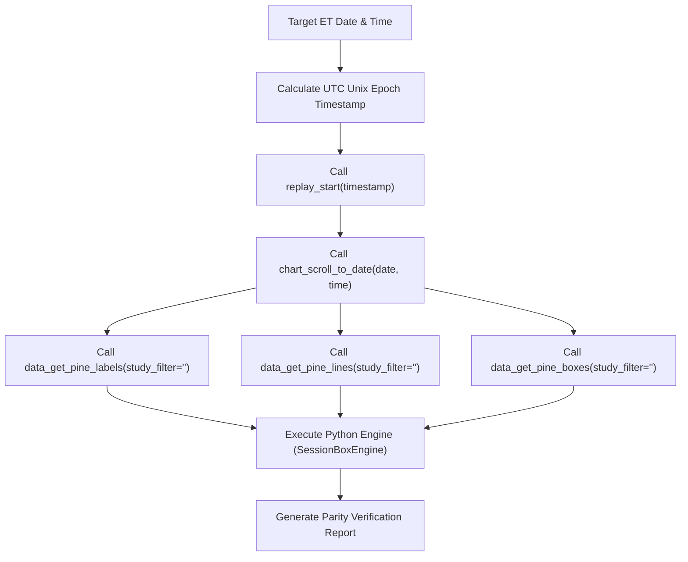

# 📈 TradingView Replay & Indicator Data Extractor Skill

This skill provides a generic, automated workflow to navigate TradingView charts to any target historical trading date/time in Bar Replay mode, extract comprehensive plot and drawing data across **all indicators (both visible and hidden)**, and perform 1-to-1 ground-truth data parity checks against Python analytical engines (`SessionBoxEngine`, `compute_profiler`, `ICT Features`, `NQStats`).

---

## 🎯 Primary Use Cases
1. **Generic Bar Replay Jump**: Jump the TradingView chart to any exact intraday timestamp (e.g. `09:15:00 ET` on any historical date).
2. **Full Indicator Stack Data Extraction**: Extract labels, lines, boxes, and plot values across ALL active indicators on the chart (including hidden studies).
3. **Ground-Truth Data Verification**: Perform side-by-side parity validation between TradingView PineScript studies and Python analytical pipelines.
4. **Intraday Step-Through & Replay Backtesting**: Step bar-by-bar through historical price action while observing real-time indicator state transitions.

---

## 🛠️ Replay & Extraction Protocol

### 1. 🕒 Timezone-Safe Replay Jump
To prevent client/browser timezone ambiguities (EDT vs PDT vs UTC), always convert target ET datetimes to **UTC Unix Epoch Seconds**:
- **Formula:** `Unix Timestamp = datetime_in_ET.timestamp()`
- **Example:** `2026-07-28 09:15:00 ET` (EDT, UTC-4) = `1785158100`

### 2. 📍 Visual Chart View Synchronization
Executing `replay_start` initializes Bar Replay at timestamp `T`, but TradingView's visual canvas may remain scrolled at a prior position. Always execute this 2-step navigation sequence:
1. `tradingview/replay_start` with `timestamp: <epoch>`
2. `tradingview/chart_scroll_to_date` with `date: "<YYYY-MM-DD>"`, `time: "<HH:MM:SS>"`

### 3. 🔍 Full Indicator Stack Extraction (Visible & Hidden Studies)
To retrieve complete output from **ALL indicators on the chart** (including hidden studies), issue the extraction calls with `study_filter: ""` (empty string):
- `tradingview/data_get_pine_labels`: Retrieves text labels, prices, and tooltips across all studies.
- `tradingview/data_get_pine_lines`: Retrieves trendlines, midpoints, and level boundaries.
- `tradingview/data_get_pine_boxes`: Retrieves range boxes (session boxes, killzones, gaps).
- `tradingview/data_get_study_values`: Retrieves numeric plot series values.

### 4. 🐍 Python Engine Parity Check
When comparing TradingView study values against Python analytical engines:
- Ensure `extract_all_sessions()` in `scripts/libs_py/nqstats/sessions.py` groups by `get_logical_trading_date(df_et.index)` (ADR-001 compliant).
- Pass `cutoff_time` matching the replay timestamp to `SessionBoxEngine.from_live("NQ1", cutoff_time=...)` to prevent future-data context leakage.
- Target **09:15 ET** (or **09:00 ET**) for pre-market evaluations to resolve pending states (`LT`/`ST`) and collapse the theoretical outcome tree.

### 5. 📸 Visual Artifact Archiving
- Call `tradingview/capture_screenshot` to save high-resolution visual chart artifacts for audit trails and documentation.

---

## 🔄 Step-by-Step Execution Checklist

