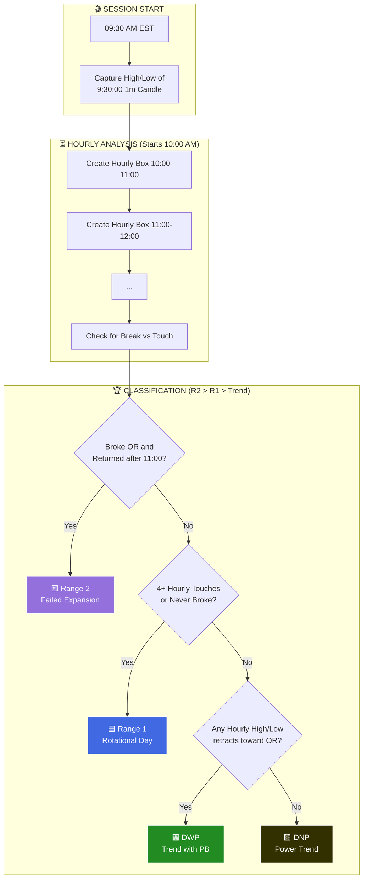

# Daily Market Action Classifications

This document provides a technical and visual reference for the four primary daily action types (R1, R2, DWP, DNP). These classifications are derived relative to the **09:30 1-minute Opening Range (OR)**.

## ⛔ End-of-Day Outcome — NOT a Pre-Market Prediction

> [!CRITICAL]
> **R1, R2, DWP, DNP are EX-POST labels.** Classification requires the **full session's hourly structure through 16:00 ET** (breaks, returns after 11:00, pullback counts across all boxes). A day cannot be classified until the session is complete. The mechanical classifier runs at EOD (e.g., the 16:15 ET tape extractor); the value only exists afterward.
>
> **During wargaming, do not predict these labels.** Pre-market planning uses the *overnight structural profile states* (LT/ST/LF/SF), P12 directional vectors, and session alignment — see `.agents/rules/daily_profiler_wargaming.md`. In the canonical `forecast_snapshots` schema, `prob_r1/prob_r2/prob_dnp/prob_dwp` are calibrated model *targets* evaluated after the fact (Brier/log-loss), never wargame inputs.
>
> Given an ex-ante plan, the correct use is conditional: *"If the day develops X (breaks hold, no return), it is trending toward DNP-like action — here is the play."* The label itself is still assigned at close.

## ⚖️ Precedence & Hierarchy

To ensure unambiguous classification, the system follows a strict hierarchy. If a day meets multiple criteria, the higher-priority type is chosen:

1.  **Range 2 (R2)**: Reversal Day (Highest Priority)
2.  **Range 1 (R1)**: Mean-Reverting/Time-Spent
3.  **Trending (DWP/DNP)**: Directional (Lowest Priority)

> [!IMPORTANT]
> **Parity Note**: The technical analysis (touches, breaks, and pullbacks) begins at the first hour change (**10:00 AM EST**). The price action from 09:30-09:59 is used *exclusively* to define the Opening Range and is not used for hourly classification counts.

---

## 🏷️ The Four Classifications

### 🟦 Range 1: Time Spent
**Definition**: The price stays within or frequently re-tests the Opening Range (OR).
- **Metric**: 4+ OR touches OR price never leaves the range.
- **Parity Rule**: Analysis starts at 10:00 AM.
- **Vibe**: Neutral, churning, rotation.

---

### 🟪 Range 2: Reversal
**Definition**: A failed expansion. Price breaks out, fails, and returns to the OR.
- **Condition**: Price must return AFTER 11:00 AM EST.
- **Condition**: At least one full hour of separation from the range.
- **Vibe**: Trapped traders, mean reversion.

---

### 🟩 DWP: Directional With Pullbacks
**Definition**: A strong trend that exhibits structural retracements.
- **Logic**: Price breaks OR and never returns.
- **PB Rule**: An hourly Low (in uptrend) or High (in downtrend) takes out the previous hourly extreme towards the OR.
- **Vibe**: Convicted move with entry opportunities.

---

### 🟨 DNP: Directional No Pullback
**Definition**: A "Power Trend" or runaway expansion.
- **Logic**: Price breaks OR and shows no structural retracements.
- **PB Rule**: Every hourly bar makes a higher low (uptrend) or lower high (downtrend).
- **Vibe**: Runaway conviction, highly aggressive.

---

## 📈 Real-World Examples

To see how these rules look on the live TradingView indicator, review these audited examples:

| Classification | Chart Example | Key Logic Observed |
| :--- | :--- | :--- |
| **Range 1** |  | Price spent 5 hours inside the 09:30 range. |
| **Range 2** |  | Broke at 11:00, returned to range after a full-hour gap. |
| **DWP** |  | Strong trend with clear hourly low violations. |
| **DNP** |  | Aggressive trend without a single hourly reversal. |

---

## 🗺️ Logic Flowchart

---

## 🛠️ Technical Implementation Details

| Parameter | Value | Description |
| :--- | :--- | :--- |
| **OR Duration** | 1 Minute | 09:30:00 to 09:30:59 |
| **Touch Tolerance** | 2.0 Ticks | Tick-based buffer around OR boundaries |
| **R2 Return Window** | 11:00 AM+ | Returns before 11:00 index do not count as R2 |
| **Analysis Start** | 10:00 AM | Hourly array begins at first hour change |
| **Timezone** | NY (EST/EDT) | All timestamps localized to America/New_York |

> [!TIP]
> **Pullback Exclusion**: The final hour of the session (15:00-16:00) is excluded from pullback detection to avoid "end of day" noise being classified as a structural trend shift.
