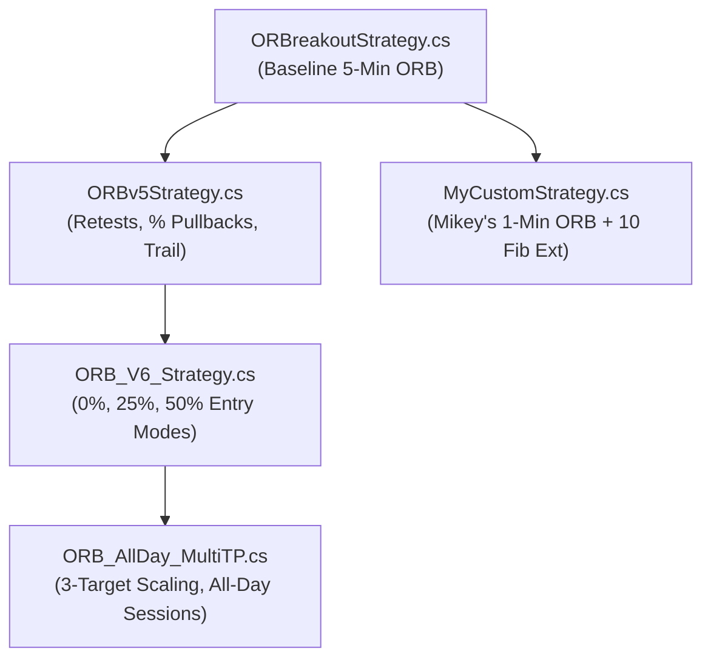

# 📈 NinjaTrader 8 Legacy Strategies Index (`From_NT8`)

**Location:** [`scripts/strategies/From_NT8/`](file:///C:/Users/vinay/tvDownloadOHLC/scripts/strategies/From_NT8)  
**Document Created:** July 29, 2026  
**Status:** Legacy Catalog & Optimization Baseline  

---

## 📌 Executive Summary

This directory contains legacy NinjaTrader 8 (NT8) strategies, custom execution utilities, order flow tools, and ICT price action algorithms copied into the repository. 

This document serves as an **authoritative catalog and sitemap** of all **34 strategy files** across 6 subdirectories. It outlines their core trading logic, indicator dependencies, entry/exit rules, and proposed improvements for modernization and backtesting within the `tvDownloadOHLC` framework.

---

## 📁 Folder Structure Overview

```
scripts/strategies/From_NT8/
├── Vinay/                      # Custom algorithmic bots built with central RiskManagerBase
│   ├── EMAPullBackBot.cs
│   ├── FailedAuctionBot.cs
│   ├── ICTFVGBoS.cs
│   └── VWAPReclaimBot.cs
├── PriceAction/                # ICT and Market Structure price action strategies
│   └── ICTHighLowBreak.cs
├── RajAlgos/                   # Advanced multi-account execution utilities
│   ├── MyCustomStrategy1.cs    # (SimpleTradeCopierV2)
│   └── SwingLevel.cs
├── TradeSaberStrategies/       # Interactive ChartTrader order entry suites
│   └── OrderEntryButtons.cs
├── TrendIsYourFriend/          # Community trade management & ATM execution suites
│   └── tiyfEasyOrdering.cs
├── bcomasStrategies/           # Account protection & equity monitoring utilities
│   └── EquityGuardNT8strategy.cs
└── [Root Level Strategies]     # Indicator crossovers, ORBs, Volatility, & Statistical Algos (24 files)
```

---

## 📑 Quick Strategy Categorization Matrix

| Category | File Name | Strategy Class Name | Core Technical Concept |
| :--- | :--- | :--- | :--- |
| **ICT & Price Action** | [`Vinay/EMAPullBackBot.cs`](file:///C:/Users/vinay/tvDownloadOHLC/scripts/strategies/From_NT8/Vinay/EMAPullBackBot.cs) | `EMAPullbackBot` | Expansion from open + EMA 20 pullback + Engulfing confirmation |
| | [`Vinay/FailedAuctionBot.cs`](file:///C:/Users/vinay/tvDownloadOHLC/scripts/strategies/From_NT8/Vinay/FailedAuctionBot.cs) | `FailedAuctionBot` | Single-print momentum spike return & counter-trend fill |
| | [`Vinay/ICTFVGBoS.cs`](file:///C:/Users/vinay/tvDownloadOHLC/scripts/strategies/From_NT8/Vinay/ICTFVGBoS.cs) | `ICTFVGBoS` | Break of Structure (BoS) + Fair Value Gap (FVG) limit entry |
| | [`Vinay/VWAPReclaimBot.cs`](file:///C:/Users/vinay/tvDownloadOHLC/scripts/strategies/From_NT8/Vinay/VWAPReclaimBot.cs) | `VWAPReclaimBot` | Session VWAP streak counter + reclaim confirmation |
| | [`PriceAction/ICTHighLowBreak.cs`](file:///C:/Users/vinay/tvDownloadOHLC/scripts/strategies/From_NT8/PriceAction/ICTHighLowBreak.cs) | `ICTHighLowBreak` | PDH/PDL liquidity sweep + MSS + FVG limit entry |
| **Opening Range Breakout (ORB)** | [`ORBreakoutStrategy.cs`](file:///C:/Users/vinay/tvDownloadOHLC/scripts/strategies/From_NT8/ORBreakoutStrategy.cs) | `ORBreakoutStrategy` | Baseline Opening Range Breakout (5-min ORB) |
| | [`ORBv5Strategy.cs`](file:///C:/Users/vinay/tvDownloadOHLC/scripts/strategies/From_NT8/ORBv5Strategy.cs) | `ORBv5Strategy` | ORB V5 with pullback retests & trailing stops |
| | [`ORB_V6_Strategy.cs`](file:///C:/Users/vinay/tvDownloadOHLC/scripts/strategies/From_NT8/ORB_V6_Strategy.cs) | `ORB_V6_Strategy` | ORB V6 with multi-level pullback entries (0%, 25%, 50%) |
| | [`ORB_AllDay_MultiTP.cs`](file:///C:/Users/vinay/tvDownloadOHLC/scripts/strategies/From_NT8/ORB_AllDay_MultiTP.cs) | `ORB_AllDay_MultiTP` | Multi-session ORB with 3-target scaling & fallback orders |
| | [`MyCustomStrategy.cs`](file:///C:/Users/vinay/tvDownloadOHLC/scripts/strategies/From_NT8/MyCustomStrategy.cs) | `ORBStrategyV2_Mikey` | Mikey's 1-min ORB with 10 Fibonacci extension levels |
| **Trend & Moving Average** | [`BB1.cs`](file:///C:/Users/vinay/tvDownloadOHLC/scripts/strategies/From_NT8/BB1.cs) | `BB1` | Bollinger Band + HMA + Heiken Ashi trend follower |
| | [`BarUpDown.cs`](file:///C:/Users/vinay/tvDownloadOHLC/scripts/strategies/From_NT8/BarUpDown.cs) | `BarUpDown` | Heiken Ashi candle streak continuation with HMA filter |
| | [`BarUpDownSwingPoints.cs`](file:///C:/Users/vinay/tvDownloadOHLC/scripts/strategies/From_NT8/BarUpDownSwingPoints.cs) | `BarUpDownSwingPoints` | BarUpDown enhanced with Swing indicator dynamic stop losses |
| | [`BollingerCrossOver.cs`](file:///C:/Users/vinay/tvDownloadOHLC/scripts/strategies/From_NT8/BollingerCrossOver.cs) | `BollingerCrossOver` | Standard Bollinger Band upper/lower band crossover |
| | [`HmaCrossOver.cs`](file:///C:/Users/vinay/tvDownloadOHLC/scripts/strategies/From_NT8/HmaCrossOver.cs) | `HmaCrossOver` | Dual HMA crossover with SMA & ADX trend filters |
| | [`SuperTrend.cs`](file:///C:/Users/vinay/tvDownloadOHLC/scripts/strategies/From_NT8/SuperTrend.cs) | `SuperTrend` | Dual SuperTrend indicator trend follower |
| | [`WilliamsRStrategy.cs`](file:///C:/Users/vinay/tvDownloadOHLC/scripts/strategies/From_NT8/WilliamsRStrategy.cs) | `WilliamsRStrategy` | Williams %R + EMA + HalfTrend + SuperTrend alignment |
| **Volatility & Statistical** | [`FiveMinVolatilityAlgo.cs`](file:///C:/Users/vinay/tvDownloadOHLC/scripts/strategies/From_NT8/FiveMinVolatilityAlgo.cs) | `FiveMinVolatilityAlgo` | 5-min MNQ volatility breakout with EMA(9/200) & ATR(40) |
| | [`FifteenMinVolatilityAlgo.cs`](file:///C:/Users/vinay/tvDownloadOHLC/scripts/strategies/From_NT8/FifteenMinVolatilityAlgo.cs) | `FifteenMinVolatilityAlgo` | 15-min MNQ volatility breakout with EMA(9/200) & ATR(40) |
| | [`MySigmaSpikesStrategyNT8.cs`](file:///C:/Users/vinay/tvDownloadOHLC/scripts/strategies/From_NT8/MySigmaSpikesStrategyNT8.cs) | `MySigmaSpikesStrategyNT8` | Adam Grimes' SigmaSpikes normalized return standard deviations |
| | [`WeeklyFactorStrategy.cs`](file:///C:/Users/vinay/tvDownloadOHLC/scripts/strategies/From_NT8/WeeklyFactorStrategy.cs) | `WeeklyFactorStrategy` | Andrea Unger's TASC Weekly Factor day-of-week patterns |
| **Order Flow & Multi-Asset** | [`LargeTradesStrategyNT8v3.cs`](file:///C:/Users/vinay/tvDownloadOHLC/scripts/strategies/From_NT8/LargeTradesStrategyNT8v3.cs) | `LargeTradesStrategyNT8v3` | OrderFlow Cumulative Delta & Large Trades block volume spikes |
| | [`LargeTradesStrategyNT8v5.cs`](file:///C:/Users/vinay/tvDownloadOHLC/scripts/strategies/From_NT8/LargeTradesStrategyNT8v5.cs) | `LargeTradesStrategyNT8v5` | LargeTrades V5 with ATM boosting and daily profit limits |
| | [`CowboyCorrelated.cs`](file:///C:/Users/vinay/tvDownloadOHLC/scripts/strategies/From_NT8/CowboyCorrelated.cs) | `CowboyCorrelated` | Correlated index pair trading (ES/NQ) with manual WPF panel |
| **Utilities & Execution** | [`RajAlgos/MyCustomStrategy1.cs`](file:///C:/Users/vinay/tvDownloadOHLC/scripts/strategies/From_NT8/RajAlgos/MyCustomStrategy1.cs) | `SimpleTradeCopierV2` | Multi-account trade copier (Master to 20 Followers) via WPF |
| | [`TradeSaberStrategies/OrderEntryButtons.cs`](file:///C:/Users/vinay/tvDownloadOHLC/scripts/strategies/From_NT8/TradeSaberStrategies/OrderEntryButtons.cs) | `OrderEntryButtons` | TradeSaber interactive ChartTrader execution suite |
| | [`TrendIsYourFriend/tiyfEasyOrdering.cs`](file:///C:/Users/vinay/tvDownloadOHLC/scripts/strategies/From_NT8/TrendIsYourFriend/tiyfEasyOrdering.cs) | `tiyfEasyOrdering` | Stop-Limit order execution & PSAR/ATR trailing manager |
| | [`bcomasStrategies/EquityGuardNT8strategy.cs`](file:///C:/Users/vinay/tvDownloadOHLC/scripts/strategies/From_NT8/bcomasStrategies/EquityGuardNT8strategy.cs) | `EquityGuardNT8strategy` | Account floating PnL, cash target & max drawdown protection |
| **NT8 Native Samples** | [`@SampleAtmStrategy.cs`](file:///C:/Users/vinay/tvDownloadOHLC/scripts/strategies/From_NT8/@SampleAtmStrategy.cs) | `SampleAtmStrategy` | Programmatic NinjaTrader ATM strategy invocation example |
| | [`@SampleMACrossOver.cs`](file:///C:/Users/vinay/tvDownloadOHLC/scripts/strategies/From_NT8/@SampleMACrossOver.cs) | `SampleMACrossOver` | Basic moving average crossover reference |
| | [`@SampleMultiInstrument.cs`](file:///C:/Users/vinay/tvDownloadOHLC/scripts/strategies/From_NT8/@SampleMultiInstrument.cs) | `SampleMultiInstrument` | Multi-series data stream reference |
| | [`@SampleMultiTimeFrame.cs`](file:///C:/Users/vinay/tvDownloadOHLC/scripts/strategies/From_NT8/@SampleMultiTimeFrame.cs) | `SampleMultiTimeFrame` | Multi-bar interval reference |
| | [`@Strategy.cs`](file:///C:/Users/vinay/tvDownloadOHLC/scripts/strategies/From_NT8/@Strategy.cs) | N/A | Base NinjaScript strategy wrapper |

---

## 🔍 Detailed Strategy Breakdown & Improvement Ideas

### 1. `Vinay/` Custom Algorithmic Suite

> [!NOTE]
> All strategies in this subfolder inherit from `RiskManagerBase`, which provides standardized daily loss caps, maximum consecutive loser pauses, session time filters (`EarliestEntry`, `LatestEntry`, `FlattenBy`), and trailing ATR stop loss management.

#### 1.1 `EMAPullBackBot.cs`
* **File:** [`Vinay/EMAPullBackBot.cs`](file:///C:/Users/vinay/tvDownloadOHLC/scripts/strategies/From_NT8/Vinay/EMAPullBackBot.cs)
* **Description:** EMA trend continuation strategy. Requires price to make an initial expansion from session open (e.g. 4+ points) to establish directional bias, then waits for price to pull back within a specific ATR proximity of EMA 20. Triggers entry on bullish/bearish engulfing bar or candle direction.
* **Key Inputs:** `MinMoveFromOpen` (4.0 pts), `PullbackProximity` (0.3 ATR), `EmaPeriod` (20), `MinPullbackBars` (2), `UseEngulfingConfirmation` (true).
* **Target / Stop:** Centralized ATR Stop (`StopAtrMult` = 1.25), `TargetRMultiple` = 3.75 R.
* **Improvement Opportunities:**
  1. Add VWAP alignment check before accepting EMA pullback.
  2. Implement dynamic EMA length based on market regime (volatility expansion vs contraction).
  3. Python Vectorization: Easily vectorized using rolling max/min from session open and EMA distance boolean masks.

#### 1.2 `FailedAuctionBot.cs`
* **File:** [`Vinay/FailedAuctionBot.cs`](file:///C:/Users/vinay/tvDownloadOHLC/scripts/strategies/From_NT8/Vinay/FailedAuctionBot.cs)
* **Description:** Single-print failed auction mean-reversion bot. Monitors rapid price moves (e.g. >= 20 pts in <= 10 1-minute bars). Registers origin price levels and places counter-trend limit/market orders when price returns to origin within ATR proximity.
* **Key Inputs:** `FastMoveMinPoints` (20.0 pts), `FastMoveBars` (10), `MaxWaitBars` (120), `EntryProximity` (0.3 ATR).
* **Target / Stop:** `StopAtrMult` = 3.5, Breakeven trigger = 0.5 R, Trailing ATR mult = 1.0.
* **Improvement Opportunities:**
  1. Require Volume Delta divergence during the return to the origin price to confirm lack of buying/selling pressure.
  2. Integrate Market Profile / Volume Profile Fair Value Nodes (POC/VA) to filter out strong trend continuation breaks.

#### 1.3 `ICTFVGBoS.cs`
* **File:** [`Vinay/ICTFVGBoS.cs`](file:///C:/Users/vinay/tvDownloadOHLC/scripts/strategies/From_NT8/Vinay/ICTFVGBoS.cs)
* **Description:** ICT Market Structure Shift (MSS/BoS) combined with Fair Value Gap (FVG) entries. Uses `ZigZag` indicator to identify high/low swing pivots and structure breaks, entering on limit orders into detected FVGs.
* **Key Inputs:** `Lookback` (10), `RFactor` (1.0), `FVGICT` indicator parameters.
* **Improvement Opportunities:**
  1. Complete the un-commented FVG price extraction logic (`fvg.getUpperPrice()` / `fvg.getLowerPrice()`).
  2. Add HTF (Higher Timeframe) bias filter (e.g., Daily/4H FVG array or PDH/PDL liquidity sweep prerequisite).

#### 1.4 `VWAPReclaimBot.cs`
* **File:** [`Vinay/VWAPReclaimBot.cs`](file:///C:/Users/vinay/tvDownloadOHLC/scripts/strategies/From_NT8/Vinay/VWAPReclaimBot.cs)
* **Description:** Session VWAP reclaim and rejection strategy. Calculates real-time session VWAP starting at 9:30 AM EST. Tracks consecutive closes above/below VWAP. Triggers long when price has spent >= `MinPriorBars` below VWAP and then closes `ConfirmationBars` above VWAP.
* **Key Inputs:** `ConfirmationBars` (2), `MinPriorBars` (2), `CooldownBars` (15).
* **Target / Stop:** Centralized Risk Manager: `StopAtrMult` = 2.0, Breakeven trigger = 2.0 R, Trailing ATR mult = 3.5.
* **Improvement Opportunities:**
  1. Incorporate VWAP Standard Deviation Bands (1st & 2nd std dev) for stretch confirmation before reclaim.
  2. Combine with 9:30 AM Opening Range direction to avoid trading against strong opening momentum.

---

### 2. Price Action & ICT Strategies

#### 2.1 `PriceAction/ICTHighLowBreak.cs`
* **File:** [`PriceAction/ICTHighLowBreak.cs`](file:///C:/Users/vinay/tvDownloadOHLC/scripts/strategies/From_NT8/PriceAction/ICTHighLowBreak.cs)
* **Description:** ICT Liquidity Sweep + Market Structure Shift (MSS) + Fair Value Gap (FVG) entry model.
  * **Short Entry:** Today's open was below Prior Day High (PDH). Price sweeps above PDH, breaks back below recent ZigZag low pivot (MSS), and creates a downward FVG. Enters short limit at FVG price.
  * **Long Entry:** Today's open was above Prior Day Low (PDL). Price sweeps below PDL, breaks above recent ZigZag high pivot (MSS), and creates an upward FVG. Enters long limit at FVG price.
* **Key Inputs:** `Lookback` (10), `Gap` (1), `RFactor` (1.0).
* **Improvement Opportunities:**
  1. High Win-Rate Candidate: This matches the institutional ICT Judas Swing / Liquidity Sweep model.
  2. Add Time-of-Day Kill Zone filter (e.g., NY AM Session 9:30 - 11:00 AM EST).
  3. Implement risk-based position sizing based on distance to swing stop loss.

---

### 3. Opening Range Breakout (ORB) Evolution Family

The repository contains 5 iterations of Opening Range Breakout (ORB) strategies showing clear algorithmic progression:



#### 3.1 `ORBreakoutStrategy.cs`
* **File:** [`ORBreakoutStrategy.cs`](file:///C:/Users/vinay/tvDownloadOHLC/scripts/strategies/From_NT8/ORBreakoutStrategy.cs)
* **Description:** Classic 5-minute Opening Range Breakout strategy. Captures high and low of first 5 minutes after 9:30 AM EST. Submits stop orders above range high or below range low.

#### 3.2 `ORBv5Strategy.cs` & `ORB_V6_Strategy.cs`
* **Files:** [`ORBv5Strategy.cs`](file:///C:/Users/vinay/tvDownloadOHLC/scripts/strategies/From_NT8/ORBv5Strategy.cs), [`ORB_V6_Strategy.cs`](file:///C:/Users/vinay/tvDownloadOHLC/scripts/strategies/From_NT8/ORB_V6_Strategy.cs)
* **Description:** Advanced ORB models introducing flexible entry modes (`BreakoutClose`, `Retest_0`, `Shallow_25`, `Deep_50`, `Midpoint_50`), candle close/wick exit rules, and runner trailing options.

#### 3.3 `ORB_AllDay_MultiTP.cs`
* **File:** [`ORB_AllDay_MultiTP.cs`](file:///C:/Users/vinay/tvDownloadOHLC/scripts/strategies/From_NT8/ORB_AllDay_MultiTP.cs)
* **Description:** Flagship ORB strategy with multi-session range definitions (9:30 AM, 10:00 AM, London 3:00 AM), 3-target scaling exits (TP1, TP2, Runner), fallback limit orders, and directional re-entry rules.

#### 3.4 `MyCustomStrategy.cs` (`ORBStrategyV2_Mikey`)
* **File:** [`MyCustomStrategy.cs`](file:///C:/Users/vinay/tvDownloadOHLC/scripts/strategies/From_NT8/MyCustomStrategy.cs)
* **Description:** Mikey's 1-minute ORB strategy calculating up to 10 Fibonacci expansion targets (1.272, 1.618, 2.0, 2.618, etc.) from the initial 1-minute range, featuring historical average range filtering.

* **Improvement Opportunities for ORB Family:**
  1. Port to vectorized Python backtester using `vectorbt` / `numpy` for multi-year parameter sweeps (range duration, entry mode, scaling targets).
  2. Integrate NQStats / Daily Bias filter (e.g. only take long ORB when bias is Bullish/DWP).

---

### 4. Trend & Moving Average Strategies

#### 4.1 `BB1.cs` & `BollingerCrossOver.cs`
* **Files:** [`BB1.cs`](file:///C:/Users/vinay/tvDownloadOHLC/scripts/strategies/From_NT8/BB1.cs), [`BollingerCrossOver.cs`](file:///C:/Users/vinay/tvDownloadOHLC/scripts/strategies/From_NT8/BollingerCrossOver.cs)
* **Description:** Combining Bollinger Bands with Hull Moving Average (HMA), Heiken Ashi candle direction, and RSI/ADX filters.

#### 4.2 `BarUpDown.cs` & `BarUpDownSwingPoints.cs`
* **Files:** [`BarUpDown.cs`](file:///C:/Users/vinay/tvDownloadOHLC/scripts/strategies/From_NT8/BarUpDown.cs), [`BarUpDownSwingPoints.cs`](file:///C:/Users/vinay/tvDownloadOHLC/scripts/strategies/From_NT8/BarUpDownSwingPoints.cs)
* **Description:** Heiken Ashi candle momentum continuation. `BarUpDownSwingPoints` improves risk management by placing initial stop losses behind recent swing high/low points.

#### 4.3 `HmaCrossOver.cs`
* **File:** [`HmaCrossOver.cs`](file:///C:/Users/vinay/tvDownloadOHLC/scripts/strategies/From_NT8/HmaCrossOver.cs)
* **Description:** Fast HMA crossing Slow HMA with SMA trend filter, ADX trend strength threshold (> 25), and Heiken Ashi confirmation.

#### 4.4 `SuperTrend.cs`
* **File:** [`SuperTrend.cs`](file:///C:/Users/vinay/tvDownloadOHLC/scripts/strategies/From_NT8/SuperTrend.cs)
* **Description:** Multi-timeframe Dual SuperTrend trend follower.

#### 4.5 `WilliamsRStrategy.cs`
* **File:** [`WilliamsRStrategy.cs`](file:///C:/Users/vinay/tvDownloadOHLC/scripts/strategies/From_NT8/WilliamsRStrategy.cs)
* **Description:** Williams %R momentum oscillator smoothed with EMA, confirmed by HalfTrend and SuperTrend indicators.

---

### 5. Volatility & Statistical Strategies

#### 5.1 `FiveMinVolatilityAlgo.cs` & `FifteenMinVolatilityAlgo.cs`
* **Files:** [`FiveMinVolatilityAlgo.cs`](file:///C:/Users/vinay/tvDownloadOHLC/scripts/strategies/From_NT8/FiveMinVolatilityAlgo.cs), [`FifteenMinVolatilityAlgo.cs`](file:///C:/Users/vinay/tvDownloadOHLC/scripts/strategies/From_NT8/FifteenMinVolatilityAlgo.cs)
* **Description:** MNQ futures volatility expansion breakout algos running during 8:30 AM - 3:10 PM CST. Uses EMA(9) vs EMA(200) trend filter, ATR(40) volatility multiple, high/low of day tracking, and dynamic position scale-ins up to 3 contracts.

#### 5.2 `MySigmaSpikesStrategyNT8.cs`
* **File:** [`MySigmaSpikesStrategyNT8.cs`](file:///C:/Users/vinay/tvDownloadOHLC/scripts/strategies/From_NT8/MySigmaSpikesStrategyNT8.cs)
* **Description:** Adam Grimes' SigmaSpikes statistical strategy measuring standard deviations of daily log returns normalized by ATR to trade mean-reversion after price spikes beyond 2.5 standard deviations.

#### 5.3 `WeeklyFactorStrategy.cs`
* **File:** [`WeeklyFactorStrategy.cs`](file:///C:/Users/vinay/tvDownloadOHLC/scripts/strategies/From_NT8/WeeklyFactorStrategy.cs)
* **Description:** Implementation of Andrea Unger's "The Weekly Factor Pattern" (TASC Sept 2023). Uses day-of-week statistical patterns and unmanaged OCO stop-limit orders.

---

### 6. Order Flow & Correlated Pair Strategies

#### 6.1 `LargeTradesStrategyNT8v3.cs` & `v5.cs`
* **Files:** [`LargeTradesStrategyNT8v3.cs`](file:///C:/Users/vinay/tvDownloadOHLC/scripts/strategies/From_NT8/LargeTradesStrategyNT8v3.cs), [`LargeTradesStrategyNT8v5.cs`](file:///C:/Users/vinay/tvDownloadOHLC/scripts/strategies/From_NT8/LargeTradesStrategyNT8v5.cs)
* **Description:** Order Flow institutional tracking strategies (coded by bcomas). Detects large block trades (e.g. >= 150 contracts per tick) via `OrderFlowCumulativeDelta` and `bcomasLargeTradesV3`, entering on breakout of block trade levels with daily profit caps.

#### 6.2 `CowboyCorrelated.cs`
* **File:** [`CowboyCorrelated.cs`](file:///C:/Users/vinay/tvDownloadOHLC/scripts/strategies/From_NT8/CowboyCorrelated.cs)
* **Description:** Multi-instrument index correlation suite (e.g., NQ vs ES or NQ vs RTY). Features custom WPF ChartTrader controls, timed automated entries, correlated hedge/mirror entries, and 3-target scaling.

---

### 7. Execution Utilities & Account Managers

#### 7.1 `RajAlgos/MyCustomStrategy1.cs` (`SimpleTradeCopierV2`)
* **File:** [`RajAlgos/MyCustomStrategy1.cs`](file:///C:/Users/vinay/tvDownloadOHLC/scripts/strategies/From_NT8/RajAlgos/MyCustomStrategy1.cs)
* **Description:** Advanced WPF Trade Copier indicator injecting buttons directly into NinjaTrader ChartTrader. Copies master account trades to up to 20 follower accounts with quantity multipliers and instrument filtering.

#### 7.2 `TradeSaberStrategies/OrderEntryButtons.cs`
* **File:** [`TradeSaberStrategies/OrderEntryButtons.cs`](file:///C:/Users/vinay/tvDownloadOHLC/scripts/strategies/From_NT8/TradeSaberStrategies/OrderEntryButtons.cs)
* **Description:** TradeSaber interactive ChartTrader order entry framework for drag-and-drop stop/target lines, risk percentage sizing, and manual ATM launching.

#### 7.3 `TrendIsYourFriend/tiyfEasyOrdering.cs`
* **File:** [`TrendIsYourFriend/tiyfEasyOrdering.cs`](file:///C:/Users/vinay/tvDownloadOHLC/scripts/strategies/From_NT8/TrendIsYourFriend/tiyfEasyOrdering.cs)
* **Description:** Popular futures.io community trade execution manager providing Stop-Limit entry padding, PSAR/ATR trailing stops, and visual marker execution tracking.

#### 7.4 `bcomasStrategies/EquityGuardNT8strategy.cs`
* **File:** [`bcomasStrategies/EquityGuardNT8strategy.cs`](file:///C:/Users/vinay/tvDownloadOHLC/scripts/strategies/From_NT8/bcomasStrategies/EquityGuardNT8strategy.cs)
* **Description:** Account protection & risk guardian strategy. Monitors account floating unrealized PnL, cash value targets, and maximum monthly drawdown, automatically flattening all positions and sending email notifications upon breach.

---

## 🛠️ Recommended Actionable Improvement Plan

To turn these 34 legacy scripts into an optimized, high-performing trading system:

> [!IMPORTANT]
> **Priority 1: High Win-Rate ICT & Structural Algos**  
> Modernize and backtest [`PriceAction/ICTHighLowBreak.cs`](file:///C:/Users/vinay/tvDownloadOHLC/scripts/strategies/From_NT8/PriceAction/ICTHighLowBreak.cs), [`Vinay/ICTFVGBoS.cs`](file:///C:/Users/vinay/tvDownloadOHLC/scripts/strategies/From_NT8/Vinay/ICTFVGBoS.cs), and [`Vinay/VWAPReclaimBot.cs`](file:///C:/Users/vinay/tvDownloadOHLC/scripts/strategies/From_NT8/Vinay/VWAPReclaimBot.cs) using our vectorized Python backtesting engine (`scripts/python/` / Optuna framework).

> [!TIP]
> **Priority 2: ORB Strategy Standardization**  
> Consolidate the 5 ORB strategies into a single parameterized ORB engine supporting the advanced features of [`ORB_AllDay_MultiTP.cs`](file:///C:/Users/vinay/tvDownloadOHLC/scripts/strategies/From_NT8/ORB_AllDay_MultiTP.cs) (0%, 25%, 50% retest entries + 3 scaling targets).

> [!WARNING]
> **Priority 3: Risk Management Integration**  
> Ensure all NT8 strategies inherit [`GovernedStrategy`](file:///C:/Users/vinay/tvDownloadOHLC/scripts/ninjatrader/shared/GovernedStrategy.cs) (STRATEGY_WORKFLOW.md §5.7), which layers the decision log, the frozen defaults and unique entry names over `RiskManagerBase` — the latter enforcing daily loss limits, consecutive-loss pauses and the mandatory session flatten.
> ⚠️ `RiskManagerBase` is owned by **nt8-riskguard** (`strategies/Vinay/`), not by this repo (ADR-025). The local copy this line used to point at was a fork; it was deleted 2026-09-05 and the folder now holds only a pointer.

---

## 🔗 Related Documentation & Links

- **[System Architecture](file:///C:/Users/vinay/tvDownloadOHLC/docs/architecture/ARCHITECTURE.md)**
- **[Strategy Workflow](file:///C:/Users/vinay/tvDownloadOHLC/docs/architecture/STRATEGY_WORKFLOW.md)** (the parity standard was subsumed into it and deleted 2026-09-04)
- **[NinjaTrader Risk Manager Suite](file:///C:/Users/vinay/tvDownloadOHLC/docs/strategies/ninjatrader/risk_manager_suite/README.md)**
- **[Backtest Standards](file:///C:/Users/vinay/tvDownloadOHLC/docs/strategies/BACKTEST_STANDARDS.md)**
- **[Second Brain Trading Rules](file:///C:/Users/vinay/tvDownloadOHLC/docs/SecondBrain_Trading.md)**
