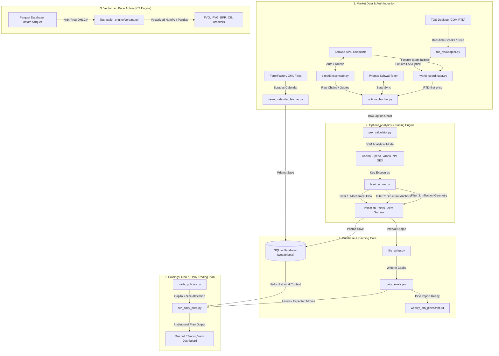
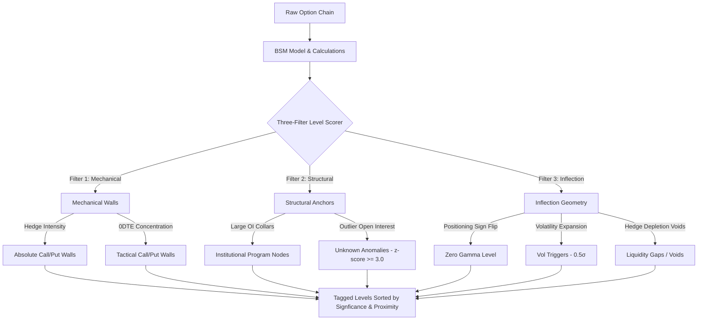

# Options Trading & Market Data Infrastructure Inventory

**Last Updated:** July 11, 2026
**Purpose:** Permanent technical blueprint, architectural catalog, and development reference for the Options, Market Data, Price Action, and PERSISTENCE layers of the TCM Trading System.

## Current Runtime Status (July 8, 2026)

- Options streaming pipeline is running with direct Prisma writes plus API fallback resilience in the interval writer path.
- Fresh index snapshots are being persisted for SPY, SPX, QQQ, and IWM in `GexSnapshot` / `MacroSnapshot`.
- Strategy engine index-entry staleness hard gate is currently enforced at 15 minutes during RTH in the engine loop.
- Daily strategy routing currently includes `WHEEL`, `EARNINGS_STRANGLE`, `INCOME_CC`, and `LONG_DTE_CREDIT` at 10:00 ET.
- Handoff alignment documents are present under `docs/features/options_dashboard/` (`HANDOFF.md`, `HANDOFF_v2.md`, `HANDOFF_v3.md`).
- **TOS RTD integration (Phase 1-4) complete**: `tos_rtd/` package provides real-time futures options Greeks via ThinkorSwim COM. Auto-detects TOS desktop process. Hybrid coordinator uses RTD for futures LAST price (sub-second) with Schwab API fallback. Greeks drift monitor validates BSM model against exchange-quality TOS native gamma. See [§8. TOS RTD Real-Time Data Feed](#-8-tos-rtd-real-time-data-feed).

---

## 🧱 Architectural System Map



---

## 🗺️ Workspace Directory Structure

The core options trading, price action library, and market data infrastructure is structured across the following paths:

```bash
c:\Users\vinay\tvDownloadOHLC
├── data/                                 # Parquet Market Database & Derived Level Caches
│   ├── QQQ_1m.parquet                    # ETF minute datasets
│   ├── SPY_1m.parquet                    
│   ├── NQ1_1m.parquet                    # High-frequency Futures continuous contracts
│   ├── ES1_1m.parquet
│   ├── ADV_1m.parquet                    # NYSE/NASDAQ Market Internals
│   ├── TICK_1m.parquet
│   ├── daily_levels.json                 # Real-time computed options levels cache
│   └── expected_moves.json               # Current day expected move calculations
├── docs/                                 # Architecture Decisions & Unified Core Guidelines
│   ├── SecondBrain_Trading.md            # Verified Statistical Probabilities Source
│   └── SCRIPTS_CATALOG.md                # High-level developer catalog
├── scripts/
│   ├── libs_py/                          # Proprietary Python Analytical Libraries
│   │   ├── ict_engine/core/pa.py         # High-performance Vectorized Price Action
│   │   ├── nqstats/                      # RTH, IB, and Profile Statistics Engine
│   │   └── risk/                         # Risk Policies and Account Management
│   ├── market_data/                      # Macro updates & Economic Calendar fetching
│   │   ├── capture_rth_open.py           # RTH Open Straddle and IV capturer
│   │   └── fetch_economic_calendar.py    # Economic events scheduler
│   ├── streaming/
│   │   ├── news_calendar_fetcher.py      # ForexFactory XML Feed Scraper
│   │   ├── api_expected_move.py          # Expected Move Dual-Proxy engine
│   │   └── options/                      # Real-time quantitative options levels pipeline
│   │       ├── ezoptionsschwab.py        # Custom Schwab API Client wrapper
│   │       ├── options_fetcher.py        # Token Auth Synchronizer & Chain Snapshots
│   │       ├── gex_calculator.py         # Advanced mathematical GEX/BSM analytics
│   │       ├── level_scorer.py           # Three-Filter triage scoring engine
    │   │   ├── run_options_levels.py     # Live multi-ticker pipeline coordinator
    │   │   └── tos_rtd/                  # TOS RTD real-time COM client (Windows-only)
    │   │       ├── adapter.py            # TOSRTDAdapter — bridge to pipeline
    │   │       ├── client.py             # RTDClient — COM subscribe/unsubscribe
    │   │       ├── worker.py             # RTDWorker — background COM thread
    │   │       ├── symbol_builder.py     # Futures option symbol construction
    │   │       ├── hybrid_coordinator.py # Schwab + RTD coordination
    │   │       └── greeks_drift_monitor.py # BSM vs TOS gamma validation
│   └── trader/
│       └── run_daily_prep.py             # Combined pre-market prep dashboard builder
└── web/
    └── prisma/
        └── schema.prisma                 # Core SQLite Database Schema Models
```

---

## 🔐 1. Broker & Auth Integrations

Manages persistent session authorization, token synchronization, and credentials synchronization with the Schwab Trader APIs.

### A. Core Modules & Files

#### 💻 [ezoptionsschwab.py](file:///c:/Users/vinay/tvDownloadOHLC/scripts/streaming/options/ezoptionsschwab.py)
* **Description:** Low-level, robust custom API helper client wrapping Schwab HTTP endpoints. Provides token synchronization, HTTP header construction, payload verification, and automated request retry loops.
* **Key Methods:**
  * `get_option_chain(symbol, strikeCount, includeQuotes, strategy, interval)`: Constructs endpoints for fetching raw options strings.
  * `get_market_quotes(symbols)`: Fetches real-time snapshots for multiple equities and indices.
  * `_refresh_session()`: Checks expiresAt and triggers a refresh loop when the access token approaches expiration.

#### 💻 [options_fetcher.py](file:///c:/Users/vinay/tvDownloadOHLC/scripts/streaming/options/options_fetcher.py)
* **Description:** Mid-level client manager handling token storage state and API synchronization. Triggers database sync or localized fallback to `token.json` when Prisma DB is temporarily unavailable.
* **Key Classes:**
  * `SchwabAuthManager`: Holds encryption/decryption hooks, parses raw OAuth callback strings, and persists tokens to SQLite via the `SchwabToken` model.
  * `OptionChainFetcher`: Orchestrates chain requests. Falls back to nearest strike range queries if the API limits large strikes fetching.

### B. Persistent Database Models
Defined in [schema.prisma](file:///c:/Users/vinay/tvDownloadOHLC/web/prisma/schema.prisma):

```prisma
model SchwabToken {
  id           String   @id @default("schwab-primary")
  accessToken  String   // Encrypted OAuth access token
  refreshToken String   // Encrypted long-lived refresh token
  expiresAt    Int      // Epoch expiration timestamp
  idToken      String?  
  tokenType    String
  scope        String?
  createdAt    DateTime @default(now())
  updatedAt    DateTime @updatedAt
}
```

---

## 📈 2. Market Data Ingestion & Fetching

Handles historical database updates, real-time option chain snapshotting, VIX indexing, and the Dual-Proxy Index Normalization algorithm.

### A. Core Modules & Files

#### 💻 [api_expected_move.py](file:///c:/Users/vinay/tvDownloadOHLC/scripts/streaming/api_expected_move.py)
* **Description:** Dual-Proxy expected move normalization engine. Normalizes liquid ETF option chains to calculate index expected moves where direct index data is illiquid or unavailable on Schwab.
* **Key Configurations:**
  * `PROXY_MAP`: Establishes the spot-to-ETF mappings:
    $$\text{/ES} \rightarrow (\text{Index: SPX, ETF: SPY})$$
    $$\text{/NQ} \rightarrow (\text{Index: NDX, ETF: QQQ})$$
    $$\text{/YM} \rightarrow (\text{Index: DJI, ETF: DIA})$$
    $$\text{/RTY} \rightarrow (\text{Index: RUT, ETF: IWM})$$
* **EM Calculation Model (IV-Driven):** All Expected Move calculations use the **TOS time-scaling model** (`calculate_tos_expected_move`) with ATM Implied Volatility as the primary input. The straddle cost is computed and stored for diagnostics and `straddle_85` reference bands only; it is **not** the primary EM source.
  $$\text{EM}_{\text{TOS}} = \text{Spot} \times \text{IV} \times \sqrt{\frac{0.6368 \times \text{DTE} + \text{Intercept}}{365}}$$
  *(Intercept shifts dynamically based on time-of-week. Weekday: 0.24 equity / 0.69 futures. Weekend decay: -0.037 equity / 0.420 futures)*
  * **Fallback:** If ATM IV is missing or zero, EM falls back to `k × straddle_mid` where `k` is `EM_STRADDLE_MULTIPLE_DEFAULT` (1.10, with SPX and /ES overridden to 1.05).
  * `get_adjusted_em(straddle_cost)`: Legacy rule-of-thumb reference band (diagnostic only, not used for primary EM):
    $$\text{EM}_{\text{adj}} = 0.85 \times \text{Straddle Cost}$$
  * `normalize_proxy_move(etf_straddle, etf_spot, index_spot)`: Maps highly active ETF straddles back to Cash Index levels (legacy normalization, diagnostic only):
    $$\text{Index EM}_{\text{normalized}} = \frac{\text{ETF Straddle Cost}}{\text{ETF Spot Price}} \times \text{Index Spot Price} \times 0.85$$

#### 💻 [weekly_expected_moves.py](file:///c:/Users/vinay/tvDownloadOHLC/scripts/streaming/options/weekly_expected_moves.py)
* **Description:** Reads pre-calculated Expected Move levels from `unified_levels.json` (produced by the pipeline using `gex_calculator.py`'s TOS time-scaling model) and formats them for Pine Script consumption and console display. No longer computes EM independently — all EM values come from the single TOS-calibrated source of truth. Also reads `weekly_em_scope.json` for the Friday EOD weekly scope EM snapshot.
* **Key Functions:**
  * `read_em_from_unified_levels(ticker)`: Reads `EM HI` / `EM LO` / `EM85 HI` / `EM85 LO` tokens from `unified_levels.json` for the given ticker.
  * `read_weekly_scope_em(ticker)`: Reads Friday EOD EM bounds from `weekly_em_scope.json`.
  * Futures translation: Scales cash-index EM to futures space using the OGT price from META tokens in `unified_levels.json`.

#### 💻 [fetch_vix_data.py](file:///c:/Users/vinay/tvDownloadOHLC/scripts/market_data/fetch_vix_data.py)
* **Description:** Downloads VIX and VVIX daily and intraday close prices, providing volatility regime filters for the options pricing engine.

### B. High-Performance Parquet Database
All historical OHLCV data is organized under `/data` using snappy-compressed Apache Parquet files, optimized for vectorized operations. For a detailed list of all 180+ datasets, their start/end dates, and bar counts, see the auto-generated [DATA_INVENTORY.md](file:///C:/Users/vinay/tvDownloadOHLC/DATA_INVENTORY.md).

#### Core Historical Coverage Ranges:
*   **Indices (SPX / NDX / RUT / DJI / VIX / VVIX)**:
    *   `SPX_1d` / `SPX_1W` starts in **August 1939** (21,800+ bars).
    *   `SPX_1m` starts in **January 2011** (1,450,000+ bars).
    *   `VIX_1d` starts in **October 1995** (7,700+ bars) and `VIX_1m` in **October 2021**.
*   **Index ETFs (SPY / QQQ / IWM / DIA)**:
    *   `SPY_1d` starts in **January 1993** (8,400+ bars).
    *   `QQQ_1d` starts in **March 1999** (6,800+ bars), `QQQ_15m` starts in **August 2013**, and `QQQ_5m` in **June 2016**.
*   **Futures Continuous Contracts (ES1 / NQ1 / YM1 / RTY1 / CL1 / GC1)**:
    *   `ES1_1d`/`NQ1_1d` starts in **September 2000** (6,500+ bars), and 1-minute historical intraday data (`ES1_1m`/`NQ1_1m`) starts in **January 2006** (6.3+ Million bars per contract).
    *   `YM1_1m`/`CL1_1m`/`GC1_1m` starts in **January 2008** (5.8+ Million bars per contract).
*   **Market Internals (TICK / TICKQ / TRIN / TRINQ / ADV / DVOL / UVOL)**:
    *   1-minute intraday feeds start in **January 2011** (1.45+ Million bars).

| Asset Type | File Signature | Timeframes | Purpose |
| :--- | :--- | :--- | :--- |
| **Futures** | `NQ1_[TF].parquet`, `ES1_[TF].parquet` | 1m, 5m, 15m, 1h, 4h, 1d | High-frequency continuous contracts |
| **Indices** | `SPX_1m.parquet`, `NDX_1m.parquet` | 1m, 5m, 15m, 1d | Cash Index reference datasets |
| **ETFs** | `SPY_1m.parquet`, `QQQ_1m.parquet` | 1m, 5m, 15m, 1d | High-liquidity options base underlyings |
| **Internals** | `TICK_1m.parquet`, `DVOL_1m.parquet` | 1m | NYSE/NASDAQ real-time momentum indicators |

---

## 🧮 3. Options Analytics & Math Engine

Calculates first and second-order Greeks, volume centroids, and zero-gamma flip points, passing them to the Institutional Three-Filter Triage.

### A. Mathematical Formulation (Greeks Engine)

All options analytics are computed using the Black-Scholes-Merton (BSM) analytical model in [gex_calculator.py](file:///c:/Users/vinay/tvDownloadOHLC/scripts/streaming/options/gex_calculator.py):

#### Standard Inputs:
* $S$: Spot Price
* $K$: Strike Price
* $t$: Years to Expiry (calculated in minutes-to-expiry $/ 525,600$)
* $\sigma$: Implied Volatility (IV)
* $r$: Risk-Free Rate
* $q$: Dividend Yield
* $N(x)$: Cumulative Normal Distribution
* $N'(x) = \frac{1}{\sqrt{2\pi}} e^{-x^2/2}$: Normal Probability Density Function

#### 1. Zero-Order Variables ($d_1, d_2$):
$$d_1 = \frac{\ln(S/K) + (r - q + \sigma^2/2)t}{\sigma \sqrt{t}}$$
$$d_2 = d_1 - \sigma \sqrt{t}$$

#### 2. Call Gamma ($\Gamma$):
$$\Gamma = \frac{e^{-q t} N'(d_1)}{S \sigma \sqrt{t}}$$

#### 3. Net GEX Exposure ($\text{GEX}_{\text{net}}$):
$$\text{GEX}_{\text{net}} = \left( \text{OI}_{\text{Calls}} \times \Gamma_{\text{Calls}} \times 100 \times S \right) - \left( \text{OI}_{\text{Puts}} \times \Gamma_{\text{Puts}} \times 100 \times S \right)$$

#### 4. Delta-Adjusted GEX ($\text{DEX}_{\text{net}}$):
To emphasize ATM exposures, GEX is weighted by absolute Delta ($\Delta$):
$$\Delta_{\text{Call}} = e^{-q t} N(d_1), \quad \Delta_{\text{Put}} = e^{-q t} [N(d_1) - 1]$$
$$\text{DEX}_{\text{net}} = \left( \text{OI}_{\text{Calls}} \times \Gamma_{\text{Calls}} \times |\Delta_{\text{Call}}| \times 100 \times S \right) - \left( \text{OI}_{\text{Puts}} \times \Gamma_{\text{Puts}} \times |\Delta_{\text{Put}}| \times 100 \times S \right)$$

#### 5. Second-Order Volatility Sensitivity: Vanna
Models the change in Delta relative to changes in Implied Volatility:
$$\text{Vanna} = \frac{\partial \Delta}{\partial \sigma} = -e^{-q t} N'(d_1) \frac{d_2}{\sigma}$$

#### 6. Second-Order Time Decay Sensitivity: Charm (Delta Decay)
Models the decay of Delta relative to the passage of calendar time:
$$\text{Charm}_{\text{Call}} = \frac{\partial \Delta_{\text{Call}}}{\partial t} = q e^{-q t} N(d_1) - e^{-q t} N'(d_1) \left( \frac{r - q}{\sigma \sqrt{t}} - \frac{d_2}{2t} \right)$$

#### 7. Third-Order Spot Sensitivity: Speed
Models the change in option Gamma relative to movements in the spot price:
$$\text{Speed} = \frac{\partial \Gamma}{\partial S} = -\frac{\Gamma}{S} \left( \frac{d_1}{\sigma \sqrt{t}} + 1 \right)$$

#### 8. Volume-Weighted Strike Centroids (Strike VWAP)
Identifies the gravity center of trading volume inside the options chain:
$$\text{Centroid}_{\text{Call}} = \frac{\sum (K \times \text{Volume}_{\text{Call}})}{\sum \text{Volume}_{\text{Call}}}$$
$$\text{Centroid}_{\text{Put}} = \frac{\sum (K \times \text{Volume}_{\text{Put}})}{\sum \text{Volume}_{\text{Put}}}$$

---

### B. Core Modules & Files

#### 💻 [gex_calculator.py](file:///c:/Users/vinay/tvDownloadOHLC/scripts/streaming/options/gex_calculator.py)
* **Description:** Calculations for BSM parameters, analytical Charm, Speed, volume centroids, Delta-adjusted gamma, and volatility triggers.
* **Key Functions:**
  * `calculate_tos_expected_move(spot, expiry, iv, is_futures)`: **The single source of truth for all EM calculations.** Empirically calibrated TOS time-scaling model (0.6368 slope) with weekend/after-hours intercept decay. Uses ATM Implied Volatility as the primary input. Called by `_expected_move()` and `_calculate_all_ems()` for every expiry in the chain.
  * `_expected_move(calls, puts, spot, dte, is_futures, ticker, ...)`: Computes blended ATM IV from call+put IV. If IV > 0, delegates to `calculate_tos_expected_move()`. Falls back to `k × straddle_mid` only when IV is missing/invalid. Stores straddle and `straddle_85` bands as diagnostics.
  * `_analytical_charm(flag, S, K, t, sigma, r, q)`: Returns the exact Charm decay factor.
  * `_analytical_speed(S, K, t, sigma, r, q)`: Returns the Gamma sensitivity rate.
  * `_delta_adjusted_gex(chain_data)`: Returns delta-adjusted call and put gamma levels.
  * `find_zero_gamma(chain_gex_df)`: Iterates strike bounds to locate the exact price level where net book positioning shifts sign. Also supports delta-adjusted Sign Flip calculation.

#### 💻 [level_scorer.py](file:///c:/Users/vinay/tvDownloadOHLC/scripts/streaming/options/level_scorer.py)
* **Description:** Implements the **Three-Filter Level Scorer** architecture. Prioritizes mathematical levels into TaggedLevels based on mechanical walls, structural anchors, and inflection points.
* **Filter Taxonomy:**
  1. ** MECHANICAL WALLS (Filter 1 - The Brakes):** Price strikes where dealer gamma hedging physically slows down spot price movement. Top 5% book concentration.
  2. ** STRUCTURAL ANCHORS (Filter 2 - Institutional Gravity):** Flags large-OI pension collars, corporate buybacks, and roll exposures (e.g. quarterly roll programs like JHEQX).
  3. ** INFLECTION GEOMETRY (Filter 3 - Transition Zones):** Points where dealer positioning transforms (Zero Gamma, Magnet pins, liquidity gaps).



* **Dataclass Hierarchy:**
  * `TaggedLevel` (Base): `strike`, `label`, `significance` (PRIMARY, SECONDARY, CONTEXT), `side` (CALL, PUT, NEUTRAL), `description`.
  * `MechanicalWall(TaggedLevel)`: Adds `net_gex`, `pct_of_book`, `hedge_contracts`, `proximity_score`.
  * `StructuralAnchor(TaggedLevel)`: Adds `open_interest`, `matched_program`, `oi_zscore`, `relevance` (DORMANT, APPROACHING, ACTIVE, CRITICAL), `days_to_expiry`.
  * `InflectionPoint(TaggedLevel)`: Adds `inflection_type` (FLIP, MAGNET, VOID), `slope_magnitude`, `gamma_velocity`.

### C. Cash-to-Futures Translation, Walls, and Dealer Levels

Because most actionable trading occurs in futures, the pipeline computes levels in the **native cash/options source space** (SPX, NDX, QQQ) and then translates them into the matching futures price scale (`/ES`, `/NQ`, `/RTY`, `/YM`).

#### 1. Translation Modes
Defined per ticker in [`config.py`](file:///c:/Users/vinay/tvDownloadOHLC/scripts/streaming/options/config.py) via `TickerProfile.basis_mode`:

| Source Ticker | Futures Target | `basis_mode` | Reason |
|---------------|----------------|--------------|--------|
| SPX, NDX, RUT, DJX | `/ES`, `/NQ`, `/RTY`, `/YM` | `additive` | Index and futures trade at the same price scale (ES ≈ SPX, NQ ≈ NDX). |
| SPY, QQQ, IWM, DIA | `/ES`, `/NQ`, `/RTY`, `/YM` | `multiplicative` | ETF share price is a different scale than the futures contract. |
| AAPL, NVDA, TSLA, etc. | None | — | Single-stock cash levels, no futures translation. |

The translation module [`futures_translator.py`](file:///c:/Users/vinay/tvDownloadOHLC/scripts/streaming/options/futures_translator.py) exports:

* `TranslatedLevels` dataclass — a mirror of `DealerLevels` with all price levels converted into futures ticks.
* `translate_to_futures(levels, futures, anchor_basis, anchor_ratio)` — converts each level using either:
  * **Additive:** `futures_price = cash_price + basis_spread`
  * **Multiplicative:** `futures_price = cash_price × basis_ratio`

An anchor basis/ratio can be supplied to **pin** the translation to the market-open basis instead of drifting with intraday futures cash-price divergence. The mode is selected dynamically if no anchor is given: if `abs(futures/cash − 1) > 0.02` the translator switches from additive to multiplicative.

#### 2. Wall and Zero-Gamma Selection
Walls are dealer-side strikes selected inside [`gex_calculator.py`](file:///c:/Users/vinay/tvDownloadOHLC/scripts/streaming/options/gex_calculator.py) by the `_find_walls` helper:

* Each candidate contract must pass `min_oi_floor`.
* Calls are restricted to strikes ≥ spot (resistance); puts to strikes ≤ spot (support).
* Contracts are ranked by `open_interest × abs(gamma)`. The top strike becomes the **primary wall**, the next becomes the **secondary wall**.
* `zero_gamma` is found by locating the sign flip of net GEX across the strike ladder. A delta-adjusted variant, `zero_gamma_delta_adj`, is also computed and passed through.

Recent additions to the `DealerLevels` dataclass carry both wall series and translation metadata:

| Field | Meaning |
|-------|---------|
| `call_wall` / `put_wall` | Primary resistance/support strikes. |
| `secondary_call_wall` / `secondary_put_wall` | Next-ranked OI×Γ strikes. |
| `call_wall_0dte` / `put_wall_0dte` | 0-DTE tactical walls. |
| `zero_gamma` | Net GEX sign-flip level. |
| `zero_gamma_delta_adj` | Delta-adjusted sign-flip level. |
| `wall_scope` / `wall_dte_min` / `wall_dte_max` | Metadata describing which DTE bucket built the walls. |
| `futures_symbol` / `translation_mode` / `basis_spread` / `basis_ratio` | Translation matrix written back onto the original `DealerLevels` object. |

#### 3. Futures Black-76 Path
Recent production work added a Black-76 (futures-style) pricing branch in `_calculate_hypothetical_total_gex_numpy`. When the chain source is a futures contract, the underlying is treated as the forward price and the cost-of-carry dividend yield is dropped, so GEX from `/ES` and `/NQ` option chains is priced consistently with CME-listed options.

#### 4. Output Anchoring
The `BASIS_ANCHORS_JSON` file (`data/options/basis_anchors.json`) records the per-ticker basis/ratio used each session. The `enable_futures_fallbacks` flag in `file_writer.py` controls whether missing futures entries can receive ETF-translated fallbacks.

---

## 📉 4. Price Action & Vectorized ICT Engines

Calculates Fair Value Gaps (FVG), Inversion FVGs (IFVG), Balanced Price Ranges (BPR), and Order Blocks (OB) in a single high-performance vectorized pass.

### A. Core Modules & Files

#### 💻 [pa.py](file:///c:/Users/vinay/tvDownloadOHLC/scripts/libs_py/ict_engine/core/pa.py)
* **Description:** Vectorized Pandas and NumPy indicators designed for high-frequency pricing frames. Avoids slow looping.
* **Vectorized Formulations:**
  * **Fair Value Gaps (FVG):** Vectorized by rolling dataframe arrays:
    $$\text{High}_{\text{rolled\_1}} = \text{Roll}(H, 1), \quad \text{Low}_{\text{rolled\_minus\_1}} = \text{Roll}(L, -1)$$
    $$\text{Bullish FVG} = \text{Low}_{\text{rolled\_minus\_1}} > \text{High}_{\text{rolled\_1}}$$
    $$\text{Bearish FVG} = \text{High}_{\text{rolled\_minus\_1}} < \text{Low}_{\text{rolled\_1}}$$
  * **Balanced Price Ranges (BPR):** Identifies overlapping bullish and bearish FVGs:
    $$\text{BPR} = \text{OverlappingRange}(\text{FVG}_{\text{bull}}, \text{FVG}_{\text{bear}})$$
  * **Order Blocks (OB):** Scans structural breaks (BOS/MSS) to isolate the high-volume buying/selling candles preceding the break.
  * **Liquidity Sweeps:** Flags candle wicks that extend beyond the rolling high/low extremes before closing back inside the boundary.

#### 💻 [sessions.py](file:///c:/Users/vinay/tvDownloadOHLC/scripts/libs_py/nqstats/sessions.py)
* **Description:** Segments session boundaries and tags trading data into distinct global sessions (Asia, London, NY AM, NY PM, RTH).

#### 💻 [generate_ict_nwog_ndog.py](file:///c:/Users/vinay/tvDownloadOHLC/scripts/trader/generate_ict_nwog_ndog.py)
* **Description:** Establishes New Week Opening Gaps (NWOG) and New Day Opening Gaps (NDOG) from weekly/daily sessions close and open transitions.

---

## 📅 5. Macro Calendar & Event Data

Automates the fetching and formatting of economic calendar schedules from ForexFactory, exporting data to NinjaTrader for custom strategies.

### A. Core Modules & Files

#### 💻 [news_calendar_fetcher.py](file:///c:/Users/vinay/tvDownloadOHLC/scripts/streaming/news_calendar_fetcher.py)
* **Description:** ForexFactory XML scraper. Retrieves economic calendar feeds, translates GMT times to Eastern Time, filters by currency and impact level, and exports to both SQLite and NinjaTrader.
* **Scraper Configs:**
  * `FF_XML_URLS`: `https://nfs.faireconomy.media/ff_calendar_thisweek.xml`
  * `CURRENCIES`: `["USD"]` (filters relevant index indicators)
  * `IMPACT_LEVELS`: `["High", "Medium", "Low"]`
* **Output Path:** Generates a custom CSV written to `~/Documents/NinjaTrader 8/bin/Custom/news_blackout.csv` formatted with pre and post-event blackout buffers.

#### 💻 [fetch_economic_calendar.py](file:///c:/Users/vinay/tvDownloadOHLC/scripts/market_data/fetch_economic_calendar.py)
* **Description:** Backup calendar ingestor.

#### 💻 [futures_rollover_calendar.py](file:///c:/Users/vinay/tvDownloadOHLC/scripts/tools/selenium_downloader/futures_rollover_calendar.py)
* **Description:** Web scraper capturing CME futures rollover dates, notifying the engine to adjust contract designations.

---

## 💾 6. Data Persistence & Cache Layers

Maintains SQLite schema configurations, Parquet storage loaders, and intraday JSON levels files.

### A. SQLite Prisma Database
Defined in [schema.prisma](file:///c:/Users/vinay/tvDownloadOHLC/web/prisma/schema.prisma):

```prisma
model SchwabToken {
  id           String   @id @default("schwab-primary")
  accessToken  String
  refreshToken String
  expiresAt    Int
  idToken      String?
  tokenType    String
  scope        String?
  createdAt    DateTime @default(now())
  updatedAt    DateTime @updatedAt
}

model ExpectedMove {
  id              Int      @id @default(autoincrement())
  ticker          String
  calculationDate DateTime
  expiryDate      DateTime
  price           Float
  straddle        Float
  em365           Float
  em252           Float
  adjEm           Float
  manualEm        Float?
  createdAt       DateTime @default(now())
  updatedAt       DateTime @updatedAt
  basis           String?
  note            String?

  @@unique([ticker, calculationDate, expiryDate])
}

model ExpectedMoveHistory {
  id            Int      @id @default(autoincrement())
  ticker        String
  date          DateTime
  closePrice    Float
  straddlePrice Float?
  emStraddle    Float?
  iv365         Float?
  em365         Float?
  iv252         Float?
  em252         Float?
  source        String?
  createdAt     DateTime @default(now())
  updatedAt     DateTime @updatedAt

  @@unique([ticker, date])
  @@index([ticker])
}

model GexSnapshot {
  id                    Int      @id @default(autoincrement())
  ticker                String
  timestamp             DateTime
  tradingDate           DateTime
  totalGex              Float
  totalGexDeltaAdj      Float?
  callGammaTotal        Float?
  putGammaTotal         Float?
  gexRegime             String
  regimeLabel           String?
  spotPrice             Float
  gammaMagnet           Float?
  pinStrike             Float?
  callVolumeCentroid    Float?
  putVolumeCentroid     Float?
  netSpeedExposure      Float?
  netVannaExposure      Float?
  put25dIv              Float?
  call25dIv             Float?
  volatilitySkewPremium Float?
  futuresSymbol         String?
  futuresTranslationMode String?
  futuresBasisSpread    Float?
  futuresBasisRatio     Float?
  createdAt             DateTime @default(now())

  // NOTE: This model stores aggregate GEX and the futures-translation matrix.
  // Individual wall strikes and per-strike OI live in the DealerLevels / TranslatedLevels
  // runtime objects and, for macro walls, in MacroSnapshot. Per-contract OI/IV for
  // RTD futures lives in data/options/.rtd_market_cache.json.

  @@index([ticker, tradingDate])
  @@index([ticker, timestamp])
}

model MacroSnapshot {
  id                    String   @id @default(cuid())
  ticker                String
  timestamp             DateTime
  tradingDate           DateTime
  spotPrice             Float
  macroCallWall         Float?
  macroPutWall          Float?
  zeroGamma             Float?
  put25dIv              Float?
  call25dIv             Float?
  volatilitySkewPremium Float?
  anomalies             String?
  dominantNodes         String?

  @@unique([ticker, tradingDate])
  @@index([ticker])
}

model Trade {
  id               String          @id @default(cuid())
  ticker           String
  entryDate        DateTime
  exitDate         DateTime?
  entryPrice       Float?
  exitPrice        Float?
  quantity         Float
  direction        String
  status           String
  accountId        String
  strategyId       String?
  orderType        String          @default("MARKET")
  pnl              Float?
  risk             Float?
  mae              Float?
  mfe              Float?
  metadata         String?
  originalSource   String?
  playbookId       String?
  createdAt        DateTime        @default(now())
  updatedAt        DateTime        @updatedAt
  marketCondition  MarketCondition?
  tradeEvents      TradeEvent[]
  legs             TradeLeg[]
  snapshots        QuoteSnapshot[]
}

model TradeLeg {
  id          String   @id @default(cuid())
  tradeId     String
  trade       Trade    @relation(fields: [tradeId], references: [id], onDelete: Cascade)

  symbol      String
  legIndex    Int
  optionType  String
  side        String
  strike      Float?
  expiry      DateTime?
  quantity    Int

  openPrice   Float
  openBid     Float?
  openAsk     Float?
  openIv      Float?
  openDelta   Float?
  openGamma   Float?
  openTheta   Float?
  openVega    Float?

  closePrice  Float?
  closeBid    Float?
  closeAsk    Float?
  closeIv     Float?
  closeDelta  Float?
  closeGamma  Float?
  closeTheta  Float?
  closeVega   Float?

  legPnl      Float?
  assigned    Boolean  @default(false)
  expiredOtm  Boolean  @default(false)

  createdAt   DateTime @default(now())
  updatedAt   DateTime @updatedAt

  @@index([tradeId])
  @@index([symbol])
}

model QuoteSnapshot {
  id              String   @id @default(cuid())
  tradeId         String
  trade           Trade    @relation(fields: [tradeId], references: [id], onDelete: Cascade)

  takenAt         DateTime @default(now())
  underlyingPx    Float
  netValue        Float
  unrealizedPnl   Float
  legPrices       String

  vix             Float?
  gexRegime       String?
  zeroGamma       Float?

  @@index([tradeId, takenAt])
}

model SignalNearMiss {
  id                 String   @id @default(cuid())
  researchStrategyId String

  evaluatedAt        DateTime @default(now())
  ticker             String
  underlyingPx       Float

  failingFilter      String
  filterValue        Float?
  filterThreshold    Float?
  context            String

  @@index([researchStrategyId, evaluatedAt])
  @@index([failingFilter])
}

model Holding {
  id          String   @id @default(cuid())
  ticker      String   @unique
  shares      Int
  costBasis   Float
  acquiredAt  DateTime
  notes       String?
  createdAt   DateTime @default(now())
  updatedAt   DateTime @updatedAt
}

model RthExpectedMove {
  id            Int      @id @default(autoincrement())
  ticker        String
  date          DateTime
  openPrice     Float?
  vixValue      Float?
  straddlePrice Float?
  emStraddle    Float?
  ivAtOpen      Float?
  emIv          Float?
  emVix         Float?
  createdAt     DateTime @default(now())
  updatedAt     DateTime @updatedAt

  @@unique([ticker, date])
  @@index([ticker])
}

model EarningsCalendar {
  id              String   @id @default(cuid())
  ticker          String
  earningsDate    DateTime
  beforeMarket    Boolean
  confirmed       Boolean  @default(false)
  source          String   @default("yfinance")
  fetchedAt       DateTime @default(now())

  @@unique([ticker, earningsDate])
  @@index([earningsDate])
}

model EconomicEvent {
  id        String       @id @default(cuid())
  datetime  DateTime
  name      String
  impact    String
  actual    Float?
  forecast  Float?
  previous  Float?
  createdAt DateTime     @default(now())
  trades    TradeEvent[]
}
```

### B. Core Modules & Files

#### 💻 [loader.py](file:///c:/Users/vinay/tvDownloadOHLC/scripts/libs_py/data/loader.py)
* **Description:** Custom high-speed parquet loader with multi-threaded optimizations for large arrays.

#### 💻 [resampler.py](file:///c:/Users/vinay/tvDownloadOHLC/scripts/libs_py/data/resampler.py)
* **Description:** Vectorized OHLCV time-resampler (1m $\rightarrow$ 5m, 15m, 1h, 4h).

#### 💻 [file_writer.py](file:///c:/Users/vinay/tvDownloadOHLC/scripts/streaming/options/file_writer.py)
* **Description:** Formats real-time computed options outputs into localized cache layers, generating:
  * `daily_levels.json`: Localized API cache.
  * `daily_levels.txt`: Copy-ready formatted strings.
  * `weekly_em_pinescript.txt`: Unified Pine Script v6 `array.new` strings, enabling copy-paste input for TradingView indicators.
  * `unified_levels`: Feeds Pine Script with native cash-space pricing alongside dynamic `META_FUTURES_RATIO` and `META_FUTURES_BASIS_` metadata tokens to execute live client-side translation without double-conversion.
  * `enable_futures_fallbacks` flag (default `True`) gates whether missing `ES`/`NQ` entries receive SPY/QQQ-translated fallbacks. When disabled, RTD-native futures entries are not silently replaced by ETF-translated perspective levels.

#### 💻 [hybrid_coordinator.py](file:///c:/Users/vinay/tvDownloadOHLC/scripts/streaming/options/tos_rtd/hybrid_coordinator.py) — RTD Market Cache
* **File:** `data/options/.rtd_market_cache.json`
* **Description:** Session-keyed JSON cache that stores the **expiries ladder and per-contract open-interest (OI) snapshot** discovered during the RTD pre-market scan. Because TOS RTD can only stream a limited COM topic budget, the pipeline performs a one-time OI completeness scan per NY trading session, then persists the results so subsequent restarts (or warm-respawns) can reuse the scan without re-querying Schwab or rebuilding all COM subscriptions. **Implied volatility is intentionally NOT cached:** IV changes intraday, so it is streamed live from COM after the scan.
* **Cache key:** `_session_key()` rolls at `NY_SESSION_ROLLOVER_TIME` (16:15 ET). Any run between today 16:15 ET and tomorrow 16:15 ET maps to tomorrow's session key, so overnight restarts stay on the same logical session.
* **Payload structure:**

```json
{
  "session_key": "2026-07-11",
  "cached_at": 1752076800.0,
  "expiries": ["2026-07-11", "2026-07-17", "2026-07-24", "2026-07-31", "2026-08-21", "2026-09-18"],
  "open_interest": {
    "/ES": { "./ESW26C6000:XCME": 1427, "./ESW26P5900:XCME": 983, ... },
    "/NQ": { "./NQW26C21000:XCME": 651, ... }
  },
  "iv_source": "rtd_live",
  "basis_at_scan": {
    "/ES": {"mode": "additive", "spread": 4.25, "ratio": 1.0},
    "/NQ": {"mode": "multiplicative", "spread": 0.0, "ratio": 41.1234}
  },
  "scan_quality": {
    "total_symbols_scanned": 480,
    "non_zero_count": 412,
    "non_zero_pct": 0.8583
  }
}
```

*Note: The legacy `schwab_iv_snapshot` key has been removed. IV is now live; only OI is persisted.*

* **Lifecycle:**
  1. `_resolve_expiries()` → memory cache → disk market cache → Schwab futures discovery + theoretical ladder.
  2. If no valid session cache exists, `_run_oi_scan()` subscribes to `OPEN_INT` for all candidate symbols and waits for ≥80% completeness (10 s timeout). **No IV is captured during this scan.**
  3. `_filter_top_oi_contracts()` keeps contracts covering ≥90% of total OI plus a ±5-strike ATM band.
  4. `_save_market_cache()` writes the OI/expiry/basis payload to `data/options/.rtd_market_cache.json`.
  5. `_start_with_filtered_data()` starts live RTD with an **optimized subscription set**: futures `LAST`, front-expiry `IMPL_VOL`, top-OI `IMPL_VOL` for back expiries, and front-expiry ATM call+put `LAST`. Back-expiry OI is served from the cache; IV is live.

* **Important constraints:**
  * The cache stores **raw per-contract OI/IV**, not aggregated snapshots. Per-strike OI is **not** persisted to the SQLite `GexSnapshot` table; the DB only stores aggregated GEX metrics.
  * The cache is **RTD-futures only** (`/ES`, `/NQ`, etc.). Cash/ETF chains (SPY, QQQ, SPX) are not cached here; they come directly from Schwab Hub REST.
  * A degeneracy guard (`non_zero_pct < 0.50`) keeps the prior session cache if available, preventing a bad scan from replacing good data.

---

## 💼 7. Position Tracking & Risk Management

Defines capital allocation boundaries, daily drawdown caps, trade execution rules, and automated pre-market trade plans.

### A. Core Modules & Files

#### 💻 [trade_policies.py](file:///c:/Users/vinay/tvDownloadOHLC/scripts/libs_py/risk/trade_policies.py)
* **Description:** Enforces quantitative capital preservation policies.
* **Execution Rules:**
  * **Drawdown Caps:** Shuts down operations if intraday loss exceeds predefined percentages of the `initialBalance` in the `Account` model.
  * **Volatility Adjuster:** Scales position size relative to the ATR (Average True Range) and VIX metrics.
  * **Killzone Constraints:** Limits execution during low-volume sessions (Asia) and high-impact economic news releases.

#### 💻 [run_daily_prep.py](file:///c:/Users/vinay/tvDownloadOHLC/scripts/trader/run_daily_prep.py)
* **Description:** Pre-market briefing coordinator. Runs prior to RTH open, pulling data from GEX files, expected moves, and overnight session profiles to generate a unified copy-ready briefing for TradingView dashboards.

---

## 📐 Unified Options Levels Matrix

The computed options levels, calculated in [gex_calculator.py](file:///c:/Users/vinay/tvDownloadOHLC/scripts/streaming/options/gex_calculator.py) and scored in [level_scorer.py](file:///c:/Users/vinay/tvDownloadOHLC/scripts/streaming/options/level_scorer.py), follow this taxonomy:

| Level Name | Core Mathematical Definition | Level Category | Operational Hedging & Trading Significance |
| :--- | :--- | :--- | :--- |
| **Absolute Call Wall** | $\max_K (\text{GEX}_{\text{Call}, K})$ | **STRATEGIC (Primary)** | The structural ceiling for dealer long positioning. Operates as an overhead resistance wall. |
| **Absolute Put Wall** | $\max_K (|\text{GEX}_{\text{Put}, K}|)$ | **STRATEGIC (Primary)** | The structural floor for dealer short positioning. Operates as a support wall. |
| **Tactical Call Wall** | $\max_K (\text{GEX}_{\text{Call}, K, \text{near-term}})$ | **PIVOT (Secondary)** | Near-term expiry wall. High daily attraction/pin potential in bullish regimes. |
| **Tactical Put Wall** | $\max_K (|\text{GEX}_{\text{Put}, K, \text{near-term}}|)$ | **PIVOT (Secondary)** | Near-term downside support floor. Active hedging pivot for the current session. |
| **Zero Gamma Level** | $\text{Price where } \text{GEX}_{\text{net}} \text{ crosses } 0$ | **PIVOT (Secondary)** | The transition boundary. Volatility expands below; market is supportive above. |
| **Zero Gamma (Δ-Adj)**| $\text{Price where } \text{DEX}_{\text{net}} \text{ crosses } 0$ | **PIVOT (Secondary)** | The delta-adjusted transition boundary, weighting exposure by strike delta. Pins the flip boundary more accurately under skew. |
| **Vanna Resistance** | $\max_K (\text{Vanna}_{\text{Call}, K})$ | **CONTEXTUAL** | Peak sensitivity to implied volatility changes. Triggers hedging shifts as IV expands. |
| **Vanna Support** | $\max_K (\text{Vanna}_{\text{Put}, K})$ | **CONTEXTUAL** | Peak downside IV sensitivity. Key for spotting volatility-based sell accelerations. |
| **Charm Gravity Node** | $\max_K (\text{Charm}_{\text{Call}, K})$ | **CONTEXTUAL** | Peak time-decay sensitivity. Drives passive weekend buyback/selling pressures. |
| **Liquidity Void** | $\min_K (\text{OI}_K) \text{ inside heavy OI bands}$ | **CONTEXTUAL** | High-velocity zones. Spot price slips rapidly through these voids due to a lack of dealer positioning. |

---

## 📡 8. TOS RTD Real-Time Data Feed

**Added:** July 8, 2026
**Source:** Ported from [2187Nick/tos-streamlit-dashboard](https://github.com/2187Nick/tos-streamlit-dashboard/tree/futures) (futures branch)
**Architecture Plan:** [TOS_RTD_INTEGRATION_PLAN.md](file:///c:/Users/vinay/tvDownloadOHLC/docs/architecture/TOS_RTD_INTEGRATION_PLAN.md)

### A. Overview

The `tos_rtd/` package provides **real-time futures options Greeks** streaming directly from the ThinkorSwim desktop application via Windows COM (Real-Time Data server). No REST API, no rate limits, no auth tokens — just a local COM connection to the TOS desktop process.

**Key characteristics:**

| Aspect | Schwab API (Primary) | TOS RTD (Supplementary) |
|---|---|---|
| **Data source** | Schwab REST API (HTTP polling) | TOS desktop COM RTD (push-based) |
| **Auth** | OAuth tokens, refresh cycles | None (TOS desktop must be running) |
| **Rate limits** | Yes (Schwab API limits) | None (local COM) |
| **Update latency** | T1/T2 interval (60s–600s) | ~50ms first data, ~1s steady state |
| **Platform** | Cross-platform | **Windows only** (COM/pythoncom) |
| **Greeks** | Computed via BSM in `gex_calculator.py` | **Computed via Black-76** in `rtd_gex_calculator.py` from live `IMPL_VOL` + `LAST`/`MARK` + cached `OPEN_INT` (native TOS `GAMMA` topic returns zeros for futures options) |
| **Role** | Primary source for GEX/wall calculations | Supplementary: real-time price + Greeks validation |

### B. Auto-Detection

The pipeline auto-detects whether TOS desktop is running — no environment variable needed.

```python
# config.py
def _is_tos_running() -> bool:
    """Check if ThinkorSwim desktop is running by looking for thinkorswim.exe process."""
    # Uses: tasklist /FI "IMAGENAME eq thinkorswim.exe" /NH
```

| Scenario | `ENABLE_TOS_RTD` | Behavior |
|---|---|---|
| TOS desktop running, no env var | `True` | RTD auto-activates |
| TOS desktop not running, no env var | `False` | Schwab-only mode |
| `ENABLE_TOS_RTD=0` | `False` | Forced off even if TOS is running |
| `ENABLE_TOS_RTD=1` | `True` | Forced on (Windows only) |
| Non-Windows platform | `False` | Always Schwab-only |

### C. Configuration (`config.py`)

```python
# TOS RTD Configuration
ENABLE_TOS_RTD: bool = True  # Auto-detected (see above)
TOS_RTD_HEARTBEAT_MS: int = 500
TOS_RTD_STRIKE_RANGE: int = 20          # ± strikes from ATM
TOS_RTD_STRIKE_SPACING: float = 1.0
TOS_RTD_SYMBOLS: list[str] = ["/ES", "/NQ"]  # Futures to monitor via RTD
```

### D. Package Structure (`scripts/streaming/options/tos_rtd/`)

| File | Purpose |
|---|---|
| `__init__.py` | Windows-only guard, exports `TOSRTDAdapter`, `OptionSymbolBuilder`, `parse_rtd_option_symbol` |
| `client.py` | `RTDClient` — COM client (subscribe/unsubscribe/refresh via `IRtdServer`) |
| `worker.py` | `RTDWorker` — background thread with `pythoncom` message pumping |
| `_rtd_worker_entry.py` | Spawned-subprocess entry point for isolated `pythoncom` worker |
| `interfaces.py` | `IRtdServer`, `IRTDUpdateEvent` COM dispatch interface definitions |
| `symbol_builder.py` | `OptionSymbolBuilder` — futures option symbol construction + `parse_rtd_option_symbol()` reverse parser |
| `adapter.py` | `TOSRTDAdapter` — bridge to our pipeline; `ChainSnapshot` + explicit `subscriptions` parameter |
| `hybrid_coordinator.py` | `HybridCoordinator` — coordinates Schwab API + TOS RTD, market cache, Greeks drift validation |
| `greeks_drift_monitor.py` | `GreeksDriftMonitor` — compares TOS native gamma vs BSM-computed gamma |
| `quote.py` | `Quote` dataclass with Treasury futures tick format support (`"109'080"` → 109.25) |
| `quote_types.py` | `QuoteType` enum (GAMMA, DELTA, OPEN_INT, VOLUME, LAST, MARK, IMPL_VOL, THETA, VEGA, RHO, etc.) |
| `settings.py` | `RTDSettings` — COM GUIDs, ProgID (`Tos.RTD`), heartbeat, poll intervals |
| `error_handler.py` | RTD errors, decorators (`handle_com_error`, `validate_connection_state`, `log_method_call`) |
| `topic.py` | Topic ID generation/lookup (deterministic MD5-based 16-bit IDs) |
| `cleanup.py` | COM cleanup utilities (`cleanup_com`, `cleanup_topics`) |
| `live_test.py` | CLI test script (`python -m ...live_test --symbol /ES --duration 15`) |
| `test_greeks.py` | Option Greeks streaming test script |

### D.1. Subscription Model and Market Cache

The RTD package now works with an **explicit subscription model** rather than subscribing to the entire option chain for live tick-by-tick updates.

* `TOSRTDAdapter` and `RTDClient` accept an explicit list of `(symbol, topic_string)` subscriptions to avoid COM topic budget overload.
* `adapter.py` exposes `static_oi_map` for contracts whose open interest is loaded from the persisted market cache. `static_iv_map` remains for compatibility but is left empty: **IV is always live from COM** because it changes intraday.
* `hybrid_coordinator.py` builds the live subscription set after the OI-only scan (`futures LAST`, ATM `LAST`, front-expiry `IMPL_VOL`, and top-OI `IMPL_VOL` per back expiry). IV for contracts outside the live set is treated as zero; their OI still contributes to the GEX snapshot but with no gamma.
* The cache is keyed by NY session rollover (16:15 ET) and contains the full futures-options expiry ladder plus per-contract OI. See §6.C for the full schema and lifecycle.

### D.2. Duplicate-Entry Guard in `run_options_levels.py`

A new RTD-native deduplication guard prevents the same underlying futures ticker from being processed twice when both the cash-source ticker (`SPX`) and its futures target (`/ES`) are configured. The pipeline now ensures only one entry per futures symbol is emitted into `daily_levels.json`, with the RTD-native futures entry taking precedence over ETF-translated fallbacks when `enable_futures_fallbacks` is `True`.

### E. Available Quote Types

The `QuoteType` enum defines all TOS RTD quote fields. The pipeline subscribes to these per option symbol:

| QuoteType | Description | Value Type | Our Current Source |
|---|---|---|---|
| `GAMMA` | Native gamma from TOS | float | Computed via Black-76 in `rtd_gex_calculator.py` |
| `DELTA` | Native delta from TOS | float | Computed via Black-76 |
| `THETA` | Native theta from TOS | float | Computed via Black-76 |
| `VEGA` | Native vega from TOS | float | Computed via BSM |
| `RHO` | Native rho from TOS | float | Computed via BSM |
| `OPEN_INT` | Open interest | int | **Persisted RTD market cache** (`data/options/.rtd_market_cache.json`) |
| `VOLUME` | Volume | int | From Schwab chain JSON |
| `LAST` | Last traded price | float | RTD live tick or Schwab chain JSON |
| `MARK` | Mark price | float | From Schwab chain JSON |
| `IMPL_VOL` | Implied volatility | float (4 decimal) | **Live TOS RTD COM** |
| `BID` / `ASK` | Bid/Ask price | float | From Schwab chain JSON |
| `BID_SIZE` / `ASK_SIZE` | Bid/Ask size | int | From Schwab chain JSON |
| `STRIKE` | Strike price | float | From Schwab chain JSON |
| `EXPIRATION` | Expiration date | string | From Schwab chain JSON |
| `EXCHANGE` | Exchange code | string | From Schwab chain JSON |

### F. Futures Option Symbol Builder

The `OptionSymbolBuilder` handles the complex futures option symbology for TOS RTD:

| Futures | Exchange | Quarterly | Weekly Mon-Thu | Weekly Fri | EOM |
|---|---|---|---|---|---|
| `/ES` | XCME | `ESH26` (AM) + `EWH26` (PM) | `E1AH26` | `EWA3N26` | `EWN26` |
| `/NQ` | XCME | `NQH26` (AM) + `QN3H26` (PM) | `Q1AH26` | `QN3N26` | `QNEN26` |
| `/ZN` | XCBT | `OZNH26` | `VY1H26` (Mon), `WY1H26` (Wed) | `ZN1H26` | — |
| `/CL` | XNYM | — | — | — | `CL1Q26` |
| `/GC` | XCEC | — | — | — | `GC1G26` |
| `/SI` | XCEC | — | — | — | `SI1G26` |
| `/RTY` | XCME | — | — | — | `RTY1H26` |
| `/YM` | XCBT | — | — | — | `YM1H26` |

**Symbol format:** `./{product_code}{C|P}{strike}:{exchange}`

**Examples:**
- `./NQH25C21000:XCME` — NQ quarterly call, strike 21000
- `./EWH25P5950:XCME` — ES weekly put, strike 5950
- `./CL1G25C7500:XNYM` — CL call, strike 7500

**Reverse parser:** `parse_rtd_option_symbol("./NQH25C21000:XCME")` → `OptionContract(product_code="NQH25", option_type="C", strike=21000.0, exchange="XCME", base_symbol="/NQ")`

### G. Hybrid Coordinator

The `HybridCoordinator` class in `hybrid_coordinator.py` coordinates Schwab API and TOS RTD:

| Method | Description |
|---|---|
| `start()` | Starts RTD adapter if TOS is running (auto-detects `thinkorswim.exe`) |
| `stop()` | Clean shutdown (disconnect COM, join thread) |
| `get_futures_price(symbol, schwab_price)` | RTD first (sub-second), Schwab fallback → `HybridFuturesQuote` |
| `validate_greeks(dealer_levels, symbol)` | Compares TOS native gamma vs BSM-computed gamma per strike |
| `get_drift_summary()` | Returns avg/max drift %, high-drift count (>5% threshold) |
| `get_rtd_snapshot()` | Raw RTD data snapshot dict |
| `get_status()` | Health status for Discord monitoring |
| `_run_oi_scan()` | One-time per-session RTD **OI-only** scan for all candidate symbols |
| `_save_market_cache()` / `_load_market_cache()` | Persists/loads `data/options/.rtd_market_cache.json` (OI + expiries only) |
| `_start_with_filtered_data()` | Starts live RTD with the optimized subscription set (futures `LAST`, front + back `IMPL_VOL`, ATM `LAST`) |

**Integration in `run_options_levels.py`:**
- `HybridCoordinator` started at pipeline start, stopped at end.
- At startup it performs an OI/IV scan and persists the RTD market cache.
- Futures price fetch: RTD preferred over Schwab polling.
- Greeks drift validation runs after all tickers processed.
- Logs warning when drift >5% on any contract.
- Discord health alert sent when RTD is enabled.

### H. Greeks Drift Monitor

The `GreeksDriftMonitor` in `greeks_drift_monitor.py` validates our BSM model against exchange-quality TOS native Greeks:

$$\text{Drift}_\% = \frac{|\Gamma_{\text{TOS}} - \Gamma_{\text{BSM}}|}{|\Gamma_{\text{TOS}}|} \times 100$$

- **Threshold:** 5% — above this, BSM model assumptions (risk-free rate, dividend yield, DTE) need recalibration
- **Standalone CLI:** `python -m scripts.streaming.options.tos_rtd.greeks_drift_monitor --symbol /ES --duration 30`
- **Pipeline integration:** Runs automatically in `run_options_levels.py` when RTD is active

### I. Database Model

```prisma
model TOSRTDSnapshot {
  id          String   @id @default(cuid())
  symbol      String   // RTD symbol, e.g. "./NQH25C21000:XCME" or "/ES:XCME"
  quoteType   String   // GAMMA, OPEN_INT, VOLUME, LAST, DELTA, IMPL_VOL
  value       Float
  source      String   // "tos_rtd"
  capturedAt  DateTime @default(now())

  @@index([symbol, capturedAt])
  @@index([capturedAt])
  @@index([quoteType, capturedAt])
}
```

### J. CLI Tools

| Command | Description |
|---|---|
| `python -m scripts.streaming.options.tos_rtd.live_test --symbols-only` | Test symbol builder + parser (no TOS needed) |
| `python -m scripts.streaming.options.tos_rtd.live_test --symbol /ES --duration 15` | Test live RTD connection with TOS desktop |
| `python -m scripts.streaming.options.tos_rtd.test_greeks` | Test option Greeks streaming (two-phase: price then Greeks) |
| `python -m scripts.streaming.options.tos_rtd.greeks_drift_monitor --symbol /ES --duration 30` | Standalone Greeks drift monitor |

### K. Dependencies

```
comtypes>=1.4.8    # Windows COM interface library (already in .venv)
pywin32>=306       # Windows COM support (pythoncom)
```

Both are Windows-only and guarded by `sys.platform == 'win32'`. On Linux, the `tos_rtd/` package raises `ImportError` on import and the pipeline runs in Schwab-only mode.

---

## ⚡ 9. Performance, Caching & Concurrency Optimizations (July 9, 2026)

To support institutional high-frequency ticks and streaming requirements, the option math, API request layer, loop scheduler, and local proxy Hub have been optimized for high concurrency, vectorized speed, and non-blocking I/O.

### A. Vectorized BSM & Greeks Engine
All CPU math in [gex_calculator.py](file:///c:/Users/vinay/tvDownloadOHLC/scripts/streaming/options/gex_calculator.py) is vectorized using NumPy arrays. Implied Volatility (`iv`) and Years to Expiry (`t`) calculations are pre-computed outside of the solver, avoiding expensive bisection loop recalculations.
* **Result:** CPU execution time for a full SPX chain calculation dropped from **14.30 seconds** to **0.78 seconds** (an **18.3x speedup**), with zero-gamma bisection search cycles accelerating **>1300x**.

### B. Parallel API Date-Chunking
Option chain requests across wide DTE ranges (0 to 365 days) are partitioned into 45-day chunks and fetched concurrently using `ThreadPoolExecutor` inside [options_fetcher.py](file:///c:/Users/vinay/tvDownloadOHLC/scripts/streaming/options/options_fetcher.py). The round-trip time is bounded only by the single slowest chunk instead of the cumulative sum of all chunks.

### C. Multi-Tier Cache Architectures
To prevent redundant API requests and local disk I/O, five caching layers are enforced:
1. **Queue-Based Option Pre-Fetching:** Tickers are pre-fetched concurrently in a queue on cycle startup, storing options chains in a cycle-scoped `chains_by_ticker` cache.
2. **ETF Fallback Cache:** When SPX lacks actionable contracts, the pipeline falls back to SPY by loading SPY from `chains_by_ticker` in-memory rather than performing a fresh Schwab API request.
3. **Futures Quote Cache:** Quote fetches (e.g. `/ES` quote fetched during SPX) are cached and reused for subsequent index mappings (e.g. SPY).
4. **EOD Close Price Cache:** Local Parquet closing-price database reads are cached to prevent repeated disk access.
5. **RTD GEX Cache:** Direct GEX calculations for RTD futures options (e.g. `/ES`) are cached by contract symbol, eliminating duplicate COM data parses and bisection runs for tickers sharing the same futures contract.

### D. Startup Backlog Replay Fix
The continuous loop scheduler (`run_loop`) has been updated to initialize past target times as "completed" on startup. This prevents the scheduler from replaying old snapshot pulse times on startup (which used to trigger up to 10 duplicate runs in rapid succession), resolving Schwab API rate-limit exhaustion and giving the RTD COM adapter time to warm up before real-time ticks fire.

### E. Schwab Unified Hub Decoupling
* **Concurrent REST Dispatch:** The REST request loop in [schwab_hub.py](file:///c:/Users/vinay/tvDownloadOHLC/scripts/streaming/schwab_hub.py) fires calls concurrently in background tasks (`asyncio.create_task()`), decoupling response latency from rate limit delays. This reduces the wait time for 10 sequential REST requests from **20 seconds** to **6 seconds** while strictly complying with Schwab's 120 req/min limit.
* **Non-Blocking WebSocket Publisher/Subscriber:** Connected clients get independent `asyncio.Queue` buffers with an automatic "discard oldest" backpressure strategy. Market data ingestion from the exchange is now decoupled and protected from client network latency.
* **Periodic Health Logging:** High-frequency single-event logging has been demoted to `DEBUG`. The Hub now prints a clean 10-second aggregate summary of incoming event rates to eliminate terminal I/O latency.

---

### F. Prisma Generate Fix

The `prisma-client-py` provider in `schema.prisma` requires a wrapper script to bridge the Node.js Prisma CLI to the Python generator:

- `web/prisma-client-py.cmd` (Windows) and `web/prisma-client-py` (Unix) — wrapper scripts
- `web/package.json` `postinstall` script auto-copies wrappers to `node_modules/.bin/`
- Schema `py_client` generator has explicit `output = "../../.venv/Lib/site-packages/prisma"` to generate into venv
- After `npm install` in `web/`, run `npx prisma generate` — both JS + Python clients generate correctly

---

> [!IMPORTANT]
> **TCM Developer Integration Rule**
> Any script modifying calculations for option walls, expected moves, or Greek sensitivities must align with **ADR-016 (Unified Hierarchy)**, enforce GMT-to-Eastern conversions, and utilize the [options_fetcher.py](file:///c:/Users/vinay/tvDownloadOHLC/scripts/streaming/options/options_fetcher.py) Schwab Token Synchronizer interface.
