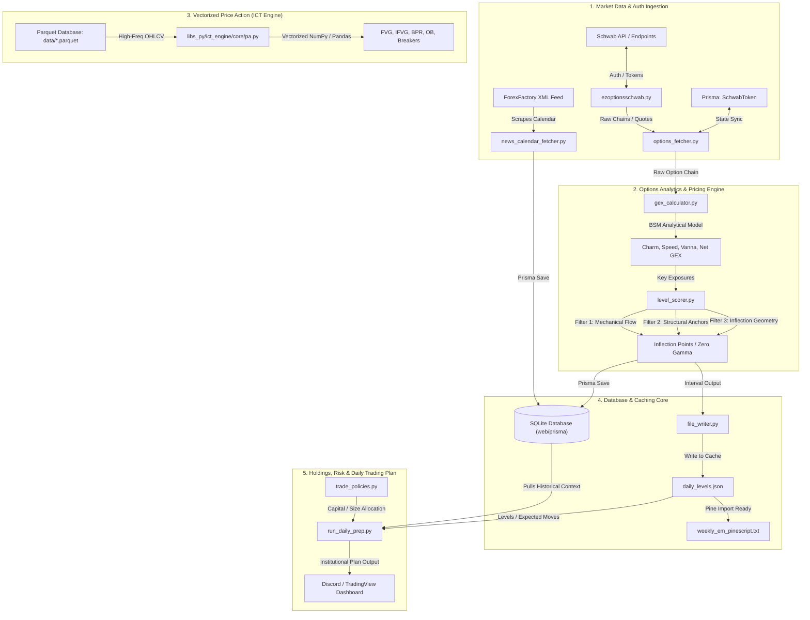
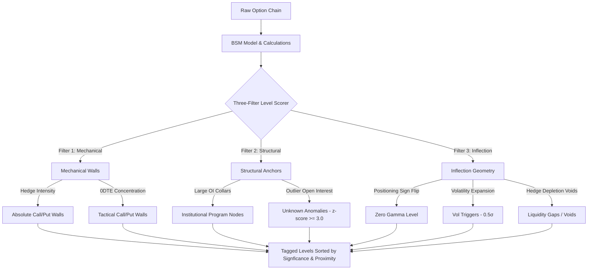

# Options Trading & Market Data Infrastructure Inventory

**Last Updated:** May 19, 2026
**Purpose:** Permanent technical blueprint, architectural catalog, and development reference for the Options, Market Data, Price Action, and PERSISTENCE layers of the TCM Trading System.

## Current Runtime Status (May 19, 2026)

- Options streaming pipeline is running with direct Prisma writes plus API fallback resilience in the interval writer path.
- Fresh index snapshots are being persisted for SPY, SPX, QQQ, and IWM in `GexSnapshot` / `MacroSnapshot`.
- Strategy engine index-entry staleness hard gate is currently enforced at 15 minutes during RTH in the engine loop.
- Daily strategy routing currently includes `WHEEL`, `EARNINGS_STRANGLE`, `INCOME_CC`, and `LONG_DTE_CREDIT` at 10:00 ET.
- Handoff alignment documents are present under `docs/features/options_dashboard/` (`HANDOFF.md`, `HANDOFF_v2.md`, `HANDOFF_v3.md`).

---

## 🧱 Architectural System Map



---

## 🗺️ Workspace Directory Structure

The core options trading, price action library, and market data infrastructure is structured across the following paths:

```bash
c:\Users\vinay\tvDownloadOHLC
├── data/                                 # Parquet Market Database & Derived Level Caches
│   ├── QQQ_1m.parquet                    # ETF minute datasets
│   ├── SPY_1m.parquet                    
│   ├── NQ1_1m.parquet                    # High-frequency Futures continuous contracts
│   ├── ES1_1m.parquet
│   ├── ADV_1m.parquet                    # NYSE/NASDAQ Market Internals
│   ├── TICK_1m.parquet
│   ├── daily_levels.json                 # Real-time computed options levels cache
│   └── expected_moves.json               # Current day expected move calculations
├── docs/                                 # Architecture Decisions & Unified Core Guidelines
│   ├── SecondBrain_Trading.md            # Verified Statistical Probabilities Source
│   └── SCRIPTS_CATALOG.md                # High-level developer catalog
├── scripts/
│   ├── libs_py/                          # Proprietary Python Analytical Libraries
│   │   ├── ict_engine/core/pa.py         # High-performance Vectorized Price Action
│   │   ├── nqstats/                      # RTH, IB, and Profile Statistics Engine
│   │   └── risk/                         # Risk Policies and Account Management
│   ├── market_data/                      # Macro updates & Economic Calendar fetching
│   │   ├── capture_rth_open.py           # RTH Open Straddle and IV capturer
│   │   └── fetch_economic_calendar.py    # Economic events scheduler
│   ├── streaming/
│   │   ├── news_calendar_fetcher.py      # ForexFactory XML Feed Scraper
│   │   ├── api_expected_move.py          # Expected Move Dual-Proxy engine
│   │   └── options/                      # Real-time quantitative options levels pipeline
│   │       ├── ezoptionsschwab.py        # Custom Schwab API Client wrapper
│   │       ├── options_fetcher.py        # Token Auth Synchronizer & Chain Snapshots
│   │       ├── gex_calculator.py         # Advanced mathematical GEX/BSM analytics
│   │       ├── level_scorer.py           # Three-Filter triage scoring engine
│   │       └── run_options_levels.py     # Live multi-ticker pipeline coordinator
│   └── trader/
│       └── run_daily_prep.py             # Combined pre-market prep dashboard builder
└── web/
    └── prisma/
        └── schema.prisma                 # Core SQLite Database Schema Models
```

---

## 🔐 1. Broker & Auth Integrations

Manages persistent session authorization, token synchronization, and credentials synchronization with the Schwab Trader APIs.

### A. Core Modules & Files

#### 💻 [ezoptionsschwab.py](file:///c:/Users/vinay/tvDownloadOHLC/scripts/streaming/options/ezoptionsschwab.py)
* **Description:** Low-level, robust custom API helper client wrapping Schwab HTTP endpoints. Provides token synchronization, HTTP header construction, payload verification, and automated request retry loops.
* **Key Methods:**
  * `get_option_chain(symbol, strikeCount, includeQuotes, strategy, interval)`: Constructs endpoints for fetching raw options strings.
  * `get_market_quotes(symbols)`: Fetches real-time snapshots for multiple equities and indices.
  * `_refresh_session()`: Checks expiresAt and triggers a refresh loop when the access token approaches expiration.

#### 💻 [options_fetcher.py](file:///c:/Users/vinay/tvDownloadOHLC/scripts/streaming/options/options_fetcher.py)
* **Description:** Mid-level client manager handling token storage state and API synchronization. Triggers database sync or localized fallback to `token.json` when Prisma DB is temporarily unavailable.
* **Key Classes:**
  * `SchwabAuthManager`: Holds encryption/decryption hooks, parses raw OAuth callback strings, and persists tokens to SQLite via the `SchwabToken` model.
  * `OptionChainFetcher`: Orchestrates chain requests. Falls back to nearest strike range queries if the API limits large strikes fetching.

### B. Persistent Database Models
Defined in [schema.prisma](file:///c:/Users/vinay/tvDownloadOHLC/web/prisma/schema.prisma):

```prisma
model SchwabToken {
  id           String   @id @default("schwab-primary")
  accessToken  String   // Encrypted OAuth access token
  refreshToken String   // Encrypted long-lived refresh token
  expiresAt    Int      // Epoch expiration timestamp
  idToken      String?  
  tokenType    String
  scope        String?
  createdAt    DateTime @default(now())
  updatedAt    DateTime @updatedAt
}
```

---

## 📈 2. Market Data Ingestion & Fetching

Handles historical database updates, real-time option chain snapshotting, VIX indexing, and the Dual-Proxy Index Normalization algorithm.

### A. Core Modules & Files

#### 💻 [api_expected_move.py](file:///c:/Users/vinay/tvDownloadOHLC/scripts/streaming/api_expected_move.py)
* **Description:** Dual-Proxy expected move normalization engine. Normalizes liquid ETF option chains to calculate index expected moves where direct index data is illiquid or unavailable on Schwab.
* **Key Configurations:**
  * `PROXY_MAP`: Establishes the spot-to-ETF mappings:
    $$\text{/ES} \rightarrow (\text{Index: SPX, ETF: SPY})$$
    $$\text{/NQ} \rightarrow (\text{Index: NDX, ETF: QQQ})$$
    $$\text{/YM} \rightarrow (\text{Index: DJI, ETF: DIA})$$
    $$\text{/RTY} \rightarrow (\text{Index: RUT, ETF: IWM})$$
* **Key Functions:**
  * `calculate_em_values(spot, iv, dte)`: Standard Expected Move (EM) calculation using Black-Scholes-Merton DTE scaling factors:
    $$\text{EM}_{\text{std}} = \text{Spot} \times \text{IV} \times \sqrt{\frac{\text{DTE}}{365}}$$
  * `get_adjusted_em(straddle_cost)`: Expected Move rule-of-thumb adjusted bounds:
    $$\text{EM}_{\text{adj}} = 0.85 \times \text{Straddle Cost}$$
  * `normalize_proxy_move(etf_straddle, etf_spot, index_spot)`: Maps highly active ETF straddles back to Cash Index levels:
    $$\text{Index EM}_{\text{normalized}} = \frac{\text{ETF Straddle Cost}}{\text{ETF Spot Price}} \times \text{Index Spot Price} \times 0.85$$

#### 💻 [weekly_futures_em.py](file:///c:/Users/vinay/tvDownloadOHLC/scripts/streaming/options/weekly_futures_em.py)
* **Description:** Retrieves near-term options chain for liquid futures contracts (e.g. `/ES`, `/NQ`) directly via Schwab APIs, extracts the exact ATM straddles, and calculates real-time volatility constraints.
* **Key Functions:**
  * `calculate_exact_atm_em(chain_data)`: Finds the closest call and put strike pair, matches their implied volatilities, and scales them to exact remaining trading minutes.

#### 💻 [fetch_vix_data.py](file:///c:/Users/vinay/tvDownloadOHLC/scripts/market_data/fetch_vix_data.py)
* **Description:** Downloads VIX and VVIX daily and intraday close prices, providing volatility regime filters for the options pricing engine.

### B. High-Performance Parquet Database
All historical OHLCV data is organized under `/data` using snappy-compressed Apache Parquet files, optimized for vectorized operations:

| Asset Type | File Signature | Timeframes | Purpose |
| :--- | :--- | :--- | :--- |
| **Futures** | `NQ1_[TF].parquet`, `ES1_[TF].parquet` | 1m, 5m, 15m, 1h, 4h, 1d | High-frequency continuous contracts |
| **Indices** | `SPX_1m.parquet`, `NDX_1m.parquet` | 1m, 5m, 15m, 1d | Cash Index reference datasets |
| **ETFs** | `SPY_1m.parquet`, `QQQ_1m.parquet` | 1m, 5m, 15m, 1d | High-liquidity options base underlyings |
| **Internals** | `TICK_1m.parquet`, `DVOL_1m.parquet` | 1m | NYSE/NASDAQ real-time momentum indicators |

---

## 🧮 3. Options Analytics & Math Engine

Calculates first and second-order Greeks, volume centroids, and zero-gamma flip points, passing them to the Institutional Three-Filter Triage.

### A. Mathematical Formulation (Greeks Engine)

All options analytics are computed using the Black-Scholes-Merton (BSM) analytical model in [gex_calculator.py](file:///c:/Users/vinay/tvDownloadOHLC/scripts/streaming/options/gex_calculator.py):

#### Standard Inputs:
* $S$: Spot Price
* $K$: Strike Price
* $t$: Years to Expiry (calculated in minutes-to-expiry $/ 525,600$)
* $\sigma$: Implied Volatility (IV)
* $r$: Risk-Free Rate
* $q$: Dividend Yield
* $N(x)$: Cumulative Normal Distribution
* $N'(x) = \frac{1}{\sqrt{2\pi}} e^{-x^2/2}$: Normal Probability Density Function

#### 1. Zero-Order Variables ($d_1, d_2$):
$$d_1 = \frac{\ln(S/K) + (r - q + \sigma^2/2)t}{\sigma \sqrt{t}}$$
$$d_2 = d_1 - \sigma \sqrt{t}$$

#### 2. Call Gamma ($\Gamma$):
$$\Gamma = \frac{e^{-q t} N'(d_1)}{S \sigma \sqrt{t}}$$

#### 3. Net GEX Exposure ($\text{GEX}_{\text{net}}$):
$$\text{GEX}_{\text{net}} = \left( \text{OI}_{\text{Calls}} \times \Gamma_{\text{Calls}} \times 100 \times S \right) - \left( \text{OI}_{\text{Puts}} \times \Gamma_{\text{Puts}} \times 100 \times S \right)$$

#### 4. Delta-Adjusted GEX ($\text{DEX}_{\text{net}}$):
To emphasize ATM exposures, GEX is weighted by absolute Delta ($\Delta$):
$$\Delta_{\text{Call}} = e^{-q t} N(d_1), \quad \Delta_{\text{Put}} = e^{-q t} [N(d_1) - 1]$$
$$\text{DEX}_{\text{net}} = \left( \text{OI}_{\text{Calls}} \times \Gamma_{\text{Calls}} \times |\Delta_{\text{Call}}| \times 100 \times S \right) - \left( \text{OI}_{\text{Puts}} \times \Gamma_{\text{Puts}} \times |\Delta_{\text{Put}}| \times 100 \times S \right)$$

#### 5. Second-Order Volatility Sensitivity: Vanna
Models the change in Delta relative to changes in Implied Volatility:
$$\text{Vanna} = \frac{\partial \Delta}{\partial \sigma} = -e^{-q t} N'(d_1) \frac{d_2}{\sigma}$$

#### 6. Second-Order Time Decay Sensitivity: Charm (Delta Decay)
Models the decay of Delta relative to the passage of calendar time:
$$\text{Charm}_{\text{Call}} = \frac{\partial \Delta_{\text{Call}}}{\partial t} = q e^{-q t} N(d_1) - e^{-q t} N'(d_1) \left( \frac{r - q}{\sigma \sqrt{t}} - \frac{d_2}{2t} \right)$$

#### 7. Third-Order Spot Sensitivity: Speed
Models the change in option Gamma relative to movements in the spot price:
$$\text{Speed} = \frac{\partial \Gamma}{\partial S} = -\frac{\Gamma}{S} \left( \frac{d_1}{\sigma \sqrt{t}} + 1 \right)$$

#### 8. Volume-Weighted Strike Centroids (Strike VWAP)
Identifies the gravity center of trading volume inside the options chain:
$$\text{Centroid}_{\text{Call}} = \frac{\sum (K \times \text{Volume}_{\text{Call}})}{\sum \text{Volume}_{\text{Call}}}$$
$$\text{Centroid}_{\text{Put}} = \frac{\sum (K \times \text{Volume}_{\text{Put}})}{\sum \text{Volume}_{\text{Put}}}$$

---

### B. Core Modules & Files

#### 💻 [gex_calculator.py](file:///c:/Users/vinay/tvDownloadOHLC/scripts/streaming/options/gex_calculator.py)
* **Description:** Calculations for BSM parameters, analytical Charm, Speed, volume centroids, Delta-adjusted gamma, and volatility triggers.
* **Key Functions:**
  * `_analytical_charm(flag, S, K, t, sigma, r, q)`: Returns the exact Charm decay factor.
  * `_analytical_speed(S, K, t, sigma, r, q)`: Returns the Gamma sensitivity rate.
  * `_delta_adjusted_gex(chain_data)`: Returns delta-adjusted call and put gamma levels.
  * `find_zero_gamma(chain_gex_df)`: Iterates strike bounds to locate the exact price level where net book positioning shifts sign.

#### 💻 [level_scorer.py](file:///c:/Users/vinay/tvDownloadOHLC/scripts/streaming/options/level_scorer.py)
* **Description:** Implements the **Three-Filter Level Scorer** architecture. Prioritizes mathematical levels into TaggedLevels based on mechanical walls, structural anchors, and inflection points.
* **Filter Taxonomy:**
  1. ** MECHANICAL WALLS (Filter 1 - The Brakes):** Price strikes where dealer gamma hedging physically slows down spot price movement. Top 5% book concentration.
  2. ** STRUCTURAL ANCHORS (Filter 2 - Institutional Gravity):** Flags large-OI pension collars, corporate buybacks, and roll exposures (e.g. quarterly roll programs like JHEQX).
  3. ** INFLECTION GEOMETRY (Filter 3 - Transition Zones):** Points where dealer positioning transforms (Zero Gamma, Magnet pins, liquidity gaps).



* **Dataclass Hierarchy:**
  * `TaggedLevel` (Base): `strike`, `label`, `significance` (PRIMARY, SECONDARY, CONTEXT), `side` (CALL, PUT, NEUTRAL), `description`.
  * `MechanicalWall(TaggedLevel)`: Adds `net_gex`, `pct_of_book`, `hedge_contracts`, `proximity_score`.
  * `StructuralAnchor(TaggedLevel)`: Adds `open_interest`, `matched_program`, `oi_zscore`, `relevance` (DORMANT, APPROACHING, ACTIVE, CRITICAL), `days_to_expiry`.
  * `InflectionPoint(TaggedLevel)`: Adds `inflection_type` (FLIP, MAGNET, VOID), `slope_magnitude`, `gamma_velocity`.

---

## 📉 4. Price Action & Vectorized ICT Engines

Calculates Fair Value Gaps (FVG), Inversion FVGs (IFVG), Balanced Price Ranges (BPR), and Order Blocks (OB) in a single high-performance vectorized pass.

### A. Core Modules & Files

#### 💻 [pa.py](file:///c:/Users/vinay/tvDownloadOHLC/scripts/libs_py/ict_engine/core/pa.py)
* **Description:** Vectorized Pandas and NumPy indicators designed for high-frequency pricing frames. Avoids slow looping.
* **Vectorized Formulations:**
  * **Fair Value Gaps (FVG):** Vectorized by rolling dataframe arrays:
    $$\text{High}_{\text{rolled\_1}} = \text{Roll}(H, 1), \quad \text{Low}_{\text{rolled\_minus\_1}} = \text{Roll}(L, -1)$$
    $$\text{Bullish FVG} = \text{Low}_{\text{rolled\_minus\_1}} > \text{High}_{\text{rolled\_1}}$$
    $$\text{Bearish FVG} = \text{High}_{\text{rolled\_minus\_1}} < \text{Low}_{\text{rolled\_1}}$$
  * **Balanced Price Ranges (BPR):** Identifies overlapping bullish and bearish FVGs:
    $$\text{BPR} = \text{OverlappingRange}(\text{FVG}_{\text{bull}}, \text{FVG}_{\text{bear}})$$
  * **Order Blocks (OB):** Scans structural breaks (BOS/MSS) to isolate the high-volume buying/selling candles preceding the break.
  * **Liquidity Sweeps:** Flags candle wicks that extend beyond the rolling high/low extremes before closing back inside the boundary.

#### 💻 [sessions.py](file:///c:/Users/vinay/tvDownloadOHLC/scripts/libs_py/nqstats/sessions.py)
* **Description:** Segments session boundaries and tags trading data into distinct global sessions (Asia, London, NY AM, NY PM, RTH).

#### 💻 [generate_ict_nwog_ndog.py](file:///c:/Users/vinay/tvDownloadOHLC/scripts/trader/generate_ict_nwog_ndog.py)
* **Description:** Establishes New Week Opening Gaps (NWOG) and New Day Opening Gaps (NDOG) from weekly/daily sessions close and open transitions.

---

## 📅 5. Macro Calendar & Event Data

Automates the fetching and formatting of economic calendar schedules from ForexFactory, exporting data to NinjaTrader for custom strategies.

### A. Core Modules & Files

#### 💻 [news_calendar_fetcher.py](file:///c:/Users/vinay/tvDownloadOHLC/scripts/streaming/news_calendar_fetcher.py)
* **Description:** ForexFactory XML scraper. Retrieves economic calendar feeds, translates GMT times to Eastern Time, filters by currency and impact level, and exports to both SQLite and NinjaTrader.
* **Scraper Configs:**
  * `FF_XML_URLS`: `https://nfs.faireconomy.media/ff_calendar_thisweek.xml`
  * `CURRENCIES`: `["USD"]` (filters relevant index indicators)
  * `IMPACT_LEVELS`: `["High", "Medium", "Low"]`
* **Output Path:** Generates a custom CSV written to `~/Documents/NinjaTrader 8/bin/Custom/news_blackout.csv` formatted with pre and post-event blackout buffers.

#### 💻 [fetch_economic_calendar.py](file:///c:/Users/vinay/tvDownloadOHLC/scripts/market_data/fetch_economic_calendar.py)
* **Description:** Backup calendar ingestor.

#### 💻 [futures_rollover_calendar.py](file:///c:/Users/vinay/tvDownloadOHLC/scripts/tools/selenium_downloader/futures_rollover_calendar.py)
* **Description:** Web scraper capturing CME futures rollover dates, notifying the engine to adjust contract designations.

---

## 💾 6. Data Persistence & Cache Layers

Maintains SQLite schema configurations, Parquet storage loaders, and intraday JSON levels files.

### A. SQLite Prisma Database
Defined in [schema.prisma](file:///c:/Users/vinay/tvDownloadOHLC/web/prisma/schema.prisma):

```prisma
model SchwabToken {
  id           String   @id @default("schwab-primary")
  accessToken  String
  refreshToken String
  expiresAt    Int
  idToken      String?
  tokenType    String
  scope        String?
  createdAt    DateTime @default(now())
  updatedAt    DateTime @updatedAt
}

model ExpectedMove {
  id              Int      @id @default(autoincrement())
  ticker          String
  calculationDate DateTime
  expiryDate      DateTime
  price           Float
  straddle        Float
  em365           Float
  em252           Float
  adjEm           Float
  manualEm        Float?
  createdAt       DateTime @default(now())
  updatedAt       DateTime @updatedAt
  basis           String?
  note            String?

  @@unique([ticker, calculationDate, expiryDate])
}

model ExpectedMoveHistory {
  id            Int      @id @default(autoincrement())
  ticker        String
  date          DateTime
  closePrice    Float
  straddlePrice Float?
  emStraddle    Float?
  iv365         Float?
  em365         Float?
  iv252         Float?
  em252         Float?
  source        String?
  createdAt     DateTime @default(now())
  updatedAt     DateTime @updatedAt

  @@unique([ticker, date])
  @@index([ticker])
}

model GexSnapshot {
  id                    Int      @id @default(autoincrement())
  ticker                String
  timestamp             DateTime
  tradingDate           DateTime
  totalGex              Float
  totalGexDeltaAdj      Float?
  callGammaTotal        Float?
  putGammaTotal         Float?
  gexRegime             String
  regimeLabel           String?
  spotPrice             Float
  gammaMagnet           Float?
  pinStrike             Float?
  callVolumeCentroid    Float?
  putVolumeCentroid     Float?
  netSpeedExposure      Float?
  netVannaExposure      Float?
  put25dIv              Float?
  call25dIv             Float?
  volatilitySkewPremium Float?
  createdAt             DateTime @default(now())

  @@index([ticker, tradingDate])
  @@index([ticker, timestamp])
}

model MacroSnapshot {
  id                    String   @id @default(cuid())
  ticker                String
  timestamp             DateTime
  tradingDate           DateTime
  spotPrice             Float
  macroCallWall         Float?
  macroPutWall          Float?
  zeroGamma             Float?
  put25dIv              Float?
  call25dIv             Float?
  volatilitySkewPremium Float?
  anomalies             String?
  dominantNodes         String?

  @@unique([ticker, tradingDate])
  @@index([ticker])
}

model Trade {
  id               String          @id @default(cuid())
  ticker           String
  entryDate        DateTime
  exitDate         DateTime?
  entryPrice       Float?
  exitPrice        Float?
  quantity         Float
  direction        String
  status           String
  accountId        String
  strategyId       String?
  orderType        String          @default("MARKET")
  pnl              Float?
  risk             Float?
  mae              Float?
  mfe              Float?
  metadata         String?
  originalSource   String?
  playbookId       String?
  createdAt        DateTime        @default(now())
  updatedAt        DateTime        @updatedAt
  marketCondition  MarketCondition?
  tradeEvents      TradeEvent[]
  legs             TradeLeg[]
  snapshots        QuoteSnapshot[]
}

model TradeLeg {
  id          String   @id @default(cuid())
  tradeId     String
  trade       Trade    @relation(fields: [tradeId], references: [id], onDelete: Cascade)

  symbol      String
  legIndex    Int
  optionType  String
  side        String
  strike      Float?
  expiry      DateTime?
  quantity    Int

  openPrice   Float
  openBid     Float?
  openAsk     Float?
  openIv      Float?
  openDelta   Float?
  openGamma   Float?
  openTheta   Float?
  openVega    Float?

  closePrice  Float?
  closeBid    Float?
  closeAsk    Float?
  closeIv     Float?
  closeDelta  Float?
  closeGamma  Float?
  closeTheta  Float?
  closeVega   Float?

  legPnl      Float?
  assigned    Boolean  @default(false)
  expiredOtm  Boolean  @default(false)

  createdAt   DateTime @default(now())
  updatedAt   DateTime @updatedAt

  @@index([tradeId])
  @@index([symbol])
}

model QuoteSnapshot {
  id              String   @id @default(cuid())
  tradeId         String
  trade           Trade    @relation(fields: [tradeId], references: [id], onDelete: Cascade)

  takenAt         DateTime @default(now())
  underlyingPx    Float
  netValue        Float
  unrealizedPnl   Float
  legPrices       String

  vix             Float?
  gexRegime       String?
  zeroGamma       Float?

  @@index([tradeId, takenAt])
}

model SignalNearMiss {
  id                 String   @id @default(cuid())
  researchStrategyId String

  evaluatedAt        DateTime @default(now())
  ticker             String
  underlyingPx       Float

  failingFilter      String
  filterValue        Float?
  filterThreshold    Float?
  context            String

  @@index([researchStrategyId, evaluatedAt])
  @@index([failingFilter])
}

model Holding {
  id          String   @id @default(cuid())
  ticker      String   @unique
  shares      Int
  costBasis   Float
  acquiredAt  DateTime
  notes       String?
  createdAt   DateTime @default(now())
  updatedAt   DateTime @updatedAt
}

model RthExpectedMove {
  id            Int      @id @default(autoincrement())
  ticker        String
  date          DateTime
  openPrice     Float?
  vixValue      Float?
  straddlePrice Float?
  emStraddle    Float?
  ivAtOpen      Float?
  emIv          Float?
  emVix         Float?
  createdAt     DateTime @default(now())
  updatedAt     DateTime @updatedAt

  @@unique([ticker, date])
  @@index([ticker])
}

model EarningsCalendar {
  id              String   @id @default(cuid())
  ticker          String
  earningsDate    DateTime
  beforeMarket    Boolean
  confirmed       Boolean  @default(false)
  source          String   @default("yfinance")
  fetchedAt       DateTime @default(now())

  @@unique([ticker, earningsDate])
  @@index([earningsDate])
}

model EconomicEvent {
  id        String       @id @default(cuid())
  datetime  DateTime
  name      String
  impact    String
  actual    Float?
  forecast  Float?
  previous  Float?
  createdAt DateTime     @default(now())
  trades    TradeEvent[]
}
```

### B. Core Modules & Files

#### 💻 [loader.py](file:///c:/Users/vinay/tvDownloadOHLC/scripts/libs_py/data/loader.py)
* **Description:** Custom high-speed parquet loader with multi-threaded optimizations for large arrays.

#### 💻 [resampler.py](file:///c:/Users/vinay/tvDownloadOHLC/scripts/libs_py/data/resampler.py)
* **Description:** Vectorized OHLCV time-resampler (1m $\rightarrow$ 5m, 15m, 1h, 4h).

#### 💻 [file_writer.py](file:///c:/Users/vinay/tvDownloadOHLC/scripts/streaming/options/file_writer.py)
* **Description:** Formats real-time computed options outputs into localized cache layers, generating:
  * `daily_levels.json`: Localized API cache.
  * `daily_levels.txt`: Copy-ready formatted strings.
  * `weekly_em_pinescript.txt`: Unified Pine Script v6 `array.new` strings, enabling copy-paste input for TradingView indicators.

---

## 💼 7. Position Tracking & Risk Management

Defines capital allocation boundaries, daily drawdown caps, trade execution rules, and automated pre-market trade plans.

### A. Core Modules & Files

#### 💻 [trade_policies.py](file:///c:/Users/vinay/tvDownloadOHLC/scripts/libs_py/risk/trade_policies.py)
* **Description:** Enforces quantitative capital preservation policies.
* **Execution Rules:**
  * **Drawdown Caps:** Shuts down operations if intraday loss exceeds predefined percentages of the `initialBalance` in the `Account` model.
  * **Volatility Adjuster:** Scales position size relative to the ATR (Average True Range) and VIX metrics.
  * **Killzone Constraints:** Limits execution during low-volume sessions (Asia) and high-impact economic news releases.

#### 💻 [run_daily_prep.py](file:///c:/Users/vinay/tvDownloadOHLC/scripts/trader/run_daily_prep.py)
* **Description:** Pre-market briefing coordinator. Runs prior to RTH open, pulling data from GEX files, expected moves, and overnight session profiles to generate a unified copy-ready briefing for TradingView dashboards.

---

## 📐 Unified Options Levels Matrix

The computed options levels, calculated in [gex_calculator.py](file:///c:/Users/vinay/tvDownloadOHLC/scripts/streaming/options/gex_calculator.py) and scored in [level_scorer.py](file:///c:/Users/vinay/tvDownloadOHLC/scripts/streaming/options/level_scorer.py), follow this taxonomy:

| Level Name | Core Mathematical Definition | Level Category | Operational Hedging & Trading Significance |
| :--- | :--- | :--- | :--- |
| **Absolute Call Wall** | $\max_K (\text{GEX}_{\text{Call}, K})$ | **STRATEGIC (Primary)** | The structural ceiling for dealer long positioning. Operates as an overhead resistance wall. |
| **Absolute Put Wall** | $\max_K (|\text{GEX}_{\text{Put}, K}|)$ | **STRATEGIC (Primary)** | The structural floor for dealer short positioning. Operates as a support wall. |
| **Tactical Call Wall** | $\max_K (\text{GEX}_{\text{Call}, K, \text{near-term}})$ | **PIVOT (Secondary)** | Near-term expiry wall. High daily attraction/pin potential in bullish regimes. |
| **Tactical Put Wall** | $\max_K (|\text{GEX}_{\text{Put}, K, \text{near-term}}|)$ | **PIVOT (Secondary)** | Near-term downside support floor. Active hedging pivot for the current session. |
| **Zero Gamma Level** | $\text{Price where } \text{GEX}_{\text{net}} \text{ crosses } 0$ | **PIVOT (Secondary)** | The transition boundary. Volatility expands below; market is supportive above. |
| **Vanna Resistance** | $\max_K (\text{Vanna}_{\text{Call}, K})$ | **CONTEXTUAL** | Peak sensitivity to implied volatility changes. Triggers hedging shifts as IV expands. |
| **Vanna Support** | $\max_K (\text{Vanna}_{\text{Put}, K})$ | **CONTEXTUAL** | Peak downside IV sensitivity. Key for spotting volatility-based sell accelerations. |
| **Charm Gravity Node** | $\max_K (\text{Charm}_{\text{Call}, K})$ | **CONTEXTUAL** | Peak time-decay sensitivity. Drives passive weekend buyback/selling pressures. |
| **Liquidity Void** | $\min_K (\text{OI}_K) \text{ inside heavy OI bands}$ | **CONTEXTUAL** | High-velocity zones. Spot price slips rapidly through these voids due to a lack of dealer positioning. |

---

> [!IMPORTANT]
> **TCM Developer Integration Rule**
> Any script modifying calculations for option walls, expected moves, or Greek sensitivities must align with **ADR-016 (Unified Hierarchy)**, enforce GMT-to-Eastern conversions, and utilize the [options_fetcher.py](file:///c:/Users/vinay/tvDownloadOHLC/scripts/streaming/options/options_fetcher.py) Schwab Token Synchronizer interface.
