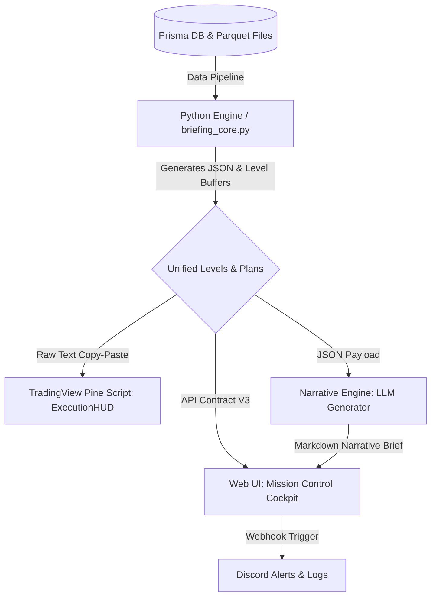
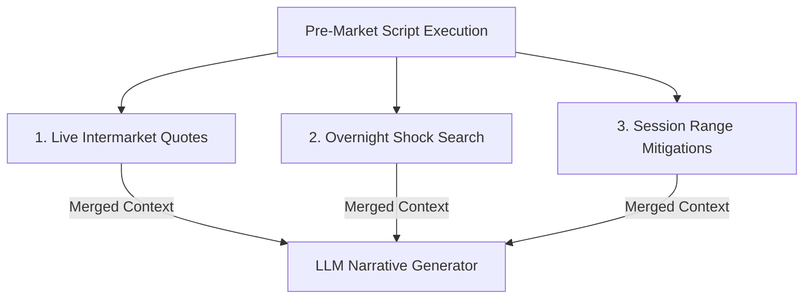

# Unified Trading Intelligence System — Architectural Blueprint

This document defines the high-level system architecture, separation of concerns, and component roles for the unified trading environment. It establishes the concept of a **Mission Control Cockpit** as the central hub connecting raw data pipelines, visual charts, qualitative AI analysis, and execution plans.

---



---

## 1. Core Component Separation of Concerns

To create a highly reliable, zero-latency execution environment, each component in the ecosystem must serve a specific, non-overlapping role.

### A. TradingView Pine Script (`ExecutionHUD.pine`)
* **Primary Role**: **Real-Time On-Chart Visual Context & Tactical Execution.**
* **Core Responsibilities**:
  * **Visual Overlay**: Render key options levels (Ceilings, Floors, Volatility Pivots, Magnets) directly on the live price candles.
  * **Tactical HUD**: Display the real-time table containing the active setup banner, trade triggers, invalidation zones, and immediate price targets.
  * **Zero Latency**: Provide instant visual feedback when the price tests, breaches, or rejects a key level.
* **Why**: The chart is where the execution decision occurs. It must be visual, local, and overlayed directly on the price bars with zero computational delay.

### B. The Narrative (LLM-Generated Briefs)
* **Primary Role**: **Qualitative Synthesis, Macro Contextualization, & Cognitive Framing.**
* **Core Responsibilities**:
  * **Storytelling**: Synthesize multi-dimensional data points (bias stats, economic calendar, GEX levels) into a cohesive "story of the day" (focusing on the **Story Strike**).
  * **Trader's Brief**: Translate mathematical boundaries into plain-English tactical briefs using a desk trader persona, stripping out options jargon (e.g., using "Upside Ceiling" instead of "Call Wall").
  * **Contextual Blending**: Integrate qualitative external factors that cannot easily be mapped on a chart (e.g. CPI release blackout windows, day type probabilities, and macro trends).
* **Why**: The narrative primes the trader's mindset before the market opens and documents EOD performance, acting as a strategic advisor rather than a visual alert system.

### C. The Web UI (Mission Control Cockpit)
* **Primary Role**: **Passive High-Fidelity Cockpit & Deep-Dive Information Readout.**
* **Core Responsibilities**:
  * **Narrative Support & Ground Truth**: Display the detailed quantitative backup data (levels ladder, squeeze factors, day types, GEX profiles) that the shorter narrative is distilled from.
  * **Visual Dashboards**: Render heatmaps, GEX profiles, and volatility charts passively.
  * **Zero Control / Read-Only**: The UI is purely a passive reader. It does not initiate tasks, trigger webhooks, or dispatch actions.
* **Why**: The UI provides the trader with a comprehensive visual check of the raw numbers whenever they want to verify or deep-dive into the narrative's conclusions.

---

## 2. Evolving the System: The Passive "Mission Control" UI

The Web UI (V3) acts as a **Passive Mission Control Cockpit**—a single-screen detailed readout of the background data pipeline. It contains four passive sections:

### Panel 1: The Levels & Squeeze Profile
*   **Levels Ladder**: Sorts all option levels from highest to lowest, displaying their point and percentage distance from the current price, color-matched to the `ExecutionHUD` chart colors.
*   **Squeeze Screener Card**: Displays the visual squeeze probability dial (0-100), compiled passively from the Python engine's calculations.

### Panel 2: The Narrative Viewer
*   **Briefing Deck**: Displays the generated markdown narratives (Morning Prep, Midday Update, EOD Review) in a clean, highly readable layout.
*   **LLM Comparison**: Side-by-side passive view of different narrative runs to monitor formatting and quality over time.

### Panel 3: Volatility & Market Structure (GEX Analyzer)
*   **GEX Heatmap**: Passive matrix showing net-gamma profiles across different strikes and expirations.
*   **Structure Guide Cards**: Visual blocks displaying the pre-calculated `NOW` (immediate volatility state), `BAND` (active decision channel), and `CHANGE` (overnight shifts) variables.
*   **Volatility Indicators**: Real-time charts tracking VIX, VVIX, and DEX momentum.

### Panel 4: Compliance & Classification Deck
*   **Unified Day Classification**: Displays the resolved day types, sequential probabilities, and NQStats bias rankings.
*   **Track Mandate Check**: Flags which execution mandate (Track A/B/C) is currently active based on the background logic.

---

## 3. Simplified Options Terminology Policy

To keep the narrative clean and trade-focused, the system enforces a strict jargon-free policy. The Python engine will pre-process options data and supply the LLM with simplified trading terms:

| Options Term (Jargon) | Simplified Trading Term | UI V3 Label | TV Pine Label | Actionable Trading Meaning |
|---|---|---|---|---|
| **Call Wall** | Upside Ceiling | Call Wall | Absolute Call Wall | Major overhead resistance. |
| **Put Wall** | Downside Floor | Put Wall | Absolute Put Wall / Hedge Wall | Major downside support. |
| **Zero Gamma / Gamma Flip** | Volatility Pivot | Gamma Flip | Zero Gamma / Gamma Flip Zone | The boundary dividing the low-vol range and the high-vol trend. |
| **Gamma Magnet / Pin Strike** | Price Magnet | Γ Magnet | Gamma Magnet / Pin Strike | The price level attracting the market. |
| **DEX Cliff / Cliff Up-Down** | Velocity Cliff | N/A | Gamma Cliff Up / Down | The point where a breach triggers a fast breakout run. |
| **Upper / Lower EM** | Expected High / Low | EM High / EM Low | Upper EM / Lower EM | The statistical expected range limits for the day. |

---

## 4. Economic Calendar, Weekly ICT Profiles, & Macro Sentiment

News releases are not just isolated times to sit out; they are the **catalysts that fuel range expansions and determine weekly structure**. 

To align the narratives with ICT weekly profile logic and macro trends, the Python engine will pre-classify the news sequence and inject it into the prompt.

### A. Evolving the Weekly ICT Profile Archetype
At the start of each week, the Python engine will scan the news calendar and determine the expected weekly profile:

| News Schedule | Expected Weekly Archetype | HOTW / LOTW Formation | Trading Strategy |
|---|---|---|---|
| **Wednesday FOMC / CPI** | Wednesday News-Driven Expansion | Wednesday morning/afternoon news release. | Consolidate Mon-Tue. Trade only post-news Wednesday and Thursday distribution. |
| **Friday NFP / Clustered Red Folders** | Seek & Destroy (Broad Chop) | Irregular; sweeps both extremes. | Avoid trend-following. Scalp range extremes; expect high chop and reversal profiles. |
| **Quiet Week / Minor News** | Classic Tuesday H/L of the Week | Tuesday London or AM session. | Monday establishes initial range. Enter trend-following continuation on Tuesday/Wednesday. |
| **Monday/Tuesday News (NFP/CPI early)** | Early Week Catalyst Profile | Monday/Tuesday during the news. | Immediate breakout expansion. Trend-follow starting Tuesday morning. |

*How this helps:* The pre-market narrative will state: *"This is a Wednesday News-Driven Expansion week. Expect consolidation or sideways range play until the Wednesday CPI print, which is the high-probability window for forming the Low/High of the Week."*

---

### B. Injecting Macro Sentiment & Consensus Themes
To ensure the LLM understands *why* a specific news event matters without hallucinating recent news, we will support a weekly configuration file (`scripts/config/weekly_macro_sentiment.yaml`) loaded by the Python engine:

```yaml
# scripts/config/weekly_macro_sentiment.yaml
macro_theme: "Market focus is entirely on the upcoming CPI print to confirm Fed rate cut path. Fed speakers have maintained a data-dependent stance."
event_sentiment:
  CPI: "Consensus is 0.2% MoM. Cooler CPI is bullish (aim for Upside Ceiling at 30,250), hot CPI will trigger downside expansion (aim for Downside Floor at 30,010)."
  FOMC: "Consensus is a 25bps cut. Market is highly sensitive to Powell's tone on labor market cooling."
```

The Python engine will merge this with the calendar and inject it into the cheat sheet:
> **Weekly Macro Focus:** [macro_theme]
> **Today's News Catalyst:** CPI (08:30 AM). [event_sentiment.CPI]

---

### C. Daily Tactical News Buffers (Blackouts & Windows)
The daily narrative will include strict time-based rules derived from the calendar:
1.  **News Blackout Buffers**: Pre-calculated windows where trading is strictly paused (e.g. *"CPI 08:30 AM news release $\rightarrow$ Blackout Window: 08:15 to 08:45 AM ET"*).
2.  **Manipulation Window**: Alerts the trader that price movements between **08:35 and 09:20 AM ET** (the Judas Swing) are likely manipulative sweeps.
3.  **Recovery Window**: Highlights the **09:50 - 10:10 AM ET** macro window for high-probability low-timeframe Market Structure Shifts (MSS) after the release volatility subsides.

---

### D. Dynamic Macro & Intermarket Integration (Solving the News & Sentiment Question)
To produce a high-fidelity "Morning Report" like the one shown in the example (summarizing scheduled FOMC minutes nuances, unscheduled overnight shock events like geopolitical strikes, and intermarket movements), we must feed the LLM with **live, verified market data and news summaries** right before it writes the narrative.

The Python background engine will execute a three-step data-gathering pipeline:



#### 1. Live Intermarket Quotes (Real-Time Queries via `yfinance` & Schwab API)
Rather than raw scraping or direct web queries, the Python engine will fetch live market data using the robust **`yfinance` library** and the **Schwab API**:
*   **Energy Catalyst**: Brent Crude futures (`BZ=F`) or Crude Oil (`CL=F`) via `yfinance` to detect commodity shocks (e.g. *"Brent +5% to ~$78"*).
*   **Bonds / Interest Rates**: 10-Year Treasury Yield (`^TNX` or `/ZN`) via `yfinance` to track interest rate pressure (e.g. *"10Y yield to 4.56%"*).
*   **Currency (U.S. Dollar)**: Dollar Index (`DX=F` or `UUP`) via `yfinance` to check dollar strength/flows.
*   **Fear Gauge**: VIX (`$VIX` or `^VIX`) and VVIX (`^VVIX`) loaded from local Parquet files, with live pre-market updates queried from the **Schwab API** (or `yfinance` fallback) to calculate implied volatility jumps (e.g. *"VIX +13% (opened 15.87)"*).
*   **Global Equity Risk**: European markets (`^STOXX50E`) and US pre-market futures (/NQ and /ES) via `yfinance`/Schwab to establish risk-off benchmarks (e.g. *"European shares -1.6%, US futures -0.8% pre-move"*).

#### 2. Overnight Shock Search & News Aggregation (Unscheduled News)
Before generating the text, the background engine will fetch recent headlines and run automated web search queries using a search/news library (or DDG Search MCP tool) for:
*   `"[Current Date] stock market overnight futures news shock"`
*   `"[Current Date] US futures geopolitical headlines"`
This allows the engine to capture sudden events (such as military strikes, government announcements, or surprise earnings) and feed the exact headline text directly to the LLM.

#### 3. Correlating News with Session Ranges & Mitigations
Rather than using volume profiles, the script will map the overnight price action directly to **Session Ranges and Options Levels**:
*   **Mitigation Check**: Note whether overnight price action took out the Prior Day Low (PDL) or Prior Day High (PDH) (e.g. *"PDL already mitigated on both; PDH untouched"*).
*   **Session Acceptance**: Identify if the price is trading accepted outside the Asia or London ranges (e.g. *"both markets sold off ~500 NQ points from the Iran headlines, bottoming around 3:30 AM ET"*).

---

### E. ALN & Confluence Level Ladders (Proximity-Ordered)
To build a cohesive picture of the session's trading structure, the narrative will combine **statistical probabilities** and **option confluences**:

#### 1. ALN (NQStats Session Profiles)
Query the NQStats database to retrieve the active session type (P1-P5, LPEU, etc.) and print the baseline statistics:
*   *Example Output:* `"Both NQ and ES locked P4 (London extends below Asia only — bearish overnight lean) at 8:00. Base rates: breaks London low 75%, breaks London high 68.6%. If low breaks first (54.4% of P4 sessions), high still breaks only 44.1% of the time — the edge favors continuation lower once the low goes."`

#### 2. Confluence Level Ladders (Proximity-Ordered)
Instead of a simple table of strikes, the Python engine will group confluences together when options levels align within a close threshold (e.g. 0.10%) of session boundaries (Asia/London high-lows, PDH/PDL):
*   **NQ Confluences**:
    *   *Resistance Above:* `"Asia low 29,266 (near Upside Ceiling 29,208) -> Asia high 29,558.75 (near Major Upside Ceiling 29,415) -> PDH 29,685.75."`
    *   *Support Below:* `"Session low 28,909.75, right on top of Expected Low (29,093) and secondary downside floor (29,001) — confluence cluster ~29,000-29,093."`
*   **ES Confluences**:
    *   *Resistance Above:* `"Asia low 7,533.25 -> Asia high 7,563 (on top of Major Upside Ceiling 7,565) -> PDH 7,587.5."`
    *   *Support Below:* `"Session low 7,468.5, confluence with secondary downside floor 7,474. Current price 7,510 sits right on Expected Low (7,517)."`

---

### F. Bias Consensus Matrix & Conflict Presentation (No Hard Override)
Instead of programmatically overriding or resolving conflicting signals, the Python engine will **compile a clear comparison table** showing what each component is forecasting. 

The LLM is then presented with this table and tasked with writing the final qualitative synthesis (the "Verdict") describing how these forces are interacting:

| Model Component | System Bias | Baseline Stats / Probability | Operational Implication |
|---|---|---|---|
| **Daily Classification** | Bullish (R2) | High (68% range expansion odds) | Primary target is expected upper boundaries. |
| **ALN (NQStats)** | Bearish (P4) | Medium (75% London Low break odds) | Bearish overnight lean. Low likely swept first. |
| **GEX Option Levels** | Neutral (Positive GEX) | High (Spot near Price Magnet) | Volatility suppressed. Expect range chop. |
| **Candle Science** | Bullish | Low (n=3 engulfing matches) | Long-term technical bias remains bullish. |
| **Consensus Score** | **Split / Conflicted** | 2 Bullish, 1 Bearish, 1 Neutral | No clear consensus; expect choppy two-sided moves. |

*LLM Synthesis Goal:* "Daily Classification holds a Bullish R2 bias, supported by long-term Candle Science. However, ALN locks a Bearish P4 overnight lean (75% odds of breaking London Low), while GEX shows range-pinning positive gamma. We expect a test of the lower levels first before any potential stabilization."

---

### G. Extensible Weekly Calendar Modifiers (OPEX & Witching)
To allow the system to evolve as new parameters are analyzed, we define weekly structural modifiers that the Python engine will pre-calculate and pass to the LLM:
*   `is_opex_week` (Option Expiration Week - third week of the month).
*   `is_triple_witching_week` (Major quarterly expirations - March, June, September, December).
*   `is_fomc_week` (Rate decision week).

*IMPLICATIONS (For LLM Prompt Guidelines):*
*   **OPEX Week = True**: Volatility tends to compress early in the week. Option pinning toward the **Price Magnet** (Max Pain / Peak GEX) is extremely strong. Reversals from Ceilings/Floors are highly reliable.
*   **Triple Witching = True**: Volume is exceptionally high. Spreads may widen. Structural rolls occur. Breakouts can be erratic due to heavy position rollover.

---

### H. The 4 Daily Prompt Templates
The system uses **four distinct prompt templates** at different stages of the session. We must audit and align all four to maintain the simplified terms and layout consistency:

1.  **`trader_premarket.md`**: Pre-market framing, overnight intermarket moves (Brent, DXY, 10Y Yield), and the **Bias Consensus Table**.
2.  **`trader_morning.md`**: Opening execution playbook, on-chart level confluences, state banners, and target zones matching the `ExecutionHUD.pine`.
3.  **`trader_intraday.md`**: Midday check-in, tracking changes in GEX structure (walls rolling, flip shifts), and adjusting playbook strategies.
4.  **`trader_close.md` / `daily_eod_update.md`**: End-of-day review, comparing the day's actual price action against the morning's GEX boundaries.

---

### I. Mega-Cap Earnings Catalysts
Earnings releases from Mega-Cap indices components (specifically Apple `AAPL`, Microsoft `MSFT`, Nvidia `NVDA`, Amazon `AMZN`, Alphabet `GOOGL`, Meta `META`, and Tesla `TSLA`) are massive volatility drivers that can override standard technical option boundaries and spark significant overnight gaps.

#### 1. Sourcing from Prisma Database
The Python engine will query the `EarningsCalendar` table in the Prisma SQLite database for the top 10 QQQ/SPY holdings:
*   Filter: Search for any earnings events where `ticker` is in `["AAPL", "MSFT", "NVDA", "AMZN", "GOOGL", "META", "TSLA"]` and the `earningsDate` is within a $\pm 1$ day window.
*   Distinguish BMO (Before Market Open) and AMC (After Market Close) to isolate the overnight catalyst.

#### 2. Pricing Impact Resolution
If a Mega-Cap earnings release is identified:
*   The script will query `yfinance` or the Schwab API to resolve that ticker's overnight pre-market percentage change (e.g. *"NVDA +8.2% overnight post-earnings AMC"*).
*   This is injected into the daily narrative context so the LLM knows exactly *why* NQ/ES futures have drifted or gapped.

---

### H. Schwab API Verification Point
To ensure the Schwab API functions reliably as a core data provider, we must implement a strict verification routine to validate access rights, symbol mappings, and fallback triggers before production cutover.

#### 1. Verification Script Target Checklist
Develop `scripts/trader/utils/verify_schwab_feed.py` to check:
*   **Authentication Check**: Ensure the API client can handshake and refresh tokens.
*   **Futures Quotes Check**: Confirm the client can retrieve quotes for active futures contracts (`/NQ` and `/ES`).
*   **Volatility Check**: Confirm retrieval of VIX and VVIX quotes.
*   **Rate Limit Profile**: Test querying 10 indicators sequentially to measure latency and verify that no rate limit (HTTP 429) is tripped.

#### 2. Graceful Fallback Policy
If Schwab queries fail (expired token, network timeout, or API changes):
*   Log the warning.
*   Immediately switch to **`yfinance`** as the fallback data provider.
*   This guarantees that the narrative generation pipeline is highly resilient and never crashes.

---

## 5. Implementation Steps

To achieve this unified system architecture, we will execute in five phases:

### Phase 1: Python Engine Corrections & Verification (COMPLETED)
*   **[x]** Fix the **Prior Day RTH Range Bug** (implemented day-walking loop and resolved UTC timezone shifting bug for accurate Friday/Monday session highs/lows).
*   **[x]** Fix the **Gamma Flip Above/Below check** to prevent regime inversion.
*   **[x]** Implement direct **NQ and ES sourcing** from `unified_levels.json` & `.txt` files (eliminating scaled QQQ/SPY basis errors, data leakage, and intermarket cross-pollination).
*   **[x]** **Remove all Volume Profile references** (VAL, VAH, POC) from the pre-processed data stream.
*   **[x]** Build and execute `scripts/trader/utils/verify_schwab_feed.py` to validate Schwab API connectivity and test the fallback to `yfinance`.

### Phase 2: Calendar, Macro, & Earnings Enrichment
*   Implement live `yfinance`/Schwab fetching for intermarket indicators: Brent Crude (`BZ=F`), 10Y Yield (`^TNX`), U.S. Dollar Index (`DX=F`), and VIX/VVIX.
*   Add the pre-market search scraper to query for overnight shock headlines.
*   Implement the **Caution Score / Risk Posture** rule-based engine.
*   Develop the **Proximity-Ordered Confluence Level Ladder** logic matching option strikes to session boundaries.
*   **[NEW]** Query the `EarningsCalendar` table in Prisma to fetch Mega-Cap earnings and resolve their pre-market impact.

### Phase 3: Prompt Engineering & Narrative Rules
*   Inject the Jargon-to-Trading translation policy into prompt templates.
*   Enforce a strict markdown structure matching the Web UI rendering cards.

### Phase 4: Mission Control API Expansion (V3 Endpoints)
*   Expose endpoints for the pre-calculated Squeeze Screener and HUD tables.
*   Integrate rules databases to support Web UI alert configurations.

### Phase 5: Web UI V3 Cockpit Build
*   Assemble the 4-panel dashboard structure.
*   Add the clipboard exporter for the TV Pine script.
