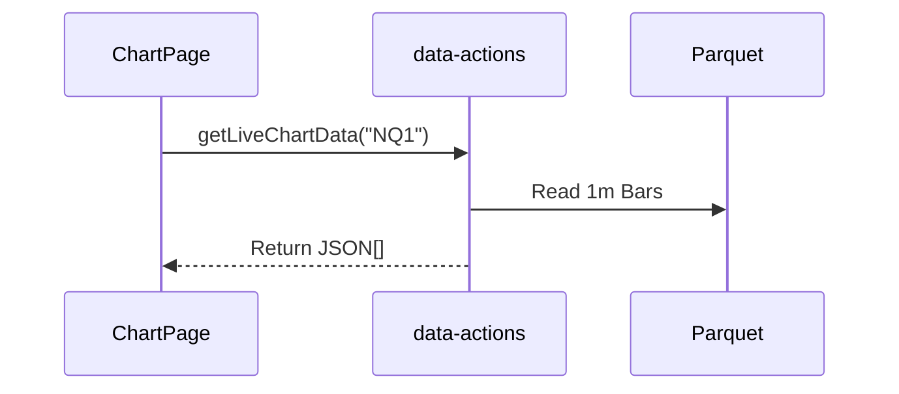
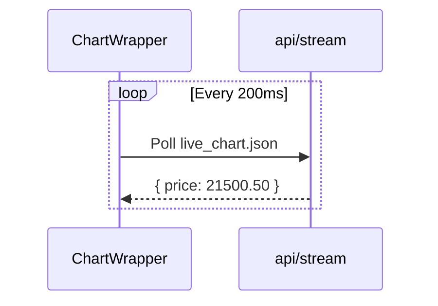

# API Reference

This document details the interface between the frontend, backend, and data layer.

## 1. System Overview

```mermaid
graph TD
    Client[Next.js Client] -->|React Server Actions| API_Actions[web/actions]
    Client -->|HTTP Polling| FastAPI[api/ FastApi]
    
    API_Actions -->|Read| Parquet[Data Lake (.parquet)]
    API_Actions -->|Write| SQLite[User DB (Prisma)]
    
    FastAPI -->|Compute| Pandas[Pandas/TA-Lib]
    FastAPI -->|Read| Parquet
```

## 2. FastAPI Backend (`api/`)
**Base URL**: `http://localhost:8000` (Proxied via Next.js rewrites in prod if applicable, or direct).

### 2.1 Indicators (`/api/indicators`)
Low-latency technical indicator calculations.

| Endpoint | Method | Params | Description |
|----------|--------|--------|-------------|
| `/` | POST | `ticker`, `period` | Generic indicator engine entry point. |

### 2.2 Sessions (`/api/sessions`)
Market session analysis (RTH, Globex, etc).

| Endpoint | Method | Params | Description |
|----------|--------|--------|-------------|
| `/sessions` | GET | `ticker` | Returns session high/low/close for RTH/Overnight. |

### 2.3 Profiler (`/api/profiler`)
Volume Profile and Market Profile calculations.

| Endpoint | Method | Params | Description |
|----------|--------|--------|-------------|
| `/volume` | GET | `ticker`, `range` | Returns Volume Profile for specified range. |

---

## 3. Server Actions (`web/actions/`)
These act as the **primary data access layer** for the Next.js application.

### 3.1 Data Loading
* **`getLiveChartData(ticker, timeframe)`**: Main query for chart hydration. Reads directly from Parquet.
* **`getTickerHistory(ticker)`**: Fetches metadata.

### 3.2 Context & Analysis
* **`getExpectedMove(ticker)`**: Calculates historical expected moves.
* **`getHistoricalVolatility(ticker)`**: Returns realized vol stats.

### 3.3 User Data
* **`journal-actions.ts`**: CRUD operations for Trade Journal (via Prisma/SQLite).
* **`settings-actions.ts`**: Persists user preferences.

## 4. Usage Patterns

### Chart Hydration


### Live Updates

