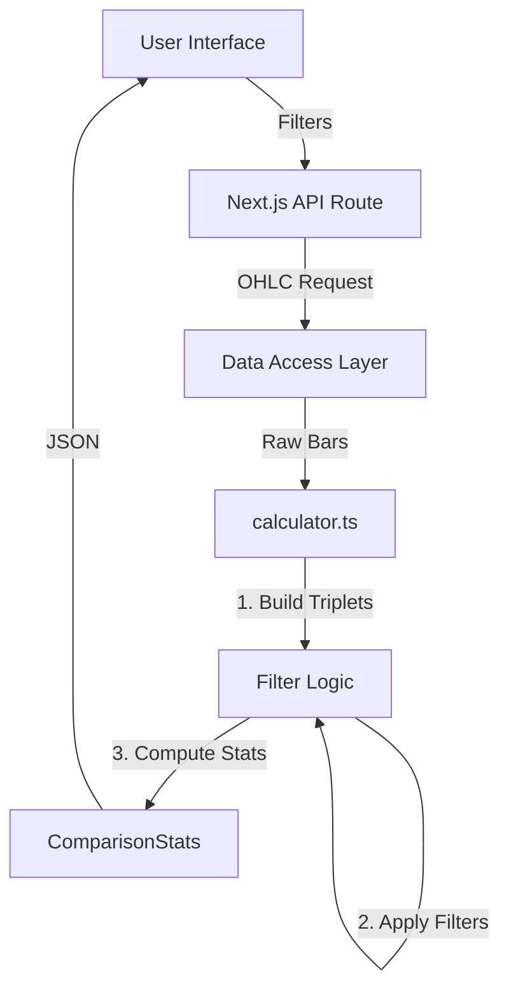

# Candle Science Architecture

## 1. Overview
Candle Science is a specialized quantitative analysis tool for identifying high-probability 3-candle patterns in OHLC data. It allows users to filter historical data by time (Time-Based Filtration) and price relationships (Reference Filtration) to project the statistical behavior of the current "Cycle 3" candle.

## 2. Methodology: Filter-then-Compute
The core innovation of Candle Science is the strict **Filter-then-Compute** methodology, derived from Verified Pine Script (v17.3).

1.  **Ingestion**: Load historical OHLC triplets (C1, C2, C3).
2.  **Filtering**: Apply **ALL** active filters first. A triplet is only included if it satisfies:
    -   Time filters (Year, Month, Day, Hour)
    -   Reference filters (e.g., C2 High > C1 High, C1 Bullish, etc.)
3.  **Computation**: Only *after* filtering, statistics are computed on the matching subset.
4.  **MFE Splitting**: Maximum Favorable Excursion (MFE) is calculated separately for positive (Above reference) and negative (Below reference) deviations to prevent data dilution.

## 3. Architecture

### 3.1 Frontend (Next.js)
-   **Framework**: Next.js 14 (App Router)
-   **Styling**: Tailwind CSS + Shadcn UI
-   **State Management**: React `useState` (Local)
-   **Key Components**:
    -   `page.tsx`: Main controller, fetches data.
    -   `CycleLedger.tsx`: Primary display component using "Data Ledger" paradigm.
    -   `SignalCardGrid.tsx`: Alternative "Card" visualization.
    -   `CandleDiagram.tsx`: Dynamic SVG visualization of the C1-C2-C3 pattern.

### 3.2 Backend (Migration in Progress)

#### Current State (Legacy Python)
-   **Endpoint**: `POST http://localhost:8000/api/candle-science/calculate`
-   **Technology**: Python FastAPI + Pandas
-   **Status**: **DEPRECATED**. Does not support the new `ComparisonStats` structure (split MFE).
-   **File**: `api/routers/candle_science.py`, `api/services/candle_science_service.py`

#### Future State (TypeScript / Next.js API)
-   **Endpoint**: `POST /api/candle-science/calculate` (Internal Next.js Route)
-   **Technology**: TypeScript (Shared logic)
-   **Calculator**: `web/lib/candle-science/calculator.ts`
-   **Status**: **Refactor Complete**. Ready for integration.
-   **Advantages**:
    -   Types safety shared with frontend.
    -   Exact implementation of "Filter-then-Compute".
    -   No dependency on external Python server for calculation.

### 3.3 Data Flow (Target)



## 4. Key Data Structures

### ComparisonStats
Splits the distribution into "Above" and "Below" buckets to provide accurate MFE (Maximum Favorable Excursion) percentiles.

```typescript
interface ComparisonStats {
    above: number; // % of time metric > reference
    below: number; // % of time metric < reference
    aboveStats: {
        p30: number; median: number; p70: number; p90: number;
    };
    belowStats: {
        p30: number; median: number; p70: number; p90: number; // Negative values
    };
}
```

## 5. UI Paradigms

### The Data Ledger (`CycleLedger.tsx`)
A high-density tabular view used for both the **Cycle 3 Forecast** (Primary) and **Cycle 2 Context** (Secondary).
-   **Zero Clipping**: Labels have dedicated columns.
-   **Battle Bar**: Visualizes the Bull/Bear distribution.
-   **Edge**: Explicitly calculates the probability advantage.

### Signal Cards (`SignalCardGrid.tsx`)
A card-based view for rapid scanning of the strongest signals using large typography and glassmorphism.

## 6. Requirements
1.  **Visual Fidelity**: Zero clipping in UI, professional "Bloomberg" aesthetic.
2.  **Cycle Priority**: C3 Projections must be the primary focus (Top Right). C2 Context is secondary.
3.  **MFE Accuracy**: MFE must separate winners from losers. +0.5% median upside is different from -0.2% median downside.
4.  **Auto-Detect (Future)**: "Fetch Latest" button to auto-populate filters based on live market data.
