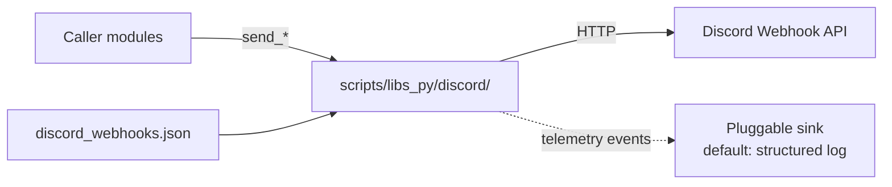

# Discord Webhook Library Architecture

> **Status**: Tier 0 + 1 + 2 + 3 complete. Authoritative reference for
> the `scripts/libs_py/discord/` sub-package.
>
> **Related**: [NARRATIVE_AUDIT_2026-07-14.md §3.5](NARRATIVE_AUDIT_2026-07-14.md)
> (audit history & migration trail),
> [DISCORD_BOT_DESIGN.md](DISCORD_BOT_DESIGN.md) (the separate
> LLM-driven trading-analysis bot — this doc does **not** cover
> that subsystem).

---

## 1. Overview

The Discord webhook library is the **single delivery layer** for
all Discord webhook traffic in the `tvDownloadOHLC` repo. It
started as a 3-consumer dedup of the narrative chain's
chunk-and-POST loop (audit §3.5 Tier 0) and grew through four
hardening tiers:

| Tier | Scope | Tests added |
|---|---|---|
| **0** | Narrative consumers (`daily_narrative`, `trader_narrative`, `weekly_narrative`) | +26 |
| **1** | 8 legacy `discord_notify` consumers migrated via shim | +0 (shim) |
| **2** | 429/5xx retry, capped exponential backoff, `wait=` pacing | +32 |
| **3** | `thread_id` / `thread_name` routing, `RateLimitTelemetry` | +43 |

The library is the **only** module in the repo that talks HTTP to
Discord. Every other module that needs to send a Discord message
imports from `scripts.libs_py.discord`.

## 2. Key Responsibilities

- **Webhook URL lookup** — read `discord_webhooks.json` (key →
  URL) via `load_webhook_url(webhook_key)`.
- **Markdown chunking** — split long narrative bodies on `\n## `
  section boundaries via `chunk_markdown(text, max_chars=1900)`.
- **Embed batching** — split embed lists by Discord's
  10-embed / 5600-char limits via `embed_batches(embeds)`,
  with an embed-→-text fallback on HTTP 400.
- **Reliable delivery** — POST with retry on 429 (honors
  `Retry-After` / `X-RateLimit-Reset-After` headers) and 5xx,
  with capped exponential backoff (1s, 3s, 9s, 27s, capped at
  30s).
- **Rate-limit pacing** — `wait=True` inserts inter-chunk /
  inter-batch sleeps (0.5s / 1s) to stay under Discord's
  per-webhook ~5 msg / 2 s limit.
- **Thread routing** (Tier 3) — `thread_id` and `thread_name`
  are injected into the JSON payload so callers can route to
  existing threads or auto-create new ones in forum channels.
- **Observability** (Tier 3) — `RateLimitTelemetry` aggregates
  per-call counters (successes, failures, retries, 429s, 5xxs,
  backoff time) and emits structured log events via a pluggable
  sink.

## 3. Data Flow

```mermaid
flowchart TD
    A[Caller<br/>narrative / options / earnings / strategy] --> B[Public send_* API<br/>send_summary, send_embeds, send_payload,<br/>send_with_files, send_message]
    B --> C[Resolve webhook URL<br/>load_webhook_url&#40;key&#41;]
    C --> D[Chunk / batch<br/>chunk_markdown, embed_batches]
    D --> E[Inject thread_id / thread_name]
    E --> F{_post_once<br/>POST via requests.post}
    F -->|200/204| G[Telemetry: on_success]
    F -->|429 / 5xx| H{Backoff schedule<br/>1s, 3s, 9s, 27s cap 30s}
    H --> I[Telemetry: on_retry_scheduled]
    I --> F
    F -->|400 + embeds| J[Embed→text fallback<br/>_post_payload_with_retry]
    J --> F
    F -->|4xx / out-of-retries| K[Telemetry: on_failure]
    K --> L[Return False]
    G --> M[Return True]
```



**Module boundaries**:



## 4. Key Components

| File | Role | Public surface |
|---|---|---|
| `__init__.py` | Stable public API (41 exports) | All re-exports |
| `config.py` | Constants: chunk size, retry policy, wait intervals | `DISCORD_MAX_CHARS`, `DISCORD_MAX_RETRIES`, `DISCORD_BACKOFF_*`, `INTER_CHUNK_WAIT_SECONDS`, `WAIT_AFTER_BATCH_SECONDS`, `DISCORD_RETRYABLE_STATUS_CODES`, `resolve_webhooks_path` |
| `chunking.py` | Markdown chunker (pure) | `chunk_markdown` |
| `embeds.py` | Embed batcher, compactor, embed→text fallback | `embed_batches`, `compact_embed`, `embed_char_count`, `embed_to_content`, `truncate_text` |
| `webhooks.py` | HTTP I/O: `send_payload`, `send_embeds`, `send_with_files`, `send_message`, `load_webhook_url` (plus private `_post_once`, `_post_payload_with_retry`, `_apply_thread`, `_retry_after_seconds`) | All public `send_*` |
| `sender.py` | Narrative-specific chunk-and-POST loop | `send_summary` |
| `telemetry.py` | `RateLimitTelemetry` aggregate counters; `RecordingTelemetry` test subclass; `TelemetryEvent` dataclass; `default_sink` | All telemetry symbols |

### 4.1 `RateLimitTelemetry` contract

The telemetry object is **stateful** and **thread-safe**. Pass
**one instance** to many `send_*` calls to aggregate across
them, then inspect the snapshot at the end of a batch.

```python
from scripts.libs_py.discord import RateLimitTelemetry, send_summary

tel = RateLimitTelemetry()

# Many calls — counters accumulate.
send_summary(morning_narrative, webhook_key="macro-alerts", telemetry=tel)
send_summary(intraday_update,    webhook_key="macro-alerts", telemetry=tel)
send_summary(eod_close,          webhook_key="macro-alerts", telemetry=tel)

# At the end:
print(tel.summary())
# 'sends=3 success=3 failure=0 retry=0 rate_limit=0 5xx=0 network=0
#  backoff=0.0s avg_attempts=1.0'
```

**Counters** (all `int` / `float`):

| Counter | Description |
|---|---|
| `total_sends` | Every HTTP attempt (success or failure) |
| `total_successes` | Final 200/204 after all retries |
| `total_failures` | Final non-2xx, or out-of-retries |
| `total_retries` | Backoff sleeps scheduled |
| `total_rate_limited` | 429 responses received |
| `total_5xx` | 500/502/503/504 responses received |
| `total_4xx` | 400/401/etc (non-429) responses received |
| `total_network_errors` | Network exceptions (timeout, DNS, etc.) |
| `total_backoff_seconds` | Sum of all backoff sleeps |
| `attempts_to_success` | Per-send attempt count (1 for first-try success, >1 if retries) |
| `attempts_to_failure` | Per-send attempt count (capped at `max_retries + 1`) |
| `status_counts` | `dict[int, int]` tally by status code |
| `avg_attempts_to_success` | Mean of `attempts_to_success` |

**Event hooks**:

| Hook | When called | Payload |
|---|---|---|
| `on_attempt(url, status, attempt, retry_after)` | Every HTTP attempt | url, status, attempt #, server-supplied Retry-After |
| `on_retry_scheduled(url, attempt, delay, reason)` | Backoff sleep scheduled | url, attempt #, seconds, reason (`"429"` / `"5xx"` / `"network"`) |
| `on_success(url, attempts)` | Final 200/204 | url, total attempts to success |
| `on_failure(url, status, attempts, reason)` | Final failure | url, status, attempts, reason |

**Sinks**: default is `default_sink` which writes
`log.info("telemetry.<event> k1=v1 k2=v2 …")`. Pass
`lambda *_: None` for silent operation, or any custom callable
for Prometheus / Datadog / etc.

**Zero overhead when unused**: pass `telemetry=None` (default)
and the hooks are skipped entirely.

### 4.2 Thread routing

```python
from scripts.libs_py.discord import send_summary

# Route to existing thread (forum / text-with-threads).
send_summary(
    eod_report,
    webhook_key="macro-alerts",
    thread_id="1234567890",
)

# Auto-create a new thread on first chunk (forum channels only).
send_summary(
    weekly_narrative,
    webhook_key="macro-alerts",
    thread_name="Weekly 2026-07-14",
)
```

Both kwargs work on every public `send_*` function.

## 5. Technology & Constraints

- **Python**: 3.11+ (uses `X | Y` union syntax, `dict[str, Any]`).
- **HTTP**: `requests` is the only required dependency. Lazily
  imported so the package is importable without it.
- **Timeouts**: `EMBED_HTTP_TIMEOUT_SECONDS=20` for embed
  POSTs, `HTTP_TIMEOUT_SECONDS=15` for narrative chunks,
  `EMBED_MULTIPART_TIMEOUT_SECONDS=20` for file uploads.
- **Retry policy**:
  - 429: honor `Retry-After` / `X-RateLimit-Reset-After`,
    capped at `DISCORD_RETRY_AFTER_MAX_SECONDS=60`.
  - 5xx (500, 502, 503, 504): exponential backoff
    `BASE * MULTIPLIER^attempt` = 1s, 3s, 9s, 27s, capped at
    `DISCORD_BACKOFF_MAX_SECONDS=30`.
  - 4xx (non-429): not retried (client error, won't fix itself).
  - Network exception: retried as a 5xx.
- **Default retry count**: `DISCORD_MAX_RETRIES=3` (i.e. up to
  4 total attempts).
- **Thread-safety**: `RateLimitTelemetry` uses a single
  `threading.Lock` for the counters. Multiple threads may call
  `send_summary` concurrently with the same `telemetry=`
  instance.
- **Test seams**: every `send_*` accepts `poster=` (HTTP mock),
  `sleep_fn=` (test-time no-op), and `telemetry=`
  (event recorder).

## 6. Migration / consumer map

| Caller | Path | Function used | Migration tier |
|---|---|---|---|
| `scripts/trader/daily_narrative.py` | narrative | `send_summary` | 0 |
| `scripts/trader/trader_narrative.py` | narrative | `send_summary` | 0 |
| `scripts/trader/weekly_narrative.py` | narrative | `send_summary` | 0 |
| `scripts/market_data/discord_earnings_notifier.py` | embed+file | `send_with_files` | 1 (via shim) |
| `scripts/streaming/options/discord_notifier.py` | embed batches | `send_embeds` | 1 (via shim) |
| `scripts/options/level_scorer/discord_notifier.py` | embed | `send_embeds` | 1 (via shim) |
| `scripts/utils/option_level_backtest/discord_report.py` | text+file | `send_message` | 1 (via shim) |
| `scripts/options/level_scorer/score_levels.py` | text | `send_message` | 1 (via shim) |
| `scripts/options/data_gap_reporter.py` | text | `send_message` | 1 (via shim) |
| `scripts/streaming/options/level_scorer_cli.py` | text | `send_message` | 1 (via shim) |
| `scripts/streaming/options/ohlcv_stream.py` | text | `send_message` | 1 (via shim) |
| `scripts/utils/discord_notify.py` | shim | `get_webhook_url` / `send_message` / `upload_file` | 1 (deprecation shim, emits `DeprecationWarning`) |

**Tier 1+2 callers still go through the
`scripts.utils.discord_notify` shim**. A follow-up PR will
move them to direct imports and remove the shim.

## 7. Test coverage

| File | Tests | Scope |
|---|---|---|
| `tests/test_discord_sender.py` | 111 | Tier 0 + 1 + 2: chunking, send_summary, send_payload retry/backoff, send_with_files, send_message, shim |
| `tests/test_discord_telemetry.py` | 43 | Tier 3: RateLimitTelemetry, RecordingTelemetry, thread_id/thread_name, telemetry wiring across all 5 send funcs |
| **Total** | **154** | All Tier 0+1+2+3 public API |

## 8. Changelog

- **2026-07-14 (Tier 3)** — added `thread_id` / `thread_name`
  to all 5 public `send_*` functions; added
  `RateLimitTelemetry` / `RecordingTelemetry` / `TelemetryEvent`
  for aggregate observability; +43 tests in
  `test_discord_telemetry.py`.
- **2026-07-14 (Tier 1+2)** — migrated 8 legacy
  `discord_notify` consumers via deprecation shim; added
  429/5xx retry with capped exponential backoff; added
  `wait=` rate-limit pacing; +32 tests in
  `test_discord_sender.py`.
- **2026-07-14 (Tier 0)** — created the
  `scripts/libs_py/discord/` sub-package; dedup'd 3 narrative
  consumers; +26 tests.
