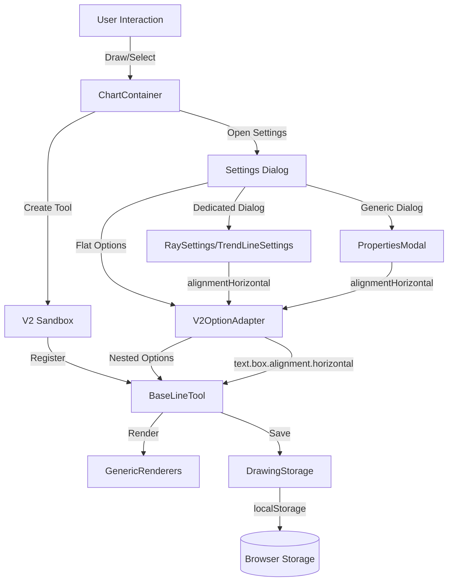

# Drawing Tools Architecture

## 1. Overview

The Drawing Tools system provides a comprehensive set of chart annotation tools (lines, shapes, text) built on the LightweightCharts V2 engine. All tools follow a unified V2 architecture with a centralized option format adapter that bridges between React UI dialogs and the internal V2 engine storage.

**Key Features:**
- 20+ drawing tools (Ray, TrendLine, Rectangle, HorizontalLine, Arrow, Circle, etc.)
- Unified V2 architecture (all tools extend `BaseLineTool`)
- Text annotations with full formatting (color, size, bold, italic, alignment, background, border)
- Template system for saving/loading tool presets
- Persistent storage in localStorage
- Real-time rendering with LightweightCharts

## 2. Key Responsibilities

- **Tool Management**: Create, select, edit, delete drawing tools
- **Option Translation**: Convert between flat UI format and nested V2 engine format
- **Rendering**: Display tools on the chart with proper positioning and styling
- **Persistence**: Save/load tool state from localStorage
- **User Interaction**: Handle mouse events for drawing, selecting, moving, resizing
- **Settings UI**: Provide dialogs for configuring tool properties

## 3. Architecture Diagram



## 4. Key Components

### Core Tool System

#### `BaseLineTool` (`web/lib/charts/v2/core/model/base-line-tool.ts`)
- **Role**: Abstract base class for all drawing tools
- **Responsibilities**:
  - Point management (add, update, move)
  - Option management (`applyOptions`, `options()`)
  - View lifecycle (create, update, destroy)
  - Hit testing for selection
  - Serialization for storage
- **Key Methods**:
  - `applyOptions(options)`: Applies partial options with deep merge and alignment sync
  - `options()`: Returns current tool options
  - `updateAllViews()`: Triggers re-render of all views
  - `hitTest(x, y)`: Determines if point is within tool bounds

#### `GenericRenderers` (`web/lib/charts/v2/core/rendering/generic-renderers.ts`)
- **Role**: Renders lines, shapes, and text on the chart canvas
- **Key Renderers**:
  - `LineRenderer`: Draws lines with various styles (solid, dashed, dotted)
  - `TextRenderer`: Renders text with alignment, background, border, rotation
  - `RectangleRenderer`: Draws filled rectangles with borders
- **Text Alignment Logic**:
  ```typescript
  // Horizontal alignment with fallback chain
  const hAlign = (data.text?.box?.alignment?.horizontal || data.text?.alignment || 'center').toLowerCase();
  
  // Vertical alignment with fallback
  const vAlign = (data.text?.box?.alignment?.vertical || 'middle').toLowerCase();
  ```

### Option Format Translation

#### `V2OptionAdapter` (`web/lib/charts/v2/utils/v2-option-adapter.ts`)
- **Role**: Translates between flat UI options and nested V2 engine options
- **Critical for**: Ensuring alignment and other properties persist correctly
- **Key Methods**:
  - `toV1FlatOptions(v2Options, type)`: Converts nested V2 → flat UI format
  - `toV2NestedOptions(v1Options, type)`: Converts flat UI → nested V2 format

**Alignment Format Mapping:**

| UI Format (Flat) | V2 Engine Format (Nested) | Renderer Reads From |
|------------------|---------------------------|---------------------|
| `alignmentHorizontal: 'left'` | `text.box.alignment.horizontal: 'left'` | `text.box.alignment.horizontal` OR `text.alignment` |
| `alignmentVertical: 'center'` | `text.box.alignment.vertical: 'middle'` | `text.box.alignment.vertical` |
| `alignmentVertical: 'top'` | `text.box.alignment.vertical: 'top'` | `text.box.alignment.vertical` |
| `alignmentVertical: 'bottom'` | `text.box.alignment.vertical: 'bottom'` | `text.box.alignment.vertical` |

**Note:** The UI uses `'center'` for vertical middle alignment (to match horizontal naming), but the renderer uses `'middle'`. The adapter maps between these.

### Settings Dialogs

#### Dedicated Settings Dialogs
Tools with specialized options have dedicated settings dialogs:
- `RaySettings.tsx` - Ray tool
- `TrendLineSettings.tsx` - Trend line tool
- `HorizontalLineSettings.tsx` - Horizontal line tool
- `VerticalLineSettings.tsx` - Vertical line tool
- `RectangleSettings.tsx` - Rectangle tool
- `TextSettings.tsx` - Text tool

**Format:** These use the `DrawingSettingsDialog` wrapper with 4 tabs (Style, Text, Coordinates, Visibility) and work with flat options (`alignmentHorizontal`, `alignmentVertical`).

#### Generic PropertiesModal
All other tools use the generic `PropertiesModal` (`web/components/properties-modal.tsx`):
- Horizontal Ray, Extended Line, Arrow, Cross Line, Circle, Price Label, Callout, Triangle, Parallel Channel, Brush, Path, Highlighter, etc.

**Format:** Uses flat options (`alignmentHorizontal`, `alignmentVertical`) as of the alignment persistence fix.

### Storage and Persistence

#### `DrawingStorage` (`web/lib/drawing-storage.ts`)
- **Role**: Manages localStorage persistence of drawing tools
- **Key Methods**:
  - `saveDrawing(ticker, timeframe, drawing)`: Saves a single drawing
  - `getDrawings(ticker, timeframe)`: Retrieves all drawings for a chart
  - `deleteDrawing(ticker, timeframe, id)`: Removes a drawing
- **Storage Format**: JSON serialization of tool export data (type, points, options)

## 5. Data Flow

### Drawing Creation Flow
```
User clicks tool button
  → ChartContainer.handleToolSelect()
  → V2Sandbox.addTool(toolType)
  → Tool constructor creates BaseLineTool instance
  → User clicks chart to add points
  → Tool.addPoint() called for each click
  → Tool.updateAllViews() triggers render
  → GenericRenderers draws tool on canvas
  → Tool.serialize() → DrawingStorage.saveDrawing()
```

### Settings Update Flow
```
User double-clicks tool
  → ChartContainer.openProperties()
  → V2OptionAdapter.toV1FlatOptions(tool.options())
  → Settings dialog opens with flat options
  → User changes alignment to 'right'
  → Dialog calls onApply({ alignmentHorizontal: 'right' })
  → ChartContainer.handlePropertiesSave()
  → V2OptionAdapter.toV2NestedOptions({ alignmentHorizontal: 'right' })
  → Returns { text: { box: { alignment: { horizontal: 'right' } }, alignment: 'right' } }
  → Tool.applyOptions(nestedOptions)
  → Tool syncs text.alignment ↔ text.box.alignment.horizontal
  → Tool.updateAllViews() triggers re-render
  → DrawingStorage.saveDrawing() persists changes
```

### Alignment Synchronization in `applyOptions`
```typescript
// After merging incoming options with current options
if (incomingTextOpt.box?.alignment?.horizontal !== undefined) {
    // Sync legacy text.alignment with modern text.box.alignment.horizontal
    mergedTextOpt.alignment = incomingTextOpt.box.alignment.horizontal;
    mergedTextOpt.box.alignment.horizontal = incomingTextOpt.box.alignment.horizontal;
}

if (incomingTextOpt.alignment !== undefined) {
    // Sync modern text.box.alignment.horizontal with legacy text.alignment
    mergedTextOpt.alignment = incomingTextOpt.alignment;
    mergedTextOpt.box.alignment.horizontal = incomingTextOpt.alignment;
}
```

This ensures the renderer can read alignment from either property path.

## 6. Technology & Constraints

### Dependencies
- **LightweightCharts**: Chart rendering engine
- **React**: UI framework for settings dialogs
- **TypeScript**: Type safety for options and tool interfaces
- **localStorage**: Browser persistence

### Performance Targets
- **Render time**: < 16ms per frame (60 FPS)
- **Tool creation**: < 100ms from click to visible
- **Settings dialog**: < 200ms to open
- **Storage**: < 50ms to save/load all drawings

### Constraints
- **Browser storage limit**: ~5-10MB for localStorage
- **Canvas rendering**: Limited to 2D context (no WebGL)
- **Point precision**: Limited by chart coordinate system
- **Text rendering**: No rich text (HTML), only canvas text with basic formatting

## 7. Recent Changes (2026-02-10)

### Alignment Persistence Fix
Fixed critical bugs preventing text alignment from persisting correctly:

1. **V2OptionAdapter.toV1FlatOptions**: Now reads from both `text.box.alignment` and legacy `text.alignment`, maps vertical `'middle'` ↔ `'center'`
2. **V2OptionAdapter.toV2NestedOptions**: Uses `!== undefined` checks instead of truthy checks, syncs both alignment properties
3. **Guard condition**: Added alignment properties to text mapping guard
4. **Ray dialog**: Removed `DEFAULT_RAY_OPTIONS` spread that overwrote real values
5. **PropertiesModal**: Changed from nested `alignment.horizontal/vertical` to flat `alignmentHorizontal/Vertical`

**Impact**: All 20+ tools now correctly persist and display text alignment settings.

See `.agent/artifacts/alignment-persistence-fix-summary.md` for detailed technical analysis.

## 8. Future Improvements

1. **Consolidate alignment properties**: Remove legacy `text.alignment`, use only `text.box.alignment.*`
2. **Dedicated dialogs for all tools**: Replace PropertiesModal with tool-specific dialogs for better UX
3. **WebGL rendering**: Migrate to WebGL for better performance with many tools
4. **Cloud storage**: Add optional cloud sync for drawings across devices
5. **Undo/redo**: Implement command pattern for tool operations
6. **Grouping**: Allow users to group multiple tools together
7. **Layers**: Add z-index control for tool stacking order
8. **Snapping**: Snap to price levels, time intervals, or other tools
9. **Keyboard shortcuts**: Add hotkeys for common tool operations
10. **Export/import**: Allow exporting drawings as JSON for sharing

## 9. Testing Checklist

### Alignment Persistence
- [ ] Draw Ray with text, change alignment to "Right" + "Top", save, reopen → shows "Right" + "Top"
- [ ] Draw Horizontal Ray, add text, change alignment to "Left" + "Bottom", save, reopen → shows "Left" + "Bottom"
- [ ] Set vertical alignment to "Middle", save, reopen → shows "Middle" (not "Top" or "Bottom")
- [ ] Change ONLY alignment (no text/color/font changes), save, reopen → alignment persists

### Tool Creation
- [ ] All 20+ tools can be created by clicking the chart
- [ ] Tools render immediately after creation
- [ ] Tools persist after page refresh

### Settings Dialogs
- [ ] Dedicated dialogs open for Ray, TrendLine, HorizontalLine, VerticalLine, Rectangle, Text
- [ ] Generic PropertiesModal opens for other tools
- [ ] All settings changes persist correctly
- [ ] Template save/load works for all tools

### Rendering
- [ ] Text renders at correct alignment position
- [ ] Lines render with correct style (solid, dashed, dotted)
- [ ] Shapes render with correct fill and border
- [ ] Tools render correctly at all zoom levels

## 10. Troubleshooting

### Alignment not persisting
- **Check**: V2OptionAdapter is correctly mapping between flat and nested formats
- **Check**: Both `text.alignment` and `text.box.alignment.horizontal` are being set
- **Check**: Settings dialog is using flat format (`alignmentHorizontal`, not `alignment.horizontal`)

### Tool not rendering
- **Check**: Tool has valid points with timestamp/price
- **Check**: Tool is visible (not hidden by visibility settings)
- **Check**: Tool options are valid (no undefined/null critical values)
- **Check**: Chart time scale includes tool's time range

### Settings dialog shows wrong values
- **Check**: `toV1FlatOptions` is reading from correct property paths
- **Check**: Default values aren't overwriting real values (no `...DEFAULT_OPTIONS` spread before real values)
- **Check**: Vertical alignment is mapped correctly (`'middle'` ↔ `'center'`)

### Tool not saving
- **Check**: localStorage quota not exceeded
- **Check**: Tool has valid ID
- **Check**: Serialization doesn't throw errors
- **Check**: Browser allows localStorage access
