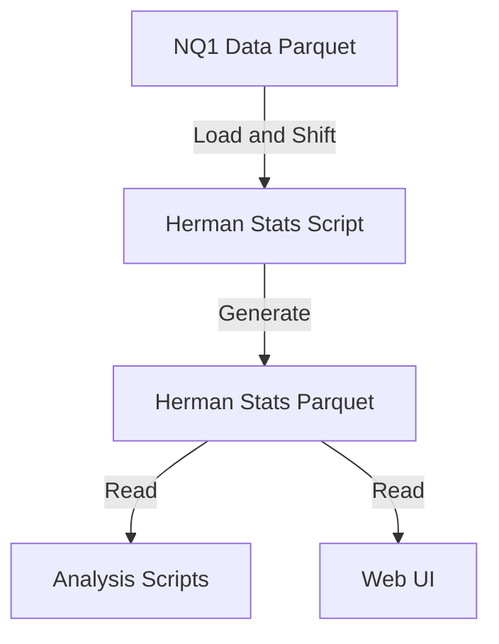

# Herman Stats Pipeline Architecture

## 1. Overview
The Herman Stats Pipeline is a derived data system designed to precompute and store daily statistical metrics related to the "Herman Trading" framework (Asia/London session liquidity sweeps, range expansion, and continuation). This avoids reprocessing 17 years of 1-minute data for every analysis request.

## 2. Key Responsibilities
- **Precompute Session Ranges**: Calculate high/low/range for Asia (20:00-00:00), Pre-London (00:00-02:00), and London (02:00-05:00).
- **Detect Liquidity Sweeps**: Identify if PL/London sessions swept Asia highs/lows.
- **Store Derived Data**: Save compact daily metrics to `data/derived/NQ1_herman_stats.parquet`.
- **Enable Quick Analysis**: Serve as the source of truth for bias reports, backtests, and dashboard visualizations.

## 3. Data Flow

## 4. Key Components
- **`scripts/derived/precompute_herman_stats.py`**: The main ETL script. It handles time-shifting (grouping Asia 20:00 with the next day's London) and metric extraction.
- **`data/derived/NQ1_herman_stats.parquet`**: The output file.
    - **Schema**:
        - `date`: Trading Day
        - `asia_high`, `asia_low`, `asia_range`, `asia_type` (Large/Small)
        - `pl_high`, `pl_low`, `pl_sweeps_asia_h`, `pl_sweeps_asia_l`
        - `lon_open`, `lon_high`, `lon_low`, `lon_sweeps_asia_h`, `lon_sweeps_asia_l`
        - `or_high`, `or_low`
        - `ny_am_high`, `ny_am_low`, `ny_am_range`
        - `ny_lunch_high`, `ny_lunch_low`, `ny_lunch_range`
        - `ny_pm_high`, `ny_pm_low`, `ny_pm_range`
        - **Sweep Flags**: Checks for NY sessions sweeping prior sessions (e.g., `ny_am_sweeps_lon_h`).

## 5. Technology & Constraints
- **Pandas**: Core processing engine.
- **Time Adjustments**: Critical dependency on correct "+4h" index shifting to group "Asia Previous Night" with "London Current Morning".
- **Performance**: Must process ~5000 days in under 10 seconds.
