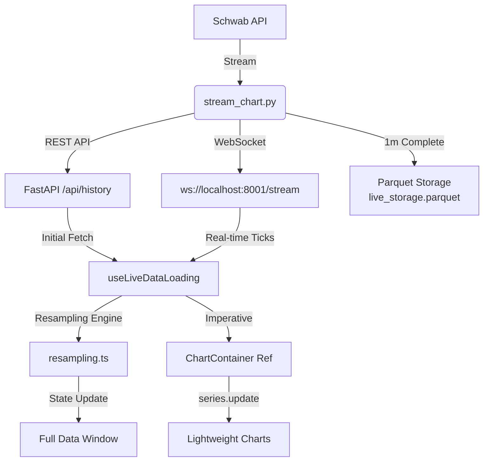

# Live Trading System: Architecture & Design

This document outlines the current implementation, requirements, and future roadmap for the Live Trading System integrated with the Schwab Trader API.

## 1. System Overview
The system provides a real-time bridge between the Schwab Streaming API and a local web interface, with persistent storage for session bars.

### Current Components:
- **`stream_chart.py` / Schwab Streamer**: The "Engine". Handles WebSocket authentication, Level 1 price streaming, and 1-minute OHLC bar calculation.
- **API Server (`/api/history`)**: Serves the initial batch of live-stored candles (up to 180,000) for instant chart loading.
- **WebSocket Server (`ws://localhost:8001/stream`)**: Pushes real-time quotes, candle snapshots, and closed candles directly to connected web clients.
- **Persistent Storage (`live_storage.parquet`)**: A session-based Parquet file where completed 1-minute bars are archived for future backtesting and analysis.
- **Frontend (`/chart` live mode)**: A React/Next.js interface providing real-time visualization via Lightweight Charts.

## 2. Technical Requirements
- **Authentication**: Requires `secrets.json` (App Key/Secret) and `token.json` (OAuth2 Access/Refresh tokens).
- **API Rate Limits**: 
    - **Streaming**: Schwab allows persistent connections for Level 1 and Chart data.
    - **Polling**: Frontend is limited to **2000ms (30 req/min)** to stay well under the 100 req/min limit.
- **Dependencies**: 
    - Python: `schwab-py`, `pandas`, `websockets`.
    - Frontend: `lightweight-charts`, `lucide-react`, `radix-ui`.

## 3. Current Design
### Data Flow:
1. **WebSocket Connect (Backend)**: StreamClient initiates a connection to Schwab.
2. **Subscriptions**: Subscribes to `CHART_FUTURES` (1-min bars) and `LEVEL_ONE_FUTURES` (Last Price).
3. **Frontend Initialization**: `useLiveDataLoading` fetches initial historical window via REST (`/api/history`).
4. **WebSocket Connect (Frontend)**: Frontend connects to local `ws://localhost:8001/stream`.
5. **Frontend Sync (Dual-Layer)**:
    - **Base Layer (State)**: The initial REST fetch populates the main reactive `fullData` array. 
    - **Live Layer (Imperative)**: Real-time ticks from the WebSocket are sent directly to the chart instance via `ChartContainerRef.updateLivePrice()`, bypassing React's render cycle for sub-16ms latency. Closed candles trigger an internal array update.
6. **Resampling**: If the user selects a higher timeframe, the base data is resampled using the shared `resampling.ts` engine (Worker for intraday, synchronous epoch-math for W/M/Y).

### Architecture Diagram

### Frontend Architecture (Live Mode)
To achieve high-performance updates without UI freezing, the live chart uses a specialized architecture:

1.  **Windowed Loading**: Instead of loading the entire multi-year history, `useLiveDataLoading` fetches a window of recent data (e.g., 180k candles) to reduce initial payload and memory usage.
2.  **Imperative Ref Updates**:
    - The `ChartWrapper` component listens to high-frequency WebSocket updates.
    - Instead of passing `livePrice` as a reactive prop (which triggers full component re-renders), it calls an imperative method on the `ChartContainer` ref.
    - **Method**: `chartRef.current?.updateLivePrice(price)`
    - **Implementation**: Directly accesses the Lightweight Charts `series` object to call `series.update()`.
3.  **Resampling Parity**:
    - High-fidelity resampling for Weekly, Monthly, and Yearly timeframes leverages `resampleDataForWMY()`, ensuring the live chart perfectly matches the historical chart's calendar alignment.

## 4. Safety & Security
- **Credential Protection**: `secrets.json` and `token.json` are globally ignored via `.gitignore`.
- **Backup**: Triple-redundant backups are performed via `scripts/utils/backup_credentials.py`.
- **Fault Tolerance**: The frontend shows a "Data Stream Offline" state instead of hanging if the script stops.

## 5. Future Scope & Roadmap

### Phase 1: Real-time Signal Engine (Pending)
- Integrate the **9:30 NQ Breakout** logic into the stream handler.
- Trigger desktop/mobile notifications when a breakout occurs live.

### Phase 2: Live Trade Analytics (Pending)
- Implement an equity curve visualizer for the live session to monitor intra-day performance.
*(Note: Live parquets and historical parquets will intentionally remain completely independent on disk to support discrete statistical analysis.)*

### Phase 3: Automated Execution (Long-term)
- Add order submission (Buy/Sell) capabilities via the Schwab Trader API.
- Implement a real-time Stop Loss / Take Profit manager (Trailing Stops).

### Phase 4: Unified Charting Interface (IN PROGRESS)
We are currently actively building a single, high-performance charting application that consolidates all historical and live data streams seamlessly in the browser.

#### 🎯 Current Objectives (See `unified_chart_data_loader.md`):
1. **Client-Side Data Fusion**: Seamlessly blending historical Parquet data (multiple years) with the live "hot buffer" in the React state for a continuous scrolling experience—without altering the independent parquet files on disk.
2. **Dynamic Context Switching**: Dropdown or command-palette to switch tickers (/NQ, /ES, etc.) and timeframes (1m, 5m, 15m) without page reloads.
3. **Indicator Library**: A plugin architecture to toggle existing indicators (Standard Deviations, ICT FVGs, Price Models) over the newly fused dataset.

#### 🛠️ Technical Hurdles Being Addressed:
- **State Management**: Handling large datasets (>100k points) across timeframe switches without memory leaks.
- **Unified Resampling**: Relying on a shared `resampling.ts` worker to upsample 1m base data into higher timeframes, guaranteeing parity between history and live data.
