# Narrative Engine Architecture

## 1. Overview
The Narrative Engine generates daily and weekly macroeconomic and options-market summaries using a local LLM. It aggregates data from the Prisma SQLite database (Economic Events, Options Flow, Market Structure) and feeds it into specific prompt templates based on the trading session (Weekly, Daily EOD, Daily Open) to provide actionable tactical analysis and boundary invalidation thresholds for trading.

## 2. Key Responsibilities
- **Data Orchestration**: Fetching options boundaries, weekly straddle prices, and forward-looking economic calendars from the Prisma DB via the Python Prisma async client.
- **Context Generation**: Building comprehensive "TOON" JSON payloads that encapsulate all relevant market mechanics for the given session.
- **LLM Synthesis**: Invoking a local Ollama model (`gemma4:31b-cloud`) to process the TOON payload against strict markdown prompt templates.
- **Notification & Storage**: Persisting the generated narratives back to the Prisma DB, writing output to local markdown files, and dispatching summaries via Discord webhooks.

## 3. Data Flow
1. **Source**: SQLite Prisma DB (`EconomicEvent`, `WeeklyBriefing`, `DailyEodUpdate` tables).
2. **Process**: Python orchestration scripts extract the data, assemble JSON, inject it into markdown prompts, and query the local Ollama LLM.
3. **Destination**: Prisma DB (`summaryMd` fields), File System (`data/options/daily/`, `data/options/weekly/`), and Discord.

```mermaid
graph TD;
    subgraph Data Sources
      DB[(Prisma SQLite)]
      CalendarAPI[Investing.com API]
    end

    subgraph Data Pipeline
      FetchCal[fetch_economic_calendar.py]
      FetchCal -->|Save Events| DB
      Core[briefing_core.py]
      DB -->|Events & Options Data| Core
    end

    subgraph Generation Engine
      Weekly[weekly_narrative.py]
      Daily[daily_narrative.py]
      Ollama((Ollama LLM))
      
      Core -->|TOON JSON Context| Weekly
      Core -->|TOON JSON Context| Daily
      
      Weekly -->|Weekly Prompt| Ollama
      Daily -->|EOD / Open Prompt| Ollama
    end

    subgraph Outputs
      Ollama -->|Markdown Narrative| DB
      Ollama -->|Markdown Narrative| FileSystem[data/options/]
      Ollama -->|Markdown Narrative| Discord[Discord Webhook]
    end
```

## 4. Key Components
- **`scripts/trader/briefing_core.py`**: The central data fetcher. Contains logic like `fetch_week_events` to retrieve MEDIUM/HIGH impact economic events for specific sessions, properly parsing Prisma `DateTime` objects. Handles TOON JSON generation.
- **`scripts/trader/weekly_narrative.py`**: Initiates the weekly brief. Maps data to `prompts/weekly_briefing.md`.
- **`scripts/trader/daily_narrative.py`**: Initiates daily briefs. Accepts `--session open` or `--session eod`. Uses `prompts/daily_open_update.md` and `prompts/daily_eod_update.md`. The EOD session dynamically shifts the target date forward by 1 day to fetch the next day's economic events.
- **`scripts/market_data/fetch_economic_calendar.py`**: Fetches a rolling 14-day window of US economic events from the Investing.com occurrences API, storing them into the `EconomicEvent` table.
- **Prompt Templates**:
  - `prompts/weekly_briefing.md`: Analyzes overarching regime, EM boundaries, and the week's economic events.
  - `prompts/daily_eod_update.md`: Analyzes EOD level interactions and forecasts tomorrow's catalysts.
  - `prompts/daily_open_update.md`: Analyzes RTH open positioning and today's intraday catalysts.

## 5. Technology & Constraints
- **Prisma Python Client**: Requires async execution. DB `DateTime` objects must be natively handled as Python `datetime` objects rather than epoch milliseconds.
- **Ollama**: Requires the local server to be running the `gemma4:31b-cloud` model. Generation latency is dependent on local hardware.
- **Calendar API**: The Investing.com API pagination limit must be respected. By fetching exclusively US events (`country_id: 5`) with `limit: 500`, we ensure complete event ingestion without 400 Bad Request errors.
