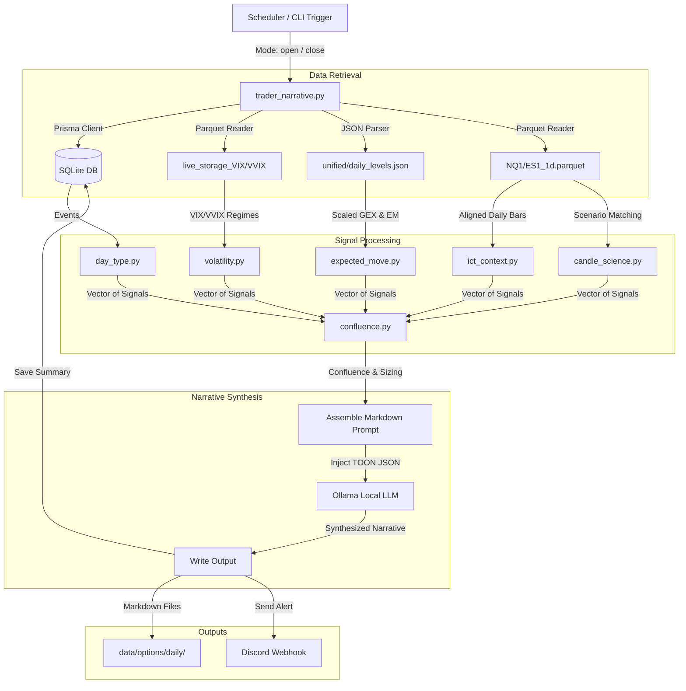

# Narrative Engine V2 Architecture & Design Specifications

## 1. Overview & Purpose
The **Narrative Engine V2** is a quantitative trading decision-support system designed to synthesize overnight market activity, option market boundaries, and technical structures into a cohesive daily trade plan. 

V2 shifts the system from a naive collection of lagging indicators (V1 "indicator soup") into a **structured, conditional probability framework**. It separates signals into **Independent Directional Drivers** (momentum/trend) and **Execution/Risk Context Filters** (volatility regimes/liquidity levels) to prevent multicollinearity and guide execution sizing.

```
                  +-----------------------------------+
                  |        NARRATIVE ENGINE V2        |
                  +-----------------------------------+
                                    |
            +-----------------------+-----------------------+
            |                                               |
  Directional Drivers                             Context Filters
  - Overnight Momentum (ALN/Herman)               - Volatility Regime (VIX/VVIX)
  - RTH Open Scenario (Gaps)                      - Option Expected Move (EM)
  - Daily Chart Structure (Candle Science)        - Liquidity Pools (PDH/PDL/Midnight)
```

---

## 2. Core Architecture & Signal Modules

### A. Directional Drivers (The "Confluence" Inputs)
The direction of the day's execution bias is determined by three independent time-horizon signals:
1.  **Overnight Momentum (Short-term)**: Evaluates pre-market London/Asia session high/low sweeps (Herman) and Liquidity Pool Expansion (ALN) patterns to determine if overnight inventory is positioned long or short.
2.  **RTH Open Scenario (Medium-term)**: Compares the opening Globex print/pre-market spot to yesterday's Regular Trading Hours (RTH) High/Low boundary, classifying the opening auction as a **Gap Up**, **Gap Down**, or **Inside** day.
3.  **Daily Chart Structure (Long-term)**: Executed by the `CandleScience` module, which performs historical pattern matching (C1→C2→C3) based on the relative sizes, wicks, and directions of the last two completed daily bars to forecast the probability of a bullish or bearish close.

### B. Execution & Risk Context Filters
These signals do not dictate direction but modify conviction, position sizing, and invalidation rules:
1.  **Volatility Guard (VIX / VVIX)**: Implements static volatility thresholds to classify risk regimes (Low, Normal, Elevated, Spike). Volatility spikes compress target sizing and expand stop distance.
2.  **Expected Move (EM) boundaries**: Derived from live option implied volatility (`daily_levels.json`). Defines the 1-standard-deviation expected price boundaries for the session.
3.  **Liquidity Map**: Captures key ICT support/resistance levels, including Prior Day High (PDH), Prior Day Low (PDL), Midnight Open, and 08:30 Open, tracking where institutional liquidity is resting.

---

## 3. Data Flow & Execution Pipeline



---

## 4. Key Code Components
- **`scripts/trader/trader_narrative.py`**: Entry point orchestrating CLI inputs, triggering data synchronization, running the signals, and managing LLM prompts.
- **`scripts/trader/briefing_core.py`**: Central engine that fetches database contexts, localizes timestamps, reads parquet files, executes GEX-to-futures translations, and builds EOD/Open cheat sheets.
- **`scripts/trader/signals/confluence.py`**: Assesses directional consensus across the three driver outputs, applying sizing multipliers and generating explanatory notes.
- **`scripts/trader/signals/candle_science.py`**: Dynamically aligns bar indices to calendar dates, executing single-line matching for Open Mode and multi-scenario projection loops (Gap Up/Inside/Gap Down) for Close Mode.

---

## 5. Design Decisions & Trade-offs (Pros vs. Cons)

The implementation of Narrative V2 involves critical trade-offs between academic statistical purity, system explainability, and live execution constraints.

### A. Confluence Heuristics vs. Joint Probabilities
*   **The Debate**: Should confluence be graded by a simple voting heuristic or by joint conditional probability distribution functions?
*   **Pros (Heuristic Voting)**:
    *   **Data Density**: Voting avoids the "curse of dimensionality" and data sparsity. A joint distribution model ($P(Y \mid X_1, X_2, X_3)$) lacks sufficient sample size in historical parquets when all three specific criteria are nested.
    *   **Overfitting Protection**: Heuristics are highly robust across shifting market regimes, whereas complex joint probability tables overfit to historical noise.
*   **Cons (Statistical Multicollinearity)**:
    *   **Signal Correlation**: The inputs are not mathematically independent. An overnight break of London High (Signal 1) frequently causes a Gap Up at the RTH Open (Signal 2). The model double-counts overnight momentum, artificially inflating confluence.

### B. Static Volatility Regimes vs. Rolling Percentiles
*   **The Debate**: Should VIX/VVIX regimes be categorized using static brackets ($<14$, $14\text{--}20$, etc.) or 90-day rolling percentiles?
*   **Pros (Static brackets)**:
    *   **Absolute Risk Pinned**: Maps directly to option implied volatility pricing surfaces and dealer hedging risk profiles.
    *   **No Regime Shift Lag**: Rolling percentiles lag during market crashes. For instance, post-crash, a highly elevated VIX of 30 can be classified as a "low percentile" relative to the past 90 days, failing to contract risk parameters appropriately.
*   **Cons (Non-Stationarity)**:
    *   **Regime Baselines Drift**: Fails to capture multi-year shifts in baseline volatility (e.g. 2017 low-vol vs 2020 high-vol). Additionally, the rise of 0DTE options has structurally altered and compressed VIX behavior relative to actual realized volatility.

### C. Expected Move Exhaustion vs. Breakout Accel
*   **The Debate**: Does hitting the 1-standard-deviation Expected Move (EM) boundary trigger price reversion or breakout acceleration?
*   **Pros (Reversion Exhaustion)**:
    *   **Institutional Behavior**: Standard option market theory suggests the EM boundary acts as a natural profit-taking zone, leading to reversion flows.
*   **Cons (Gamma Path Dependency)**:
    *   **Dealer Hedging Acceleration**: Under Negative Gamma (net short dealer positioning), crossing the EM boundary forces dealers to aggressively short futures to hedge, creating a liquidity hole that accelerates a breakout rather than halting it.

### D. Rigid Level Invalidation vs. Volatility Stops
*   **The Debate**: Should trading bias be invalidated immediately on a 2-bar close below London Low, or should invalidations be volatility-adjusted (ATR-based)?
*   **Pros (Rigid Close Invalidation)**:
    *   **Drawdown Management**: NQ/ES futures move extremely fast. Waiting for a volatility stop (e.g. 0.5 ATR on NQ is often $150\text{ pts}$ or $3,000 per contract) can result in catastrophic drawdowns. Exiting immediately when the support structure fails preserves capital.
*   **Cons (Stop-Sweeps)**:
    *   **Liquidity Hunts**: Large players intentionally drive prices below key structural boundaries (like London Low) to trigger stop orders (Sell-Side Liquidity sweeps) before reversing price. Tight, rigid invalidation rules guarantee getting stopped at the absolute bottom.

### E. Explainable Heuristics vs. Machine Learning Models
*   **The Debate**: Should the engine use a rules-based heuristic or maintain a machine learning model to output directional bias?
*   **Pros (Explainable Heuristics)**:
    *   **Explainability**: Live trading requires full comprehension of *why* a bias is graded. If a trade goes wrong, the trader must understand which structural assumption failed.
    *   **No Silent Failures**: ML models fail silently by identifying spurious correlations or overfitting to noise.
*   **Cons (Predictive Utility)**:
    *   **Forecasting Edge**: A well-trained ML model can achieve a 60% out-of-sample directional win rate on index futures, representing a significant statistical edge. Dropping it eliminates a powerful quantitative filter.
