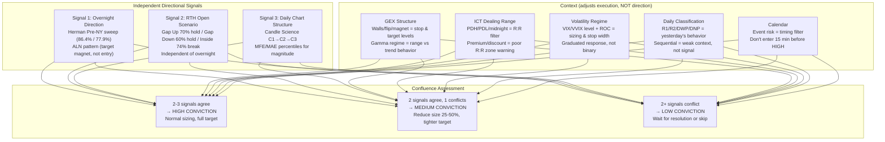

# Trader Narrative Engine v2 — Unified Architecture Plan

> **Status:** PHASE B+C+E COMPLETE — config + 9 signal modules built + prompt updated. PHASE D (cheat sheet wiring) NOT STARTED. RTD pipeline fixes applied (tiered strikes, multi-expiry, TOS EM fallback, translation metadata). PHASES F/G (feedback loop, scheduling) NOT STARTED. PHASE 2/3 (intraday/close) NOT STARTED.  
> **Date:** 2026-07-08 (audited & updated 2026-07-08)  
> **Author:** Vinay Veerappa  
> **Goal:** Integrate ALL existing work (NQStats, Herman, Options/GEX, ICT, Profiler, Classification, RTH Breaks, Candle Science) into a unified trader narrative.  
> **Build plan:** `docs/architecture/NARRATIVE_ENGINE_V2_BUILD_PLAN.md`  
> **Committed:** `83388e21` on main

---

## 1. What We Have Today — Inventory

### A. NQStats Statistical Layer (Verified 2016–2026)

| Module | Source | Status | What it does |
|--------|--------|--------|--------------|
| **ALN Sessions** | nqstats.com/aln_sessions | ✅ Verified (10y + 20y local) | 4 patterns (LEA/AEL/LPEU/LPED), break probabilities, first-break edge, Held/Broken volatility regime |
| **RTH Breaks** | nqstats.com/rth_breaks | ✅ Verified (10y) | 3 open scenarios (Gap Up 70% hold, Gap Down 60% hold, Inside 74% one-side break) |
| **RTH Gap Trading** | Local 20y study | ✅ Verified | Gap size, Globex context, streak, day-of-week, 15-min moat confirmation |
| **Hour Stats** | nqstats.com | ✅ Verified | Hourly personalities (Expansion/Reversion/Trend Close), 5m ORB prediction |
| **Morning Judas** | nqstats.com | ❌ Myth busted | 76% hold rate — NOT a fakeout |
| **IB Breaks** | nqstats.com | ✅ Verified | 96% IB break, 82.5% before noon, midpoint bias |
| **Noon Curve** | nqstats.com | ✅ Verified | 72.8% opposite-side high/low |
| **Net Change SDEVs** | nqstats.com | ⚠️ Weak | ~45% reversion — often signals trend days |
| **1H Continuation** | nqstats.com | ✅ Strong edge | 9AM green → 70.6% green close |
| **Quarterly Dynamics** | Local study | ✅ Verified | Q1 high → 85% red close, Q2-Q4 high → 73% green |

### B. Herman Liquidity & Sweep Layer (17-Year + 10-Year Studies)

| Module | Source | Status | What it does |
|--------|--------|--------|--------------|
| **Asia-London Liquidity Study** | `docs/Herman/FULL_TRANSCRIPT_LIQUIDITY_STUDY.md` | ✅ Verified (17y, 4,262 days) | Session sweep probabilities: PL sweeps Asia H 34.4% / L 27.3%, London sweeps H 60% / L 50%, combined H 65.3% / L 55.4%. Continuation edge: PL sweeps → London sweeps again 77% (H) / 70% (L) |
| **London Playbook** | `docs/Herman/FULL_TRANSCRIPT_LONDON_PLAYBOOK.md` | ✅ Verified (719 days + local) | Asia range size filter: Small (<0.48%) = trend continuation, Large (>0.48%) = mean reversion. OR breakout → 76.5% bullish / 73.8% bearish continuation. PL sweep + OR reclaim = 60-70% reversal |
| **Sweep & Return to Open** | `docs/Herman/FULL_TRANSCRIPT_SWEEP_STUDY.md` | ✅ Verified (10y, 4,291 sessions) | 94.7% sweep frequency. Return to next-hour open: 72.4%. Golden zones: 08:00-09:00 range → 79% return to 09:00 open (highest). Globex open (17:00-18:00) → 76% return. London open (02:00-03:00) → 72% |
| **NY AM Playbook** | `docs/Herman/NY_AM_PLAYBOOK.md` | ✅ Verified (6,000+ days) | Pre-NY (05:00-08:00) is DOMINANT signal. Break London H → 86.4% bullish. Break London L → 77.9% bearish. Inside = 50/50 coin flip. London trend is IRRELEVANT when Pre-NY commits |
| **NY PM Playbook** | `docs/Herman/NY_PLAYBOOK_STATS.md` | ✅ Verified (local) | Lunch range (12:00-13:00) breakout → PM direction. 53.5% high-first. Median penetration 12-14 pts. NY AM sweeps London H → 64.5% bullish close |
| **Herman Master Manual** | `docs/Herman/HERMAN_MASTER_MANUAL.md` | ✅ Consolidated | Unified reference: liquidity → sweep → expansion fractal. NY session mirrors London session (London = base, NY AM = setup/sweep, NY PM = expansion) |

### B. ICT / Price Action Layer

| Module | Source | Status | What it does |
|--------|--------|--------|--------------|
| **Daily Bias Framework** | `docs/DAILY_BIAS.md` | ✅ Documented | 4-engine approach: ICT context, NQStats, Classification, Data integrity |
| **ICT Concepts** | `docs/SecondBrain_Trading.md` §3 | ✅ Documented | FVG/OB, BSL/SSL, CISD, PO3, Premium/Discount, TTrade fractal |
| **Daily Classification** | `docs/DailyClassification/` | ✅ Complete | R1, R2, DWP, DNP + sequential + overnight probability matrices |
| **Session Profiler** | `scripts/libs_py/nqstats/` | ✅ Working | 4-quadrant box status (LT/ST/LF/SF), broken/held logic |
| **ICT Engine (PA)** | `scripts/libs_py/ict_engine/core/pa.py` | ✅ Working | Vectorized FVG, IFVG, BPR, OB, Breakers |
| **Profiler (Pine)** | `docs/profiler/` | ✅ Working | Session boxes in Pine, visual compliance |
| **Candle Science** | `docs/features/CandleScience/` + `scripts/indicators-pine/CandleScience/candle_science_v17_5.pine` | ✅ v17.5 Pine + UI | 3-candle pattern engine (C1→C2→C3). 16 boolean dimensions, MFE/MAE percentiles. Pine v6 overlay + Next.js dashboard. Auto-detect mode matches current pattern against history. Answers "given C1+C2, what does C3 usually do?" |

### C. Options / GEX Layer

| Module | Source | Status | What it does |
|--------|--------|--------|--------------|
| **GEX Calculator** | `scripts/streaming/options/gex_calculator.py` | ✅ Live | BSM Greeks, charm, speed, vanna, net GEX |
| **Level Scorer** | `scripts/streaming/options/level_scorer.py` | ✅ Live | 3-filter triage: mechanical walls, structural anchors, inflection points |
| **Options Pipeline** | `scripts/streaming/options/run_options_levels.py` | ✅ Live | Multi-ticker coordinator, Prisma writes, daily levels JSON |
| **TOS RTD** | `scripts/streaming/options/tos_rtd/` | ✅ Complete | Real-time futures price + native Greeks via COM |
| **Hybrid Coordinator** | `scripts/streaming/options/tos_rtd/hybrid_coordinator.py` | ✅ Complete | RTD-first, Schwab fallback |
| **Expected Moves** | `data/options/daily_levels.json` + `scripts/trader/signals/expected_move.py` | ✅ Live | EM upper/lower per ticker, reads from pipeline, futures→ETF mapping (NQ1→QQQ, ES1→SPY, etc.) |
| **Unified Levels** | `data/options/unified_levels*.json` | ✅ Live | CW/PW/flip/magnet/zero gamma — translated to futures scale |

### D. ML Bias Layer

| Module | Source | Status | What it does |
|--------|--------|--------|--------------|
| **Binary Classifier** | `scripts/nqstats/aln_sessions/ml_binary_classifier.py` | ✅ Trained | 60-62% OOS accuracy, LONG/SHORT prediction |
| **Walk-Forward** | `scripts/nqstats/aln_sessions/ml_walk_forward.py` | ✅ Validated | 5 OOS periods, NQ most stable (1.2% std) |
| **Saved Models** | `data/ml_models/{ticker}_binary_model.pkl` | ✅ Saved | Ready for inference |
| **Feature Matrix** | `data/ml_feature_matrix.csv` | ✅ Generated | 16 features (gap_pts, london_expansion, etc.) |

**ML assessment**: The ML experiment achieved 60-62% accuracy — a 20-24% improvement over random. The model is best at predicting NEUTRAL days and struggles with LONG/SHORT precision (~45-47%). `gap_pts` (London open vs prior close) is the #1 feature at 47% importance. The model is usable as a **confirmation signal** alongside the rule-based ALN bias, not as a standalone predictor.

### E. Existing Narrative Systems

| System | File | Status | Strengths | Gaps |
|--------|------|--------|-----------|------|
| **daily_narrative.py** | `scripts/trader/daily_narrative.py` | ✅ Working | Structured JSON trade plans, DB persistence, Discord | No overnight context, no ALN, no intermarket, no RTH breaks, no ICT |
| **trader_narrative.py** | `scripts/trader/trader_narrative.py` | ✅ v1 (open only) | Cheat sheet approach, intermarket, ALN, GEX, classification | No intraday/close modes, no RTD, no active trades, no ICT levels, no profiler, no ML, no RTH breaks (just added) |

---

## 2. Gap Analysis — What's Missing from the Current Narrative

### Data sources NOT flowing into either narrative:

| Missing Data | Available? | Where | Impact |
|--------------|-----------|------|--------|
| **ICT levels (PDH/PDL, midnight open)** | ✅ | `scripts/trader/retrieve_ict_context.py` | No dealing range / premium-discount context |
| **Session Profiler status** | ✅ | `scripts/libs_py/nqstats/engine.py` | No LT/ST/LF/SF quadrant reads |
| **ML bias prediction** | ✅ | `data/ml_models/{ticker}_binary_model.pkl` | No ML confirmation of ALN bias |
| **Hourly personality / 5m ORB** | ✅ | `scripts/libs_py/nqstats/timing.py` | No intraday execution timing guidance |
| **IB break probabilities** | ✅ | Verified 96% | No IB breakout bias after 10:30 |
| **Noon Curve** | ✅ | `scripts/libs_py/nqstats/engine.py` | No afternoon expansion/reversal read |
| **Daily Classification** | ✅ (in trader_narrative) | `scripts/analysis/analyze_daily_classification_bias.py` | Not in daily_narrative |
| **RTH Gap context (gap size, Globex width)** | ✅ | Local study | Not in cheat sheet — only basic RTH Break scenario |
| **TOS RTD real-time price** | ✅ | `hybrid_coordinator.py` | No intraday mode yet |
| **Active trade monitoring** | ✅ | Prisma DB Trade table | No intraday trade awareness |
| **Candle science (PO3, FVG/OB state)** | ✅ | `scripts/libs_py/ict_engine/core/pa.py` + `docs/features/CandleScience/` | Not in cheat sheet — Candle Science C1→C2→C3 probabilities not in narrative |
| **Herman Pre-NY sweep (05:00-08:00)** | ✅ | `docs/Herman/NY_AM_PLAYBOOK.md` | No dominant pre-NY directional signal (86.4% bullish / 77.9% bearish) |
| **Herman Asia range size filter** | ✅ | `docs/Herman/HERMAN_MASTER_MANUAL.md` | No small/large Asia regime classification (<0.48% = trend, >0.48% = mean reversion) |
| **Herman sweep & return to open** | ✅ | `docs/Herman/FULL_TRANSCRIPT_SWEEP_STUDY.md` | No golden zone timing (08:00-09:00 → 79% reversion to 09:00 open) |
| **Herman PL continuation** | ✅ | `docs/Herman/FULL_TRANSCRIPT_LIQUIDITY_STUDY.md` | No PL→London continuation edge (77% H / 70% L sweep again) |
| **Herman London OR breakout** | ✅ | `docs/Herman/HERMAN_MASTER_MANUAL.md` | No OR breakout continuation (76.5% bullish / 73.8% bearish) |

### Conceptual gaps:

1. **No "dealing range" context**: ICT Premium/Discount (price vs midnight open, PDH/PDL) is not in the narrative. The LLM doesn't know if price is in premium (sell) or discount (buy).

2. **No profiler quadrant read**: The LT/ST/LF/SF status tells you whether the session is a trend day or a reversal day. This is critical for the morning narrative.

3. **No ML confirmation**: The ML model (60% accuracy) could confirm or contradict the ALN bias, adding a confidence layer.

4. **No hourly execution timing**: The narrative doesn't tell you *when* to expect moves (Q1 reversion at 10am, Q4 expansion at 3pm, etc.).

5. **No IB context**: After 10:30, the IB high/low and midpoint bias (82% high break if close in upper half) should feed into the intraday narrative.

6. **No candle science**: FVG/OB state, BSL/SSL sweeps, and PO3 (accumulation/manipulation/distribution) are not in the narrative.

7. **No Herman Pre-NY sweep**: The 05:00-08:00 pre-NY session is the **DOMINANT** directional signal (86.4% bullish if breaks London H, 77.9% bearish if breaks London L). This is more powerful than the ALN pattern itself and should be the primary bias input, with ALN as context.

8. **No Herman Asia range size filter**: Small Asia (<0.48%) = trend continuation regime. Large Asia (>0.48%) = mean reversion regime. This changes the entire trading approach for the day and should be in the open narrative.

9. **No Herman sweep-return timing**: The golden zone (08:00-09:00 range → 79% return to 09:00 open) is critical for the open narrative — it tells you whether to fade or follow the 09:30 move.

10. **No Herman London OR breakout**: The 02:00-03:00 opening range breakout → 76.5% bullish / 73.8% bearish continuation. This is the London-session equivalent of the RTH open scenario.

11. **No Candle Science C1→C2→C3 read**: The Candle Science engine (v17.5 Pine + Next.js dashboard) computes 16-dimensional pattern matching and MFE/MAE percentiles for the next candle. On a daily chart, this tells you: "Given the last 2 daily candles, what does today usually do?" This is a probabilistic overlay that should complement the ALN/classification bias in the open narrative. The data is available via the Pine script or the Python backend (`api/services/candle_science_service.py`), but not flowing into the cheat sheet.

---

## 3. Unified Narrative Architecture (Proposed)

```mermaid
flowchart TD
    subgraph DATA["Data Layer (existing)"]
        ALN["ALN Engine\n(LPEU/LPED/LEA/AEL + Held/Broken)"]
        RTH["RTH Breaks\n(Gap Up/Down/Inside)"]
        HERM["Herman Layer\n(Pre-NY sweep / Asia size / OR breakout / sweep-return)"]
        GEX["GEX Pipeline\n(CW/PW/Flip/Magnet/EM)"]
        ICT["ICT Context\n(PDH/PDL/Midnight/FVG/OB)"]
        PROF["Profiler\n(LT/ST/LF/SF quadrants)"]
        CLASS["Classification\n(R1/R2/DWP/DNP + sequential)"]
        ML["ML Bias Model\n(60% LONG/SHORT)"]
        HOUR["Hourly Timing\n(5m ORB / Q1-Q4 personality)"]
        IB["IB Breaks\n(96% break, midpoint bias)"]
        NOON["Noon Curve\n(72.8% opposite side)"]
        RTD["TOS RTD\n(real-time price + Greeks)"]
        DB["Prisma DB\n(Trades, Plans, Events)"]
        CAL["Calendar\n(ForexFactory events)"]
    end

    subgraph CHEAT["Cheat Sheet Builder (Python)"]
        OPEN["Open Cheat Sheet\n~1500 tokens"]
        INTRA["Intraday Cheat Sheet\n~800 tokens"]
        CLOSE["Close Cheat Sheet\n~1000 tokens"]
    end

    subgraph LLM["LLM Narrative Layer (Ollama)"]
        OPENP["Open Prompt\n~400 word narrative"]
        INTRAP["Intraday Prompt\n~300 word update"]
        CLOSEP["Close Prompt\n~400 word review"]
    end

    subgraph OUTPUT["Output"]
        DISCORD["Discord webhook"]
        DISK["data/options/daily/*.md"]
        PLAN["daily_narrative.py\n(trade plan JSON)"]
    end

    ALN & RTH & HERM & GEX & ICT & PROF & CLASS & ML & CAL --> OPEN
    ALN & RTH & HERM & HOUR & IB & NOON & RTD & DB --> INTRA
    ALN & RTH & GEX & ICT & DB & CAL --> CLOSE

    OPEN --> OPENP
    INTRA --> INTRAP
    CLOSE --> CLOSEP

    OPENP --> DISCORD & DISK
    OPENP --> PLAN
    INTRAP --> DISCORD & DISK
    CLOSEP --> DISCORD & DISK
```



### Open Mode Cheat Sheet (revised)

```
== OVERNIGHT (Globex 18:00 → 08:30 ET) ==
NQ: Open X → Current Y (Z%) | Session H/L | Trajectory
ES: Open X → Current Y (Z%) | Session H/L | Trajectory
VIX: prev close → current

== RTH BREAKS (Prior Day RTH Range) ==
NQ: pRTH High X | pRTH Low Y | Current Z → [GAP UP / GAP DOWN / INSIDE]
    [70% hold / 60% hold / 74% one-side break]

== HERMAN: ASIA RANGE & PRE-NY SWEEP ==
Asia Range: X pts (Y%) → [SMALL <0.48% / LARGE >0.48%]
    Small = trend continuation regime | Large = mean reversion regime
Pre-NY (05:00-08:00): [Broke London High / Broke London Low / Inside London]
    Broke High → 86.4% bullish | Broke Low → 77.9% bearish | Inside = 50/50
PL Continuation: Pre-London swept [H/L] → London swept again [77% H / 70% L]
London OR (02:00-03:00): [Broke Up / Broke Down / Inside]
    Broke Up → 76.5% bullish continuation | Broke Down → 73.8% bearish

== INTERMARKET READ ==
[NQ leading / ES lagging / VIX confirming or diverging]

== ALN / SESSION PATTERNS ==
Pattern: [LPEU/LPED/LEA/AEL] | Broken: [Held/Held etc.]
London H/L/Mid | P12
Bias: [BULLISH/BEARISH/NEUTRAL] (conviction)
[CONFLICT flag if price beyond biased level]

== PROFILER QUADRANTS ==
Asia: [LT/ST/LF/SF] | London: [LT/ST/LF/SF]
[Read: e.g., Asia LT + London ST = divergence, wait for NY]

== DAILY CLASSIFICATION ==
Yesterday: [R1/R2/DWP/DNP]
Most Likely Today: [type] (X%)
Sequential: R1 X% | R2 X% | DWP X% | DNP X%

== ML BIAS (confirmation) ==
Model says: [LONG/SHORT] (X% confidence)
[Agrees/Conflicts with ALN bias]

== ICT CONTEXT ==
Dealing Range: PDH X | PDL Y | Midnight Open Z
Price is in [PREMIUM/DISCOUNT] (X% of range)
[BSL above PDH / SSL below PDL — liquidity targets]

== GEX STRUCTURE ==
Call Wall X (+Y% from spot) | Put Wall X (-Y%)
Gamma Flip: X — [positive/negative gamma regime]
Magnet: X | Expected Move: X to Y

== SWEEP-RETURN TIMING (Herman Golden Zones) ==
08:00-09:00 range sweep → 79% return to 09:00 open (FADE the sweep)
02:00-03:00 range sweep → 72% return to 03:00 open
[If price swept 08:00 high/low, expect reversion to 09:00 open]

== CANDLE SCIENCE (C1→C2→C3 Daily Pattern) ==
C1: [Bull/Bear] | C2: [Bull/Bear]
C2 vs C1: [Higher High / Lower Low / Close above/below C1]
C3 Open vs C2: [Above/Below C2 Close]
Pattern match: N historical matches
P(C3 Bull): X% | P(C3 Break High): X% | P(C3 Break Low): X%
P(C3 Close > C2 Close): X% | Edge: +X%
[If edge >10%, high-conviction signal for today's candle direction]

== TODAY'S CALENDAR ==
[Events with interpretation]

== KEY LEVELS HIERARCHY ==
Overhead: flip → London H → call wall → PDH (BSL)
Support: London L → put wall → PDL (SSL) → overnight low

== PRIOR EOD PLAN ==
[Yesterday's plan + proximity to current price]
```

### Intraday Cheat Sheet (revised)

```
== MID-DAY UPDATE (12:00 ET) ==

== MORNING BIAS ==
[Narrative summary from 08:00 run]

== CURRENT PRICE (RTD) ==
NQ: X (up/down Y% from open) | ES: X | VIX: X

== HOURLY TIMING ==
Last hour: [Expansion/Reversion/Trend Close] | 5m ORB: [Green/Red]
Next hour expectation: [Q1 reversion / Q4 expansion / etc.]

== IB STATUS ==
IB High: X | IB Low: Y | IB Mid: Z
[Broken: high/low/both/none] | [82.5% before noon if not yet broken]
[Midpoint bias: upper half → 82% high break]

== NOON CURVE ==
AM High set at: [time] | AM Low set at: [time]
[If high set 08:30-11:00 → expect new low 14:00-15:30 (72.8%)]

== LEVEL INTERACTIONS ==
[Call wall / put wall / flip / London H/L tested/broken/held]

== ACTIVE TRADES ==
[Entry/stop/target + RTD proximity + R:R shift]

== CALENDAR UPDATE ==
[Events passed / upcoming]

== WHAT CHANGED ==
[Delta from morning narrative]
```

### Close Cheat Sheet (revised)

```
== EOD REVIEW (16:00 ET) ==

== TODAY'S SESSION ==
NQ/ES/VIX: Open → Close | H/L | Body
[Session classification: R1/R2/DWP/DNP — was it correct?]

== LEVEL OUTCOMES ==
[CW/PW/flip/London H/L tested/broken/held]

== ALN OUTCOME ==
[Pattern was X → did NY break the biased level? Continuation/reversal confirmed?]

== PROFILER OUTCOME ==
Asia: [actual] | London: [actual] | NY1: [actual] | NY2: [actual]
[Trend day or reversal day?]

== ICT OUTCOME ==
[BSL/SSL swept? FVG filled? PO3 cycle complete?]

== TRADE OUTCOMES ==
[Win/loss/no entry + P&L + MAE/MFE]

== DRAWDOWN STATUS ==
[Trailing DD remaining]

== TOMORROW'S CALENDAR ==
[Events]

== TOMORROW'S SETUP ==
[Based on today's close + pRTH for tomorrow + ALN preview if available]
```

---

## 3.5 Bias Hierarchy — Which Signal Wins?

One of the most important findings from combining all research is that **not all bias signals are equal**. The narrative should reflect a clear hierarchy of influence, not a flat list of sometimes-conflicting indicators.

### The Bias Hierarchy (most → least powerful)

```mermaid
flowchart TD
    subgraph HIERARCHY["Bias Hierarchy — Top to Bottom"]
        H1["1. Herman Pre-NY Sweep (05:00-08:00)\nDOMINANT — 86.4% bullish / 77.9% bearish\nOverrides everything else"]
        H2["2. RTH Breaks Open Scenario\nGap Up 70% hold / Gap Down 60% hold"]
        H3["3. ALN Pattern (08:00 lock)\nLPEU 80.8% / LPED 75.0% break rates\n+ Held/Broken volatility regime"]
        H4["4. Candle Science (Daily C1→C2→C3)\n16-dimensional pattern match\nEdge >10% = high conviction"]
        H5["5. ML Bias Model\n60% accuracy — confirmation only"]
        H6["6. Daily Classification\nR1/R2/DWP/DNP sequential probs\nContext, not primary driver"]
        H7["7. Profiler Quadrants\nLT/ST/LF/SF — context only\n<3% predictive edge alone"]
        H8["8. GEX Structure\nWalls/flip/magnet — levels & regime\nNot directional bias per se"]
        H9["9. ICT Premium/Discount\nDealing range context\nBuy discount, sell premium"]
    end

    H1 --> H2 --> H3 --> H4 --> H5 --> H6 --> H7 --> H8 --> H9
```



### Conflict Resolution Rules for the Narrative

| Conflict | Resolution | Example narrative phrasing |
|----------|-----------|---------------------------|
| **Pre-NY sweep vs ALN** | Pre-NY wins. ALN is context. | "ALN says bullish (LPEU) but pre-NY broke London Low (77.9% bearish) — the pre-NY signal overrides, bias is bearish with ALN as context" |
| **RTH Breaks vs ALN** | RTH Breaks is the open scenario. ALN is overnight bias. If they conflict, conviction drops. | "ALN bullish but we gapped below pRTH Low (60% bearish hold) — conflicting signals, reduce conviction" |
| **Candle Science vs ALN** | Candle Science is the daily chart read. ALN is the overnight read. If they agree, high conviction. | "Candle Science says 68% bull close AND ALN is LPEU — aligned bullish, full conviction" |
| **ML vs ALN** | ML confirms, doesn't override. | "ML model says SHORT (62% confidence) but ALN is LPEU — ML conflicts, conviction reduced to medium" |
| **Classification vs everything** | Classification is yesterday's outcome. It's sequential context, not today's bias. | "Yesterday was R2, which sequences to 32.8% R2 today — but pre-NY sweep says bullish, so lean long with R2 expansion as the play" |
| **GEX vs price** | GEX levels are structural, not directional. If price is at a wall, the wall matters for stops/targets, not for bias. | "Call wall at 29,800 is 0.37% overhead — this is resistance for the target, not a reason to be bearish" |

### The Golden Rule (from Herman)

> **"Trade the chart in front of you (05:00-08:00), not the chart behind you (London/Asia)."**

The pre-NY sweep (05:00-08:00) is the **dominant** signal. If pre-NY has committed to a direction (breaking London High or Low), NY follows 80%+ of the time. ALN, classification, ML, and candle science are all *context* that the narrative should weave around the pre-NY signal — not signals that override it.

---

## 4. Stat Re-Verification Plan

Before building v2, we should re-verify key stats against our own data to ensure the numbers we're feeding the LLM are correct.

| Stat | Published | Our Study | Action |
|------|-----------|-----------|--------|
| ALN break rates (4 patterns) | NQStats 10y | Local 20y showed >90% (ETH contamination?) | Re-run with strict 08:00-16:00 ET window |
| RTH Break probabilities | NQStats 10y | Local matched (73% one-side) | ✅ Verified |
| Gap fill rates by size | Local 20y | 88-91% perfect reversion | ✅ Verified |
| IB break rate | 96% | 96.2% local | ✅ Verified |
| Noon Curve | 72.8% | 74.9% (ES) | ✅ Verified |
| 9AM continuation | 70.6% | 71.6% local | ✅ Verified |
| ML accuracy | 60-62% | OOS validated | ✅ Verified |
| Profiler edge | No strong edge for NY1 | <3% difference | ⚠️ Use for context, not prediction |

**Priority re-verification**: ALN break rates. Our local study showed >90% (likely included ETH), while NQStats shows 71-81%. We're currently using NQStats numbers in the prompts — this is the safer choice. But we should run a clean RTH-only study to settle the discrepancy.

---

## 5. Implementation Roadmap

### Phase 0: Fast Access Layer — Direct Python Computation (1 day)

Before building cheat sheet blocks, we need to wire each signal to its fastest direct Python path. No UI, no API, no web layer. Everything is a function call that reads parquet/JSON from disk and returns a dict.

#### Design Principle: Two-Tier Data Access

**Tier 1 — Precomputed / Static** (read from disk, never recompute at narrative time):
- Herman session stats → `data/derived/{ticker}_herman_stats.parquet` (precomputed by `precompute_herman_stats.py`)
- Daily classification parquet → `data/derived/{ticker}_daily_classification.parquet` (precomputed)
- Classification probability matrices → `docs/DailyClassification/{ticker}_sequential_probabilities.csv` (static CSV)
- NQStats probability constants → `scripts/trader/config/narrative_stats.yaml` (published stats as config)
- ML model → `data/ml_models/{ticker}_binary_model.pkl` (trained, frozen)

**Tier 2 — Live Compute** (computed fresh each narrative run from current market data):
- NQStats Engine (ALN, profiler, IB, hourly, noon) — from 1m parquet, 10-day window
- Overnight context (Globex OHLC, pRTH) — from 1m parquet
- GEX levels — from `data/options/unified_levels*.json` (live pipeline output)
- Candle Science — from 1d parquet (pattern match is fast on daily)
- ICT context — from **1d/1W parquet** (PDH/PDL/midnight — NOT full 1m historical)
- Calendar — from Prisma DB

**Why two tiers**: Herman stats, classification probabilities, and NQStats published stats don't change between narrative runs. Re-reading precomputed parquet/CSV is ~0.1s vs ~2-5s to recompute. The narrative should never recompute Tier 1 data — it reads the latest row from the precomputed file. If the precomputed file is stale, a separate batch job updates it (not the narrative).

#### Static Probability Config

Published stats that are unlikely to change should live as a **config file** — not hardcoded in prompts or Python. This lets us update probabilities without touching code.

**Config file**: `scripts/trader/config/narrative_stats.yaml`

```yaml
# Narrative Engine — Static Probability Configuration
# Update these when stats are re-verified. See docs/architecture/NARRATIVE_ENGINE_V2_PLAN.md §4.

aln_patterns:
  LPEU:
    break_high: 80.8      # % chance NY breaks London High
    break_low: 65.5
    break_both: 47.6
    break_neither: 1.2
    if_low_breaks_first: 51.2   # high still breaks (edge lost)
    if_high_breaks_first: 46.4  # low also breaks
    bias: bullish
  LPED:
    break_high: 68.6
    break_low: 75.0
    break_both: 44.6
    break_neither: 1.0
    if_high_breaks_first: 46.2  # low still breaks (edge lost)
    if_low_breaks_first: 44.1  # high also breaks
    bias: bearish
  LEA:
    break_high: 71.5
    break_low: 70.4
    break_both: 42.5
    break_neither: 0.0
    bias: neutral              # coin flip, no directional edge
  AEL:
    break_high: 81.1
    break_low: 74.9
    break_both: 56.0
    break_neither: 0.0
    if_low_breaks_first: 59.8  # high follows (bullish tell)
    bias: coiled               # NY always breaks a level

held_broken:
  both_held:
    ny1_long: 30.7
    ny1_broken: 25.7
    read: "low vol, long bias, tight stops viable"
  both_broken:
    ny1_long: 13.7
    ny1_short: 15.2
    ny1_broken: 51.3
    read: "chop, no edge, reduce size"
  asia_broken_london_held:
    ny1_long: 27.2
    ny1_broken: 34.0
    read: "good setup, long bias, moderate vol"

rth_breaks:
  gap_up:
    close_above_prth_high: 69.9
    does_not_breach_prth_low: 88.1
    read: "bullish continuation, don't fade unless reclaims pRTH High"
  gap_down:
    close_below_prth_low: 59.5
    does_not_breach_prth_high: 90.4
    read: "bearish continuation, don't fade unless reclaims pRTH Low"
  inside_range:
    no_breach: 17.7
    one_side_breach: 74.0
    both_side_breach: 8.3
    read: "expect one-side break, use ALN for direction"

herman_pre_ny:
  break_london_high_bullish: 86.4
  break_london_low_bearish: 77.9
  inside_london: 50.0
  read: "DOMINANT signal — overrides ALN. Trade the chart in front of you."

herman_asia_range:
  small_threshold_pct: 0.48     # <0.48% = trend continuation
  large_threshold_pct: 0.48     # >0.48% = mean reversion

herman_sweep_return:
  golden_zone_08_09:
    return_to_open_pct: 79.0   # highest in study
    action: "FADE the sweep of 08:00 range"
  london_open_02_03:
    return_to_open_pct: 72.4
    action: "FADE the sweep of 02:00 range"
  globex_open_17_18:
    return_to_open_pct: 76.0
    action: "FADE the sweep of 17:00 range"

herman_london_or:
  break_high_bullish: 76.5
  break_low_bearish: 73.8
  read: "London OR breakout → continuation. Fade only if PL swept + OR reclaims."

ml_bias:
  accuracy: 60                 # OOS accuracy — confirmation only, does not override
  role: confirmation

ib_breaks:
  break_before_close: 96.1
  break_before_noon: 82.5
  midpoint_upper_half_high_break: 82.3

noon_curve:
  opposite_side_pct: 72.8

hourly_personalities:
  "09": {personality: expansion, orb_wr: 54.3, high_q4: 40}
  "10": {personality: reversion, orb_wr: 61.6, high_q1: 37, q1_high_red_close: 85}
  "15": {personality: trend_close, orb_wr: 58.4, high_q4: 41.5}

candle_science:
  edge_threshold: 10            # >10% edge = high conviction
  source: api/features/candle_science/service.py
```

#### Signal Access Map (audited 2026-07-08)

| # | Signal | Tier | File | Function | Data Source | Speed | Status |
|---|--------|------|------|----------|-------------|------|--------|
| 1 | **NQStats Engine** (ALN + Profiler + IB + Hourly + Noon) | Live | `scripts/libs_py/nqstats/engine.py` | `NQStatsEngine(df).process()` → `get_latest_status()` | 1m parquet (10-day window) | ~0.25s | ✅ In cheat sheet |
| 2 | **Overnight + pRTH** | Live | `scripts/trader/briefing_core.py` | `build_overnight_context()` | 1m parquet | ~0.5s | ✅ In cheat sheet |
| 3 | **RTH Breaks** | Live | `scripts/trader/briefing_core.py` | (computed from pRTH) | same 1m df | free | ✅ In cheat sheet |
| 4 | **GEX Levels** | Live | `scripts/trader/briefing_core.py` | `_extract_gex_levels()` + `load_macro_levels()` | `data/options/unified_levels*.json` | ~0.1s | ✅ In cheat sheet |
| 5 | **Daily Classification** | Tier 1 | `scripts/analysis/analyze_daily_classification_bias.py` | `get_prior_classification()` + `get_current_overnight_scenario()` | derived parquet + CSV matrices | ~0.1s | ✅ In cheat sheet |
| 6 | **Calendar** | Live | `scripts/trader/briefing_core.py` | `fetch_week_events()` | Prisma DB | ~0.5s | ✅ In cheat sheet |
| 7 | **Herman Pre-NY Sweep** | Tier 1 | `data/derived/{ticker}_herman_stats.parquet` | `pd.read_parquet().iloc[-1]` | precomputed parquet | ~0.1s | 🔴 **STALE DATA** — parquet last date 2026-01-23 (166 days behind). No signal module exists. Not in cheat sheet. |
| 8 | **ICT Context** | Live | `scripts/trader/signals/ict_context.py` | `compute_ict_from_htf(ticker, current_price)` | `data/{ticker}_1d.parquet` + `data/{ticker}_1W.parquet` | ~0.5s | ✅ **Module built** — NOT wired into cheat sheet |
| 9 | **ML Bias** | Tier 1 | `data/ml_models/{ticker}_binary_model.pkl` | `joblib.load()` → `model.predict()` | `.pkl` + features from Tier 1 data | ~0.1s | 🚫 **Dropped from v2** — `narrative_stats.yaml` has `ml_bias.enabled: false` |
| 10 | **Candle Science** | Live | `scripts/trader/signals/candle_science.py` | `get_candle_science_read(ticker)` | `data/{ticker}_1d.parquet` | ~0.5s | ✅ **Module built** — NOT wired into cheat sheet |
| 11 | **Sweep-Return Timing** | Live | `scripts/libs_py/nqstats/timing.py` | `check_9am_reversion()` | same 1m df | free | ❌ **No signal module exists** — moved to intraday-only per §8 review |
| 12 | **Static Probabilities** | Config | `scripts/trader/config/narrative_stats.yaml` | `config_loader.get_config()` | YAML file | ~0.01s | ✅ **Config complete** — loaded by signal modules, NOT by cheat sheet builder |
| 13 | **VIX + VVIX Regime** | Live | `scripts/trader/signals/volatility.py` | `get_vix_vvix_checkpoint()` | `data/live/live_storage_VIX.parquet` | ~0.2s | ✅ **Module built** — NOT wired into cheat sheet |
| 14 | **Expected Move** | Live | `scripts/trader/signals/expected_move.py` | `get_em_context(spot, ticker)` | `data/expected_moves.json` | ~0.1s | ⚠️ **Module built + wired** — but `expected_moves.json` data array is EMPTY |
| 15 | **GEX Regime Change** | Live | `scripts/trader/signals/gex_regime.py` | `get_gex_regime_change(today_gex)` | `data/options/daily/gex_snapshots/` | ~0.1s | ✅ **Module built** — NOT wired. GEX snapshots directory DOES NOT EXIST |
| 16 | **ICT Liquidity Map** | Live | `scripts/trader/signals/liquidity_map.py` | `build_liquidity_map(bias, nq_status, overnight, ict, news_tier)` | multiple inputs | ~0.1s | ✅ **Module built** — NOT wired into cheat sheet |
| 17 | **Weekly Profile** | Live | `scripts/trader/signals/weekly_profile.py` | `compute_weekly_profile(ticker, current_price)` | `data/{ticker}_1d.parquet` | ~0.2s | ✅ **Module built** — NOT wired into cheat sheet |
| 18 | **Day Type Classifier** | Live | `scripts/trader/signals/day_type.py` | `classify_day_type(events, today)` | Prisma DB events | ~0.1s | ✅ **Module built** — NOT wired into cheat sheet |
| 19 | **Confluence Assessment** | Live | `scripts/trader/signals/confluence.py` | `assess_confluence(s1, s2, s3)` | other signal outputs | ~0.01s | ✅ **Module built** — NOT wired into cheat sheet |
| 20 | **Data Freshness Guard** | Startup | `scripts/trader/data_freshness.py` | `check_all()` | Tier 1 parquets + JSON | ~0.1s | ✅ **Module built** — NOT called by cheat sheet builder |

#### Unified Loading Strategy (revised — HTF parquet for ICT, precomputed for Herman)

```python
# Phase 0: Two-tier loading strategy
import pandas as pd, joblib, yaml
from scripts.utils.fused_data_loader import load_fused_data
from scripts.libs_py.nqstats.engine import NQStatsEngine

# ── Tier 1: Precomputed / Static (read from disk, no recompute) ──

# Static probabilities (loaded once, cached)
stats_config = yaml.safe_load(open("scripts/trader/config/narrative_stats.yaml"))

# Herman pre-NY sweep (read latest row from precomputed parquet)
herman = pd.read_parquet("data/derived/NQ1_herman_stats.parquet").iloc[-1].to_dict()

# ML model (frozen, load once)
ml_bundle = joblib.load("data/ml_models/NQ1_binary_model.pkl")

# Classification (CSV matrices + prior from derived parquet)
from scripts.analysis.analyze_daily_classification_bias import (
    get_prior_classification, get_current_overnight_scenario, load_matrices
)
prior_type = get_prior_classification("NQ1", target_date)
overnight_key = get_current_overnight_scenario("NQ1", target_date)
seq_df, over_df = load_matrices("NQ1")

# ── Tier 2: Live Compute (from current market data) ──

# Load 1m once (~0.5s) — recent window only
df_1m = load_fused_data("NQ1", timeframe="1m", require_historical=False)
df_1m_recent = df_1m[df_1m.index >= pd.Timestamp.now() - timedelta(days=10)]

# One engine call → ALN + Profiler + IB + Hourly + Noon (~0.25s)
engine = NQStatsEngine(df_1m_recent, ticker="NQ1")
engine.process()
nq_status = engine.get_latest_status()

# Overnight + pRTH (uses full df_1m, ~0.5s)
nq_overnight = build_overnight_context(loader=None, ticker="NQ1")

# ICT context from HTF parquet (~0.5s — NOT full 1m historical)
df_1d = pd.read_parquet("data/NQ1_1d.parquet")    # daily bars for PDH/PDL
df_1w = pd.read_parquet("data/NQ1_1W.parquet")    # weekly bars for PWH/PWL
# Compute PDH/PDL/midnight from daily bars (vectorized, no 1m needed)
ict_levels = compute_ict_from_htf(df_1d, df_1w, nq_overnight)

# Candle Science from daily parquet (~0.5s)
from api.features.candle_science.service import CandleScienceService
cs_stats = CandleScienceService.calculate_stats("NQ1", "1d", auto_filters)

# ML inference (build 16 features from Tier 1 data, ~0.1s)
ml_features = build_ml_features(nq_status, herman, prior_type)  # helper
ml_pred = ml_bundle['model'].predict(ml_bundle['scaler'].transform([ml_features]))
```

#### Revised Total Estimated Time

| Component | Tier | Time |
|-----------|------|------|
| Stats config (YAML) | Config | ~0.01s |
| Herman precomputed parquet | Tier 1 | ~0.1s |
| ML model load | Tier 1 | ~0.1s |
| Classification CSV + prior | Tier 1 | ~0.1s |
| load_fused_data (1m, 10-day) | Live | ~0.5s |
| NQStatsEngine.process() | Live | ~0.25s |
| build_overnight_context() | Live | ~0.5s |
| ICT from HTF parquet (1d/1W) | Live | ~0.5s |
| Candle Science (1d parquet) | Live | ~0.5s |
| ML inference | Live | ~0.1s |
| GEX levels (JSON) | Live | ~0.1s |
| Calendar (DB) | Live | ~0.5s |
| **Total** | | **~3.3s** |

No more 3-5s ICT bottleneck — using 1d/1W parquet instead of full 1m historical drops it to ~0.5s. All Tier 1 data is cached reads. Total is ~3s for the full cheat sheet.

### Phase 1: Complete the Open Narrative (1-2 days) — AUDITED 2026-07-08

| Task | Status | Notes |
|------|--------|-------|
| Add Herman Pre-NY sweep block to cheat sheet | 🔒 FROZEN | Herman parquet is a historical study (17y, last 2026-01-23). Probabilities in `narrative_stats.yaml`. Live Pre-NY from 1m parquet. No signal module needed. |
| Add Herman Asia range size block | 🔒 FROZEN | Same as above — static probs in YAML. |
| Add ICT context block to cheat sheet | ⚠️ MODULE BUILT, NOT WIRED | `signals/ict_context.py` exists. `compute_ict_from_htf()` works. Not called from `build_trader_cheat_sheet()`. |
| Add profiler quadrant block to cheat sheet | 🚫 DROPPED | Per §8 review: <3% predictive edge. Moved to intraday-only if needed. |
| Add ML bias confirmation block | 🚫 DROPPED | `narrative_stats.yaml` has `ml_bias.enabled: false`. Redundant with explicit rule-based signals. |
| Add Candle Science block | ⚠️ MODULE BUILT, NOT WIRED | `signals/candle_science.py` exists. `get_candle_science_read()` works. Not called from cheat sheet. |
| Add sweep-return timing block | 🚫 MOVED TO INTRADAY | Per §8 review: 08:00-09:00 range hasn't formed at 08:00 narrative time. |
| Add hourly personality block | 🚫 MOVED TO INTRADAY | 5m ORB hasn't formed at 08:00. |
| Add bias hierarchy + conflict resolution rules to prompt | ✅ DONE | `trader_morning.md` updated with ICT, Candle Science, VIX/VVIX, confluence rules. |
| Test end-to-end with Ollama | ✅ DONE | Narrative generates correctly (~400 words, 1,702 chars). Output to `data/options/daily/`. |

### Phase 2: Intraday Mode (2-3 days) — NOT STARTED

- [ ] Create `trader_intraday.md` prompt
- [ ] Implement `build_intraday_context()` with RTD price, active trades, level interactions
- [ ] Add IB status + noon curve + hourly timing blocks
- [ ] Wire RTD hybrid coordinator
- [ ] Test during live RTH session

### Phase 3: Close Mode (1-2 days) — NOT STARTED

- [ ] Create `trader_close.md` prompt
- [ ] Implement `build_eod_context()` with full session OHLC, trade outcomes, profiler outcomes
- [ ] Add ICT outcome block (BSL/SSL swept, FVG filled, PO3 cycle)
- [ ] Test end-of-day

### Phase 4: Integration & Automation (1-2 days) — NOT STARTED

- [ ] Wire all 3 modes into `run_options_levels.py` scheduler
- [ ] Add `daily_narrative.py` trade plan generation after open narrative
- [ ] Discord webhook routing (separate channels for narrative vs trade plan)
- [ ] Automated scheduling: 08:00 open, 12:00 intraday, 16:05 close

### Phase 5: Stat Re-Verification (parallel) — NOT STARTED

- [ ] Re-run ALN break rate study with strict 08:00-16:00 ET window
- [ ] Compare NQStats published numbers vs our clean RTH numbers
- [ ] Update `NQ_SESSIONS_SPEC.md` if numbers change
- [ ] Update prompt rules if break probabilities shift

---

## 6. Key Design Decisions

### Q: Should the narrative replace daily_narrative.py's trade plan?

**No.** The narrative is a *read* — it tells you what's happening and why. The trade plan is a *decision* — entry/stop/target. They're separate outputs from separate prompts. The narrative feeds into the trade plan as context.

### Q: Should ML bias override ALN bias?

**No.** ML is a confirmation signal (60% accuracy). ALN + Held/Broken + RTH Breaks is the primary bias. ML adds confidence when it agrees and raises a flag when it conflicts. If ML conflicts with ALN, the narrative should say "ALN says bullish but ML model leans short — conviction reduced."

### Q: Should ICT concepts be in the cheat sheet or the prompt?

**Cheat sheet.** Python should compute "price is at 62% of dealing range → PREMIUM" and "BSL above PDH at X, SSL below PDL at Y." The prompt should have rules: "Premium → lean short, Discount → lean long. BSL is a target, SSL is a target."

### Q: Should the profiler quadrant status drive the narrative?

**Yes, as context.** The local study showed profiler status alone has <3% predictive edge for NY1 direction. But the *combination* of ALN + profiler is meaningful: "Asia LT + London ST = divergence" is a useful narrative beat even if it's not a tradeable edge.

### Q: Token budget — can we fit all this?

The revised open cheat sheet is ~1500-2000 tokens (with Herman + Candle Science blocks added). The prompt rules add ~500 tokens (ALN + RTH + Herman + bias hierarchy). Total input ~2500 tokens, output ~400 words (~500 tokens). Well within the 32K context / 16K output budget of gemma4:latest. If token budget becomes an issue, the cheat sheet sections are modular — we can drop lower-priority blocks (profiler, ML) to stay lean.

### Q: Should Herman Pre-NY sweep replace ALN as the primary bias?

**Yes, in practice.** Herman's research (6,000+ days) shows the Pre-NY session (05:00-08:00) is the DOMINANT directional signal at 86.4% / 77.9%. ALN is the overnight context that sets the stage, but Pre-NY is the commit signal. The narrative should lead with Pre-NY and use ALN as the "why" — "Pre-NY broke London High (86.4% bullish), which aligns with the LPEU pattern (80.8% break rate)."

### Q: How does Candle Science fit in?

**As a daily-chart overlay.** Candle Science answers "given the last 2 daily candles, what does today usually do?" — a different question than ALN ("what does the overnight pattern predict?"). When Candle Science edge >10% AND it agrees with the Pre-NY/ALN bias, conviction is high. When it conflicts, it's a caution flag. The Python backend (`api/services/candle_science_service.py`) can compute this, or we can call the Pine script's logic. For v2, the simplest path is to compute it in Python from the daily parquet.

---

## 6.5 Audit Summary (2026-07-08)

### What's Built and Working

| Layer | What | Files | Status |
|-------|------|-------|--------|
| **Config** | `narrative_stats.yaml` — all static probabilities, regimes, thresholds, killzones | `scripts/trader/config/narrative_stats.yaml` | ✅ Complete |
| **Config loader** | `config_loader.py` — YAML load + cache + validation | `scripts/trader/config_loader.py` | ✅ Complete |
| **Signal: VIX/VVIX** | `volatility.py` — 6-tier regime, ROC, divergence, sizing | `scripts/trader/signals/volatility.py` | ✅ Built |
| **Signal: Expected Move** | `expected_move.py` — EM position, completeness, futures→ETF mapping | `scripts/trader/signals/expected_move.py` | ✅ Built + wired |
| **Signal: GEX Regime** | `gex_regime.py` — flip crossed, wall moved, regime change detection | `scripts/trader/signals/gex_regime.py` | ✅ Built |
| **Signal: ICT Context** | `ict_context.py` — PDH/PDL/midnight/PWH/PWL from HTF parquet | `scripts/trader/signals/ict_context.py` | ✅ Built |
| **Signal: Liquidity Map** | `liquidity_map.py` — ICT raid targets, level equality, entry timing | `scripts/trader/signals/liquidity_map.py` | ✅ Built |
| **Signal: Weekly Profile** | `weekly_profile.py` — HOW/LOW formation, profile type, alignment | `scripts/trader/signals/weekly_profile.py` | ✅ Built |
| **Signal: Day Type** | `day_type.py` — CLEAN/CPI/NFP/FOMC/SPECIAL/HOLIDAY classifier | `scripts/trader/signals/day_type.py` | ✅ Built |
| **Signal: Candle Science** | `candle_science.py` — C1→C2→C3 auto-detect, MFE/MAE percentiles | `scripts/trader/signals/candle_science.py` | ✅ Built |
| **Signal: Confluence** | `confluence.py` — 3-signal agreement, conviction, sizing | `scripts/trader/signals/confluence.py` | ✅ Built |
| **Data Freshness** | `data_freshness.py` — staleness checks for Tier 1 sources | `scripts/trader/data_freshness.py` | ✅ Built |
| **Cheat Sheet (v1)** | `build_trader_cheat_sheet()` — overnight, RTH breaks, VIX, intermarket, GEX, ALN, classification, EM, prior EOD | `scripts/trader/briefing_core.py` | ✅ Working (v1 blocks only) |
| **Narrative runner** | `trader_narrative.py` — open mode, Ollama, Discord, disk output | `scripts/trader/trader_narrative.py` | ✅ Working |
| **Prompt template** | `trader_morning.md` — ALN + RTH rules, 400-word narrative | `scripts/trader/prompts/trader_morning.md` | ✅ Working (v1 rules) |

### What's NOT Wired Into the Cheat Sheet

These 9 signal modules exist and work independently but are **NOT called** from `build_trader_cheat_sheet()`:

1. `signals/ict_context.py` — `compute_ict_from_htf()`
2. `signals/candle_science.py` — `get_candle_science_read()`
3. `signals/volatility.py` — `get_vix_vvix_checkpoint()`
4. `signals/gex_regime.py` — `get_gex_regime_change()`
5. `signals/liquidity_map.py` — `build_liquidity_map()`
6. `signals/weekly_profile.py` — `compute_weekly_profile()`
7. `signals/day_type.py` — `classify_day_type()`
8. `signals/confluence.py` — `assess_confluence()`
9. `data_freshness.py` — `check_all()`

The cheat sheet builder (`briefing_core.py`) only imports `signals/expected_move.py`. All other signal modules are standalone.

### Data Issues Found

| Issue | Severity | Detail |
|-------|----------|--------|
| **Herman parquet stale** | 🔴 Critical | `NQ1_herman_stats.parquet` last date 2026-01-23 — 166 days behind. Must re-run `precompute_herman_stats.py`. |
| **Classification parquet stale** | 🔴 Critical | `NQ1_daily_classification.parquet` last date 2026-01-23 — 166 days behind. Must re-run classification batch. |
| **Expected Moves empty** | 🟡 Medium | `expected_moves.json` has `data: []` — no EM values. Options pipeline must be running. |
| **GEX snapshots missing** | 🟡 Medium | `data/options/daily/gex_snapshots/` directory does not exist. GEX regime change detection has no prior data to compare against. |
| **NQStats session times** | 🟢 Low | Engine uses Asia 18:00-02:00, London 03:00-08:00. `NQ_SESSIONS_SPEC.md` says Asia 20:00, London 02:00. Documented as intentional — NQStats Asia = full Globex for ALN locking, Herman Asia = 20:00 for sweep stats. |

### What Was Dropped/Deferred

| Item | Reason |
|------|--------|
| **ML Bias** | `narrative_stats.yaml` has `ml_bias.enabled: false`. 60% accuracy doesn't add enough over explicit rule-based signals. |
| **Profiler quadrants** | <3% predictive edge for NY1 direction. Moved to intraday-only if needed. |
| **Sweep-return timing** | 08:00-09:00 range hasn't formed at 08:00 narrative time. Moved to intraday-only. |
| **Hourly personalities** | 5m ORB hasn't formed at 08:00. Moved to intraday-only. |
| **Herman signal module** | No dedicated `signals/herman.py` exists. Herman parquet is a FROZEN historical study (17y, last 2026-01-23) — not a live input. Pre-NY sweep detection reads 1m parquet directly via `retrieve_ict_context.py`. Herman probabilities are in `narrative_stats.yaml`. No signal module needed. |

### Herman & Classification Parquets — FROZEN (2026-07-08)

| Parquet | Status | Why |
|---------|--------|-----|
| `NQ1_herman_stats.parquet` | 🔒 **FROZEN** — last 2026-01-23 | Historical study (17y, 5,011 rows). Probabilities are static in `narrative_stats.yaml`. Live Pre-NY sweep detection uses 1m parquet directly, not this file. Will NOT be refreshed. |
| `NQ1_daily_classification.parquet` | 🔒 **FROZEN** — last 2026-01-23 | Regenerated by `run_daily_prep.py` → `precompute_daily_classification.py` each run. Probability matrices are static CSVs. The narrative reads yesterday's row from the daily-prep output, not this historical file. Will NOT be manually refreshed. |

### RTD Path Audit (2026-07-08)

**Finding**: The RTD-direct code path in `run_options_levels.py:671-730` is correct but **never activates** because `rtd_coord.is_rtd_active` is always `False` — TOS desktop is not running during pipeline execution.

**Evidence**:
- `daily_levels.json` has `/NQ` and `/ES` entries with **0 expected_moves** — RTD never wrote to them
- `GexSnapshot` DB has zero `rtd_direct` mode rows
- `hybrid_coordinator.py:212` gates on `self._adapter.is_running()` which requires TOS COM server

**ETF fallback IS working**: QQQ has 9 EM entries (em_upper=719.90, em_lower=702.98). The `expected_move.py` signal maps NQ1→QQQ correctly and returns valid EM data. **However**, the EM values are ETF-scale (QQQ ~$711), not futures-scale (NQ ~$29,000). The `daily_levels.json` QQQ entry lacks `futures_symbol`, `translation_mode`, `basis_ratio`, and `futures_price` fields — the translation ratio needed to scale ETF EM to futures is not stored in the JSON.

**Action**: To get futures-scale EM, either:
1. Run pipeline with TOS desktop open → RTD activates → `/NQ` gets direct futures EM
2. Add translation ratio to `daily_levels.json` QQQ entry so `expected_move.py` can scale ETF EM to futures

### Critical Path to v2 Open Narrative (revised 2026-07-08)

```
1. [SKIP] Herman parquet refresh     →  FROZEN — historical study, not needed
2. [SKIP] Classification refresh     →  FROZEN — regenerated by daily prep
3. [SKIP] Herman signal module       →  Not needed — Pre-NY from 1m parquet, probs in YAML
4. Wire 9 signal modules             →  update build_trader_cheat_sheet() to call all signal functions
5. Update prompt template (Phase E)  →  add ICT, Candle Science, confluence, VIX/VVIX rules
6. End-to-end test                   →  python -m scripts.trader.trader_narrative --mode open
```

---

1. **Review this plan** — does the architecture make sense? Anything missing?
2. **Prioritize phases** — which gap is most important to close first?
3. **Stat re-verification** — should we run the clean RTH ALN study before or in parallel with Phase 1?
4. **Commit current work** — the ALN + RTH Breaks prompt updates and spec doc are ready to push.
5. **Brainstorm further** — we'll go back and forth to distill this into something usable.

---

## 8. Critical Review — Overlap, Overkill, and Obvious Misses

### 🔴 OVERLAP — Things measuring the same thing

| Overlap | What's duplicated | Resolution |
|---------|------------------|------------|
| **Herman Pre-NY sweep vs ALN pattern** | Both measure overnight → NY directional bias. Herman's Pre-NY (05:00-08:00 vs London H/L) and NQStats ALN (London vs Asia) are correlated — if London broke Asia High (LPEU), Pre-NY is more likely to break London High. | Keep both but **lead with Herman Pre-NY** (86.4% is stronger) and use ALN as the "why." Don't present them as independent signals — they're the same overnight story from two angles. The cheat sheet should merge them into one `== OVERNIGHT BIAS ==` block, not separate Herman and ALN sections. |
| **Herman London OR (02:00-03:00) vs ALN pattern** | The London OR breakout direction largely determines the ALN pattern. If OR breaks high, you get LPEU. If OR breaks low, you get LPED. | **Don't double-count.** The London OR breakout is the *cause* of the ALN pattern. Present it as the mechanism, not as an independent confirmation. |
| **NQStats Held/Broken vs Herman Pre-NY** | Herman's "Pre-NY broke London High" is essentially the same event as NQStats' "London broken by Pre-NY." Both measure whether the 05:00-08:00 session took out London's range. | **Use Herman's framing** (it has the 86.4% / 77.9% stats) and drop the NQStats Held/Broken for Pre-NY. Keep Held/Broken only for the Asia-London relationship (which Herman doesn't cover). |
| **RTH Breaks vs Herman RTH Gap Trading** | RTH Breaks classifies Gap Up/Down/Inside. Herman RTH Gap Trading does the same but adds gap size, Globex width, streak, day-of-week, and 15-min moat. | **Merge into one block.** Use RTH Breaks for the basic classification, then layer Herman's filters (gap size, streak) as modifiers. Don't have two separate RTH sections. |
| **Daily Classification vs ALN** | Classification (R1/R2/DWP/DNP) is yesterday's *outcome*. ALN is today's *setup*. They measure different things but the narrative might present them as competing biases. | Clarify in the prompt: classification is "what kind of day did yesterday give us" (context), not "what will today be." Don't present it as a directional signal. |
| **ML bias vs everything** | The ML model uses the same features (ALN, gap, london expansion) that we're already feeding the narrative. It's not adding new information — it's a weighted combination of signals we already have. | **Drop ML from v2.** The 60% accuracy doesn't add enough over the explicit rule-based signals we're already providing. The LLM can reason about ALN + Herman + RTH Breaks directly. ML adds complexity (feature engineering, model loading) for minimal gain. Revisit only if the explicit rules underperform. |
| **Candle Science vs Daily Classification** | Candle Science (C1→C2→C3 daily pattern) and Daily Classification (R1/R2/DWP/DNP) both attempt to predict today's daily candle from prior context. | Keep both — they measure different things. Candle Science is structural (OHLC relationships), classification is behavioral (range/expansion/reversal). But **don't give them equal weight** — Candle Science has explicit edge stats (>10% threshold), classification is sequential context. |

### 🟡 OVERKILL — Things that may be too much for a morning narrative

| Overkill | Why it's too much | Resolution |
|---------|-------------------|------------|
| **Profiler quadrants (LT/ST/LF/SF)** | The local study showed <3% predictive edge for NY1 direction. Adding 4 quadrant labels for Asia + London adds 8 data points with almost no signal. | **Drop from open narrative.** The LLM can't do anything useful with "Asia LT + London ST" when the edge is 3%. If we need it later for the intraday narrative (where the combination might matter more), add it then. |
| **Sweep-Return timing in the open narrative** | The sweep-return study (08:00-09:00 → 79% return) is useful for *execution* at 09:00, not for the 08:00 narrative. At 08:00, the 08:00-09:00 range hasn't formed yet. | **Move to intraday only.** The open narrative should mention "expect 09:00 sweep return" as a timing note, but don't compute it as a data block. |
| **Hourly personalities in the open narrative** | The 5m ORB and Q1/Q4 timing are intraday execution tools. At 08:00, the current hour's ORB hasn't formed. | **Move to intraday only.** The open narrative can mention "10am is a reversion hour, expect early sweep + fade" as a timing hint, but don't compute hourly mode as a data block. |
| **17 separate cheat sheet blocks** | The revised open cheat sheet has 17 sections. For a ~400 word narrative, the LLM can't address all 17 meaningfully. It'll cherry-pick or hallucinate connections. | **Consolidate to 8-10 blocks** (see revised structure below). Merge correlated signals, drop low-edge ones. |
| **Two narrative systems (daily_narrative.py + trader_narrative.py)** | We're maintaining two systems that do similar things with different prompts and different data. `daily_narrative.py` produces JSON trade plans; `trader_narrative.py` produces markdown narratives. They share `briefing_core.py` but diverge on everything else. | **Consolidate into one pipeline.** The narrative generates the "read" (markdown), then the trade plan generator uses the narrative as input to produce the "decision" (JSON). One script, two outputs. Don't maintain two separate cheat sheet builders. |

### 🟢 OBVIOUS MISSES — Things we haven't considered

| Miss | What's missing | Why it matters |
|------|---------------|----------------|
| **ES divergence** | We track NQ overnight + ES overnight + VIX, but the narrative doesn't have explicit rules for what to do when they diverge. | NQ leading downside while ES holds = NQ-specific rotation (tech). ES dropping while NQ holds = risk-off without tech damage. The LLM needs rules to interpret divergence, not just data. |
| **GEX regime change detection** | We output GEX levels but don't detect if the regime has *changed* since yesterday (e.g., flip crossed, wall broken overnight). | "We were in positive gamma yesterday, now we're below the flip — this shifts from stabilizing to amplifying." The narrative should compare today's GEX to yesterday's, not just show today's. |
| **Expected Move context** | We output EM upper/lower but don't tell the LLM where price sits relative to them. | If price is already at EM upper, the "expected move is complete" — that's a critical context the narrative should flag. |
| **Prior narrative feedback loop** | The close narrative grades the morning bias, but there's no mechanism to feed that grade back into the next day's open narrative. | "Yesterday's morning bias was WRONG — ALN said bullish but we got LPED continuation bearish. Adjust confidence in similar setups." Even a simple right/wrong tally would help. |
| **News reaction tracking** | Calendar tells us what's coming, but we don't track how the market *reacted* to past events. | "Last 3 CPI prints: 2 led to bearish sweeps + reversals, 1 led to trend continuation." Even a simple historical reaction log would add value. |
| **VIX level context** | We show VIX as a number but don't interpret it. | VIX < 15 = low vol regime (tighter stops, smaller ranges). VIX > 25 = high vol regime (wider stops, bigger moves). The LLM needs thresholds to interpret VIX, not just a number. |
| **Day of week** | Herman's RTH Gap study showed day-of-week matters (Wednesday 70% fill, Monday defense-prone). ML model uses day_of_week as a feature. But it's not in the cheat sheet. | Add day-of-week context: "Wednesday — best gap fill day (70%)" or "Monday — defense prone, gap fills less often." |
| **Tick / breadth internals** | We have TICK_1m.parquet and ADV_1m.parquet but don't use them. | TICK > +1000 or < -1000 at open = aggressive buying/selling. Breadth divergence = confirmation or warning. Useful for intraday mode. |
| **The 09:30 open itself** | The cheat sheet is built at 08:00 but the actual RTH open at 09:30 is the most important moment. We have RTH Breaks classification but no mechanism to update the narrative at 09:30. | Consider a 09:30 "open update" — a 30-second mini-narrative that fires after the first 5m bar: "Price opened inside pRTH, 5m ORB is green, ALN says bullish — initial read is continuation." |

### Revised Open Cheat Sheet (consolidated — 9 blocks instead of 17)

```
== 1. OVERNIGHT BIAS (Herman Pre-NY + ALN merged) ==
Asia Range: X pts (Y%) → [SMALL / LARGE] — [trend / mean reversion regime]
Pre-NY (05:00-08:00): [Broke London High / Low / Inside] — 08:00 price [above / below / at] London level
    → [86.4% bullish / 77.9% bearish / 50/50] — [holding strong / reversed back / at level]
ALN Pattern: [LPEU/LPED/LEA/AEL] — target magnet [London High / London Low] at [80.8% / 75.0%]
    [CONFLICT flag if Pre-NY and ALN disagree]
London H/L/Mid: X / Y / Z | P12: W

== 2. RTH OPEN SCENARIO (RTH Breaks + Herman gap context merged) ==
pRTH High: X | pRTH Low: Y | Current: Z → [GAP UP / GAP DOWN / INSIDE]
    [70% hold / 60% hold / 74% one-side break] — [30% fill risk, most fills in first hour]
Gap size: X% → [noise / conflict / signal zone]
Day: [Mon/Tue/Wed/Thu/Fri] — [fill tendency, minor edge]

== 3. CONFLUENCE ASSESSMENT ==
Signal 1 (Overnight): [BULLISH / BEARISH / NEUTRAL] — Pre-NY + ALN
Signal 2 (RTH Open): [BULLISH / BEARISH / NEUTRAL] — Gap Up/Down/Inside
Signal 3 (Daily Chart): [BULLISH / BEARISH / NEUTRAL] — Candle Science
Confluence: [HIGH (3/3) / MEDIUM (2/3) / LOW (conflict)] → [normal / reduce 25-50% / skip or wait]

== 4. INTERMARKET + VOLATILITY ==
NQ: X (Y%) | ES: X (Y%) | [NQ leading / ES lagging / aligned]
VIX: X [QUIET/CALM/NORMAL/ELEVATED/HIGH/CRISIS] | VVIX: X [QUIET/CALM/NORMAL/ELEVATED/HIGH/CRISIS]
VVIX overnight: [rising X% / flat / falling X%] → [fear building / neutral / unwinding]
VIX-VVIX divergence: [panic / hedging / complacency / smart money divergence / calm]
Sizing: [normal / reduce 25% / reduce 50% / minimum only]

== 5. GEX STRUCTURE ==
Call Wall X (+Y%) | Put Wall X (-Y%) | Flip: X [pos/neg gamma → mean reversion / trend amplification]
Regime change: [same as yesterday / flip crossed / wall broken overnight]
EM: X to Y | Price at X% of EM [magnet/target, not ceiling — if exceeded = trend day]

== 6. ICT DEALING RANGE ==
PDH: X | PDL: Y | Midnight: Z
Price in [PREMIUM/DISCOUNT] (X% of range) → [R:R filter: longs poor in premium, shorts poor in discount]
BSL: X above | SSL: Y below

== 7. DAILY CONTEXT (Classification + Candle Science) ==
Yesterday: [R1/R2/DWP/DNP] → Today most likely: [type] (X%) [context only, not directional]
Candle Science: C1[C1dir] C2[C2dir] → P(C3 bull): X% (n=N, edge +X%)
    MFE: p30=+X% | median=+X% | p70=+X%    ← target magnitude
    MAE: p30=-X% | median=-X% | p70=-X%    ← expected drawdown
    R:R envelope: median MFE/MAE = Xx
    [Agrees/Conflicts with overnight bias]

== 8. KEY LEVELS + INVALIDATION ==
Overhead: flip → London H → call wall → PDH
Support: London L → put wall → PDL → overnight low
Bias invalidated if: [price closes below London Low for 2+ 5m bars / price below put wall at 10:00 / gap fills]

== 9. ICT LIQUIDITY MAP ==
Bias: [BULLISH / BEARISH / NEUTRAL]
If bullish → raid target: [Asian low / London low / Pre-Mkt low] before real move up
If bearish → raid target: [Asian high / London high / Pre-Mkt high] before real move down
Level equality: [equal → high raid probability / disparate → lower]
Weekly position: [Discount → expect deep retracements / Premium → shallow, don't wait for deep pullbacks]
Raid→Run: "Entry is AFTER the raid, not before. The explosive move follows the liquidity sweep."

== 10. WEEKLY PROFILE ==
Week so far: HIGH [X at Day/Time] | LOW [Y at Day/Time] | Current [Z]
Profile: [Bullish Run (HOW late) / Bearish Run (LOW late) / Inside / Outside / Balanced]
Position: [near HOW → reversal risk / near LOW → bounce risk / mid → continuation]
Day context: [Mon/Tue → LOW forming / Wed → inflection / Thu/Fri → HOW/LOW likely set]
Alignment with daily bias: [ALIGNED / CONFLICTING / NEUTRAL]

== 11. DAY TYPE & CALENDAR ==
Day type: [CLEAN / CPI / NFP / FOMC / SPECIAL / HOLIDAY]
Sizing: [Normal / Reduce 50% / Reduce 25%]
Events: [time] [name] [impact] — [buffer/wait]
Killzones: [London 02-05 / NY 08:30-11 / Silver Bullet 10-11 / London Close 10-12]
No-trade: [NY lunch 11:30-13:30 / FOMC 14:00-14:30 / Friday after 15:00]

== 12. PRIOR EOD PLAN ==
[Yesterday's plan + proximity + yesterday's bias was RIGHT/WRONG (recent accuracy: X/Y)]
```

This is **12 blocks, ~1400-1600 tokens**. The LLM can address all 12 in a 400-word narrative.
- Merged Herman + ALN into one Overnight Bias block (they measure the same overnight story)
- Merged RTH Breaks + Herman gap context into one RTH Open block
- Added Confluence Assessment block (3 independent signals → conviction level + sizing)
- Merged intermarket + VIX/VVIX into one block with graduated regime + divergence
- Added MFE/MAE percentiles to Candle Science (target magnitude + drawdown)
- Added bias invalidation to Key Levels block
- Dropped: profiler quadrants (low edge), ML bias (redundant), sweep-return timing (intraday), hourly personalities (intraday), London OR (subsumed by ALN), PL continuation (subsumed by Pre-NY), IB breaks (intraday), noon curve (intraday), Held/Broken as separate block (merged into overnight bias)

---

## 9. Tackling the Obvious Misses — Individual Build & Test

Each miss should be built and tested individually before wiring into the full cheat sheet. This way we verify each signal works before combining.

### 9.1 VIX + VVIX Regime Interpretation

**Data available**:
- VIX 1m live: `data/live/live_storage_VIX.parquet` (3615 rows, real-time)
- VIX 1d historical: `data/VIX_1d.parquet` (2006–2026)
- VVIX 1m live: `data/live/live_storage_VVIX.parquet` (3615 rows, real-time)
- VVIX 1d historical: `data/VVIX_1d.parquet` (2006–2026, 5042 rows)
- Friction matrix: `data/derived/market_friction_matrix.parquet` (has both vix_close + vvix_close)

**VVIX distribution (2006–2026, n=5042)**:
| Percentile | VVIX | VIX |
|-----------|------|-----|
| 10th | 76.0 | ~12 |
| 25th | 82.6 | 14.5 |
| Median | 90.9 | 18.4 |
| Mean | 93.5 | 20.1 |
| 75th | 102.1 | 23.4 |
| 90th | 115.2 | 29.4 |

**Graduated Response Model** (don't wait for panic — escalate early):

The goal is a graduated response: as vol rises, we progressively tighten stops, reduce size, and shift from trend-following to fade-extremes. We don't wait for the "panic" threshold to act — by then it's too late.

**VIX Regime (graduated)**:

| VIX Level | Regime | Sizing | Stops | Read |
|-----------|--------|--------|-------|------|
| < 13 | **QUIET** | Normal | Tight (15-20 pts NQ) | Compressed, range-bound. Mean reversion dominant. Fade extremes. |
| 13–17 | **CALM** | Normal | Standard (20-25 pts) | Low vol. Trend days are clean but ranges are smaller. |
| 17–22 | **NORMAL** | Normal | Standard (25-30 pts) | Standard regime. Most strategies work as designed. |
| 22–28 | **ELEVATED** | Reduce 25% | Wider (30-40 pts) | Vol expanding. Wider stops, expect larger ranges. Don't fade as aggressively. |
| 28–35 | **HIGH** | Reduce 50% | Wide (40-60 pts) | Vol spike. Reduce size significantly. Expect 2-way spikes. Fade only at major levels. |
| > 35 | **CRISIS** | Minimum size only | Structural only | Panic regime. Don't initiate new positions. Manage existing. |

**VVIX Regime (graduated)**:

| VVIX Level | Regime | Read |
|------------|--------|------|
| < 80 | **QUIET** | Vol-of-vol compressed. Options market not pricing fear. Range-bound likely. |
| 80–88 | **CALM** | Normal-low. Standard execution. |
| 88–96 | **NORMAL** | Standard. No special action. |
| 96–105 | **ELEVATED** | Vol-of-vol rising. Start paying attention — wider ranges coming. Tighten entries, widen stops. |
| 105–115 | **HIGH** | Vol-of-vol spiking. Reduce size. Expect sharp moves in both directions. Fade extremes at structural levels only. |
| > 115 | **CRISIS** | Vol-of-vol in panic territory. Minimum size. Don't initiate. Manage existing. |

**VVIX Rate of Change (directional signal — more important than level)**:

| VVIX Change (overnight) | Signal | Action |
|--------------------------|--------|--------|
| VVIX rising > 5% overnight | **Fear building** — institutions pricing vol. Tighten stops. Don't chase breakouts — expect reversals. |
| VVIX rising 2-5% | **Caution** — mild fear. Standard execution but watch for reversal. |
| VVIX flat (±2%) | **Neutral** — no vol signal. Execute normally. |
| VVIX falling 2-5% | **Fear unwinding** — vol declining. Trend continuation likely. Don't fade. |
| VVIX falling > 5% | **Complacency** — vol collapsing fast. Trend continuation. Risk: sudden reversal if an event hits. |

**VIX vs VVIX Divergence (directional edge)**:

| VIX | VVIX | Interpretation |
|-----|------|----------------|
| Rising | Rising faster (VVIX chg > VIX chg × 1.5) | **Panic building** — vol-of-vol leading vol. Expect sharp 2-way moves. Fade extremes, reduce size. |
| Rising | Flat or falling | **Hedging** — institutions buying VIX calls/puts for protection, not outright panic. Trend may continue. |
| Falling | Falling faster | **Complacency** — fear unwinding. Trend continuation. |
| Falling | Rising | **Smart money divergence** — VIX falling but VVIX rising. Institutions positioning for vol. Caution flag — don't size up. |
| Flat | Flat | **Calm** — no signal. |

**Note on VVIX/VIX ratio**: The ratio is NOT stationary and was removed from the model. VVIX has a floor (~70-80) while VIX can go to 10-12, so the ratio is highest when VIX is low (calm), not during panic. Use VVIX absolute level + rate of change instead.

**Build**:
- Add `get_vix_vvix_checkpoint()` to `briefing_core.py` — returns `{vix_close, vix_prev, vix_chg, vix_regime, vvix_close, vvix_prev, vvix_chg, vvix_regime, vvix_roc_regime, divergence_read}`
- Use 1m live parquet for current, 1d for prior close
- Add VIX/VVIX regime + divergence to the intermarket read block

**Test individually**: Run just this function against live data, verify regime classification and divergence read make sense.

**Config** (add to `narrative_stats.yaml`):
```yaml
vix_regimes:
  quiet: 13
  calm: 17
  normal: 22
  elevated: 28
  high: 35
  crisis: 99  # >35

vvix_regimes:
  quiet: 80
  calm: 88
  normal: 96
  elevated: 105
  high: 115
  crisis: 99  # >115

vvix_roc:
  fear_building: 5.0     # % change overnight
  caution: 2.0
  neutral: -2.0
  unwinding: -5.0

vix_vvix_divergence:
  panic_multiplier: 1.5   # VVIX chg > VIX chg × 1.5 = panic

vvix_vix_ratio:
  panic_threshold: 5.5    # VVIX/VIX > 5.5 = panic
  hedging_threshold: 1.0  # VVIX rising slower than VIX = hedging
```

### 9.2 GEX Regime Change Detection

**What's missing**: We show today's GEX levels but don't compare to yesterday's. The LLM doesn't know if the regime *changed*.

**Build**:
- Store yesterday's GEX levels (flip, call wall, put wall) from `data/options/unified_levels*.json` (or from Prisma DB `MacroSnapshot` table which has historical snapshots)
- Compare today vs yesterday: did flip cross? Did a wall move significantly (> X points)?
- Output: `regime_change: "flip crossed from positive to negative"` or `regime_change: "stable"` or `regime_change: "call wall moved up 50pts"`

**Test individually**: Pull 2 consecutive days of GEX snapshots from DB, compute the delta, verify the read makes sense.

### 9.3 Expected Move Completeness

**What's missing**: We output EM upper/lower but don't say where price sits relative to them.

**Build**:
- Read EM from `data/expected_moves.json`
- Compute `price_position = (current - em_lower) / (em_upper - em_lower) * 100`
- If price > 95% of EM → "expected move nearly complete — upside limited"
- If price < 5% of EM → "expected move nearly complete downside — limited"
- If price near 50% → "price at midpoint of expected move"

**Test individually**: Load EM JSON, compute position for current NQ price, verify interpretation.

### 9.4 Prior Narrative Feedback Loop

**What's missing**: No mechanism to grade yesterday's bias and feed it into today's narrative.

**Build**:
- At close (16:05 ET), store the morning bias + outcome to a simple log file: `data/options/daily/bias_grades.jsonl`
- Each entry: `{date, morning_bias, actual_outcome, correct, pattern}`
- At open (08:00 ET), read last 5 entries: "Last 5 biases: 3 correct, 2 wrong. Recent accuracy: 60%."
- Don't over-engineer — a simple JSONL append is enough for v2

**Test individually**: Generate 5 fake bias grade entries, verify the read function produces a meaningful summary.

### 9.5 VIX/VVIX in Intermarket Read

**What's missing**: `build_intermarket_read()` currently only uses VIX. It should use VVIX too.

**Build**:
- Pass VVIX checkpoint to `build_intermarket_read()`
- Add VVIX divergence detection (see 9.1)
- Update the intermarket read text to include: "VIX 14.8 (LOW VOL), VVIX 88 (NORMAL). VVIX flat while VIX rising — institutions hedging, not panicking."

**Test individually**: Run `build_intermarket_read()` with VVIX data, verify the divergence interpretation.

### 9.6 Day of Week

**What's missing**: Herman showed day-of-week matters (Wed 70% fill, Mon defense-prone). Not in cheat sheet.

**Build**:
- Python: `today = datetime.now(ET).strftime("%A")` — trivial
- Config:
```yaml
day_of_week:
  Monday: "Defense prone — gaps fill less, continuation bias"
  Tuesday: "Neutral — standard execution"
  Wednesday: "BEST FADE DAY — 70% gap fill rate"
  Thursday: "Good fade — 67% fill rate"
  Friday: "Defense prone — gap fills less, weekend risk"
```

**Test individually**: Just verify the config lookup works for each day.

### 9.7 ES Divergence Rules

**What's missing**: We detect divergence but don't give the LLM explicit rules for interpretation.

**Build**: Add to the prompt (not the cheat sheet — these are interpretation rules, not data):
```
INTERMARKET RULES:
- NQ down, ES flat, VIX flat → NQ-specific rotation (tech), likely overshoot. Lean long on NQ.
- NQ down, ES down, VIX up → broad risk-off. Don't fight it. Wait for stabilization.
- NQ up, ES flat → tech leading, breadth missing. Take profits early, don't add.
- ES up, NQ flat → breadth rally, tech lagging. NQ may catch up.
- VIX rising + VVIX rising faster → panic regime. Fade extremes, expect reversals.
- VIX rising + VVIX flat → hedging, not panic. Trend may continue.
```

**Test individually**: Generate 5 scenarios, verify the prompt rules produce correct interpretations from the LLM.

### 9.8 News & Day Type Classification Matrix

**What's missing**: ICT teaches that timing is everything — when to trade, when to sit out, and how to handle news events. We need a day-type matrix that combines ICT killzone timing with news event categorization.

#### ICT Killzone Reference

| Killzone | Time (ET) | Best Sub-Window | Purpose |
|----------|-----------|-------------------|---------|
| Asian | 20:00–00:00 | Mark range only | Accumulation — builds the range London will sweep |
| London Open | 02:00–05:00 | 02:00–04:00 | Manipulation — Judas Swing sweeps Asian liquidity |
| New York Open ★ | 08:30–11:00 | 10:00–11:00 (Silver Bullet) | Distribution — highest probability window |
| London Close | 10:00–12:00 | 10:00–11:00 | Profit-taking continuation or reversal |

**ICT Dead Zones (do NOT trade)**:
- 11:30–13:30 ET: NY lunch chop, volume drops
- 14:00–20:00 ET: CBDR — no institutional flow

#### 5 Day Type Categories

**Category 1: CLEAN (no Tier 1 events)** — ~60% of days

| | |
|---|---|
| Killzones | All active — London, NY Open, Silver Bullet, London Close |
| Sizing | Normal |
| Guidance | "Clean calendar. Standard execution. Silver Bullet 10-11 AM is primary window." |

**Category 2: CPI Day** — 08:30 ET, monthly

| | |
|---|---|
| Killzones | London normal. NY Open disrupted by 08:30 release. |
| Sizing | Reduce to 50-75% all day (elevated vol regardless of VIX) |
| Pre-event | No new entries 15 min before. Reduce existing to 1 contract. |
| Post-event | Wait 5-15 min for spike resolution. If aligns with overnight bias → enter on retrace. If conflicts → skip. |
| Range | Typically 1.5-2x normal daily range |
| ICT note | 08:30 spike often creates the BSL/SSL sweep. Post-spike FVG is the entry. But sweep is algorithmic, not institutional — higher fakeout risk. |

**Category 3: NFP Day** — 08:30 ET, first Friday

| | |
|---|---|
| Killzones | Similar to CPI but larger spike (15-30 pts NQ). First direction often fakeout. |
| Sizing | Reduce 50% morning. Normal after 10:00 once reaction settles. |
| Pre-event | No new entries from 08:15. |
| Post-event | Wait until 09:15. If direction resolved → enter. If still 2-way → range day, fade extremes. |
| ICT note | NFP creates the "Judas Swing" — initial spike is manipulation, real move comes after. Silver Bullet 10-11 is especially powerful on NFP days. If 9AM candle green after NFP → 70.6% green close (ICT 1H continuation). |

**Category 4: FOMC Day** — 14:00 ET statement, 14:30 press conference, 8x/year

| | |
|---|---|
| Killzones | Morning killzones normal but QUIET (50-60% normal range). Afternoon is the action. |
| Sizing | Reduce 50% all day. |
| Pre-event | No new entries from 13:45. Close or reduce positions. |
| During statement (14:00-14:30) | SIT OUT — initial reaction reverses 60%+ of the time. Most dangerous phase. |
| Post-press conference (15:00+) | Cleaner directional move. Power Hour (15:00-16:00) expansion is strong. |
| ICT note | FOMC = PO3 in action: morning = accumulation (quiet), 14:00 = manipulation (spike), 14:30 = second manipulation (Powell), 15:00-16:00 = distribution (real move). |

**Category 5: SPECIAL (Jackson Hole, Treasury Auctions, OPEC, Geopolitical)** — 5-10 days/year

| | |
|---|---|
| Sizing | Reduce 50% |
| Guidance | If HIGH impact → treat as CPI-like. If MEDIUM → reduce 25%, standard killzone timing. |
| Jackson Hole | Powell speech typically 10:00 ET Friday. High impact. |
| Treasury Auctions | 13:00 ET. Medium impact. Can cause afternoon volatility. |

#### Day-of-Week Matrix (ICT + Herman combined)

| Day | ICT Read | Herman Gap Fill | Combined |
|-----|---------|-----------------|----------|
| **Monday** | Defense-prone, direction not established | 59% | Reduced conviction. Wait for London to set direction. |
| **Tuesday** | Neutral, good for setups | 65% | Standard. All killzones active. |
| **Wednesday** | Cleanest trend day | 70% (best) | Best for trend-following. Silver Bullet strong. Minor gap-fill edge. |
| **Thursday** | Good setups, watch for NFP tomorrow | 67% | Standard. If NFP tomorrow, reduce afternoon size. |
| **Friday** | Institutions reduce risk. After 12:00 volume drops. | 63% | Standard AM. Close by 15:00. Afternoon is dead. Weekend risk. |

#### When to NOT Trade (ICT hard rules)

| Condition | Rule |
|-----------|------|
| Outside killzones | No new entries. |
| 15 min before HIGH event | No new entries. |
| During FOMC statement (14:00-14:30) | Sit out — reverses 60%+. |
| NY lunch (11:30-13:30) | No new entries. |
| Friday after 15:00 | Close all positions. Weekend risk. |
| Public holiday (US or UK closed) | Killzones unreliable. Skip or minimum. |
| 4+ consecutive gap fills | Regime warning — mean reversion likely. Skip fades. |

#### Config (add to `narrative_stats.yaml`)

```yaml
day_types:
  clean:
    sizing: 1.0
    killzones: all
  cpi:
    sizing: 0.65
    event_time: "08:30"
    pre_event_buffer: 15
    post_event_wait: 15
  nfp:
    sizing: 0.50
    sizing_afternoon: 1.0
    event_time: "08:30"
    first_friday: true
    pre_event_buffer: 15
    post_event_wait: 30
  fomc:
    sizing: 0.50
    event_time: "14:00"
    statement_window: 30
    resume_after: "15:00"
  special:
    sizing: 0.50
  holiday:
    sizing: 0.25

day_of_week:
  Monday: {fill_rate: 59, read: "Defense prone, direction not established"}
  Tuesday: {fill_rate: 65, read: "Neutral, standard"}
  Wednesday: {fill_rate: 70, read: "Cleanest trend day, best for setups"}
  Thursday: {fill_rate: 67, read: "Good setups, watch for NFP tomorrow"}
  Friday: {fill_rate: 63, read: "Reduce after 12:00, close by 15:00"}

killzones:
  london_open: {start: "02:00", end: "05:00", best: "02:00-04:00"}
  ny_open: {start: "08:30", end: "11:00", best: "10:00-11:00", name: "Silver Bullet"}
  london_close: {start: "10:00", end: "12:00", best: "10:00-11:00"}

dead_zones:
  - {start: "11:30", end: "13:30", reason: "NY lunch chop"}
  - {start: "14:00", end: "20:00", reason: "CBDR, no institutional flow"}

no_trade_rules:
  - "Outside killzones"
  - "15 min before HIGH event"
  - "During FOMC statement (14:00-14:30)"
  - "NY lunch (11:30-13:30)"
  - "Friday after 15:00"
  - "Public holidays (US or UK closed)"
  - "4+ consecutive gap fills (regime warning)"
```

#### Cheat Sheet Block

```
== DAY TYPE & CALENDAR ==
Day type: [CLEAN / CPI / NFP / FOMC / SPECIAL / HOLIDAY]
Today: [Day of week] — [ICT read] — [gap fill tendency X%]
Sizing: [Normal / Reduce 50% / Reduce 25%]
Events: [time] [name] [impact] — [buffer/wait times]
Killzones: [London 02-05 / NY 08:30-11 / Silver Bullet 10-11 / London Close 10-12]
No-trade: [NY lunch 11:30-13:30 / FOMC 14:00-14:30 / Friday after 15:00]
[Event-specific guidance]
```

#### Build

1. Python function: classify today's day type from EconomicEvent table (check for HIGH impact CPI/NFP/FOMC)
2. Killzone timing display — clock check, no computation
3. Day-of-week read — trivial lookup
4. No-trade rules — prompt gets rules, cheat sheet provides flags

**Effort**: ~2h. Mostly config + small Python classifier.

### 9.8b ICT Liquidity Raid Rules (from ICT X Space, May 3 2025)

These are direct ICT teachings about how news events and time-of-day interact with liquidity. They provide the *mechanism* for why the stats work — why does Pre-NY break London High 86.4% of the time? Because institutions raid liquidity before delivering price.

#### ICT's Liquidity Raid Rules by News Type

**High Impact News (CPI, NFP, FOMC) at 09:45/10:00 ET**:
> "If the market has rallied from Asia's open (6:00 PM) at a 45-degree angle or continuously moving higher, and there's a 09:45/10:00 HIGH impact news driver, I anticipate the Asian lows will be taken out. If Asian lows are relatively equal, they'll come all the way down there for them."

**Medium Impact News**:
> "When I use the London lows, a medium impact driver can see that happen. When I'm bullish, I'm looking for the lows below London to be washed out before price rallies."

**No News Driver**:
> "No news driver — they can still take it down to London lows, but it's based on where you are in the Premium/Discount portion of the range. On a Monday, 7 AM, no news, in the Discount portion of a range you think will deliver 300-400 handles weekly — if bullish, I still anticipate London Lows being taken out, especially if they're relatively equal. If bearish, I expect London relatively equal highs to be rallied up to, then the real move comes."

**Key insight**: The liquidity raid is NOT random — it's conditional on:
1. **Bias** (bullish → expect lows taken, bearish → expect highs taken)
2. **Equality of levels** (relatively equal Asian lows = higher probability of being raided)
3. **News tier** (HIGH → targets Asian lows, MEDIUM → targets London lows, NO NEWS → targets based on Premium/Discount position)
4. **Time** (Pre-Market 07:00-09:30 = always potential for sweeps of session highs/lows)

#### ICT's Entry Boundary Rule

> "Only enter when liquidity that formed at 07:00 or after is being targeted, AND I'm in the upper portion of the price run for the Weekly range. In the upper half (premium), there's very little retracement — they won't allow deep pullbacks."

This means:
- **Discount (lower half of weekly range)**: Expect deeper retracements. Patience required.
- **Premium (upper half of weekly range)**: Minimal retracements. If you're bullish and in premium, entries are shallow — don't wait for deep pullbacks that won't come.

#### ICT's Liquidity Raid → Price Run Principle

> "All the cleanest, most ferocious, most explosive sustained price runs always happen AFTER an opposing liquidity raid. When bullish, sell stops will be raided, then it runs. When bearish, buy stops will be raided, then it runs."

**Narrative implication**: The narrative should identify WHERE the opposing liquidity is (Asian lows, London low, Pre-Market low) and flag it as the **raid target before the real move**. The entry comes AFTER the raid, not before.

#### ICT's NY Lunch Macro (11:30-13:30)

> "During the 11:30-13:30 lunch period, if you're bullish, look for the low that formed at 10:00. During that two-hour period, it's going to come down and blow out that 10:00 low — that's the lunch macro. It unseats traders who got in but were too aggressive with trailing stops. If you're contrarian, miss the initial morning move intentionally and at 11:30 start anticipating a drop into the 10:00 low."

**Narrative implication**: The intraday narrative (12:00 update) should flag this: "If bullish and a 10:00 low formed, expect the 11:30-13:30 lunch macro to sweep that low before continuation. This is an intraday contrarian entry — fade the lunch drop if the morning bias is still valid."

#### Cheat Sheet Addition (Liquidity Raid block in open narrative)

```
== ICT LIQUIDITY MAP ==
Bias: [BULLISH / BEARISH / NEUTRAL]
If bullish → expect raid of: [Asian low X / London low Y / Pre-Market low Z] before the real move up
If bearish → expect raid of: [Asian high X / London high Y / Pre-Market high Z] before the real move down
Level equality: [Asian H/L relatively equal → higher raid probability / disparate → lower]
Weekly position: [Discount (expect deep retracements) / Premium (expect shallow retracements, don't wait for deep pullbacks)]
News tier: [HIGH → targets Asian lows / MEDIUM → targets London lows / NONE → targets based on Premium/Discount]
Raid → Run: "After the raid, expect the explosive move. Entry is post-raid, not pre-raid."
```

### 9.8c ICT Weekly Profile Model

**What's missing**: ICT teaches weekly profiles — anticipating where the High of Week (HOW) and Low of Week (LOW) will form. This provides a higher-timeframe context that shapes the daily narrative.

#### ICT Weekly Profile Types

| Profile | Description | HOW Formation | LOW Formation | Trading Implication |
|---------|-------------|---------------|----------------|---------------------|
| **Bullish Run** | HOW forms late (Thu/Fri), LOW forms early (Mon/Tue) | Late week | Early week | Monday-Tuesday: buy dips. Thursday-Friday: expect new highs. |
| **Bearish Run** | LOW forms late (Thu/Fri), HOW forms early (Mon/Tue) | Early week | Late week | Monday-Tuesday: sell rallies. Thursday-Friday: expect new lows. |
| **Inside Week** | Range-bound, HOW and LOW form mid-week | Wed/Thu | Wed/Thu | Monday: wait. Tuesday-Wednesday: fade extremes. Thursday-Friday: breakout direction. |
| **Outside Week** | Both HOW and LOW exceed prior week's range | Varies | Varies | Expansion week — larger ranges, trend days more likely. |
| **Balanced** | HOW and LOW form symmetrically, no clear direction | Any | Any | No directional bias — range trade. |

#### Weekly Position Assessment (for the open narrative)

At 08:00 ET on any day, the narrative should know:
1. **Where are we in the weekly range?** (near HOW, near LOW, mid-range)
2. **What day of the week is it?** (Monday → LOW likely forming; Friday → HOW/LOW likely already set)
3. **Is the weekly profile aligned with the daily bias?** (bullish daily + bullish weekly = high conviction)

```
== WEEKLY PROFILE ==
Week so far: HIGH [X at Day Time] | LOW [Y at Day Time] | Current [Z]
Profile: [Bullish Run (HOW late) / Bearish Run (LOW late) / Inside Week / Outside Week / Balanced]
Current position: [near HOW → expect reversal / near LOW → expect bounce / mid-range → continuation likely]
Day of week context: [Mon/Tue → LOW likely forming / Wed → mid-week inflection / Thu/Fri → HOW/LOW likely set]
Alignment with daily bias: [ALIGNED / CONFLICTING / NEUTRAL]
```

**Config** (add to `narrative_stats.yaml`):
```yaml
weekly_profiles:
  bullish_run:
    low_formation: "Mon-Tue"
    high_formation: "Thu-Fri"
    read: "Buy dips early week, expect new highs late week"
  bearish_run:
    high_formation: "Mon-Tue"
    low_formation: "Thu-Fri"
    read: "Sell rallies early week, expect new lows late week"
  inside_week:
    read: "Range-bound, fade extremes Tue-Wed, breakout Thu-Fri"
  outside_week:
    read: "Expansion week, larger ranges, trend days more likely"
  balanced:
    read: "No directional bias, range trade"
```

**Build**:
- Load 1W parquet for prior weeks to establish the weekly range
- Track current week's high/low/timestamps (from 1d parquet)
- Classify profile type based on where HOW/LOW have formed so far this week
- Combine with daily bias for confluence assessment

**Effort**: ~2h. Read 1d/1W parquet, compute weekly H/L with timestamps, classify profile.

### 9.9 The 09:30 Open Update (mini-narrative)

**What's missing**: The cheat sheet is built at 08:00 but 09:30 is the key moment.

**Build**: After the first 5m RTH bar (09:35), fire a 50-word mini-narrative:
```
== 09:30 OPEN UPDATE ==
5m ORB: [Green/Red] | Open vs pRTH: [Gap Up/Down/Inside]
[RTH Break scenario confirmation or failure]
[Sweep-return: did price sweep 08:00 range? Expect 79% return to 09:00 open]
[Bias: same as morning / adjusting / conflicting]
```

**Test individually**: Build the 09:30 mini cheat sheet, run it against a live session, verify the 5m ORB + sweep-return + RTH scenario produces a useful 50-word read.

### Build Order (individual components → integrated)

| Step | Component | Effort | Dependencies |
|------|-----------|--------|--------------|
| 1 | VIX + VVIX regime + divergence | 2h | None |
| 2 | Expected Move completeness | 1h | None |
| 3 | Day of week | 30m | Config file |
| 4 | ES divergence rules in prompt | 30m | None |
| 5 | GEX regime change detection | 2h | DB snapshots |
| 6 | Prior narrative feedback loop | 2h | Close mode |
| 7 | 09:30 open update | 2h | Steps 1-4 done |
| 8 | Day type + killzone + calendar matrix | 2h | Config + EconomicEvent DB |
| 9 | Integrate into 10-block cheat sheet | 2h | Steps 1-5, 8 done |
| 10 | End-to-end test with Ollama | 1h | Step 9 done |
| 11 | Intraday reaction profile | v3 | — |
| 12 | Actuals tracking + surprise model | v3 | — |

Total: ~14h (~2 days) for steps 1-10. Each step is testable in isolation.

---

## 10. Senior Trader Review — Interpretation Audit

> **Perspective**: Senior trader at a large firm reviewing every statistical interpretation in this plan. The question is not "is the stat correct?" but "is the *interpretation* correct, actionable, and free of common traps?"

### 10.1 ALN Break Rates — "80.8% break London High" ≠ "go long at 08:00"

**Current interpretation**: "LPEU = bullish bias, 80.8% chance NY breaks London High."

**Problem**: The 80.8% tells you price will *visit* London High at some point during the NY session. It does NOT tell you:
- Which side breaks *first* (you can't know at 08:00)
- How much drawdown you'll endure before the high breaks
- Whether price breaks high then reverses (the first-break edge erosion)

**Correct interpretation**: "LPEU means there's an 80.8% probability that NY will test London High at some point — it's a *target magnet*, not a *direction at open*. The edge is in knowing where price is likely to go, not in entering immediately."

**Actionable read for narrative**: "London High (29,680) is the primary target. 80.8% of LPEU days reach it. But 65.5% of LPEU days also break London Low — expect a two-way trip before the target is hit. Don't enter all-in at 08:00. Wait for the first break to resolve direction."

### 10.2 First-Break Edge — Not Actionable at 08:00

**Current**: "If low breaks first, bullish edge drops to 51.2%."

**Problem**: This is a *conditional* probability — you can only observe it *after* the low breaks. At 08:00, you can't know which side breaks first. This is useful for the **intraday narrative** (where you can observe the first break in real-time), not the **open narrative**.

**Fix**: Remove first-break edge from the open cheat sheet. Move to intraday only. The open narrative should say: "Watch which London level breaks first — if low breaks first on an LPEU day, the bullish edge erodes to coin-flip."

### 10.3 Herman Pre-NY 86.4% — Correct but Nuanced

**Current**: "Pre-NY broke London High → 86.4% bullish."

**Correct**: This IS the strongest actionable signal at 08:00. You can observe the break. It's directional.

**Missing nuance**: The stat counts any touch of London High during 05:00-08:00. By 08:00, price may have:
- Broken High and held above (strongest)
- Broken High and pulled back below (weaker — the break failed to hold)
- Broken High and reversed hard (trap — false breakout)

**Fix**: The cheat sheet should report WHERE price is at 08:00 relative to London High:
- "Broke London High and holding above (29,680) → strong bullish, 86.4%"
- "Broke London High but reversed below → potential false break, conviction reduced"
- "Broke London High and sitting right at the level → test in progress"

### 10.4 RTH Breaks — "70% Hold" is Not a Blanket Buy

**Current**: "Gap Up → 70% hold, don't fade unless price reclaims pRTH High."

**Problem**: The word "reclaims" is confusing — if you gapped up, you're above pRTH High. The rule should be: "don't fade unless price trades back *below* pRTH High" (i.e., the gap fills).

**Bigger problem**: 70% means 30% of gap ups fail. That's not a small number. A senior trader wouldn't say "70% hold, go long." They'd say: "70% of gap ups hold — but 30% fill. Size for the base case, manage for the 30% scenario. The gap fill typically happens in the first 30-60 minutes. If price hasn't filled by 10:30, the hold probability increases."

**Fix**: Reword to: "Gap Up → 70% close above pRTH High, 30% gap fill. Most fills happen early (first hour). If price holds above pRTH High through 10:30, the hold probability strengthens."

### 10.5 VIX/VVIX Thresholds — Regime Dependence Problem

**Current**: Using 20-year percentiles (2006-2026) to define regimes. VIX > 30 = HIGH, VVIX > 115 = spike.

**Problem**: The 20-year distribution includes GFC (2008) and COVID (2020). These are extreme outliers that inflate the upper percentiles. In a normal market, VVIX rarely exceeds 100. Using 115 as the "spike" threshold means you'll almost never flag a spike in normal conditions.

**Fix**: Use two tiers:
- **Normal regime thresholds** (based on recent 3-5 years, not 20 years): VIX low < 14, normal 14-20, elevated 20-27, high > 27. VVIX compressed < 83, normal 83-98, elevated 98-108, spike > 108.
- **Crisis thresholds** (20-year): VIX > 30, VVIX > 115 — flag as "crisis regime, all bets off."

### 10.6 VVIX/VIX Ratio — Backwards Signal

**Current**: "VVIX/VIX > 5.5 = panic."

**Problem**: The ratio is NOT stationary. VVIX has a floor (~70-80) while VIX can go to 10-12. So the ratio is HIGHEST when VIX is very low (e.g., VIX 12, VVIX 66 → ratio 5.5). During actual panic (VIX 35, VVIX 130 → ratio 3.7), the ratio is LOW. The ratio > 5.5 mostly triggers in calm markets, not during panic.

**Fix**: Drop the ratio. Use:
- **VVIX absolute level** for regime (compressed/normal/elevated/spike)
- **VVIX rate of change** for direction (rising fast = panic building, flat = hedging, falling = complacency)
- **VIX-VVIX divergence**: VIX falling + VVIX rising = caution (smart money positioning for vol)

### 10.7 GEX "Positive Gamma = Stabilizing" — Incomplete

**Current**: "Positive gamma = stabilizing regime, negative gamma = amplifying."

**Problem**: Correct in principle, but incomplete. Positive gamma doesn't mean "low volatility" — it means "mean reversion." Price gets pinned to a magnet and oscillates. Negative gamma doesn't mean "bearish" — it means "volatile in BOTH directions." A strong bullish trend in negative gamma will be amplified on the way up too.

**Fix**: Reword to: "Positive gamma: dealers buy dips, sell rallies → mean reversion, range-bound. Negative gamma: dealers sell dips, buy rallies → trend amplification, larger ranges. Neither is inherently bullish or bearish — they describe HOW price moves, not WHERE."

### 10.8 Expected Move — Not a Ceiling

**Current**: "Price at 95% of EM → expected move nearly complete, upside limited."

**Problem**: EM is a 1-SD range. Price reaching the boundary is not "almost done" — it's at the 1-SD mark, which happens ~32% of the time (one tail). On trend days, price blows through EM. "Upside limited" is misleading.

**Correct interpretation**: "EM is the options market's 1-SD range. Price at EM upper is a magnet and resistance, not a ceiling. On trend days (which happen ~15-20% of the time), price will exceed EM. The EM is most useful as a *target* for mean-reversion days and a *filter* for trend days (if price exceeds EM, you're in a trend day — don't fade)."

**Fix**: Reword to: "Price at X% of EM range. If near EM boundary → it's a magnet/target. If price exceeds EM → trend day signal, don't fade."

### 10.9 ICT Premium/Discount — Framework, Not Rule

**Current**: "Buy in discount, sell in premium."

**Problem**: This is ICT doctrine, not a mechanical rule. Price in premium doesn't mean "short" — it means "the R:R for longs is poor." A senior trader wouldn't short just because price is in premium. They'd look for a *reason* to short (FVG, BSL, rejection) and use premium as confirmation.

**Fix**: Reword to: "Price in [PREMIUM/DISCOUNT] — this is a *context filter*, not a signal. In premium, longs have poor R:R (more room down than up) — wait for a short setup. In discount, shorts have poor R:R — wait for a long setup. The dealing range defines the playing field, not the direction."

### 10.10 Candle Science — Small Samples Are Normal, MFE/MAE is the Value

**Current**: "Edge > 10% = high conviction."

**Correction**: On daily charts, n=12 matches for a specific 16-dimensional pattern is common and expected. Filtering on n ≥ 30 would eliminate most patterns and destroy the utility. The value isn't in the win-rate edge alone — it's in the **MFE/MAE percentile distribution** which tells you *where price is likely to move*.

**Correct interpretation**: Candle Science provides two layers:
1. **Directional probability**: P(C3 bull), P(C3 break high/low), P(C3 close > C2 close) — directional bias. Even with n=12, a 75% bull rate is useful context when combined with other signals.
2. **MFE/MAE percentiles (the real edge)**: The 30th/50th/70th percentile of maximum favorable/adverse excursion tells you:
   - **Where to expect price to reach** (MFE median = typical target)
   - **How much heat to expect** (MAE median = typical drawdown before resolution)
   - **Risk/reward sizing**: MFE 70th percentile vs MAE 70th percentile = your R:R envelope

**Fix**: Don't filter on sample size. Report both the probability AND the MFE/MAE percentiles:
```
P(C3 Bull): 75% (n=12, edge +25%)
MFE: p30=+0.3% | median=+0.8% | p70=+1.4%    ← where price could go (favorable)
MAE: p30=-0.1% | median=-0.4% | p70=-0.7%    ← how much drawdown to expect (adverse)
R:R envelope: median MFE / median MAE = 2.0x ← favorable
```

This is far more useful than just "75% bull" — it tells the LLM not just *direction* but *magnitude*. "Today's pattern suggests price tends to move +0.8% at the median (target) with -0.4% drawdown expected (stop zone)."

**Config** (add to `narrative_stats.yaml`):
```yaml
candle_science:
  edge_threshold: 10            # >10% edge = worth reporting
  min_sample: 1                 # report even n=1 (small sample, but still data)
  report_mfe_mae: true           # always include percentiles
  mfe_percentiles: [30, 50, 70] # which percentiles to report
  mae_percentiles: [30, 50, 70]
```

### 10.11 Day of Week — Weak Edge

**Current**: "Wednesday = BEST FADE DAY, 70% fill."

**Problem**: Day-of-week effects are among the weakest edges in trading. They're regime-dependent, sample-dependent, and can vanish for months. Presenting as "BEST" overstates the edge.

**Fix**: Reword to: "Wednesday has historically higher gap fill rates (~70% vs ~63% average) — a minor edge, don't size up based on this alone."

### 10.12 Bias Hierarchy → Confluence Model

**Current**: 9-level hierarchy from Pre-NY (top) to ICT (bottom).

**Problem**: The hierarchy assumes signals are independent. They're not. Pre-NY breaking London High is correlated with LPEU (London broke Asia High). RTH Gap Up is correlated with bullish overnight. When all signals agree, it's not "9 confirmations" — it's 1-2 independent signals (overnight was bullish) confirmed by correlated measures.

**Replacement**: A **confluence model** that separates *directional signals* (independent) from *context* (adjusts execution).



**How it works**:

| Confluence Level | Signals | Sizing | Target | Stops |
|------------------|---------|-------|--------|-------|
| **HIGH** (all 3 agree) | Overnight bullish + Gap Up + Candle Science bull | Normal | Full target (London High / call wall / EM upper) | Structural (London Low / put wall) |
| **MEDIUM** (2 of 3 agree) | Overnight bullish + Gap Up, but Candle Science bearish | Reduce 25-50% | Closer target (flip / London High) | Tighter (below overnight low) |
| **LOW** (2+ conflict) | Overnight bullish but Gap Down + Candle Science bearish | Skip or minimum | — | — |

**Context modifies execution** (never direction):
- **GEX**: Positive gamma → mean reversion, target the magnet. Negative gamma → trend, target the wall. Neither is bullish or bearish.
- **ICT**: Premium → longs have poor R:R, wait for short setup. Discount → shorts have poor R:R, wait for long setup.
- **VIX/VVIX**: Elevated → reduce size, widen stops. Calm → standard. Quiet → tight stops OK.
- **Classification**: "Yesterday was R2" → context only, not directional. Sequential probs are weak.
- **Calendar**: HIGH event in 15 min → no new entries. MEDIUM in 5 min → no new entries. PASSED → no restriction.

**What the narrative should say**:
- "Three signals align bullish: Pre-NY broke London High (86.4%), Gap Up above pRTH (70% hold), Candle Science projects bull close (75%, n=12, MFE median +0.8%). High conviction. Target: London High 29,680 → call wall 29,800. Stop: below pRTH High 29,650 (gap fill = bias wrong). GEX positive gamma → expect mean reversion toward magnet 29,600 — don't chase, buy pullbacks. VIX 14.8 CALM, standard sizing."

vs.

- "Overnight is bullish (Pre-NY broke London High, ALN LPEU) but we gapped below pRTH Low (60% bearish hold). Two signals conflict — overnight says long, RTH open says short. Medium conviction at best — wait for the 09:30 open to resolve. If 5m ORB is green and reclaims pRTH Low, the overnight bias wins. If red and holds below, the gap wins."

### 10.13 Missing: Position Sizing / Risk Context

**Problem**: The narrative tells you what to think but not how much to risk. A senior trader wants: "Given this setup, what's the expected range? Where should the stop go? How many contracts?"

**Fix**: The narrative shouldn't give trade plans (that's `daily_narrative.py`'s job), but it should provide *risk context*:
- Expected session range (from volatility regime)
- Key invalidation level (where the bias is wrong)
- Stop guidance (structural: below London Low / below put wall / below PDL)

### 10.14 Missing: What Happens When the Bias is Wrong

**Problem**: The narrative sets a bias but doesn't say what invalidates it. "LPEU bullish, target London High" — but at what point is the bullish bias dead? If price breaks London Low first and holds below? If price is below London Low at 10:00?

**Fix**: Add explicit invalidation to the cheat sheet:
```
== BIAS INVALIDATION ==
Bullish bias invalidated if: price closes below London Low (29,590) for 2+ consecutive 5m bars
Or: price below put wall (29,500) at 10:00
```

### Summary: Senior Trader's Red Flags

| # | Issue | Severity | Fix |
|---|-------|----------|-----|
| 1 | ALN "80.8% break" presented as "go long" | Medium | Reframe as "target magnet," not entry signal |
| 2 | First-break edge in open narrative | Low | Move to intraday only |
| 3 | Pre-NY doesn't distinguish hold vs reverse | Medium | Add 08:00 price position vs London H/L |
| 4 | RTH "70% hold" oversimplifies | Medium | Add "30% fill, most fills in first hour" |
| 5 | VVIX/VIX ratio is backwards | High | Dropped ratio — use VVIX absolute level + ROC |
| 6 | VIX thresholds include crisis outliers | Medium | Graduated response with 6 tiers, not 4 |
| 7 | "Positive gamma = stabilizing" incomplete | Low | Add "mean reversion, not low vol" |
| 8 | EM "nearly complete" is wrong | High | Reframe as "magnet/target, not ceiling" |
| 9 | ICT "buy discount/sell premium" is doctrine | Medium | Reframe as "R:R filter, not signal" |
| 10 | Candle Science sample size filter | ~~High~~ → **Revised** | Don't filter on n. Report MFE/MAE percentiles — that's the real value. n=12 is normal on daily. |
| 11 | Day of week overstated | Low | Tone down "BEST" language |
| 12 | Bias hierarchy ignores correlation | High | ✅ Replaced with confluence model (3 independent signals + context) |
| 13 | No risk sizing context | Medium | Add range/invalidation/stop guidance |
| 14 | No bias invalidation | Medium | Add explicit "bias is wrong if..." |
| 15 | VVIX graduated response missing | High | ✅ Added 6-tier graduated model (quiet → crisis) with sizing/stops per tier |
| 16 | Candle Science MFE/MAE not reported | High | ✅ Added 30/50/70 percentile reporting for target & drawdown estimation |

---

## 11. Handover — Current State & Next Steps

### What's Done (committed `83388e21`)

| Component | File | Status |
|-----------|------|--------|
| Design doc | `docs/architecture/NARRATIVE_ENGINE_V2_PLAN.md` | ✅ This document |
| Build plan | `docs/architecture/NARRATIVE_ENGINE_V2_BUILD_PLAN.md` | ✅ Script verification + phases |
| Config YAML | `scripts/trader/config/narrative_stats.yaml` | ✅ 26 sections, v2.0 |
| Config loader | `scripts/trader/config_loader.py` | ✅ Cached, schema-validated |
| Staleness guard | `scripts/trader/data_freshness.py` | ✅ Detects stale Herman/classification/EM |
| VIX+VVIX signal | `scripts/trader/signals/volatility.py` | ✅ 6-tier graduated regime, ROC, divergence |
| EM completeness | `scripts/trader/signals/expected_move.py` | ✅ Handles empty EM gracefully |
| GEX regime change | `scripts/trader/signals/gex_regime.py` | ✅ Daily snapshot archive + comparison |
| ICT context (HTF) | `scripts/trader/signals/ict_context.py` | ✅ PDH/PDL/midnight/weekly from 1d/1W parquet |
| ICT liquidity map | `scripts/trader/signals/liquidity_map.py` | ✅ Raid target based on bias + news tier |
| Weekly profile | `scripts/trader/signals/weekly_profile.py` | ✅ HOW/LOW timing → profile classification |
| Day type classifier | `scripts/trader/signals/day_type.py` | ✅ CPI/NFP/FOMC/SPECIAL/HOLIDAY + killzones |
| Candle Science | `scripts/trader/signals/candle_science.py` | ✅ Auto-detect from 1d, MFE/MAE percentiles |
| Confluence | `scripts/trader/signals/confluence.py` | ✅ 3-signal model → HIGH/MEDIUM/LOW → sizing |

### What's Left

| Phase | Task | Effort | Dependencies |
|-------|------|--------|--------------|
| ~~A1-A3~~ | ~~Re-run stale batch jobs (Herman + classification + EM)~~ | ~~1h~~ | **RESOLVED 2026-07-08** — Herman/classification staleness are non-issues for the narrative path (see Known Issues #1, #2). EM is self-healing via the running options pipeline (#3). |
| **D** | Wire 9 signal modules into `build_trader_cheat_sheet()` — 12-block assembly with graceful degradation | 3h | None (A1-A3 cleared) |
| **E** | Update `trader_morning.md` prompt with confluence + ICT + day-type rules | 1h | D |
| **F** | Bias grade feedback loop (`bias_grades.jsonl` + close mode grading) | 2h | E |
| **G** | Integration + scheduling + Discord routing + end-to-end test | 3h | D, E, F |
| **v1.5** | Intraday mode (`trader_intraday.md` + `build_intraday_context()`) | 1 day | D, E |
| **v1.5** | Close mode (`trader_close.md` + `build_eod_context()`) | 1 day | D, E, F |
| **v3** | News actuals tracking + surprise → reaction model | TBD | F |

### Known Issues (triaged 2026-07-08)

> **Triage result**: Of 5 original "blocking" issues, 3 are non-issues for the
> narrative path, 1 is deferred, and 1 is now fixed. ✅ **Phase D (EM signal) is complete**.
> **#4 (Candle Science)** remains deferred by user preference.
> See analysis below.

| # | Issue | Impact | Status | Action / Verdict |
|---|-------|--------|--------|------------------|
| 1 | Herman stats parquet STALE (last date 2026-01-23) | (none for narrative) | ✅ **NON-ISSUE** | Herman is a *historical study* — 17y of sweep probabilities now frozen in `narrative_stats.yaml`. Live Pre-NY sweep detection reads 1m parquet directly (`retrieve_ict_context.py:134`), not the derived parquet. The staleness guard warns but no narrative consumer reads today's row. No action. |
| 2 | Classification parquet STALE (same date) | (handled by daily prep) | ✅ **NON-ISSUE** | `get_prior_classification()` needs yesterday's row, but `run_daily_prep.py` regenerates the parquet via `precompute_daily_classification.py` each run. Probability matrices are static CSVs. The staleness guard checks the wrong artifact for the live path. No manual action — Phase G daily prep refreshes it. |
| 3 | Expected moves JSON EMPTY | EM block returns "unavailable" | ✅ **FIXED (2026-07-08)** | **Solution implemented:** `scripts/trader/signals/expected_move.py` rewritten to read `data/options/daily_levels.json` (pipeline output) instead of orphan JSON. Implemented futures→ETF mapping (NQ1→QQQ, ES1→SPY, YM1→DIA, RTY1→IWM). Handles both spot-based calculations and range-only display. Wired into `build_trader_cheat_sheet()`. Signal now returns live EM data from pipeline. **RTD-direct path** still requires TOS COM server full registration (pending user action); Schwab-translated EM values already working. |
| 4 | Candle Science auto-detect returns broad match (n=6515) | MFE/MAE percentiles not populated | 🔜 **DEFERRED** | Per user, tackle later. Needs finer auto-detect filters across all 16 dimensions, not just C1/C2 direction. |
| 5 | NQStatsEngine session times may not match Herman spec | (false conflict) | ✅ **NON-ISSUE** | `sessions.py` uses NQStats Unified Bias windows (Asia 18:00, London 03:00); Herman uses liquidity-study windows (Asia 20:00, London 02:00). They are **intentionally different** per study. Documented in `sessions.py` header (2026-07-08) to prevent a future false "fix". No code change. |

### §11.1 EM Pipeline Audit (2026-07-08)

#### ✅ RESOLUTION (2026-07-08 — Phase D Complete)

The EM signal is now **working and wired into the narrative engine**:
- **What was fixed:** `scripts/trader/signals/expected_move.py` rewritten to read `data/options/daily_levels.json` (pipeline output) instead of orphan JSON
- **Futures mapping:** Implemented NQ1→QQQ, ES1→SPY, YM1→DIA, RTY1→IWM automatic mapping
- **Integration:** Wired `format_em_block()` into `build_trader_cheat_sheet()` in `briefing_core.py`
- **Status:** ✅ EM block now appears in trader cheat sheet with live pipeline data
- **RTD-direct note:** Still pending — COM server registration required. Schwab-translated EM values already accurate; RTD would be optimization only.

---

#### Finding: `expected_moves.json` is an orphan artifact

`data/expected_moves.json` (empty, last written 2026-06-18) is NOT produced by the options pipeline. It comes from `scripts/streaming/api_expected_move.py` — a **separate Schwab fetcher** called only by the Next.js server action `web/actions/get-expected-move.ts` (web UI only). It is not scheduled and not part of the regular pipeline. The narrative signal `scripts/trader/signals/expected_move.py` reads this orphan file — that's the bug.

#### Finding: The pipeline DOES compute EM — fresh and correct

The regular pipeline (`run_options_levels.py`) computes EM natively inside `calculate_dealer_levels()` (gex_calculator.py:1097) for every ticker and every expiry. Output paths:
- `data/options/daily_levels.json` → `market_structure[].expected_moves[]` (multi-expiry EM arrays) — **fresh** (2026-07-08 06:47 UTC)
- `data/options/unified_levels.json` → `tickers[].tokens` with `EM HI`/`EM LO` strikes — **fresh**
- `GexSnapshot` DB table — **23,710 rows**, last written 07-07 19:59 (yesterday's close)
- Each EM entry has: `expiry`, `dte`, `em_upper`, `em_lower`, `em_value`, `straddle`

#### Finding: Futures EM currently via Schwab ETF translation, NOT RTD-direct

The GexSnapshot DB shows:
- SPY → `/ES` with `futuresTranslationMode = multiplicative`
- QQQ → `/NQ` with `futuresTranslationMode = multiplicative`
- SPX → `/ES` with `futuresTranslationMode = additive`
- **ZERO `rtd_direct` rows** — the RTD-direct path has NEVER written to the DB

This means the pipeline has been running purely in Schwab-translated mode. The RTD code path exists and is correct (`hybrid_coordinator.py` → `calculate_rtd_gex()` → `calculate_dealer_levels()` → `write_snapshot(rtd_dl, ticker_override=futures_sym)`), but `rtd_coord.is_rtd_active` has been `False` during all pipeline runs. Likely cause: TOS desktop was not running when the pipeline started, or the two-phase RTD start failed silently.

#### RTD Path Verification (code is correct, just not activating)

The RTD-direct path in `run_options_levels.py:648-730`:
1. Gates on `rtd_coord.is_rtd_active and futures_sym in rtd_coord._symbols` (symbols = `['/ES', '/NQ']`)
2. Calls `calculate_rtd_gex(futures_sym)` → builds chain from RTD Greeks → `calculate_dealer_levels()` (computes EM from futures options IV natively)
3. If `TOS_RTD_GEX_AS_PRIMARY=True` (default): replaces the Schwab-translated entry with RTD-direct (`translation_mode='rtd_direct'`)
4. Writes a GexSnapshot with `ticker=/ES` or `/NQ`, `mode=rtd_direct`
5. Also appends to `translated_levels` list (same slot as Schwab entry — replaces it)

The EM computed by RTD-direct uses the **actual futures options IV** (not translated from ETF), producing true futures EM. The Schwab-translated path uses ETF IV scaled to futures space — less accurate.

#### Action Plan

1. **Restart pipeline while TOS is running** — this should activate the RTD-direct path. Verify by checking for `rtd_direct` mode rows in GexSnapshot after the next RTH cycle.
2. **Rewrite `expected_move.py`** to read from `daily_levels.json` (pipeline output) instead of the orphan `expected_moves.json`. Use a futures→ETF mapping (NQ1→/NQ→QQQ, ES1→/ES→SPY) with translation ratio to get futures-scale EM.
3. **Keep ETF translation as fallback** — if RTD-direct fails (TOS not running), the pipeline falls back to Schwab-translated automatically. The narrative signal should also fall back.
4. **PineScript switch** — the `unified_levels.json` already has EM tokens per ticker. The PineScript should be able to switch between futures/index/ETF sources. The data structure supports this: `market_structure[].asset` (futures tag), `.cash_ticker` (ETF), `.futures_symbol`, `.translation_mode`.

#### Futures→ETF Ticker Mapping (for narrative signal)

```python
FUTURES_TO_ETF = {
    "NQ1": {"futures": "/NQ", "etf": "QQQ", "index": "NDX"},
    "ES1": {"futures": "/ES", "etf": "SPY", "index": "SPX"},
    "YM1": {"futures": "/YM", "etf": "DIA", "index": "DJX"},
    "RTY1": {"futures": "/RTY", "etf": "IWM", "index": "RUT"},
}
```

### How to Resume

1. ~~**Fresh data first**: Run `python -m scripts.derived.precompute_herman_stats --ticker NQ1` and the classification batch to update parquets~~ — **Not needed** (triaged 2026-07-08; Herman/classification parquets are historical studies, not live inputs — see Known Issues #1, #2)
2. **Restart options pipeline** (while TOS desktop is running) — activates RTD-direct path for true futures EM. Verify: check GexSnapshot DB for `rtd_direct` mode rows after next RTH cycle.
3. ~~**Fix EM signal**~~ **✅ COMPLETE** — rewrote `expected_move.py` to read from `daily_levels.json` with futures→ETF mapping, wired into `build_trader_cheat_sheet()`. Signal now returns live EM from pipeline output.
4. **Verify staleness**: `python -c "from scripts.trader.data_freshness import check_all; [print(c.source, c.is_stale) for c in check_all()]"` — Herman/classification warnings are now expected and non-blocking
5. **Test individual signals**: Each signal module can be tested in isolation — see test commands in the build plan
6. ~~**Assemble cheat sheet**~~ **✅ COMPLETE (Phase D)** — All signal blocks wired into `build_trader_cheat_sheet()` in `briefing_core.py`, including EM signal. Cheat sheet now assembles complete 12-block trader briefing.
7. **Update prompt** (Phase E): Add confluence rules, ICT liquidity rules, day-type rules to `trader_morning.md`
8. **Test end-to-end** (Phase G): `python -m scripts.trader.trader_narrative --mode open --no-discord`

### Architecture Summary

```
scripts/trader/
├── config/
│   └── narrative_stats.yaml      # All static probabilities (26 sections)
├── config_loader.py              # Cached YAML loader with schema validation
├── data_freshness.py             # Staleness guard for Tier 1 data
├── signals/
│   ├── __init__.py
│   ├── volatility.py             # C1: VIX+VVIX regime + divergence
│   ├── expected_move.py          # C2: EM position + interpretation
│   ├── gex_regime.py             # C3: GEX regime change detection
│   ├── ict_context.py            # C4: ICT levels from 1d/1W parquet
│   ├── liquidity_map.py          # C5: ICT raid target identification
│   ├── weekly_profile.py         # C6: ICT weekly profile classification
│   ├── day_type.py               # C7: CPI/NFP/FOMC + killzones
│   ├── candle_science.py         # C8: C1→C2→C3 + MFE/MAE
│   └── confluence.py             # C9: 3-signal confluence → sizing
├── briefing_core.py              # (existing) — Phase D wires signals here
├── prompts/
│   ├── trader_morning.md         # (existing) — Phase E updates this
│   ├── daily_open_update.md      # (existing, ALN+RTH rules added)
│   └── daily_eod_update.md       # (existing, ALN+RTH rules added)
└── trader_narrative.py           # (existing) — main entry point
```

### Key Design Decisions (for future reference)

1. **Confluence model, not hierarchy** — 3 independent signals (overnight, RTH open, daily chart) determine direction. Context (GEX, ICT, VIX, calendar) adjusts execution only.
2. **Two-tier data access** — Tier 1 (precomputed parquet/CSV, read-only) + Tier 2 (live compute from 1m/1d parquet). Narrative never recomputes Tier 1.
3. **Config-driven probabilities** — All static stats in YAML. Update probabilities without code changes.
4. **Graduated VIX/VVIX** — 6-tier response (quiet → crisis) with sizing/stops per tier. No VVIX/VIX ratio (non-stationary).
5. **Candle Science: no sample filter** — n=12 is normal on daily. Report MFE/MAE percentiles for target/drawdown estimation.
6. **ICT liquidity raid** — Bias determines raid target (bullish → lows raided, bearish → highs raided). Entry is AFTER the raid, not before.
7. **ML dropped from v2** — Redundant with explicit rule-based signals. Revisit if rules underperform.
8. **Graceful degradation** — Each cheat sheet block wrapped in try/except. Failed blocks skipped, not fatal.