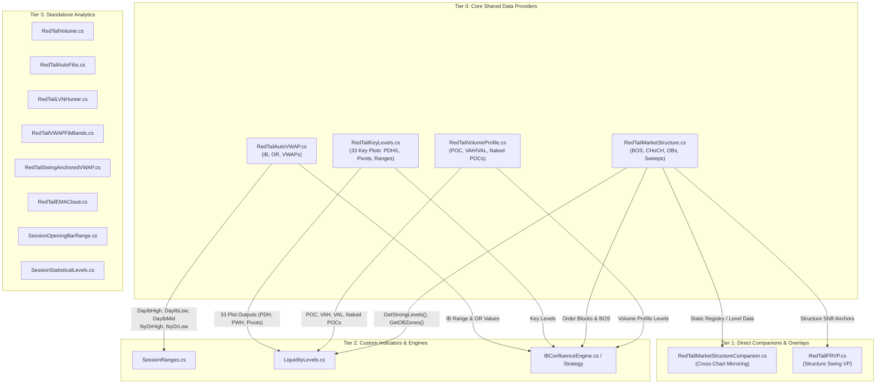

# RedTail Indicators Architecture & Dependency Reference

> **Author**: Antigravity Agent  
> **Date**: 2026-08-03  
> **Status**: Active Source-of-Truth Reference  
> **Source Directory**: [`scripts/ninjatrader/indicators/redtail/`](file:///c:/Users/vinay/tvDownloadOHLC/scripts/ninjatrader/indicators/redtail/)  

---

## 1. Overview

The **RedTail Indicator Suite** consists of 14 high-performance NinjaTrader 8 (C#) indicators developed by `3astbeast` (open-source), integrated and enhanced within this codebase. They provide institutional-grade technical analysis capabilities including:
- **Smart Money Concepts (SMC)**: Market Structure (BOS/CHoCH), Order Blocks (OBs), Liquidity Sweeps, Displacement.
- **Auction Market Theory (AMT)**: Multi-session Volume Profiles (POC, VAH/VAL, Naked POCs), Fixed Range VP (FRVP), Low Volume Nodes (LVNs).
- **Volume-Weighted Average Price (VWAP)**: Multi-timeframe VWAP (NY, Daily, Weekly, Monthly, Yearly, HOD/LOD), MIDAS VWAP, Swing-Anchored VWAP.
- **Liquidity & Range Levels**: 33 key plot levels (Pivots, PDH/PDL, PWH/PWL, PMH/PML, Monday/Globex/RTH Ranges, Opening Bar Ranges).

All RedTail indicators are maintained in [`scripts/ninjatrader/indicators/redtail/`](file:///c:/Users/vinay/tvDownloadOHLC/scripts/ninjatrader/indicators/redtail/) and automatically synced to NinjaTrader 8 (`Documents/NinjaTrader 8/bin/Custom/Indicators/RedTail/`
— its **own subfolder**, corrected 2026-08-14; syncing these to a flat `Indicators/` would have
duplicated all 14 beside the copies already deployed there, and a duplicate `.cs` fails the whole
NT8 Custom assembly) via [`sync_nt8_strategies.py`](file:///c:/Users/vinay/tvDownloadOHLC/scripts/utils/sync_nt8_strategies.py).

---

## 2. Feature Matrix (All 14 Indicators)

| # | Indicator Name & File | Primary Purpose / Core Features | Data Outputs & Public Exposure | Integration Role |
|---|---|---|---|---|
| 1 | [`RedTailAutoVWAP.cs`](file:///c:/Users/vinay/tvDownloadOHLC/scripts/ninjatrader/indicators/redtail/RedTailAutoVWAP.cs) | Multi-Timeframe VWAPs (NY, Daily, Weekly, Monthly, Yearly, HOD/LOD) + NY Opening Range (OR) + Initial Balance (IB) + VWAP Fib Bands. | **Plots**: VWAP lines. **Public C# Props**: `DayIbHigh`, `DayIbLow`, `DayIbMid`, `DayIbRange`, `DayIbComplete`, `NyOrHigh`, `NyOrLow`. | 🥇 **Foundation Provider**. Primary IB & VWAP data provider for custom indicators (`SessionRanges`, `IBConfluence`) and strategies. |
| 2 | [`RedTailMarketStructure.cs`](file:///c:/Users/vinay/tvDownloadOHLC/scripts/ninjatrader/indicators/redtail/RedTailMarketStructure.cs) | Full SMC Engine: Break of Structure (BOS), Change of Character (CHoCH), Volumized Order Blocks (ATR displacement & breaker conversion), Strong/Weak Level scoring, Liquidity Sweeps, Equal Highs/Lows. | **SharpDX Visuals**: OB Boxes, BOS lines. **Exposed Data**: `GetStrongLevels`, `GetOBZones`, static level registry. | 🥈 **SMC Engine**. Provides structural levels, order block zones, and swing data to companion indicators and strategies. |
| 3 | [`RedTailMarketStructureCompanion.cs`](file:///c:/Users/vinay/tvDownloadOHLC/scripts/ninjatrader/indicators/redtail/RedTailMarketStructureCompanion.cs) | Cross-chart level mirror companion. Renders `RedTailMarketStructure` levels onto tick, range, volume, or Renko charts. | **Render Overlay**: Mirrored OB zones and strong structure lines on non-time-based bar charts. | **Direct Companion**. Requires `RedTailMarketStructure` to be running on a primary chart. |
| 4 | [`RedTailKeyLevels.cs`](file:///c:/Users/vinay/tvDownloadOHLC/scripts/ninjatrader/indicators/redtail/RedTailKeyLevels.cs) | Multi-timeframe liquidity level & pivot aggregator (Pivots, PDH/PDL, PWH/PWL, PMH/PML, Monday/Globex/RTH Ranges, Auto Fibs). | **33 Plot Series**: `PP`, `R1-R3`, `S1-S3`, `PDH/PDL`, `PWH/PWL`, `PMH/PML`, `MH/ML`, `GH/GL`, `NYH/NYL`, `Fib1-Fib10`. | 🥉 **Liquidity Exposer**. Raw level provider for custom catalog ([`LiquidityLevelsCatalog.cs`](file:///c:/Users/vinay/tvDownloadOHLC/scripts/ninjatrader/indicators/vinay/LiquidityLevelsCatalog.cs)). |
| 5 | [`RedTailVolumeProfile.cs`](file:///c:/Users/vinay/tvDownloadOHLC/scripts/ninjatrader/indicators/redtail/RedTailVolumeProfile.cs) | Comprehensive Volume Profile suite: Session, Visible Range, Weekly, Monthly, Composite, Anchored, Naked POCs/VAHs/VALs, Overnight levels. | **Plots & Methods**: `CurrentPOCPlot`, `CurrentVAHPlot`, `CurrentVALPlot`, `PrevDayPOCPlot`, `GetWeeklyNakedPOCLevels()`, etc. | **AMT Provider**. Provides auction market value areas and naked liquidity pools. |
| 6 | [`RedTailFRVP.cs`](file:///c:/Users/vinay/tvDownloadOHLC/scripts/ninjatrader/indicators/redtail/RedTailFRVP.cs) | Standalone Fixed Range Volume Profile (FRVP) anchored to structural swings (BOS/CHoCH) with Fib overlay & K-Means clusters. | **SharpDX Visuals**: Micro volume profiles on individual swing legs. | **Target Refinement**. Provides volume profile target zones for structure breakouts and IB retests. |
| 7 | [`RedTailVolume.cs`](file:///c:/Users/vinay/tvDownloadOHLC/scripts/ninjatrader/indicators/redtail/RedTailVolume.cs) | Delta volume breakdown (Buy vs. Sell volume) with 30-day moving average and cumulative delta statistics panel. | **Plots**: `Buy Volume`, `Sell Volume`, `Volume Average`. | **Volume Filter**. Confirms order flow pressure on IB breakouts and level tests. |
| 8 | [`RedTailAutoFibs.cs`](file:///c:/Users/vinay/tvDownloadOHLC/scripts/ninjatrader/indicators/redtail/RedTailAutoFibs.cs) | Dynamic Auto-Fibonacci retracements calculated from developing High/Low across Daily, Weekly, and Monthly timeframes. | **Visual Lines**: 10 Fib retracement levels per timeframe (30 total levels). | **Fib Confluence**. Identifies Fib retracement depths (38.2%, 50%, 61.8%) across higher timeframes. |
| 9 | [`RedTailLVNHunter.cs`](file:///c:/Users/vinay/tvDownloadOHLC/scripts/ninjatrader/indicators/redtail/RedTailLVNHunter.cs) | Low Volume Node (LVN) scanner that highlights price zones of low liquidity across session or fixed-bar lookbacks. | **Visual Highlight Boxes**: LVN price intervals. | **Target/Extension**. Identifies low resistance liquidity pockets for fast price traversal. |
| 10 | [`RedTailVWAPFibBands.cs`](file:///c:/Users/vinay/tvDownloadOHLC/scripts/ninjatrader/indicators/redtail/RedTailVWAPFibBands.cs) | MIDAS VWAP with ±1σ/±2σ/±3σ standard deviation bands and fractional Fibonacci sub-bands. | **Plots**: `MIDAS`, `Upper 1-3`, `Lower 1-3`, Fib sub-band lines. | **Mean-Reversion**. Identifies VWAP extension zones and mean-reversion boundaries. |
| 11 | [`RedTailSwingAnchoredVWAP.cs`](file:///c:/Users/vinay/tvDownloadOHLC/scripts/ninjatrader/indicators/redtail/RedTailSwingAnchoredVWAP.cs) | EWMA-smoothed VWAP automatically anchored to major swing high/low pivots with ATR volatility bands. | **Plots**: `VWAP Value`, ATR volatility bands. | **Pivot Reference**. Dynamic VWAP reference point measured from key structural turning points. |
| 12 | [`RedTailEMACloud.cs`](file:///c:/Users/vinay/tvDownloadOHLC/scripts/ninjatrader/indicators/redtail/RedTailEMACloud.cs) | 5 independent moving average clouds (8/9, 5/12, 34/50, 72/89, 180/200 EMA/SMA) with cloud fill & audio alerts. | **Visual Fills**: Gradient trend clouds. | **Macro Trend Filter**. 200 EMA cloud acts as overall directional bias filter. |
| 13 | [`SessionOpeningBarRange.cs`](file:///c:/Users/vinay/tvDownloadOHLC/scripts/ninjatrader/indicators/redtail/SessionOpeningBarRange.cs) | RTH opening bar (first 1m/5m bar) High/Low/Mid plus statistical rotation & extension multiples for NY/London/Asia. | **Plots**: Opening Bar High, Low, Mid, Extension levels. | **Pre-IB Reference**. Captures immediate market opening sentiment prior to Initial Balance completion. |
| 14 | [`SessionStatisticalLevels.cs`](file:///c:/Users/vinay/tvDownloadOHLC/scripts/ninjatrader/indicators/redtail/SessionStatisticalLevels.cs) | Percentile range projections (P25, P50, P75, P90, P95) and MAE/MFE historical expectations by session. | **Visual Lines**: Session percentile projection boundaries. | **Statistical Targets**. Proportional range targets for profit target and stop placement. |

---

## 3. Dependency Network & Inter-Indicator Coupling

Understanding how indicators share data prevents breaking changes when adding features or refactoring logic.

### Dependency Categories & Data Flow Mechanics

#### A. Hard C# Dependencies (Direct Code Coupling)
* **`RedTailMarketStructureCompanion.cs` → `RedTailMarketStructure.cs`**:
  - `RedTailMarketStructureCompanion` cannot function without `RedTailMarketStructure`. It reads static level data published by `RedTailMarketStructure` to render structure zones on non-time charts (tick/range/Renko).

#### B. Public Property & Data Exposure Coupling
* **`RedTailAutoVWAP.cs` → Custom Indicators (`SessionRanges`, `IBConfluence`)**:
  - `RedTailAutoVWAP` exposes `public double DayIbHigh`, `DayIbLow`, `DayIbMid`, `DayIbRange`, `DayIbComplete`, `NyOrHigh`, `NyOrLow`.
  - When modifying `RedTailAutoVWAP.cs`, **do not alter or remove these property names**, as [`SessionRanges.cs`](file:///c:/Users/vinay/tvDownloadOHLC/scripts/ninjatrader/indicators/vinay/SessionRanges.cs) and strategy bots rely on them.

#### C. NinjaTrader Plot Series Coupling
* **`RedTailKeyLevels.cs` & `RedTailVolumeProfile.cs` → `LiquidityLevels.cs`**:
  - `RedTailKeyLevels` exposes 33 named plot series (`Pp`, `R1-R3`, `S1-S3`, `PDH`, `PDL`, `PWH`, `PWL`, etc.).
  - [`LiquidityLevelsCatalog.cs`](file:///c:/Users/vinay/tvDownloadOHLC/scripts/ninjatrader/indicators/vinay/LiquidityLevelsCatalog.cs) maps these plot names directly into a unified 52+ liquidity level catalog. Renaming plot series in `RedTailKeyLevels.cs` will break downstream liquidity level tracking.

---

## 4. Guidance for Adding Features

When adding custom features to RedTail indicators:

1. **Modifying `RedTailAutoVWAP.cs`**:
   - Keep SAPI voice alerts stubbed out (`System.Speech` references removed) to ensure standard NinjaTrader 8 compilation passes with zero errors.
   - Preserve the `[XmlIgnore] [Browsable(false)]` attributes on public exposure properties (`DayIbHigh`, etc.) so NinjaTrader serialization is unaffected.

2. **Modifying `RedTailMarketStructure.cs`**:
   - Maintain the intra-bar deduplication logic (`_earlyBullBreakIndex`, `_earlyBearBreakIndex`) when extending BOS or Order Block alerts to avoid alert spam on live tick updates.
   - Ensure changes to level registries do not break `RedTailMarketStructureCompanion.cs`.

3. **Deploying Changes**:
   - Always edit files in [`scripts/ninjatrader/indicators/redtail/`](file:///c:/Users/vinay/tvDownloadOHLC/scripts/ninjatrader/indicators/redtail/).
   - Execute [`python scripts/utils/sync_nt8_strategies.py`](file:///c:/Users/vinay/tvDownloadOHLC/scripts/utils/sync_nt8_strategies.py) to push changes to your active NinjaTrader 8 installation.

---

## 5. Related Architecture & Design Documentation

- 📘 [**IB Confluence Indicator Architecture**](file:///c:/Users/vinay/tvDownloadOHLC/docs/architecture/IB_CONFLUENCE_INDICATOR_DESIGN.md): Details the multi-indicator composition engine (RedTail + FairValueGapICT + IBConfluenceEngine).
- 📘 [**Liquidity Levels Indicator Design**](file:///c:/Users/vinay/tvDownloadOHLC/docs/architecture/LIQUIDITY_LEVELS_INDICATOR_DESIGN.md): Explains how 52+ levels are ingested from `RedTailKeyLevels`, `RedTailVolumeProfile`, and `RedTailMarketStructure`.
- 📘 [**Session Ranges Indicator Design**](file:///c:/Users/vinay/tvDownloadOHLC/docs/architecture/SESSION_RANGES_INDICATOR_DESIGN.md): Explains initial balance (IB) and session opening range (OR) integration with `RedTailAutoVWAP`.
- 📘 [**NinjaTrader File Organization**](file:///c:/Users/vinay/tvDownloadOHLC/docs/architecture/NT8_FILE_ORGANIZATION.md): Defines directory structure and source-of-truth mapping rules.
