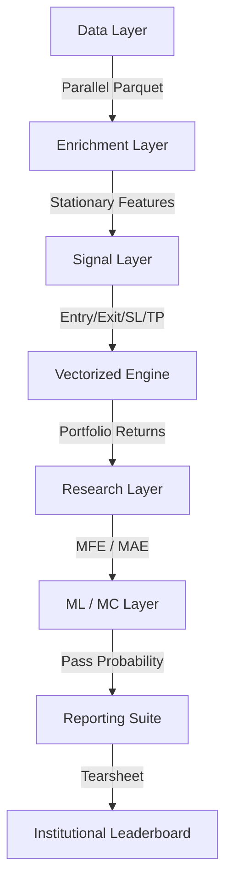

# Institutional Research Framework

## Overview
The Institutional Research Framework is a high-performance, vectorized backtesting and analytical engine designed to bridge the gap between retail strategy development and institutional standards.

It implements the **7-Layer Research Protocol** (ADR-010), ensuring that every strategy is subjected to rigorous risk grading, excursion analysis, and Monte Carlo failure testing.

## Design Philosophy
- **Performance First**: Driven by ADR-009, all data operations are vectorized (no Python loops) and parallelized. 10 years of 1m data must process in under 10 seconds.
- **Institutional Rigor**: Strategies are graded on EV, SQN, and Risk of Ruin, not just absolute P&L.
- **Strict Stationary Separation**: (ADR-008) Features are persisted to Parquet to ensure consistency between research and production.

## System Architecture

### Core Components

#### 1. FrameworkLoader (`loader.py`)
Orchestrates parallel I/O and feature synchronization. It manages the `FeatureRegistry` to ensure that required technical and session-based features are computed exactly once.

#### 2. VectorizedBacktester (`backtest_engine.py`)
A pure-NumPy execution engine that computes equity curves and trade statistics without bar-by-bar loops. It supports leverage, slippage, and cumulative return tracking.

#### 3. Research Analysis (`mfe_mae.py`)
Vectorized windowing logic for calculating Maximum Favorable/Adverse Excursions across multiple time horizons (5m, 15m, 1h, etc.).

#### 4. Institutional Grading (`tearsheet.py`)
Standardized scoring system (A-F) based on Expectancy (EV), System Quality (SQN), and Profit Factor (PF).

## Data Contracts
- **Timezone**: All internal timestamps are Naive UTC (ADR-001).
- **Normalization**: Performance is measured in % of entry price or ATR (ADR-002).
- **Sessions**: Uses the Institutional ALN window standard (ADR-004).
