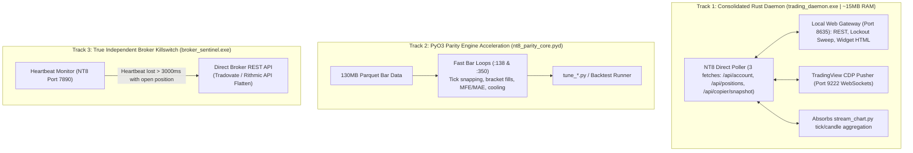

# Master Architecture: Rust Migration Plan (Empirical & Pragmatic Revision)

**Document ID:** ARCH-2026-RUST-02  
**Status:** Revised & Verified against Live System Telemetry  
**Scope:** Streamer/Widget Daemon Consolidation, PyO3 Parity Engine Acceleration, Independent Broker-API Circuit Breaker  

---

## 1. Measured Baseline vs. Architecture Realities

A review of the live process table and code telemetry revealed critical facts that shaped this revised architecture:

| Component | Claimed / Assumed | Measured Reality on Live System | Action Taken |
| :--- | :--- | :--- | :--- |
| **Node.js Daemons** | 150–300MB per server | **214 MB total** (`pnl_widget_server`: 84MB, `fj_widget_server`: 80MB). A duplicate `pnl_widget_server` was killed (-80MB). | Consolidated into single Rust daemon. |
| **Pipeline Latency** | "45–120ms, 3 hops via `ninjatrader_hub.py`" | **`ninjatrader_hub.py` is not running.** `pnl_widget_server.js` polls NT8 port 7890 directly (1 hop). | Plan corrected to reflect 1-hop topology. |
| **Options JSON Parsing** | 1,200ms–1,500ms | **67.3 ms** on an 8.4MB SPX chain (18,565 contracts). | Low priority; deferred. |
| **GEX Calculation** | 800ms $\rightarrow$ 4ms | `gex_calculator.py` is **already NumPy-vectorized** (50 bisection iters over 18k arrays). | Low priority; no rewrite of vectorized math. |
| **Trade Copier** | Proposed Rust loopback | Copier is **in-process C# inside NT8**. An external Rust copier adds 2 loopback hops and runs *after* SSE emits. | **DROPPED (Anti-pattern).** Keep C# in-process. |
| **MCP Wrappers** | Proposed Rust rewrite | `tradingview-mcp` is 11,565 LOC (97 tools) saving ~75MB. `nt-mcp` is co-located with C# to prevent contract drift. | **DROPPED.** Do not touch MCP servers. |
| **Parity Engine Loops** | Omitted in original plan | `nt8_parity_engine.py` has **two un-accelerated Python `for` loops** (`:138`, `:350`) over 130MB parquets. | **PROMOTED to Track 2 (50x–200x PyO3 win).** |

---

## 2. The 3 High-ROI Migration Tracks

---

### Track 1: Consolidated Background Daemon (`trading_daemon`)
* **Consolidates:** `pnl_widget_server.js` (84MB) + `fj_widget_server.js` (80MB) + `scripts/streaming/stream_chart.py` (312MB).
* **Net Memory Reclaimed:** **~450 MB RAM**, reducing 3 Python/Node processes to 1 native compiled binary.
* **Exact Route & Polling Topology:**
  * Polls NT8 port 7890 directly using **3 concurrent requests**:
    1. `GET /api/account` (singular!)
    2. `GET /api/positions`
    3. `GET /api/copier/snapshot` (preserves copier rows in HUD)
  * Serves full HTTP contract on port `8635`:
    * `GET /health`, `GET /api/data`, `POST /api/order/atm`, `POST /api/position/close`, `POST /api/flatten`, `GET /api/lockouts`, `GET /api/guard/config`, widget HTML.
    * Background 2.5s lockout sweep (`POST /api/lockout` to port 7890).
    * Background 30s config reload.
  * Pushes real-time HUD updates directly to TradingView CDP (port `9222`).

---

### Track 2: PyO3 Backtest & Parity Engine Inner Loops (`nt8_parity_core`)
* **Target:** `scripts/execution/nt8_parity_engine.py` (lines 138 and 350).
* **Problem:** Sequential Python `for` loops iterating bar-by-bar over hundreds of thousands of rows to simulate tick snapping, bracket execution, consecutive loss cooling, and intra-bar MFE/MAE tracking.
* **Solution:** Compile the inner simulation loop into a PyO3 Rust extension module (`nt8_parity_core.pyd`).
* **Rule:** Leave the `@njit` ICT libraries (`fvg`, `cisd`, `liquidity`, `orderblock`) untouched—they are already compiled to machine code via Numba.
* **Expected Gain:** 50x–200x faster strategy parameter sweeps (`tune_*.py`).

---

### Track 3: Independent Broker-API Circuit Breaker (`broker_sentinel`)
* **Target:** A true fail-safe against NinjaTrader UI thread deadlocks.
* **Problem:** If NT8 freezes, sending `POST /api/position/close` to port 7890 hangs because port 7890 is hosted inside the deadlocked NT8 process.
* **Solution:** A minimal watchdog that monitors port 7890:
  * If positions are open AND port 7890 fails to respond for $> 3,000$ ms:
  * Immediately issues emergency cancel/flatten requests **directly to the broker's API** (Tradovate REST `account/cancelOrders` & `order/placeOrder`).
* **Corrected Cushion Math:**
  $$\text{Cushion} = \text{Current Net Liq} - (\text{Peak Net Liq} - \text{Trailing DD Limit})$$

---

## 3. Supervised Runtime Policy

1. **Panic Strategy:** Use `panic = "unwind"` (NOT `panic = "abort"`). An unexpected panic must unwind cleanly to a supervisor thread rather than silently killing the risk watchdog.
2. **Git Hygiene:** `target/` and `*.pyd` are explicitly gitignored to prevent binary commit bloat.
