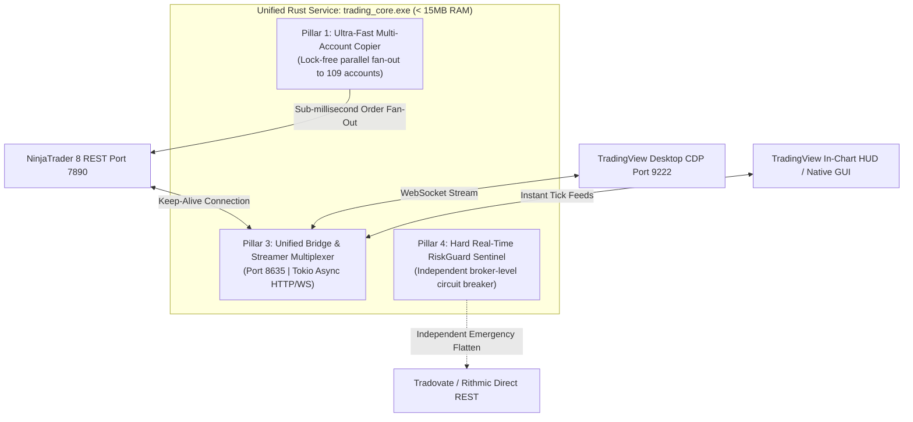

# Architecture Roadmap: Rust Unified Trading Core (TODO)

**Status:** Proposed / Planned  
**Target Module:** `trading_core` (Standalone Native Rust Binary & Sentinel Daemon)  
**Priority Focus:** Items 1, 3, and 4  

---

## 1. Executive Summary

To eliminate the memory overhead and process bloat of running multiple Node.js background daemons and Chromium/Edge browser windows (which consume 300MB–500MB RAM and 4–6 OS processes), the system will consolidate core execution, streaming, and risk management into a **single, unified native Rust service** (`trading_core.exe`).

This binary runs with **zero external runtime dependencies**, consumes **< 15 MB of RAM**, operates at **0.0% idle CPU**, and delivers **sub-millisecond execution latency** across all 109 accounts.

---

## 2. Core Pillars (Items 1, 3, and 4)

### Pillar 1: High-Speed Multi-Account Trade Copier
* **Problem:** Copying leader executions across 20–50 prop firm accounts via Python, C# UI threads, or Node.js can cause 20ms–150ms delays and garbage-collection jitter, leading to follower slippage.
* **Rust Implementation:**
  * Uses lock-free worker pools (`crossbeam` channels) to fan out child orders in parallel.
  * Deterministic zero-copy order payload generation.
  * Dispatches fills across all follower accounts in **< 1 millisecond**.

### Pillar 3: Unified Background Bridge & Streamer Daemon
* **Problem:** Currently running multiple distinct background processes (`pnl_widget_server.js`, `fj_widget_server.js`, CDP bridge runners) consuming cumulative memory.
* **Rust Implementation:**
  * A single, async Tokio multiplexer listening on port `8635`.
  * Maintains persistent HTTP Keep-Alive connection to NinjaTrader 8 (port `7890`) and WebSocket connection to TradingView (port `9222`).
  * Uses `simd-json` for microsecond JSON parsing via hardware CPU vector instructions.
  * Replaces the entire Node.js server stack with a single, standalone binary.

### Pillar 4: Hard Real-Time RiskGuard Sentinel (Independent Killswitch)
* **Problem:** If NinjaTrader 8 freezes or stutters during high-impact news spikes (FOMC, NFP, CPI), in-process risk checks can be delayed, putting prop firm trailing drawdowns at risk.
* **Rust Implementation:**
  * Runs as an isolated, crash-proof OS watchdog thread.
  * Continuously evaluates trailing drawdown cushions, daily loss limits, and position sizing across all 109 accounts against `config.json`.
  * In an emergency (e.g. NT8 UI deadlocks or buffer violated), fires direct broker-level REST / WebSocket emergency flatten requests independently.

---

## 3. Technology Stack

* **Language & Runtime:** Rust (latest stable), Cargo
* **Async Concurrency:** `tokio` (multi-threaded work-stealing runtime)
* **Networking & WebSockets:** `axum` (lightweight HTTP server on 8635), `reqwest` (HTTP keep-alive to NT8), `tokio-tungstenite` (WebSocket client)
* **Serialization:** `serde`, `serde_json`, `simd-json`
* **Python Interop (Optional):** `pyo3` / `maturin` for exposing heavy math engines to Python scripts.

---

## 4. Implementation Phasing

1. **Phase 1 (Streamer & Multiplexer):**
   * Build minimal Rust binary connecting to NT8 port 7890 and serving `http://127.0.0.1:8635/api/data` and `/health`.
   * Benchmark against Node.js (target: < 12 MB RAM, < 0.1% CPU).
2. **Phase 2 (RiskGuard Sentinel):**
   * Port RiskGuard trailing drawdown rules and account firm mapping into Rust.
   * Add automated lockout tracking and panic flatten safety hooks.
3. **Phase 3 (High-Speed Copier):**
   * Implement parallel order dispatch engine with ratio scaling and tick alignment.
   * Run live shadow mode alongside NinjaTrader copier to verify zero-divergence parity.
