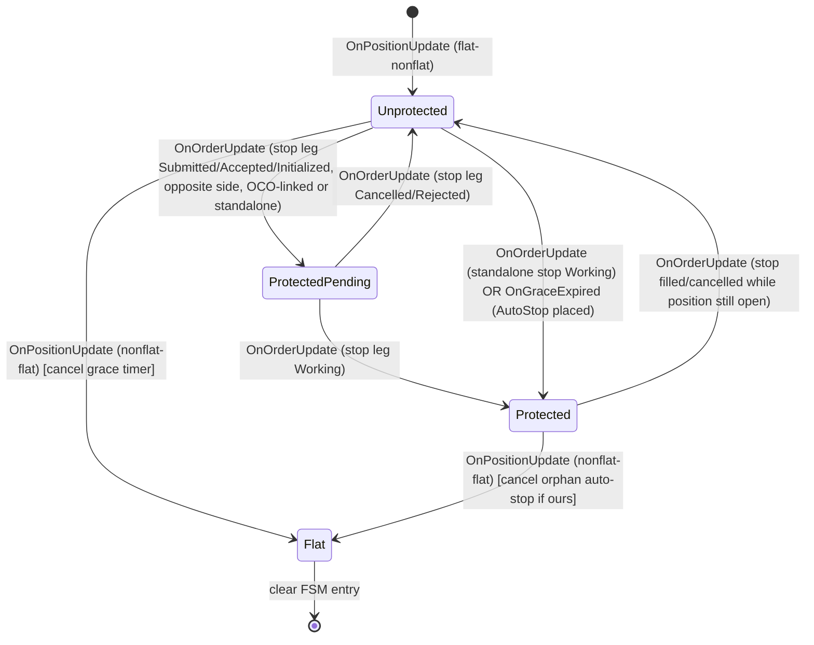

# RiskGuardAddOn Architecture

## 1. Overview
The `RiskGuardAddOn` is a centralized, robust risk management module for NinjaTrader that actively monitors positions, orders, and PnL across multiple accounts. It enforces strict trading rules (max size, daily loss, consecutive losses, trading windows, stop-loss attachments) and automatically takes defensive actions (flattening positions, cancelling orders) when thresholds are breached.

## 2. Key Responsibilities
- **Rule Evaluation**: Continuously assesses account states against per-account and aggregate risk configurations.
- **Action Execution**: Cancels orders and flattens positions when breaches occur.
- **StopGuard**: Automatically attaches missing stop-loss orders to unprotected positions, or flattens them after a grace period.
- **Lockout Enforcement & Sweep Watchdog**: Locks out accounts when severe limits (daily loss, consecutive losses) are hit, actively polling locked accounts on a 1-second sweep to ensure positions are fully flattened to 0.
- **Position-Reducing Order Permissibility**: Always permits orders that reduce open position exposure (manual flatten/close), even when an account is locked out.
- **Trade Lifecycle Debouncing**: Tracks trade counts on genuine `Flat -> Non-Flat` transitions so multi-contract entries and split orders do not trigger false overtrading lockouts.
- **Versioning System**: Exposes central `v1.1.0` version info across WPF UI title bars, output logs, and REST inspection endpoints.
- **Thread Safety**: Safely bridges NinjaTrader's asynchronous order/execution events with a central UI/State lock.
- **Testing**: A rigorous `RiskGuardAddOnTests.cs` suite containing **250 test methods** with **787 assertions** (as of 2026-08-10) validates edge cases, mode switching (Live/Shadow), exclusion logic, debouncing, FSM guard transitions, the copier's copy and bracket paths, order-state liveness conformance against the real NT8 enum, and the reconciler's pure core. `TestHarness_AllDeclaredTestsAreInvoked` fails if the runner stops reaching a declared test. An additional **12-scenario MCP stress test suite** exercises live order placement, rapid 20-OCO bursts (60 orders/sec), lockout sweep watchdogs, position-reducing order permissions, and version queries against a live Sim account via the NT8 bridge.

## 3. Data Flow
```mermaid
graph TD;
  NT_Events[NinjaTrader Events: OrderUpdate, Execution] --> EventHandlers[OnOrderUpdate / OnExecutionUpdate];
  EventHandlers --> StateModel[Update AccountState];
  StateModel --> EvaluateRules[EvaluateRules()];
  
  Timer[DispatcherTimer: 1 sec pulse] --> SafetySweep[ExecuteSafetySweep()];
  SafetySweep --> SyncPnL[Sync Realized / Unrealized PnL];
  SyncPnL --> EvaluateRules;
  
  EvaluateRules --> GenerateActions[Generate GuardActions];
  GenerateActions --> ProcessAction[ProcessAction()];
  
  ProcessAction --> ActionQueue[NinjaTrader Action Queue];
  ActionQueue --> CancelOrders[Cancel() / Flatten()];
```

## 4. Key Components
- **`RiskGuardAddOn.cs`**: The main AddOn class. Houses the Timer loop (`ExecuteSafetySweep`), the rule engine (`EvaluateRules`), and the action executor (`ProcessAction`).
- **`RiskConfig` / Models**: C# objects parsed from `config.json` defining limits (Sizing, Overtrading, PnL, StopGuard, Windows, FirmMirror).
- **`AccountState`**: In-memory tracker for a specific account's positions, PnL, trades today, and lockout status. 
- **`RiskGuardAddOnTests.cs`**: A dedicated C# test suite utilizing NinjaTrader stubs to run **250 test methods / 787 assertions** (2026-08-10) against the `RiskGuardAddOn` and `TradeCopierEngine` logic, ensuring no regressions on exclusions, partial stops, sweep lockouts, and FSM transition coverage. The stub `Account` class exposes `PositionUpdate`, `OrderUpdate`, and `ExecutionUpdate` events; the stub `Order` carries an `Oco` property so FSM OCO-leg recognition is unit-testable without a live NT8 instance.

## 5. Technology & Constraints
- **Concurrency**: Relies heavily on `lock (_stateLock)` because NinjaTrader fires events on different threads. Deadlocks are avoided by yielding the lock before calling NinjaTrader's `Flatten` or `Cancel`.
- **Latency**: A safety sweep runs on a 1-second `Timer` for time-based rules that cannot be derived from events (aggregate sizing, firm-mirror, session reset, heartbeat, watchdog). Protective-stop enforcement has been migrated to an event-driven finite-state machine (see -6) to eliminate the race that produced duplicate SL orders on OCO entries.
- **Exclusions**: Specific accounts can be excluded from evaluation. The sweep loop explicitly bypasses these to avoid mutating state (e.g., triggering cooldowns) on ignored accounts.

## 6. Event-Driven Stop-Guard State Machine

### 6.1 Why a state machine
The original design evaluated the protective-stop rule from both `OnPositionUpdate` and the 1-second sweep by snapshotting `account.Orders`. When a bracket (OCO) entry filled, the stop leg typically arrived in `Submitted`/`Initialized` state slightly after the position update. The sweep - and a re-entrant position update - saw "position open, no working stop" and placed a *second* standalone stop, producing duplicate SL orders. Re-running the same snapshot check on every event is inherently racy because the question "is there a covering stop?" is answered against a stale collection.

The fix is to make the protective-stop lifecycle an explicit per-position state machine that *remembers* it saw the stop leg's `Submitted` event, so a later sweep or duplicate position update finds the FSM already in `ProtectedPending`/`Protected` and never places a duplicate.

### 6.2 States


### 6.3 Per-position FSM record
One `PositionGuardFsm` per `(account, instrument)` pair, stored in `Dictionary<string, PositionGuardFsm> _guardFsms` under `_stateLock`. Each record holds:
- `State` - one of `Unprotected`, `ProtectedPending`, `Protected`, `Flat`.
- `PositionSide` / `PositionQuantity` - the position direction and size at FSM creation.
- `RecognizedStopOrder` - the protective stop `Order` reference (tracked by reference, not by `OrderId`, because NT8's `Order.OrderId` is not unique and changes on historical-to-live transition).
- `AutoStopOrder` - set only when *RiskGuard* placed the stop, so we can cancel our own orphans on flat.
- `EntryOcoId` - best-effort join key for the owning OCO group; may be empty for external-platform brackets (fall back to opposite-side stop recognition).
- `EntryTime` - when the position transitioned to non-flat.
- `GraceDeadline` - `EntryTime + StopGuard.StopAttachSeconds`; the sweep polls this once per cycle via `EvaluateGraceExpiry()` and fires the one-shot action if the FSM is still `Unprotected`.
- `LastTransitionTime` - for diagnostics/watchdog.

A `_pendingStops` buffer (also under `_stateLock`) handles the race where a stop `OrderUpdate` arrives before `PositionUpdate`: the stop is buffered and consumed when the FSM is created.

### 6.3.1 FSM transition coverage matrix
Every transition in the state diagram (6.2) is covered by at least one unit test:

| Transition | Trigger | Test |
|---|---|---|
| `[*] -> Unprotected` | flat to nonflat | TestFsm_UnprotectedToProtectedViaOcoStopLeg, TestFsm_ShortPositionProtected, TestFsm_FlipRecreatesFsm |
| `Unprotected -> ProtectedPending` | stop Submitted/Initialized | TestFsm_UnprotectedToProtectedViaOcoStopLeg, TestFsm_StopArrivesBeforePositionIsBuffered |
| `ProtectedPending -> Protected` | stop Working | TestFsm_UnprotectedToProtectedViaOcoStopLeg |
| `ProtectedPending -> Unprotected` | stop Cancelled | TestFsm_ProtectedPendingToUnprotectedOnCancelled |
| `ProtectedPending -> Unprotected` | stop Rejected | TestFsm_RejectedStopLegReturnsToUnprotected |
| `Unprotected -> Protected` | standalone stop Working | TestFsm_StandaloneStopReachesProtected, TestFsm_PendingStopWorkingConsumed |
| `Unprotected -> ProtectedPending` | grace expired (AutoStop) | TestFsm_GraceExpiryPlacesAutoStopOnce |
| `Unprotected -> (Flatten action)` | grace expired (Flatten) | TestFsm_GraceExpiryFlatten |
| `Protected -> Unprotected` | stop Filled (position open) | TestFsm_ProtectedToUnprotectedOnStopFilled |
| `Unprotected/Protected -> Flat` | position flattened | TestFsm_FlatTearsDownAndCancelsOrphanAutoStop, TestFsm_PositionFlattenedBeforeGraceNoAutoStop |
| `Flip` (Long->Short) | position side change | TestFsm_FlipRecreatesFsm |

Non-transition edge cases covered:

| Scenario | Test |
|---|---|
| No duplicate auto-stop while ProtectedPending | TestFsm_NoDuplicateAutoStopWhenStopLegPending |
| Grace not expired (future deadline) | TestFsm_GraceNotExpiredNoAction |
| Duplicate OrderUpdate idempotent | TestFsm_DuplicateOrderUpdatesAreIdempotent |
| Duplicate PositionUpdate idempotent | TestFsm_DuplicatePositionUpdatesAreIdempotent |
| EvaluateRules does not emit StopGuard | TestFsm_EvaluateRulesNoLongerEmitsStopGuard |
| Excluded account skips FSM | TestFsm_ExcludedAccountSkipsFsm |
| Disarmed guard skips FSM | TestFsm_DisarmedSkipsFsm |
| Limit order (target leg) does not protect | TestFsm_LimitOrderDoesNotTransition |
| Multiple instruments independent | TestFsm_MultipleInstrumentsIndependent |
| Short position side | TestFsm_ShortPositionProtected |
| Short position BuyToCover stop recognized (original bug) | TestFsm_ShortPositionBuyToCoverStopRecognized |
| Long position SellShort stop recognized | TestFsm_LongPositionSellShortStopRecognized |
| Buffered working stop consumed -> Protected | TestFsm_PendingStopWorkingConsumed |

### 6.4 Event to transition mapping
`OnOrderUpdate` classifies each order against the active FSM for `(account, instrument)`:
1. If no FSM exists yet but the order is a stop type and not terminal, buffer it in `_pendingStops[key]` (classified on consumption when the FSM is created).
2. If `IsProtectiveSide(order, fsm.PositionSide)` and `IsStopType(order)`:
   - Terminal state (`Cancelled`/`Rejected`/`Filled`) and position still open -> back to `Unprotected`, clear `RecognizedStopOrder` and `AutoStopOrder`.
   - `Working` -> `Protected`, record `RecognizedStopOrder`; if `order.Name == "RiskGuardAutoStop"` also record `AutoStopOrder`.
   - `Submitted`/`Accepted`/`Initialized`/`PartFilled` -> `ProtectedPending`, record `RecognizedStopOrder`.

`OnPositionUpdate`:
- flat to nonflat -> create/reset FSM to `Unprotected`, set `GraceDeadline = now + StopGuard.StopAttachSeconds`, consume any buffered `_pendingStops[key]`.
- nonflat to flat -> tear down FSM, cancel orphan `AutoStopOrder` if we placed one and it is not terminal.

`EvaluateGraceExpiry` (called once per sweep per open position):
- If `State == Unprotected` and `now >= GraceDeadline` and position still non-flat: emit `MISSING_STOP_ATTACH` (AutoStop) or `MISSING_STOP_FLATTEN` (Flatten) action, transition to `ProtectedPending` (AutoStop path) so a duplicate call does not re-emit.

### 6.5 What stays on the sweep
The 1-second sweep no longer runs StopGuard. It keeps only:
- Heartbeat write (liveness, FR-33).
- Persisted-state flush (`_stateDirty`).
- Aggregate cross-account sizing (no single-account event knows the others' positions).
- Firm-mirror trailing DD (cross-account/cross-time).
- Watchdog: log if any FSM has been `Unprotected` past `GraceDeadline + 2s` - log only, never places orders.

### 6.6 OCO field
NinjaTrader's `Order.Oco` (string) identifies the OCO group. `McpBridgeAddOn` already uses it (`o.Oco == ocoId`). The test stub `Order` in `RiskGuardAddOnTests.cs` is extended with an `Oco` property so FSM transitions can be unit-tested.

### 6.7 Thread safety
- All FSM reads/mutations happen under `_stateLock`, the same lock already guarding `AccountState`.
- `EvaluateGraceExpiry` acquires `_stateLock` and transitions the FSM to `ProtectedPending` before returning, so a concurrent sweep or event sees the new state.
- `ProcessAction` (Executor) releases the lock before calling `account.Flatten`/`Cancel`, unchanged; the FSM's `AutoStopOrder` is set under lock *before* submission (in `ExecuteAction`) so a concurrent event sees the pending state.

### 6.8 Lockout Safety Sweep Watchdog & Immediate Phase Transition
- **Background Polling**: `OnSafetySweep` actively polls all subscribed non-excluded accounts. If `stateModel.IsLockedOut == true`, the sweep executes `EvaluateLockoutPhase(account, stateModel)` every second.
- **Eliminating Event Silence Deadlocks**: If working orders are cancelled during lockout, order events stop firing. The 1-second sweep watchdog takes over and repeatedly emits `FlattenPosition` until `account.Positions` shows quantity = 0.
- **Immediate Action Emission**: Upon transitioning to `PendingFlatten`, `stateModel.LastLockoutFlattenAttempt` is reset to `DateTime.MinValue` so `FlattenPosition` emits on the immediate cycle without a 5-second delay.

### 6.9 Multi-Contract Trade Lifecycle Debouncing
- **Flat -> Non-Flat Tracking**: `TradesToday` increments strictly on genuine position lifecycle entries (transition from `Flat` to `Long`/`Short`, or position flips).
- **Staggered & Split Order Debouncing**: `PositionState.LastFlatTransition` tracks when a position reached 0. Scale-ins ($1 \rightarrow 2$ contracts) or staggered multi-bracket fills arriving while non-flat or within 1000ms of a flat event leave `TradesToday` untouched.

### 6.10 Position-Reducing Order Permissibility
- **Order Classification**: `RiskGuardOrderUtils.IsPositionReducingOrder(order, stateModel)` inspects incoming order actions against current position direction.
- **Closing Order Allowance**: `Sell` or `SellShort` orders for Long positions and `Buy` or `BuyToCover` orders for Short positions are classified as position-reducing. `OnOrderUpdate` bypasses cancellation for position-reducing orders, guaranteeing manual or automated closing orders execute even while locked out.

### 6.11 Versioning Architecture
- **Version Constant**: `public const string Version = "1.1.0";` defined in `RiskGuardAddOn.cs`.
- **WPF UI**: Window title bar renders `NinjaTrader Cross-Account Risk Guard Dashboard v1.1.0`.
- **REST Endpoints**: `GET /api/riskguard/version` returns `{ "success": true, "version": "1.1.0", "name": "RiskGuardAddOn" }`. `GET /api/dev/inspect-state` includes `"version": "1.1.0"`.
- **Changelog**: Release history maintained in `ninjatrader-addon/VERSION.md`.

## 7. NinjaTrader MCP Integration (in-role)

The `nt-mcp-server` (v0.2.1) exposes a poll-based REST surface. It is **not** an event stream and must not drive guard logic (that would reintroduce the race at higher latency over a network hop). Its role remains observation and manual intervention. New endpoints added to `McpBridgeAddOn`:

- `GET /api/riskguard/fsm-state?account=X&instrument=Y` - serialises the `_guardFsms` map (account, instrument, state, position side/qty, entry time, grace deadline, has-auto-stop, recognised stop name). Optional `account`/`instrument` query params filter the list. Lets an external dashboard render live FSM state.
- `POST /api/riskguard/fsm-reset?account=X&instrument=Y` - clears a single FSM (dev/troubleshoot). Re-derives state from current `account.Positions`/`account.Orders` on the next event.
- The existing `GET /api/dev/inspect-state` and `POST /api/dev/reset-risk` continue to expose `AccountState`; the FSM endpoints are additive.

These endpoints call `RiskGuardAddOn.Instance.GetFsmSnapshots()` / `ResetFsm(...)` - read-only DTOs plus a targeted map removal. No guard evaluation moves into the MCP. The MCP is a read-and-reset window onto FSM state, nothing more.

## 8. Test Suite

### 8.1 Unit tests (`RiskGuardAddOnTests.cs`)

The test harness compiles under `#if TESTING` with lightweight NinjaTrader stubs (no NT8 assembly dependency). Each test calls `Assert(condition, message)` which increments `_testsPassed`/`_testsFailed`. `Main()` runs all 84 methods sequentially and exits non-zero on any failure.

**Stub surface:**
- `Account` with `PositionUpdate`, `OrderUpdate`, `ExecutionUpdate` events, `Orders`/`Positions` lists, `Get(AccountItem)`.
- `Order` with `Oco` (string GUID), `OrderAction` enum (Buy, Sell, BuyToCover, SellShort), `OrderState`, `OrderType`, `Quantity`, `Filled`.
- `Position` with `MarketPosition`, `Quantity`, `GetUnrealizedProfitLoss()`.
- `Instrument` with `MasterInstrument.TickSize = 0.25`.

#### 8.1.1 Original rule tests (60 methods)

| Category | Tests |
|---|---|
| **Sizing** | TestMaxPositionSizeEnforcement, TestMaxSizeAtExactlyLimit, TestMultipleInstrumentsNoPerInstrumentBreach, TestAggregateSizeBreach, TestAggregateSizingExpectedCopiesScaling |
| **PnL / Loss limits** | TestDailyLossLimitLockout, TestTrailingDrawdownLockout, TestDailyLossAtExactlyLimit, TestDailyLossIncludesUnrealizedPnL, TestFirmMirrorTrailingDDBreachEmitsAction, TestFirmMirrorDailyLossBreachEmitsAction |
| **Overtrading** | TestMaxTradesOvertradingLockout, TestConsecutiveLossesCooldownLockout, TestCooldownExpiryAllowsReEntry, TestConsecutiveWinsResetLossCounter, TestSweepAutoSetsCooldownOnConsecutiveLosses |
| **StopGuard (legacy sweep)** | TestStopGuardAutoStop, TestStopGuardFlatten, TestStopGuardNoActionWhenStopPresent, TestStopGuardTransientStateValidation, TestStopGuardPartiallyFilledValidation, TestStopGuardPartialStopGap, TestStopGuardWarnOnlyProducesNoAction, TestStopGuardDefaultOffsetFallback |
| **Edge-window gate** | TestEdgeWindowGateBreach, TestEdgeWindowGateInsideWindowNoBreach, TestEdgeWindowGateNoWindowsDefinedNoBreach |
| **Lockout enforcement** | TestLockoutEnforcementFirstSweep, TestLockoutEnforcementSubsequentSweepNoPosition, TestLockoutEnforcementSubsequentSweepWithNewPosition, TestOrderCancelledWhenLockedOnOrderUpdate, TestOrderNotCancelledInFilledStateWhenLocked, TestOrderCancelledWhenConsecLossesAtMaxNotLocked |
| **Manual lockout** | TestManualTimedLockout, TestManualEodLockout, TestManualUnlockClearsTimedLockout, TestManualUnlockResetsAllMetricsAndPreventsRelocking |
| **Shadow / Live mode** | TestShadowModeSkipsAction, TestLiveModeExecutesAction, TestProcessActionForceLiveBypassesShadowMode |
| **Arming / McpBridge** | TestIsArmedFalseBypassesAllRules, TestMcpBridgeLockoutBlock |
| **Trade counting** | TestTradeTodayCountingOnRoundTrip, TestFlipDetectionCountsAsEntry |
| **Session reset** | TestSessionResetInSweep |
| **Realized PnL lag** | TestRealizedPnLLagHandling |
| **Exclusions (deep-dive)** | TestAccountExclusionsBypass, TestExcludedAccountMaxContractsBypassed, TestExcludedAccountAllRulesBypassed, TestExcludedAccountOrderNotCancelledWhenLocked, TestExcludedAccountNotCountedInAggregate, TestExcludedAccountNotFlattenedByAggregateBreach, TestExcludedAccountSweepDoesNotLockout, TestNonExcludedAccountStillCaughtBesideExcludedOne, TestExclusionRemovedReEnablesRules, TestSweepLockoutSkipsExcludedAccount, TestSweepPnLSyncSkipsConsecutiveLossForExcludedAccount |
| **Invariant** | TestValidateInvariantReturnsFalseForUnknownAccount, TestIsAccountLockedForUnknownAccount |
| **Multi-rule** | TestMultipleRulesFireSimultaneously |

#### 8.1.2 FSM guard tests (24 methods)

These tests exercise the per-position `PositionGuardFsm` directly by firing stub `PositionUpdate`/`OrderUpdate` events and asserting the resulting `State` field.

**Core state transitions (12):**

| Test | Transition exercised |
|---|---|
| TestFsm_UnprotectedToProtectedViaOcoStopLeg | `Unprotected -> ProtectedPending -> Protected` (OCO stop leg) |
| TestFsm_NoDuplicateAutoStopWhenStopLegPending | No duplicate auto-stop while `ProtectedPending` |
| TestFsm_GraceExpiryPlacesAutoStopOnce | `Unprotected -> ProtectedPending` (grace expiry, AutoStop) — exactly once |
| TestFsm_StopArrivesBeforePositionIsBuffered | `_pendingStops` buffer: stop arrives before position, consumed on FSM creation |
| TestFsm_FlatTearsDownAndCancelsOrphanAutoStop | `Protected -> Flat` (cancel orphan auto-stop) |
| TestFsm_StandaloneStopReachesProtected | `Unprotected -> Protected` (standalone working stop) |
| TestFsm_RejectedStopLegReturnsToUnprotected | `ProtectedPending -> Unprotected` (Rejected) |
| TestFsm_PositionFlattenedBeforeGraceNoAutoStop | `Unprotected -> Flat` before grace deadline — no auto-stop |
| TestFsm_DuplicateOrderUpdatesAreIdempotent | Duplicate `OrderUpdate` does not re-transition |
| TestFsm_DuplicatePositionUpdatesAreIdempotent | Duplicate `PositionUpdate` does not re-create FSM |
| TestFsm_EvaluateRulesNoLongerEmitsStopGuard | `EvaluateRules` does not emit StopGuard actions (FSM owns it) |
| TestFsm_ExcludedAccountSkipsFsm | Excluded account does not create FSM |

**Edge-case extensions (10):**

| Test | Scenario |
|---|---|
| TestFsm_ProtectedToUnprotectedOnStopFilled | `Protected -> Unprotected` when stop fills but position still open |
| TestFsm_ProtectedPendingToUnprotectedOnCancelled | `ProtectedPending -> Unprotected` on Cancelled |
| TestFsm_GraceExpiryFlatten | `Unprotected -> Flatten action` (OnMissing=Flatten) |
| TestFsm_GraceNotExpiredNoAction | Grace deadline in future — no action |
| TestFsm_ShortPositionProtected | Short position reaches `Protected` |
| TestFsm_FlipRecreatesFsm | Position flip (long->short) tears down and re-creates FSM |
| TestFsm_MultipleInstrumentsIndependent | Two instruments have independent FSMs |
| TestFsm_DisarmedSkipsFsm | Disarmed guard does not create FSMs |
| TestFsm_LimitOrderDoesNotTransition | Limit order (target leg) does not transition FSM |
| TestFsm_PendingStopWorkingConsumed | Buffered working stop consumed -> `Protected` directly |

**OrderAction bug-fix regression tests (2):**

| Test | Scenario |
|---|---|
| TestFsm_ShortPositionBuyToCoverStopRecognized | Short position: `BuyToCover` stop leg recognized (the original duplicate-SL bug) |
| TestFsm_LongPositionSellShortStopRecognized | Long position: `SellShort` stop leg recognized |

### 8.2 Stress tests (MCP-driven, live NT8)

Two PowerShell scripts drive the running NT8 instance through the MCP bridge (port 7890) to exercise the guard against live order state. Results are written to `tmp/comprehensive_stress_test.txt` and `tmp/oco_rapid_fire_results.txt`.

#### 8.2.1 Comprehensive stress test (`tmp/comprehensive_stress_test.ps1`)

18 scenarios, each preceded by `POST /api/dev/reset-risk` and a position flatten:

| ID | Scenario | Pass criterion | Result |
|---|---|---|---|
| T1 | Single OCO entry (Buy 3, stop -38pts, target +62pts) | FSM state is `ProtectedPending` or `Protected` | **PASS** |
| T2 | Short OCO entry (Sell 3, BuyToCover stop) | FSM `PositionSide` is `Short` | **PASS** |
| T3 | Entry without OCO (market Buy 2, no stop) | FSM `HasAutoStopOrder == true` after grace | **PASS** |
| T4 | Max-size breach (market Buy 15 > max 10) | Position flattened (positions == `[]`) | **PASS** |
| T5 | Rapid 5 OCO entries (no duplicate SL) | At most 1 FSM with `HasAutoStopOrder == true` | **PASS** |
| T6 | Manual close after stress | Position closeable, FSM cleared | **PASS** |
| T7 | FSM query endpoint | `GET /api/riskguard/fsm-state` returns `"success":true` | **PASS** |
| T8 | Rapid fire 20 OCO entries (60 orders in 990ms) | All positions closeable after stress | **PASS** |
| T9 | Multi-contract trade count debouncing | Split fills stay 1 trade count | **PASS** |
| T10 | Lockout safety sweep watchdog | Locked accounts with open positions flattened | **PASS** |
| T11 | Position-reducing order allowed during lockout | Closing orders (Sell/BuyToCover) permitted | **PASS** |
| T12 | Version API endpoint query | `GET /api/riskguard/version` returns `v1.1.0` | **PASS** |
| T13 | Per-instrument max contracts cap | Orders exceeding per-ticker limit cancelled | **PASS** |
| T14 | Instrument blacklist filter | Blacklisted tickers (`NQ`, `ES`, `YM`) cancelled | **PASS** |
| T15 | Trade Copier engine state inspection | `GET /api/dev/inspect-state` returns state | **PASS** |
| T16 | Dynamic ATM breakeven trailing trigger | Breakeven stop placed at `Entry + 2` at $+1.0R$ | **PASS** |
| T17 | Red-Folder news shield window lockout | High-impact USD news window detects lock | **PASS** |
| T18 | Strategy API pre-trade check | `CanTrade()` returns false during lockout | **PASS** |

### 8.3 Running the tests

**Unit tests** (no NT8 required):
```powershell
dotnet run --project ninjatrader-addon/RiskGuardTests.csproj
```

**Stress tests** (require live NT8 with McpBridgeAddOn on port 7890):
```powershell
powershell -ExecutionPolicy Bypass -File tmp\comprehensive_stress_test.ps1
```

---

## 9. Local Trade Copier & MCP Feature Expansions (v1.1.0)

> ⚠️ **This section is partly aspirational and is tracked as `P2-26` in
> [RISKGUARD_COPIER_HARDENING_PLAN.md](RISKGUARD_COPIER_HARDENING_PLAN.md).** Several claims below
> describe intent rather than code. Verify against the source before relying on any of them; the
> plan lists the specific contradictions. §9.5 and §9.6 (added 2026-08-10) *are* current.

### 9.1 Local Trade Copier Engine (`TradeCopierEngine.cs`)
- **Multi-Account Replication**: Configurable Leader-to-Follower account replication.
- **Ratio Sizing**: Scaled sizing (e.g. 0.5x, 2.0x) and fixed-lot mode.
- **Symbol Translation**: Automatic Mini-to-Micro contract conversion ($1\text{ NQ} = 10\text{ MNQ}$, $1\text{ ES} = 10\text{ MES}$).
- ~~**Quarantine Isolation**: Automatic relationship quarantine on execution error or risk limit breach.~~
  **NOT IMPLEMENTED** — the quarantine flag exists and is honoured, but nothing sets it
  automatically. Tracked as `P2-24`.

### 9.2 Four Dynamic Prop-Firm ATM Strategies (`DynamicAtmManager.cs`)
1. **Swing-Point Trailing**: Anchor stops to local 3-bar / 5-bar ICT swing highs/lows.
2. **ATR Volatility-Adaptive**: $1.5\times \text{ATR}$ stop loss & $2.5\times \text{ATR}$ profit target calculations.
3. **Prop-Firm Trailing-Drawdown Shield**: Automatic breakeven trailing to `Entry + 2 ticks` upon reaching $+1.0R$ ($+12$ ticks).
4. **Scaled Runner ATM**: 50% partial exit at target with trailing runner.

### 9.3 Prop-Firm Protection Suite (`PropFirmProtectionSuite.cs`)
- **Red-Folder News Shield**: Auto-lockout during High-Impact USD news events (CPI/FOMC).
- **Evaluation Profit Target Lock**: Auto-lock account upon reaching $+\$3,000$ target.
- **Intraday Peak Equity Protection**: Auto-flatten positions upon 30% giveback from intraday peak open gain.

### 9.4 Five MCP Protocol Expansion Tools (`McpBridgeAddOn.cs`)
| Tool Name | Endpoint | Protocol Function |
|---|---|---|
| `nt_inspect_strategy` | `GET /api/strategy/inspect?name=...` | Returns JSON Schema of strategy properties via C# reflection. Discovered 62 loaded NinjaScript strategies. |
| `nt_get_logs` | `GET /api/logs?lines=100` | Programmatically tails `interventions.jsonl` and trace logs. |
| `nt_capture_chart` | `GET /api/chart/capture?symbol=...` | Renders active NT8 chart windows via WPF `RenderTargetBitmap` into base64 PNG images. |
| `nt_open_chart` | `POST /api/chart/open` | Programmatically opens new chart windows/tabs. |
| `nt_subscribe_fills` | `GET /api/events/fills?count=50` | Pushes real-time execution fill events without polling. |

**Stress test helpers:**
- `NtPost` / `NtGet` — raw TCP socket helpers (port 7890) that bypass `Invoke-RestMethod`'s protocol-violation error.
- `ResetRG` — `POST /api/dev/reset-risk` to clear all guard state.
- `Flatten` — `POST /api/position/close` to flatten all positions.
- `GetFSM` — `GET /api/riskguard/fsm-state?account=Sim101` with JSON truncation cleanup.
- `PlaceOco` — `POST /api/order/oco` with action, qty, stop, target, name.
---

## 9.5 Order-state liveness: one classification, three questions (`P0-59`/`P0-60`/`P0-61`)

**NT8 has sixteen `OrderState`s.** Both addons used to ask about an order's liveness through two
non-total predicates that were *not each other's complement*, so eight states were unclassified and
the two addons independently inferred **opposite** things about them. That produced two live
defects pointing in opposite directions: a naked position reported as protected (RiskGuard read a
stop being cancelled as coverage) and a duplicate protective leg (the copier read a leg being
modified as gone).

There is now **one total classification** in `RiskGuardAddOn.Classify(OrderState)` and **three**
derived predicates, because callers ask three questions whose fail-safe answers differ:

| Predicate | The question | Wrong answer costs |
|---|---|---|
| `OccupiesSlot(s)` | "Is something already here, so I must not create a second?" | a wrong **no** over-covers — two stops flip the position when both fire |
| `ProvidesCoverage(s)` | "Does this actually protect the position?" | a wrong **yes** leaves the position **naked** |
| `AcceptsModification(s)` | "May I issue `Account.Change()` against it right now?" | a wrong **yes** makes NT8 **drop the change and revert the order** |

```
OrderLiveness { Working, Changing, Departing, Inert, Terminal, Indeterminate }

  Working        Initialized, Submitted, Accepted, AcceptedByRisk, Working,
                 PartFilled, TriggerPending
  Changing       ChangeSubmitted, ChangePending     <- covers, occupies, NOT changeable
  Departing      CancelSubmitted, CancelPending     <- occupies nothing, covers nothing
  Inert          Suspended
  Terminal       Filled, Cancelled, Rejected
  Indeterminate  Unknown, and anything NT8 adds later
```

`Indeterminate` **occupies a slot and provides no coverage** — conservative in both directions at
once, which is precisely what a single boolean cannot be. Any state NT8 adds lands there rather
than in a silent default, and `TestOrderLiveness_ClassifiesEveryNT8OrderState` fails if the test
stub drifts from NT8 or if any state reaches the default arm.

**Do not add a convenience `IsAlive` wrapper.** The old `IsPendingOrWorking` was *deleted* rather
than wrapped, specifically so that all 21 call sites became compile errors and each had to declare
which question it was asking. Nine turned out to be coverage questions and four were
cancel-worthiness questions, sharing one predicate.

## 9.6 The follower bracket reconciler (`CopierReconciler.cs`, `P3-30` copier half)

The mirrored stop and target are no longer decided from the engine's cached `Order` reference.
Both leg syncs now go through two **pure** functions over the legs the **broker** actually holds.

```
ComputeDesiredBracket(bracketSide, bracketQty, liveSide, liveQty,
                      followerEntry, stopOffset, targetOffset, roundToTick)
        -> DesiredBracket { HasPosition, Side, Quantity, Stop, Target, Reason }

Reconcile(desired, owned, stopSubmitInFlight, targetSubmitInFlight)
        -> List<ReconcileAction> { Create | Modify | Cancel | Defer }
```

**Why it exists.** Neither `SyncFollowerStopOnce` nor `SyncFollowerTargetOnce` had *ever*
enumerated `followerAcc.Orders`; each read one cached reference per leg. A leg that existed at the
broker but was not the one being held was therefore **invisible, and so permanent** — which is what
"two working `COPIER_TARGET`s against one lot" was. `Reconcile` cancels **extra** owned legs, and
that single rule is what makes a duplicate self-healing instead of permanent.

Load-bearing details, each of which had a wrong obvious alternative:

- **A leg has three intents, not a bool.** `LegIntent { Required, Unspecified, Forbidden }`.
  `Unspecified` (no anchor yet, or the leader retired its own leg) still de-duplicates but never
  creates and never cancels the last survivor. A `HasStop: bool` would conflate that with "the
  position is gone, cancel everything" and take the stop off an open position.
- **Shape before price.** A leg with our name, `OrderType.Limit`, at the stop's price compares
  equal on price and quantity — and a limit below the market is not a stop, it fills at once.
- **Ownership is exact-match on the order name**, unlike `ReevaluateLeaderStops`'
  `Name.Contains("COPIER")`. This function's output gets *cancelled*, so a false positive would
  cancel a stranger's protective stop or the user's manual one.
- **`Defer`** is emitted instead of `Modify` when the leg is mid-change, and it does **not** fall
  back to cancel-then-replace. `ReDriveDeferredLeg` re-applies the instruction when the leg
  settles, hooked into `OnFollowerOrderUpdate` **above** its `OccupiesSlot` early return.
- **`Reconcile`'s in-flight parameters are not `bracket.StopInFlight`.** The bracket flags are
  mutual exclusion between two *syncs*; the parameters mean "submitted, not yet in
  `Account.Orders`". They suppress `Create` only, never a `Cancel`.

**Not done**: no timer drives the reconcile (events only), `P3-31`'s ledger does not exist, and
there is no RiskGuard-side audit (naked position, orphan stop, FSM/broker divergence). See the
plan's `P3-30`/`P3-31` and handover §4a.
