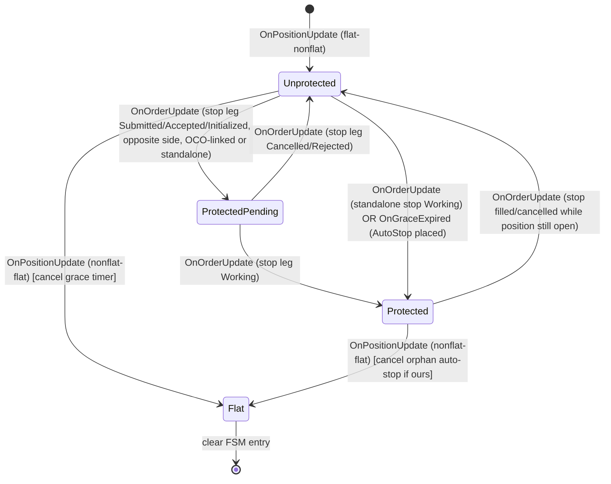

# RiskGuardAddOn Architecture

## 1. Overview
The `RiskGuardAddOn` is a centralized, robust risk management module for NinjaTrader that actively monitors positions, orders, and PnL across multiple accounts. It enforces strict trading rules (max size, daily loss, consecutive losses, trading windows, stop-loss attachments) and automatically takes defensive actions (flattening positions, cancelling orders) when thresholds are breached.

## 2. Key Responsibilities
- **Rule Evaluation**: Continuously assesses account states against per-account and aggregate risk configurations.
- **Action Execution**: Cancels orders and flattens positions when breaches occur.
- **StopGuard**: Automatically attaches missing stop-loss orders to unprotected positions, or flattens them after a grace period.
- **Lockout Enforcement**: Locks out accounts when severe limits (daily loss, consecutive losses) are hit, blocking further entry.
- **Thread Safety**: Safely bridges NinjaTrader's asynchronous order/execution events with a central UI/State lock.
- **Testing**: A rigorous `RiskGuardAddOnTests.cs` suite containing 119 unit tests (97 original + 22 FSM) validates edge cases, mode switching (Live/Shadow), exclusion logic, and the per-position guard state machine.

## 3. Data Flow
```mermaid
graph TD;
  NT_Events[NinjaTrader Events: OrderUpdate, Execution] --> EventHandlers[OnOrderUpdate / OnExecutionUpdate];
  EventHandlers --> StateModel[Update AccountState];
  StateModel --> EvaluateRules[EvaluateRules()];
  
  Timer[DispatcherTimer: 1 sec pulse] --> SafetySweep[ExecuteSafetySweep()];
  SafetySweep --> SyncPnL[Sync Realized / Unrealized PnL];
  SyncPnL --> EvaluateRules;
  
  EvaluateRules --> GenerateActions[Generate GuardActions];
  GenerateActions --> ProcessAction[ProcessAction()];
  
  ProcessAction --> ActionQueue[NinjaTrader Action Queue];
  ActionQueue --> CancelOrders[Cancel() / Flatten()];
```

## 4. Key Components
- **`RiskGuardAddOn.cs`**: The main AddOn class. Houses the Timer loop (`ExecuteSafetySweep`), the rule engine (`EvaluateRules`), and the action executor (`ProcessAction`).
- **`RiskConfig` / Models**: C# objects parsed from `config.json` defining limits (Sizing, Overtrading, PnL, StopGuard, Windows, FirmMirror).
- **`AccountState`**: In-memory tracker for a specific account's positions, PnL, trades today, and lockout status. 
- **`RiskGuardAddOnTests.cs`**: A dedicated C# test suite utilizing NinjaTrader stubs to run 119 comprehensive scenarios (97 original + 22 FSM) against the `RiskGuardAddOn` logic, ensuring no regressions on exclusions, partial stops, sweep lockouts, and FSM transition coverage.

## 5. Technology & Constraints
- **Concurrency**: Relies heavily on `lock (_stateLock)` because NinjaTrader fires events on different threads. Deadlocks are avoided by yielding the lock before calling NinjaTrader's `Flatten` or `Cancel`.
- **Latency**: A safety sweep runs on a 1-second `Timer` for time-based rules that cannot be derived from events (aggregate sizing, firm-mirror, session reset, heartbeat, watchdog). Protective-stop enforcement has been migrated to an event-driven finite-state machine (see -6) to eliminate the race that produced duplicate SL orders on OCO entries.
- **Exclusions**: Specific accounts can be excluded from evaluation. The sweep loop explicitly bypasses these to avoid mutating state (e.g., triggering cooldowns) on ignored accounts.

## 6. Event-Driven Stop-Guard State Machine

### 6.1 Why a state machine
The original design evaluated the protective-stop rule from both `OnPositionUpdate` and the 1-second sweep by snapshotting `account.Orders`. When a bracket (OCO) entry filled, the stop leg typically arrived in `Submitted`/`Initialized` state slightly after the position update. The sweep - and a re-entrant position update - saw "position open, no working stop" and placed a *second* standalone stop, producing duplicate SL orders. Re-running the same snapshot check on every event is inherently racy because the question "is there a covering stop?" is answered against a stale collection.

The fix is to make the protective-stop lifecycle an explicit per-position state machine that *remembers* it saw the stop leg's `Submitted` event, so a later sweep or duplicate position update finds the FSM already in `ProtectedPending`/`Protected` and never places a duplicate.

### 6.2 States


### 6.3 Per-position FSM record
One `PositionGuardFsm` per `(account, instrument)` pair, stored in `Dictionary<string, PositionGuardFsm> _guardFsms` under `_stateLock`. Each record holds:
- `State` - one of `Unprotected`, `ProtectedPending`, `Protected`, `Flat`.
- `PositionSide` / `PositionQuantity` - the position direction and size at FSM creation.
- `RecognizedStopOrder` - the protective stop `Order` reference (tracked by reference, not by `OrderId`, because NT8's `Order.OrderId` is not unique and changes on historical-to-live transition).
- `AutoStopOrder` - set only when *RiskGuard* placed the stop, so we can cancel our own orphans on flat.
- `EntryOcoId` - best-effort join key for the owning OCO group; may be empty for external-platform brackets (fall back to opposite-side stop recognition).
- `EntryTime` - when the position transitioned to non-flat.
- `GraceDeadline` - `EntryTime + StopGuard.StopAttachSeconds`; the sweep polls this once per cycle via `EvaluateGraceExpiry()` and fires the one-shot action if the FSM is still `Unprotected`.
- `LastTransitionTime` - for diagnostics/watchdog.

A `_pendingStops` buffer (also under `_stateLock`) handles the race where a stop `OrderUpdate` arrives before `PositionUpdate`: the stop is buffered and consumed when the FSM is created.

### 6.3.1 FSM transition coverage matrix
Every transition in the state diagram (6.2) is covered by at least one unit test:

| Transition | Trigger | Test |
|---|---|---|
| `[*] -> Unprotected` | flat to nonflat | TestFsm_UnprotectedToProtectedViaOcoStopLeg, TestFsm_ShortPositionProtected, TestFsm_FlipRecreatesFsm |
| `Unprotected -> ProtectedPending` | stop Submitted/Initialized | TestFsm_UnprotectedToProtectedViaOcoStopLeg, TestFsm_StopArrivesBeforePositionIsBuffered |
| `ProtectedPending -> Protected` | stop Working | TestFsm_UnprotectedToProtectedViaOcoStopLeg |
| `ProtectedPending -> Unprotected` | stop Cancelled | TestFsm_ProtectedPendingToUnprotectedOnCancelled |
| `ProtectedPending -> Unprotected` | stop Rejected | TestFsm_RejectedStopLegReturnsToUnprotected |
| `Unprotected -> Protected` | standalone stop Working | TestFsm_StandaloneStopReachesProtected, TestFsm_PendingStopWorkingConsumed |
| `Unprotected -> ProtectedPending` | grace expired (AutoStop) | TestFsm_GraceExpiryPlacesAutoStopOnce |
| `Unprotected -> (Flatten action)` | grace expired (Flatten) | TestFsm_GraceExpiryFlatten |
| `Protected -> Unprotected` | stop Filled (position open) | TestFsm_ProtectedToUnprotectedOnStopFilled |
| `Unprotected/Protected -> Flat` | position flattened | TestFsm_FlatTearsDownAndCancelsOrphanAutoStop, TestFsm_PositionFlattenedBeforeGraceNoAutoStop |
| `Flip` (Long->Short) | position side change | TestFsm_FlipRecreatesFsm |

Non-transition edge cases covered:

| Scenario | Test |
|---|---|
| No duplicate auto-stop while ProtectedPending | TestFsm_NoDuplicateAutoStopWhenStopLegPending |
| Grace not expired (future deadline) | TestFsm_GraceNotExpiredNoAction |
| Duplicate OrderUpdate idempotent | TestFsm_DuplicateOrderUpdatesAreIdempotent |
| Duplicate PositionUpdate idempotent | TestFsm_DuplicatePositionUpdatesAreIdempotent |
| EvaluateRules does not emit StopGuard | TestFsm_EvaluateRulesNoLongerEmitsStopGuard |
| Excluded account skips FSM | TestFsm_ExcludedAccountSkipsFsm |
| Disarmed guard skips FSM | TestFsm_DisarmedSkipsFsm |
| Limit order (target leg) does not protect | TestFsm_LimitOrderDoesNotTransition |
| Multiple instruments independent | TestFsm_MultipleInstrumentsIndependent |
| Short position side | TestFsm_ShortPositionProtected |

### 6.4 Event to transition mapping
`OnOrderUpdate` classifies each order against the active FSM for `(account, instrument)`:
1. If no FSM exists yet but the order is a stop type and not terminal, buffer it in `_pendingStops[key]` (classified on consumption when the FSM is created).
2. If `IsProtectiveSide(order, fsm.PositionSide)` and `IsStopType(order)`:
   - Terminal state (`Cancelled`/`Rejected`/`Filled`) and position still open -> back to `Unprotected`, clear `RecognizedStopOrder` and `AutoStopOrder`.
   - `Working` -> `Protected`, record `RecognizedStopOrder`; if `order.Name == "RiskGuardAutoStop"` also record `AutoStopOrder`.
   - `Submitted`/`Accepted`/`Initialized`/`PartFilled` -> `ProtectedPending`, record `RecognizedStopOrder`.

`OnPositionUpdate`:
- flat to nonflat -> create/reset FSM to `Unprotected`, set `GraceDeadline = now + StopGuard.StopAttachSeconds`, consume any buffered `_pendingStops[key]`.
- nonflat to flat -> tear down FSM, cancel orphan `AutoStopOrder` if we placed one and it is not terminal.

`EvaluateGraceExpiry` (called once per sweep per open position):
- If `State == Unprotected` and `now >= GraceDeadline` and position still non-flat: emit `MISSING_STOP_ATTACH` (AutoStop) or `MISSING_STOP_FLATTEN` (Flatten) action, transition to `ProtectedPending` (AutoStop path) so a duplicate call does not re-emit.

### 6.5 What stays on the sweep
The 1-second sweep no longer runs StopGuard. It keeps only:
- Heartbeat write (liveness, FR-33).
- Persisted-state flush (`_stateDirty`).
- Aggregate cross-account sizing (no single-account event knows the others' positions).
- Firm-mirror trailing DD (cross-account/cross-time).
- Watchdog: log if any FSM has been `Unprotected` past `GraceDeadline + 2s` - log only, never places orders.

### 6.6 OCO field
NinjaTrader's `Order.Oco` (string) identifies the OCO group. `McpBridgeAddOn` already uses it (`o.Oco == ocoId`). The test stub `Order` in `RiskGuardAddOnTests.cs` is extended with an `Oco` property so FSM transitions can be unit-tested.

### 6.7 Thread safety
- All FSM reads/mutations happen under `_stateLock`, the same lock already guarding `AccountState`.
- `EvaluateGraceExpiry` acquires `_stateLock` and transitions the FSM to `ProtectedPending` before returning, so a concurrent sweep or event sees the new state.
- `ProcessAction` (Executor) releases the lock before calling `account.Flatten`/`Cancel`, unchanged; the FSM's `AutoStopOrder` is set under lock *before* submission (in `ExecuteAction`) so a concurrent event sees the pending state.

## 7. NinjaTrader MCP Integration (in-role)

The `nt-mcp-server` (v0.2.1) exposes a poll-based REST surface. It is **not** an event stream and must not drive guard logic (that would reintroduce the race at higher latency over a network hop). Its role remains observation and manual intervention. New endpoints added to `McpBridgeAddOn`:

- `GET /api/riskguard/fsm-state?account=X&instrument=Y` - serialises the `_guardFsms` map (account, instrument, state, position side/qty, entry time, grace deadline, has-auto-stop, recognised stop name). Optional `account`/`instrument` query params filter the list. Lets an external dashboard render live FSM state.
- `POST /api/riskguard/fsm-reset?account=X&instrument=Y` - clears a single FSM (dev/troubleshoot). Re-derives state from current `account.Positions`/`account.Orders` on the next event.
- The existing `GET /api/dev/inspect-state` and `POST /api/dev/reset-risk` continue to expose `AccountState`; the FSM endpoints are additive.

These endpoints call `RiskGuardAddOn.Instance.GetFsmSnapshots()` / `ResetFsm(...)` - read-only DTOs plus a targeted map removal. No guard evaluation moves into the MCP. The MCP is a read-and-reset window onto FSM state, nothing more.