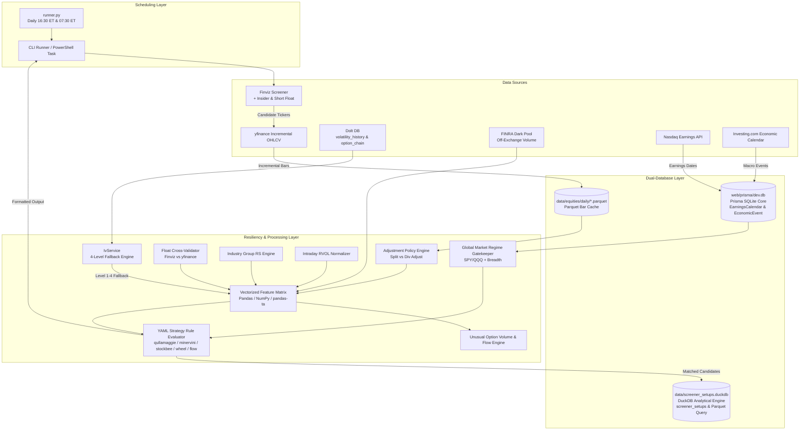

# Stock & Options Screener Engine Architecture (`trade_screener`)

**Document Version**: 1.5.0  
**Status**: Active  
**Location**: `docs/architecture/STOCK_SCREENER_ENGINE_ARCHITECTURE.md`  

---

## 1. Overview

The `trade_screener` engine provides systematic, multi-framework stock and options screening for US equities. It bridges real-time market data providers (Finviz, yfinance, Nasdaq Earnings API, Investing.com) and the local **Dolt Volatility Database** (`data/options/options`) into a unified, vectorized feature engine. Daily OHLCV price histories are incrementally cached in **Parquet files** (`data/equities/daily/*.parquet`) and queried via **DuckDB** (`scripts/edgeful/data_loader.py` pattern).

---

## 2. Dual-Database Role Alignment

| Database System | Location / Driver | Primary Purpose | Screener Role | Access Pattern |
| :--- | :--- | :--- | :--- | :--- |
| **Prisma SQLite Core** | `web/prisma/dev.db` (Prisma Client) | Relational application state, accounts, playbooks, trade plans, and calendar metadata. | Stores **`EarningsCalendar`** & **`EconomicEvent`** single source of truth. | Python (`from prisma import Prisma`) & Next.js UI. |
| **DuckDB Analytical Engine** | `data/screener_setups.duckdb` (`duckdb` python package & DuckDB-WASM) | High-speed analytical OLAP queries over Parquet data & setup logs. | Stores **`screener_setups`** table & queries `data/equities/daily/*.parquet`. | Python (`import duckdb`) & Web UI (`web/lib/duckdb.ts`). |

---

## 3. Dependencies & Pre-Installed Stack

| Package | Status in Repo | Purpose |
| :--- | :--- | :--- |
| **`duckdb`** | **Already Installed & Active** | Used in `scripts/edgeful/data_loader.py` & `web/lib/duckdb.ts` |
| **`yfinance`** | **Already Installed & Active** | Vectorized daily bar downloader & options parser |
| **`requests` / `httpx`** | **Already Installed & Active** | API fetching for Nasdaq & Investing.com |
| **`pyarrow`** | **Already Installed & Active** | Parquet file I/O engine |
| **`finvizfinance`** | Needed (`pip install finvizfinance`) | Top-of-funnel Finviz query wrapper |
| **`pandas-ta`** | Needed (`pip install pandas-ta`) | Vectorized technical indicator calculations |
| **`pyyaml`** | Needed (`pip install pyyaml`) | Strategy YAML config loader |

---

## 4. Rate Limitations & Error Handling Matrix

| Component | Target Provider | Rate Limit / Risk | Mitigation & Retry Strategy | Fallback Protocol |
| :--- | :--- | :--- | :--- | :--- |
| **Stage 1 Funnel** | Finviz (`finvizfinance`) | IP throttling / HTTP 429 on $>20$ rapid requests. | Single aggregated filter query; **1.5s delay** between pages; Desktop User-Agent header. | Fall back to local S&P 500 / Nasdaq 100 / Russell 1000 constituent universe file. |
| **Stage 2 Data** | Yahoo Finance (`yfinance`) | Sequential queries cause HTTP 429 rate limit. | **Multi-threaded vector batch download** (`yf.download()`) in **1 single network call**; 3-retry exponential backoff. | Use local Parquet bar cache (`data/equities/daily/*.parquet`). |
| **Earnings Sync** | Nasdaq Earnings API | Rejects requests missing browser headers. | Custom headers (`User-Agent`, `Origin`, `Accept`); **1.0s delay** between dates. | Fall back to `yfinance.Calendars()`. |
| **Volatility** | Dolt DB (`IvService`) | Query subprocess timeout ($>10\text{s}$). | 10s timeout on `dolt sql` subprocess; 4-level fallback order. | Fall back to benchmark proxy $\rightarrow$ yfinance option chain $\rightarrow$ soft `None`. |
| **Strategy Engine**| YAML Evaluator | Corrupted ticker or missing data column. | Ticker-level `try/except` insulation; log errors to `screener_errors.log`. | Non-blocking execution; skip single ticker and continue processing universe. |

---

## 5. System Architecture & Data Flow

