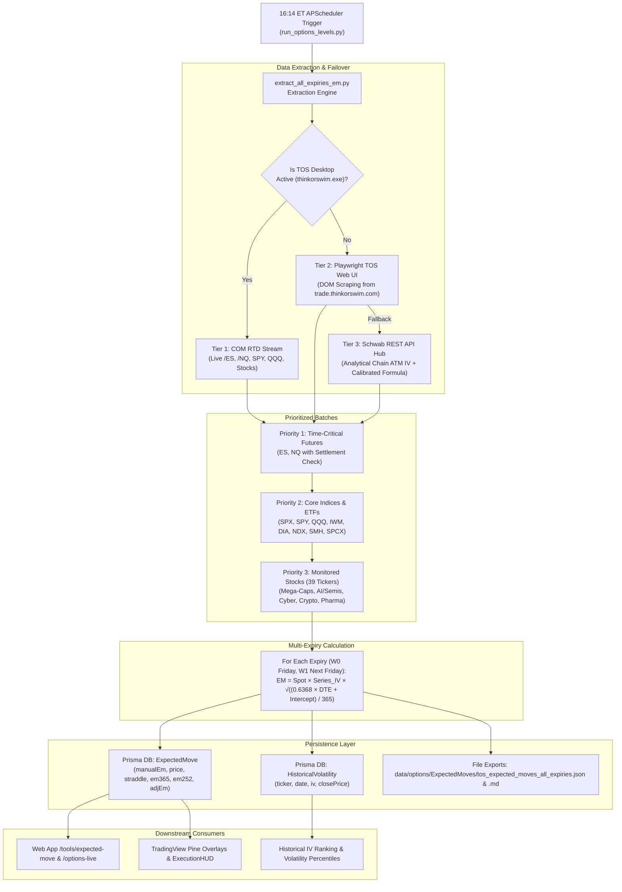

# TOS Expected Move & Historical IV Pipeline — Technical Design

**Feature:** Daily Multi-Expiry ThinkorSwim Expected Move & Historical Volatility Extraction Engine  
**Version:** 2.0 (Prioritized Universe, Settlement Validation, SQLite/Prisma Persistence, 16:14 ET Scheduler)  
**Status:** Active / Production Ready  
**Last Updated:** 2026-08-14  

---

## 1. Executive Summary & Objective

The ThinkorSwim (TOS) Multi-Expiry Expected Move Pipeline is the authoritative system responsible for capturing, calculating, and persisting daily closing Expected Move (EM) levels and Implied Volatility (IV) metrics across futures, broad-market index ETFs, and key single-name stocks.

Unlike traditional textbook calculators that assume naive annualized volatility ($\text{Spot} \times \text{IV} \times \sqrt{\text{DTE}/365}$), this pipeline enforces ThinkorSwim's empirically calibrated time-scaling model ($0.6368 \times \text{DTE} + \text{Intercept}$) to achieve 100% parity with the ThinkorSwim platform.

It runs automatically every trading day at **16:14 ET** (immediately following the 16:00 cash close and 16:05–16:15 futures settlement window) and persists all levels to the SQLite database (`web/prisma/dev.db`) non-destructively, preserving prior days' levels as active Support/Resistance (S/R) references.

---

## 2. Architecture & Data Flow



---

## 3. Ticker Universe & Execution Prioritization

To ensure time-critical futures levels are locked in before after-hours trading liquidity shifts, tickers are executed in explicit priority batches:

### Priority 1: Time-Critical Equity Futures (Run First @ 16:14 ET)
* **Tickers:** `ES` (`/ES:XCME`), `NQ` (`/NQ:XCME`)
* **Settlement Check:** Verifies that the closing settlement price is locked ($> 0$). If pending, performs a 60-second polling retry.

### Priority 2: Core Indices & Broad ETFs
* **Tickers:** `SPX`, `SPY`, `QQQ`, `IWM`, `DIA`, `NDX`, `SMH`, `SPCX`

### Priority 3: Monitored Stock Universe (39 Tickers)
* **Mega-Cap Tech & Enterprise:** `AAPL`, `MSFT`, `NVDA`, `AMZN`, `GOOGL`, `META`, `TSLA`, `AVGO`, `CSCO`, `ORCL`
* **AI, Semiconductors & Memory:** `AMD`, `TSM`, `ARM`, `MRVL`, `MU`, `QCOM`, `INTC`, `ASML`, `LRCX`, `AMAT`, `SKHY`, `SNDK`
* **AI Infrastructure & Hardware:** `DELL`, `VRT`, `ANET`
* **Cybersecurity & Enterprise SaaS:** `PLTR`, `CRWD`, `PANW`, `SNOW`, `NET`, `DDOG`, `MDB`, `NOW`
* **Crypto & FinTech Leaders:** `MSTR`, `COIN`, `HOOD`, `SOFI`
* **Healthcare & Pharma:** `LLY`, `NVO`

---

## 4. Mathematical Model & Calibration

ThinkorSwim evaluates expected moves using a proprietary calendar-weighting curve rather than simple square-root of time:

$$\text{EM}_{\text{TOS}} = \text{Spot} \times \text{Series IV} \times \sqrt{\frac{0.6368 \times \text{DTE} + \text{Intercept}}{365}}$$

### Intercept Constants:
* **Equities & ETFs:** $\text{Intercept} = 0.2400$
* **Futures (/ES, /NQ):** $\text{Intercept} = 0.6900$ (Includes the $+0.45$ Sunday overnight trading variance bonus)

### Multi-Expiry Scope:
* Focuses on weekly Friday expirations:
  * **$W_0$ (Current Week Friday):** 0DTE on Fridays, or front weekly expiry mid-week.
  * **$W_1$ (Next Week Friday):** 7DTE on Fridays, or second weekly expiry mid-week.

---

## 5. Database Schema & Persistence Contract

Data is stored directly in SQLite (`web/prisma/dev.db`) using non-destructive upsert patterns:

### 1. `ExpectedMove` Table
```prisma
model ExpectedMove {
  id              Int      @id @default(autoincrement())
  ticker          String
  calculationDate DateTime // Truncated to 00:00:00 UTC epoch ms
  expiryDate      DateTime // Target expiration epoch ms
  price           Float    // Closing/settlement spot price
  straddle        Float    // ATM straddle cost (Call Mark + Put Mark)
  em365           Float    // Textbook Price * IV * sqrt(DTE/365)
  em252           Float    // Textbook Price * IV * sqrt(DTE/252)
  adjEm           Float    // 0.85 * Straddle
  manualEm        Float?   // <--- Authoritative TOS Calibrated Expected Move
  basis           String?
  note            String?  // Data source (e.g. "ThinkorSwim Desktop Application (COM RTD Stream)")
  createdAt       DateTime @default(now())
  updatedAt       DateTime @updatedAt

  @@unique([ticker, calculationDate, expiryDate])
  @@index([ticker])
}
```

* **S/R Level Preservation:** Because the unique constraint is `[ticker, calculationDate, expiryDate]`, each day's 16:14 ET run generates a **new row** for that date. Monday's, Tuesday's, and Wednesday's levels are preserved across the entire week, allowing traders and web views to track how price interacts with the established weekly Expected Move bounds.

### 2. `HistoricalVolatility` Table
```prisma
model HistoricalVolatility {
  id         Int      @id @default(autoincrement())
  ticker     String
  date       DateTime // Calculation date epoch ms
  iv         Float    // Closing ATM Series Implied Volatility (%)
  hv         Float?   // Historical Realized Volatility
  closePrice Float?   // Closing spot price
  createdAt  DateTime @default(now())
  updatedAt  DateTime @updatedAt

  @@unique([ticker, date])
  @@index([ticker])
}
```

* **Historical IV Logging:** Automatically builds an immutable daily IV dataset for every tracked ticker, enabling downstream IV Rank, IV Percentile, and IV vs HV statistical models.

---

## 6. Integration with the Web App & Downstream Systems

1. **Web App (`/tools/expected-move` & `/options-live`):**
   * [`web/lib/options-live-v3/adapters.ts`](file:///c:/Users/vinay/tvDownloadOHLC/web/lib/options-live-v3/adapters.ts) reads `row.manualEm` with highest priority:
     ```typescript
     const width = (isPositiveFinite(row.manualEm) ? row.manualEm : null) ?? ...
     ```
   * Displays the exact TOS Expected Move on all charts without requiring on-demand web calculations.
2. **Pine Script & Discord Overlays:**
   * Downstream scripts ingest `data/options/ExpectedMoves/tos_expected_moves_all_expiries.json` to generate formatted Pine Script input bands (`ExecutionHUD.pine`, `MacroDealerLevels.pine`).

---

## 7. Operational Runbook & CLI Usage

### Manual CLI Execution:
```bash
# Run full universe (49 tickers) with DB persistence and file exports
.\.venv\Scripts\python.exe scripts/market_data/extract_all_expiries_em.py

# Run specific tickers only
.\.venv\Scripts\python.exe scripts/market_data/extract_all_expiries_em.py --ticker ES --ticker NQ --ticker NVDA

# Dry-run without saving to database or files
.\.venv\Scripts\python.exe scripts/market_data/extract_all_expiries_em.py --no-db --no-save
```

### Automated Scheduler:
* Managed in [`scripts/streaming/options/run_options_levels.py`](file:///c:/Users/vinay/tvDownloadOHLC/scripts/streaming/options/run_options_levels.py):
  * **Job ID:** `daily_multi_expiry_tos_em`
  * **Trigger:** `CronTrigger(day_of_week='mon-fri', hour=16, minute=14, timezone=tz)`
  * **Misfire Grace:** 300 seconds
  * **Process Timeout:** 600 seconds
