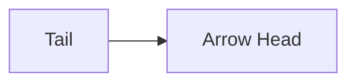

# Arrow Architecture

## 1. Overview
The `Arrow` utility draws a directed line segment with an arrowhead at the second point.

## 2. Key Responsibilities
- **Directional Rendering**: Calculates the angle of the line to position and rotate the arrowhead correctly.
- **Geometric Calculation**: Computes arrowhead vertices (triangle) relative to the line slope.

## 3. Key Components
- **ArrowRenderer**: Specialized logic for drawing the head (polygons).

## 4. Diagram

