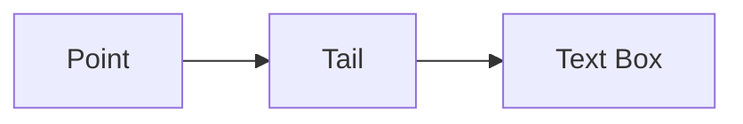

# Callout Architecture

## 1. Overview
The `Callout` tool combines a text box with a pointer (anchor) that identifies a specific point on the chart.

## 2. Key Responsibilities
- **Anchor Relationship**: Maintains a flexible distance between the anchor point and the text box.
- **Dynamic Pointer**: Renders a tail/pointer from the box to the anchor point.

## 3. Diagram

