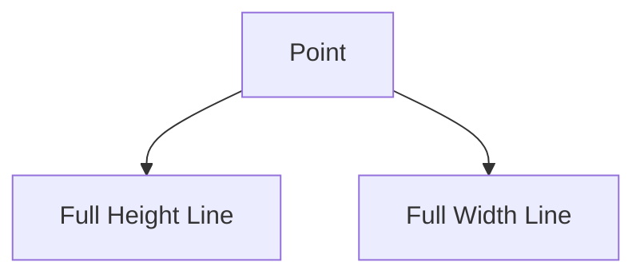

# CrossLine Architecture

## 1. Overview
A `CrossLine` draws both a horizontal and a vertical line intersecting at a single point, effectively marking a coordinate.

## 2. Key Responsibilities
- **Dual Axis Tracking**: Manages a single point but generates two perpendicular lines.
- **Positioning**: Intuitive marking of specific price-time confluence.

## 3. Key Components
- **CrossLineV2**: Delegates rendering to both vertical and horizontal logic.

## 4. Diagram

