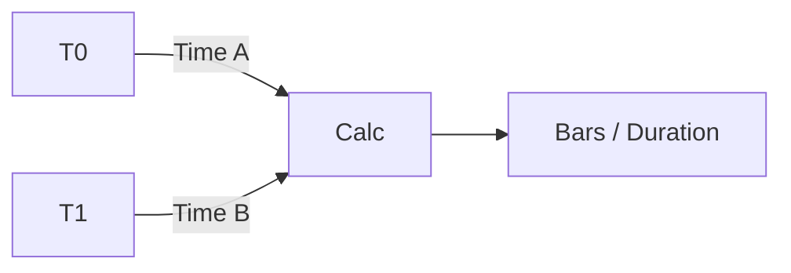

# DateRange Architecture

## 1. Overview
The `DateRange` utility measures the horizontal distance (time/bars) between two points.

## 2. Key Responsibilities
- **Bar Counting**: Calculates the number of bars between two logical indices.
- **Temporal Calculation**: Displays duration in hours/days.

## 3. Diagram

