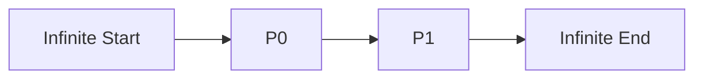

# ExtendedLine Architecture

## 1. Overview
The `ExtendedLine` draws a line that passing through two points and extends infinitely in both directions.

## 2. Key Responsibilities
- **Bi-Directional Extension**: Calculates infinite projection in both directions based on two anchor points.
- **Rendering**: Draws a line spanning the entire screen width/height based on its slope.

## 3. Data Flow
[P0, P1] -> [Slope Calculation] -> [Intersection Logic] -> [Renderer]

## 4. Key Components
- **ExtendedLineRenderer**: Handles complexity of drawing lines that project beyond the visible pane.

## 5. Diagram

