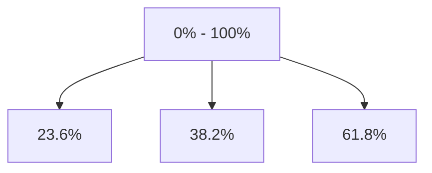

# Fibonacci Architecture

## 1. Overview
The `Fibonacci` (Retracement) tool projects horizontal levels based on Fibonacci ratios between two points.

## 2. Key Responsibilities
- **Ratio Projection**: Calculates levels (0, 0.236, 0.382, 0.5, 0.618, 0.786, 1, etc.) relative to the 0-100% range defined by the points.
- **Extended Lines**: Optionally extends level lines across the pane.

## 3. Diagram

