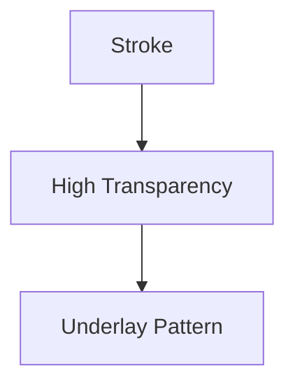

# Highlighter Architecture

## 1. Overview
The `Highlighter` is a variant of the Brush tool with high transparency and thicker strokes, used to emphasize chart areas.

## 2. Key Responsibilities
- **Semi-transparent Fill**: Renders utilizing high alpha transparency to allow underlying price data to remain visible.
- **Layering**: Typically rendered in the background of other drawings.

## 3. Diagram

