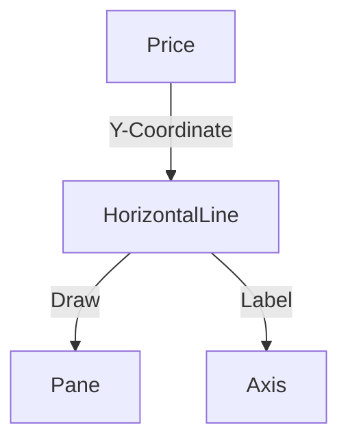

# HorizontalLine Architecture

## 1. Overview
A `HorizontalLine` represents a single price level extending across the entire width of the chart.

## 2. Key Responsibilities
- **Price Tracking**: Anchors to a single price coordinate.
- **Full Width**: Ensures the line always spans the visible horizontal range.
- **Labeling**: Optionally displays the price on the Y-axis.

## 3. Data Flow
[Price] -> [HorizontalLineV2] -> [Renderer] -> [Axis View]

## 4. Key Components
- **HorizontalLineV2**: Manages the single price point.
- **PriceAxisView**: Renders the price label on the axis.

## 5. Technology & Constraints
- **Responsiveness**: Must update instantly on price scale changes.

## 6. Diagram

