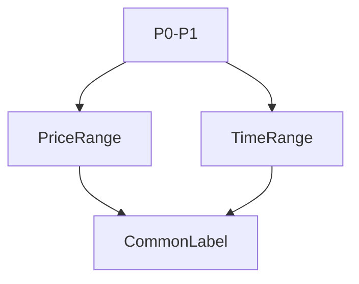

# Measure Architecture

## 1. Overview
The `Measure` tool combines price and date range measurement into a single two-point utility.

## 2. Key Responsibilities
- **Dual Axis Stats**: Simultaneously calculates price change, percentage, bar count, and time duration.
- **Visualization**: Draws a diagonal line with a shaded rectangle area.

## 3. Diagram

