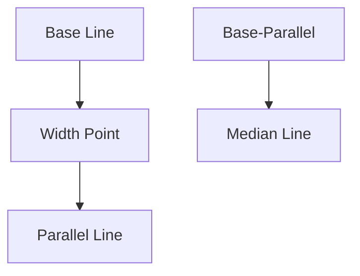

# ParallelChannel Architecture

## 1. Overview
The `ParallelChannel` consists of three points: two defining the primary trend line (base) and a third defining the width of the parallel channel.

## 2. Key Responsibilities
- **Parallel Geometry**: Ensures the second line remains strictly parallel to the base line.
- **Mid-line Generation**: Automatically calculates and renders the median line of the channel.

## 3. Diagram

