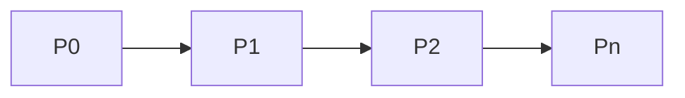

# Path Architecture

## 1. Overview
The `Path` utility is a multi-segment line tool used for custom markings.

## 2. Key Responsibilities
- **Dynamic Point Addition**: Grows the points array based on user clicks or movements.
- **Path Closure**: Can optionally close the path into a polygon.

## 3. Diagram

