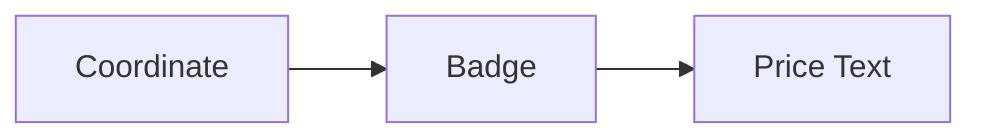

# PriceLabel Architecture

## 1. Overview
The `PriceLabel` utility marks a specific price point with a label that often includes an arrow or a badge.

## 2. Key Responsibilities
- **Price Pinning**: Strictly tied to a price level.
- **Visibility**: Ensures the label remains legible against the background.

## 3. Diagram

