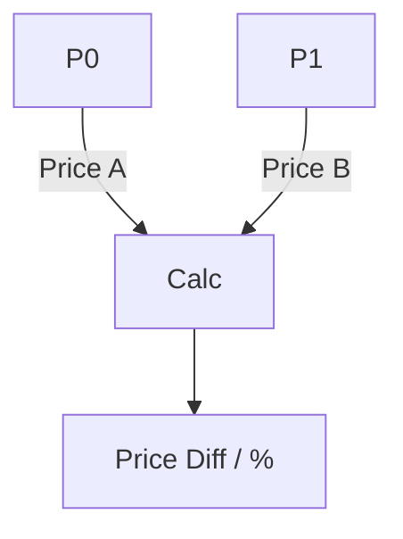

# PriceRange Architecture

## 1. Overview
The `PriceRange` utility measures the vertical distance (price) between two points and displays the difference in absolute terms and percentage.

## 2. Key Responsibilities
- **Range Calculation**: Computes `abs(P1.price - P0.price)` and percentage change.
- **Bounded Rendering**: Displays a shaded region Between the two price levels.

## 3. Diagram

