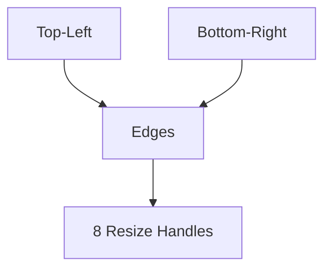

# Rectangle Architecture

## 1. Overview
The `Rectangle` utility allows users to define a rectangular area on the chart using two corner points.

## 2. Key Responsibilities
- **8-Point Interaction**: Provides 4 corner handles and 4 mid-edge handles for comprehensive resizing.
- **Fill & Border**: Renders a customizable background and stroke.
- **Text Support**: Supports internal text labels with horizontal and vertical alignment.

## 3. Key Components
- **RectangleV2**: Manages the two points and virtualizes the 8-point handle logic.
- **RectangleRenderer**: Draws the box and its fill.
- **TextRenderer**: Renders the internal label.

## 4. Diagram

