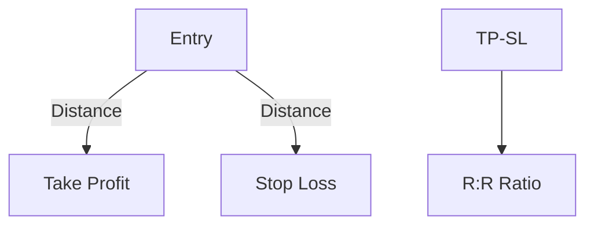

# RiskReward Architecture

## 1. Overview
The `RiskReward` tool allows traders to visualize potential profit (target) and loss (stop) relative to an entry price.

## 2. Key Responsibilities
- **Triple-level Tracking**: Manages Stop Loss, Entry, and Take Profit levels.
- **Ratio Calculation**: Automatically computes the Risk/Reward ratio.
- **PnL Simulation**: Displays potential gain/loss in price and percentage.

## 3. Diagram

