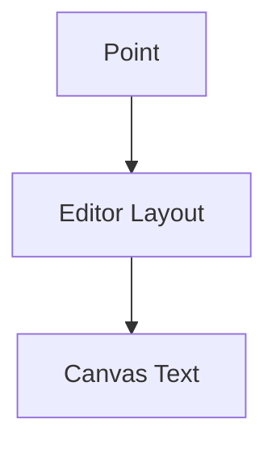

# Text Architecture

## 1. Overview
The `Text` utility places a text label at a specific coordinate on the chart.

## 2. Key Responsibilities
- **Multi-line Support**: Renders text with word wrapping or manual breaks.
- **Editing**: Supports inline text editing on double-click.
- **Styling**: Customizable fonts, colors, backgrounds, and borders.

## 3. Key Components
- **TextV2**: Model class.
- **TextRenderer**: Core rendering logic for bounded text.

## 4. Diagram

