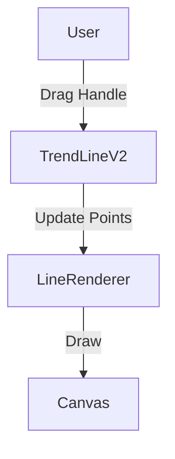

# TrendLine Architecture

## 1. Overview
The `TrendLine` utility allows users to draw a simple line segment between two specified points on the chart. It is a fundamental drawing tool used for technical analysis to identify trends and levels.

## 2. Key Responsibilities
- **Coordinate Mapping**: Converts two logical points (timestamp, price) into screen coordinates.
- **Rendering**: Draws a line segment between the two points using the Canvas API.
- **Interaction**: Provides two handles (one at each end) for resizing and supports dragging the entire line.
- **Styling**: Supports customizable line color, width, and style (solid, dotted, dashed).

## 3. Data Flow
[User Input] -> [InteractionManager] -> [TrendLineV2] -> [TrendLineRenderer] -> [Canvas]

## 4. Key Components
- **TrendLineV2**: The main model class managing points and options.
- **LineRenderer**: Responsible for the visual output on the pane.
- **LineAnchorRenderer**: Manages the two interactive endpoint handles.

## 5. Technology & Constraints
- **Dependencies**: Lightweight Charts `ISeriesPrimitive`.
- **Performance**: Optimized for continuous updates during drag operations.

## 6. Interaction Diagram

