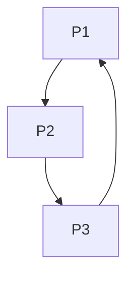

# Triangle Architecture

## 1. Overview
The `Triangle` utility allows users to define a three-point polygon area.

## 2. Key Responsibilities
- **Multi-point State**: Manages exactly 3 points.
- **Polygon Rendering**: Draws the closed path between all points.

## 3. Diagram

