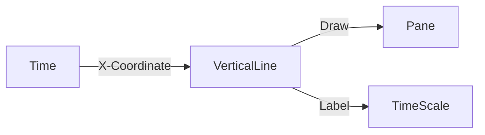

# VerticalLine Architecture

## 1. Overview
A `VerticalLine` represents a specific moment in time, extending across the entire height of the chart.

## 2. Key Responsibilities
- **Time Tracking**: Anchors to a single timestamp or logical index.
- **Full Height**: Spans the entire vertical height of the pane.
- **Labeling**: Optionally displays the time/date on the X-axis.

## 3. Data Flow
[Time] -> [VerticalLineV2] -> [Renderer] -> [Time Axis View]

## 4. Key Components
- **VerticalLineV2**: Manages the temporal anchor point.
- **TimeAxisView**: Renders the date/time label.

## 5. Diagram

