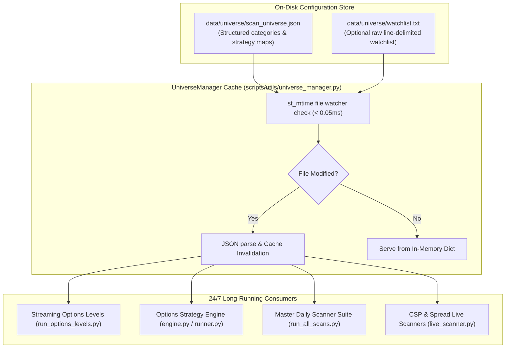

# Dynamic Universe Management & Zero-Restart Hot-Reloading Architecture

This document describes the zero-restart dynamic universe configuration system enabling continuous 24/7 background daemons, options level streaming, and strategy engine execution without restarting Python processes upon watchlist updates.

---

## 1. Problem Statement & Design Requirements

In long-running quantitative execution and options market pipelines:
* WebSocket connections to broker gateways (Schwab Hub, RTD, Interactive Brokers) must maintain continuous streaming state.
* Restarting scripts to update a ticker list disrupts in-flight orders, drops intraday bar buffers, and resets GEX anchor states.
* **Requirement**: The system must allow modifying active symbols, strategy assignments, and scanner targets directly on disk (or via CLI) and have running engines dynamically ingest changes in $< 1\text{ ms}$ with zero process interruption.

---

## 2. Architecture & File Structure



---

## 3. Configuration Store (`data/universe/scan_universe.json`)

The central store organizes symbols into explicit, hot-reloadable functional domains:

```json
{
  "active_options_tickers": [
    "SPX", "SPY", "NDX", "QQQ", "NQ", "ES", "IWM", "DIA", 
    "AAPL", "MSFT", "NVDA", "TSLA", "META", "GOOGL", "AMZN", "AVGO",
    "BE", "AXTI", "ALAB", "COHR", "SMCI", "TEM", "BB", "RIVN"
  ],
  "priority_options_tickers": [
    "SPX", "SPY", "QQQ", "NQ", "ES"
  ],
  "strategy_engine_tickers": {
    "wheel": ["NVDA", "TSLA", "AAPL", "GOOGL", "MSFT", "AMZN", "BE", "AXTI"],
    "income_cc": ["GOOGL", "TSLA", "RIVN", "NVDA"],
    "ben_csp": ["BE", "AXTI", "NBIS", "ALAB", "COHR", "SMCI", "TEM", "BB"],
    "ben_spread": ["BE", "AXTI", "NBIS", "ALAB", "COHR", "SMCI", "TEM", "BB"],
    "zero_dte_pcs": ["SPY", "SPX"],
    "long_dte_credit": ["SPY", "NVDA", "TSLA", "IWM", "BE", "ALAB"],
    "earnings_strangle": ["NVDA", "TSLA", "AAPL", "GOOGL"]
  },
  "csp_universe": [
    "BE", "AXTI", "SMCI", "NBIS", "ALAB", "COHR", "BB", "TEM", "PURR", 
    "CRCL", "CRDO", "DELL", "HPE", "PATH", "DOCN", "LQDA", "CART", "KLAC", 
    "OSCR", "PLTR", "ARM", "RIVN", "SOFI", "AFRM", "HOOD", "MARA", "RIOT", 
    "COIN", "DKNG", "CELH", "SYM", "IONQ", "APP", "DUOL", "ASTS", "RDDT"
  ],
  "momentum_universe": [
    "NVDA", "TSLA", "AAPL", "MSFT", "AMZN", "GOOGL", "META", "AVGO", "AMD", 
    "NFLX", "PLTR", "ARM", "SMCI", "APP", "ASTS", "RDDT", "CAVA", "TEM"
  ]
}
```

---

## 4. CLI & Management Utility

You can view, add, or remove tickers live via the CLI tool:

```bash
# 1. Summary Overview
python -m scripts.utils.universe_manager

# 2. List Category or Strategy Tickers
python -m scripts.utils.universe_manager --list csp
python -m scripts.utils.universe_manager --list strategy:wheel

# 3. Add Symbols Dynamically
python -m scripts.utils.universe_manager --add CRWD --category csp
python -m scripts.utils.universe_manager --add BE --strategy wheel

# 4. Remove Symbols Dynamically
python -m scripts.utils.universe_manager --remove XYZ --category csp
```

---

## 5. Python API Usage in Code

Any script or module can import accessor functions that automatically check file modification timestamps:

```python
from scripts.utils.universe_manager import (
    get_active_options_tickers,
    get_priority_options_tickers,
    get_strategy_tickers,
    get_universe,
)

# In live execution loop:
active_tickers = get_active_options_tickers() # Auto-updates if scan_universe.json was edited!
csp_targets = get_universe("csp")
wheel_stocks = get_strategy_tickers("wheel")
```
