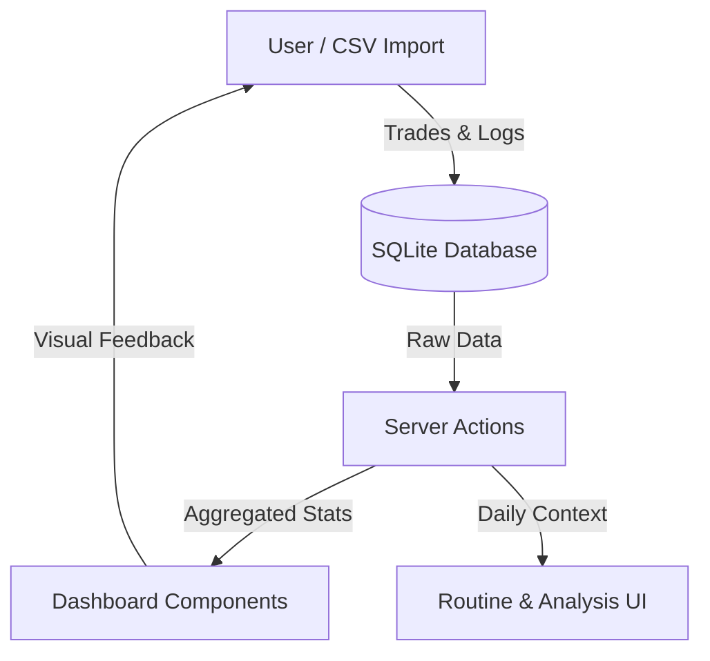

# Unified Trading Journal Architecture

## 1. Overview

The Unified Trading Journal is a comprehensive system designed to track trades, analyze performance, and foster disciplined routines. It integrates execution data, psychological metrics, and process compliance into a single "Cockpit" dashboard.

## 2. Key Responsibilities

- **Data Ingestion**: Importing trades from various brokers (TopstepX, TradingView, Tradovate).
- **Performance Analytics**: Calculating Win Rate, P&L, Profit Factor, and Equity Curves.
- **Process Tracking**: Logging Daily Analysis, Wargaming scenarios, and Routine compliance.
- **Visual Library**: Storing and tagging Chart screenshots for historical review.

## 3. Data Flow

## 4. Key Components

### Backend (Server Actions)

- **`journal-actions.ts`**: Core logic for fetching aggregated stats (Win Rate, P&L) and Equity Curve data.
- **`csv-actions.ts`**: Handles parsing of broker CSV files and normalization into the `Trade` model.
- **`routine-actions.ts`**: Manages the "Ralph Loop" features (Daily Analysis, Wargaming, Routine Checking).
- **`trade-actions.ts`**: CRUD operations for individual trades and manual entry.

### Database Models (Prisma)

- **`Trade`**: The central atom. Linked to `Account`, `Strategy`, and `Playbook`.
- **`Analysis`**: Stores the "Story of the Day" (Sentiment, Bias, Notes) and Tool Snapshots.
- **`Wargame`**: "If/Then" scenarios linked to an Analysis.
- **`Routine`**: Daily checklist performance and grading.
- **`Chart`**: A polymorphic image library linked to Trades, Wargames, or Analysis.

### Frontend (Components)

- **`JournalDashboard`**: The main entry point. Orchestrates the "Cockpit" view.
- **`StatsCards`**: Reusable scorecards for key metrics.
- **`DailyRoutine`**: A tabbed interface for Context, Wargaming, and Review (Phase 3).
- **`ChartLibrary`**: A grid/gallery view for historical chart review (Phase 3).

## 5. Technology & Constraints

- **Framework**: Next.js 14 (App Router) for server-side rendering and actions.
- **Database**: SQLite (via Prisma) for local-first, zero-latency performance.
- **UI**: Shadcn/UI + TailwindCSS for a professional, "Financial Terminal" aesthetic.
- **Charts**: Recharts for data visualization.
