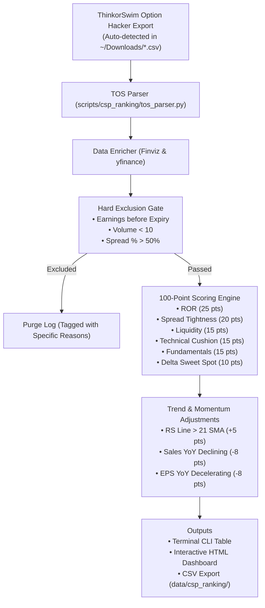

# Cash-Secured Put (CSP) Automated Ranking & Scoring System

Based on the quantitative methodology by **Ben (@PatternProfits)**.

* [📖 ThinkorSwim Scan Setup & Parameter Guide](file:///c:/Users/vinay/tvDownloadOHLC/docs/csp_ranking/tos_scan_setup.md)
* [💰 Capital Requirements, Leverage & Assignment Guide](file:///c:/Users/vinay/tvDownloadOHLC/docs/csp_ranking/capital_leverage_and_assignment.md)
* [⚡ Ben Bennett Velocity & Focus List Scanner Guide](file:///c:/Users/vinay/tvDownloadOHLC/docs/screener/ben_velocity_and_focus_list.md)
* [🎯 Covered Call & LEAPS / PMCC Income Engine](file:///c:/Users/vinay/tvDownloadOHLC/docs/screener/options_income_scanners.md)
* [🌐 Dynamic Universe Hot-Reloading Architecture](file:///c:/Users/vinay/tvDownloadOHLC/docs/architecture/dynamic_universe_hot_reloading.md)
* [🚀 Master Daily Scanner Suite (All Scans in 1)](file:///c:/Users/vinay/tvDownloadOHLC/docs/screener/README.md)
* [🚀 Launch Script](file:///c:/Users/vinay/tvDownloadOHLC/launch/run_csp_scanner.ps1)

---

## 🎯 Architecture & Workflow



---

## 🚀 Execution Modes

### 1. Mode A: Run with your ThinkorSwim CSV Export (Default)
Export your scan to `Downloads` $\rightarrow$ double-click [`launch/run_csp_scanner.bat`](file:///c:/Users/vinay/tvDownloadOHLC/launch/run_csp_scanner.bat) or run:
```powershell
.\launch\run_csp_scanner.ps1
```

### 2. Mode B: Run via Charles Schwab Trader API
Queries live option chains directly through your Schwab developer keys:
```powershell
.\launch\run_csp_scanner.ps1 --schwab
```

### 3. Mode C: 100% Standalone Autonomous Scan (No TOS / No Keys Needed)
Runs live market options scan, calculates Black-Scholes Greeks, and scores candidates:
```powershell
.\launch\run_csp_scanner.ps1 --live
```

---

## 📊 100-Point Scoring Model Breakdown

| Metric | Max Pts | Criteria / Scaling |
| :--- | :---: | :--- |
| **Return on Risk (ROR)** | **25 pts** | $\ge 30\%$ Ann. ROR = 25 pts, $25-30\%$ = 22 pts, $20-25\%$ = 19 pts, $15-20\%$ = 15 pts, $10-15\%$ = 10 pts |
| **Spread Tightness** | **20 pts** | $\le 8\%$ Spread = 20 pts, $\le 15\%$ = 16 pts, $\le 25\%$ = 12 pts, $\le 35\%$ = 8 pts, $\le 50\%$ = 4 pts |
| **Liquidity** | **15 pts** | Vol $\ge 100$ = 15 pts, $\ge 50$ = 12 pts, $\ge 25$ = 9 pts, $\ge 10$ = 6 pts |
| **Technical Cushion** | **15 pts** | $\ge 15\%$ OTM = 8 pts, Strike below 50 SMA = +4 pts, Strike below 200 SMA / 20d Low = +3 pts |
| **Fundamentals** | **15 pts** | Profitable P/E = 5 pts, Sales Q/Q $> 15\%$ = 5 pts ($> 0\%$ = 3 pts), EPS Q/Q $> 20\%$ = 5 pts |
| **Delta Safety** | **10 pts** | $|\Delta| \in [0.12, 0.18]$ = 10 pts, $|\Delta| \in [0.08, 0.22]$ = 8 pts, $|\Delta| \in (0.22, 0.28]$ = 5 pts |
| **Total Base Score** | **100 pts** | **Quantitative Foundation** |

### Momentum & Growth Adjustments
- 📈 **RS Line > 21-day SMA**: `+5 pts` (Stock outperforming SPY benchmark)
- 📉 **Revenue Declining YoY/QoQ**: `-8 pts` (Fundamental headwind)
- 📉 **EPS Decelerating YoY/QoQ**: `-8 pts` (Earnings momentum slowing)

---

## 🛑 Hard Exclusion Filters
Contracts failing any of these rules are **immediately purged** before scoring:
1. **Earnings Overlap**: `Today <= Earnings Date <= Expiration Date` (Eliminates binary crush risk).
2. **Low Volume**: `Volume < 10` contracts (Eliminates untradeable ghost strikes).
3. **Wide Spread**: `(Ask - Bid) / Mid > 50%` (Eliminates excessive execution slippage).
4. **Low Bid**: `Bid <= $0.05`.
