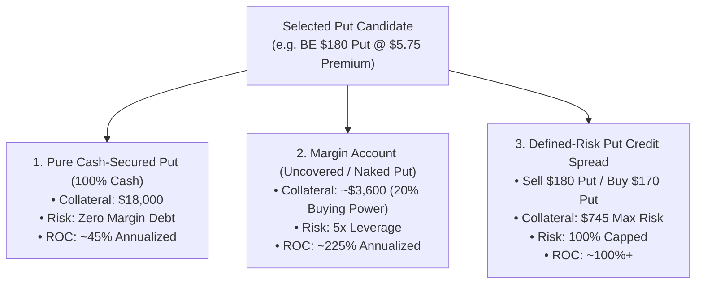

# Capital Requirements, Leverage & Assignment Guide for Cash-Secured Puts

This guide explains the capital requirements, margin/leverage alternatives, exact assignment mechanics, and institutional risk management rules when trading the Cash-Secured Put (CSP) strategy.

---

## 💰 1. Capital Requirements: Cash vs. Leverage vs. Spreads



### Side-by-Side Comparison

| Feature | Cash-Secured Put (Cash/IRA) | Margin Account (Uncovered Put) | Defined-Risk Put Credit Spread |
| :--- | :--- | :--- | :--- |
| **Capital Required** | **100% of Strike $\times$ 100** | **$\sim 20\%$ of Stock Price $\times$ 100** | **(Spread Width $\times$ 100) $-$ Credit** |
| **`BE` \$180 Put Example** | **\$18,000** | **\$3,600** | **\$745** (\$10 spread) |
| **`ALAB` \$260 Put Example** | **\$26,000** | **\$5,200** | **\$900** (\$15 spread) |
| **`AXTI` \$50 Put Example** | **\$5,000** | **\$1,000** | **\$295** (\$5 spread) |
| **`BB` \$7 Put Example** | **\$700** | **\$140** | **\$82** (\$1 spread) |
| **Risk Profile** | Max loss = Strike $-$ Premium | Leveraged loss if stock crashes | Strictly capped at collateral |
| **Account Type** | Cash, IRA, Margin | Standard Margin (Reg-T / Portfolio) | Margin / Level 3 Options |
| **Return on Capital (ROC)**| $25\% - 50\%$ Annualized | $150\% - 250\%$ Annualized | $80\% - 150\%$ on risk |

---

## ⚖️ 2. How Margin & Leverage Work for Puts

In a standard **Reg-T Margin account**, you do not lock up the full cash value of the shares. Instead, the broker requires a **Buying Power Reduction (BPR)** calculated as the greater of:

1. **Standard Formula**:
   $$\text{BPR} = (20\% \times \text{Underlying Price} - \text{OTM Amount} + \text{Premium}) \times 100$$
2. **Minimum Floor Formula**:
   $$\text{BPR Floor} = (10\% \times \text{Strike Price} + \text{Premium}) \times 100$$

> **Example on `BE` (\$206.30 Stock Price, \$180 Put @ \$5.75)**:
> * 20% of stock = $\$41.26$
> * OTM amount = $\$206.30 - \$180.00 = \$26.30$
> * Margin per share = $\$41.26 - \$26.30 + \$5.75 = \mathbf{\$20.71}$
> * Total margin locked up = $\mathbf{\$2,071}$ to control 100 shares of a \$20,630 position.

---

## 🎯 3. What Happens During Assignment?

Options are assigned only when the stock closes **in-the-money (ITM)** at expiration (i.e. stock price is below your strike price).

### A. Cash-Secured Put Assignment (Fully Funded)
1. If `BE` closes at **\$175.00** at expiration (below your \$180.00 strike):
   * Your \$18,000 cash collateral is automatically used to purchase **100 shares of `BE` at \$180.00**.
2. **Net Discounted Cost Basis**:
   $$\text{Net Cost Basis} = \text{Strike Price} - \text{Premium Collected} = \$180.00 - \$5.75 = \mathbf{\$174.25}$$
   *Even though the stock is at \$175, your position is essentially break-even because of the \$5.75 premium you collected upfront.*
3. **The Wheel Transition (Covered Call Selling)**:
   * You now own 100 shares of an institutional-growth leader at a discount.
   * On Monday, sell a **Covered Call** (e.g. 30 DTE \$185.00 Call for \$4.50 premium).
   * If assigned again on the Call, you lock in capital gains + double premium collection.

---

### B. Margin Account Assignment (Leveraged)
1. **If your account has sufficient equity/cash**: You acquire 100 shares on margin. You only pay standard margin interest on the borrowed portion until you deposit cash or sell covered calls/shares.
2. **If the assignment exceeds your account limits**: The broker issues a **Margin Call**. You can either deposit funds or sell the 100 shares on Monday morning to realize the net difference.

---

## 🛡️ 4. Institutional Risk Management & Defense Rules

Professional options traders use two core rules to avoid unwanted assignments:

```mermaid
flowchart LR
    A["Active Put Position"] --> B{"50% Profit Reached?<br/>(e.g. $5.75 -> $2.85)"}
    B -->|YES (Usually in 10-14 days)| C["RULE 1: Buy to Close (BTC)<br/>Lock profit & recycle capital"]
    B -->|NO| D{"Stock Approaching Strike<br/>at 10-14 DTE?"}
    D -->|YES| E["RULE 2: Roll Down & Out<br/>Buy back current put & sell next month for net credit"]
    D -->|NO| F["Hold to Expiration / 100% decay"]
```

### Rule 1: The 50% Max Profit Take (Recycle Capital)
* Place a Good-'Til-Cancelled (GTC) limit order to **Buy to Close (BTC) at 50% of the initial premium collected**.
* *Example*: If you sold `BE` \$180 Put for **\$5.75**, set your BTC limit at **\$2.85**.
* *Why*: Over 80% of winning CSP trades hit 50% profit within the first 10–14 days. Taking profit early dramatically increases annualized Return on Capital and frees up cash to enter the next top-ranked candidate.

### Rule 2: Rolling "Down and Out" for a Net Credit
* If the underlying stock drops toward your strike and reaches **10–14 DTE**:
  1. Buy back the current expiring put.
  2. Sell the next monthly expiration at a **lower strike price** for a **net credit**.
* *Example*: Buy to close Sep \$180 Put for \$6.00, sell Oct \$170 Put for \$7.50 $\to$ **Net Credit of +\$1.50**, lowering your strike by \$10 and giving the trade another 30 days to recover.
