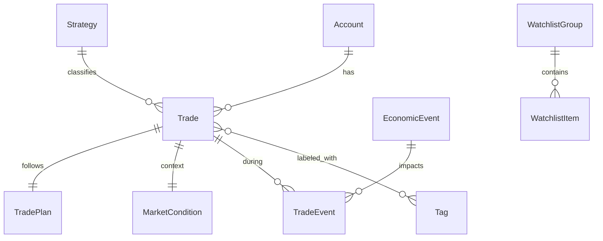

# Database Schema Documentation

This document describes the data models stored in the application database (SQLite via Prisma).

## Overview

The database serves two primary purposes:
1.  **User Data**: Persistence for the Trading Journal (Trades, Accounts, Strategies).
2.  **Market Data Cache**: Storage for slow-moving or relational market data (News, Calendar, Volatility).

**Schema File**: `web/prisma/schema.prisma`

---

## 1. User Domain

Models related to the user's trading activity. Detailed architecture in [JOURNAL_TECHNICAL.md](../features/journal/JOURNAL_TECHNICAL.md).

### Core Entities
*   **Account**: Trading accounts (Sim, Live, Funded).
*   **Strategy**: Trading strategies for tagging trades.
*   **Trade**: The central record. Contains execution details, P&L, and links to context.
*   **Journal**: Daily summary/mood entries.

### Classification
*   **Tag / TagGroup**: Flexible tagging system (e.g., "Mistake: FOMO").
*   **Watchlist / WatchlistGroup**: User-defined symbol lists.

---

## 2. Market Data Domain

Models that cache external data to reduce API dependency and enable relational queries.

### Volatility & Expected Move
*   **ExpectedMove**: Calculated daily ranges based on IV/Straddle.
    *   *Key Fields*: `straddle`, `em365`, `em252`, `expiryDate`.
*   **ExpectedMoveHistory**: Historical log of EM values for analysis.
*   **HistoricalVolatility**: Log of IV vs HV over time.
*   **RthExpectedMove**: Intraday EM captured specifically at RTH Open (09:30).

### External Context
*   **EconomicEvent**: Calendar data (CPI, NFP).
    *   *Source*: Economic Calendar Script.
    *   *Relation*: Linked to `Trade` via `TradeEvent`.
*   **MarketNews**: News headlines fetched from Yahoo Finance/Benzinga.
    *   *Source*: `yahoo-finance.ts`.

### Authentication
*   **SchwabToken**: Stores OAuth tokens for the Schwab API streamer.

---

## 3. Relationships Diagram



## 4. Maintenance

### Migrations
We use Prisma Migrate to handle schema changes.
```bash
npx prisma migrate dev --name <change_description>
```

### Seeding
Default data (Accounts, Strategies) is loaded via:
```bash
npx prisma db seed
```
