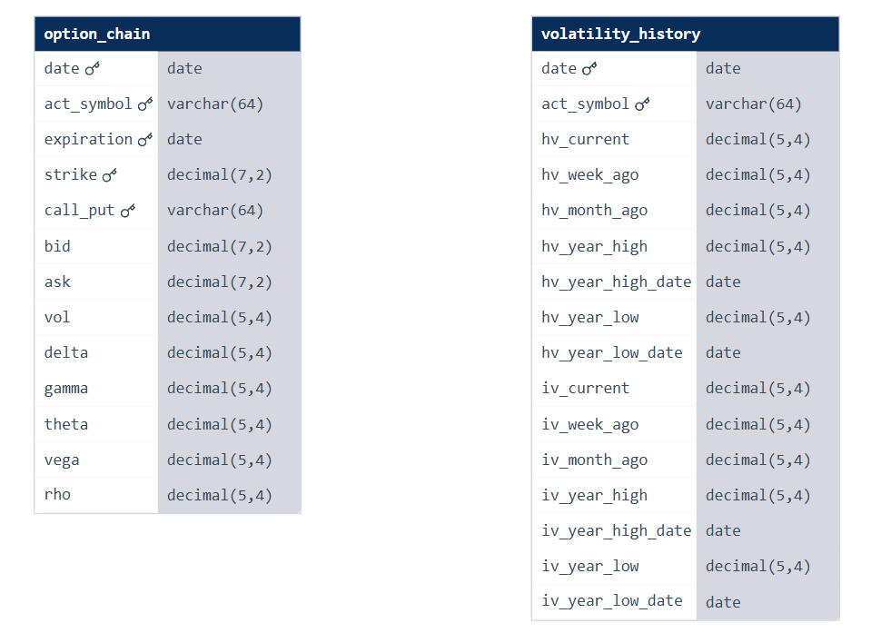

# Options Database Documentation

**Version:** 1.0.0
**Last Updated:** December 26, 2025

This document describes the Dolt options database, its tables, useful SQL queries, and scheduled data update scripts.

---

## 1. Database Overview

**Database:** Dolt (git-like SQL database)
**Location:** `data/options/options/`
**Source:** [post-no-preference/options](https://www.dolthub.com/repositories/post-no-preference/options) on DoltHub

### Tables

| Table | Description | Records | Date Range |
|:---|:---|:---|:---|
| `option_chain` | Full options chain data (all strikes, expirations) | ~180M+ rows | Feb 2019 - Dec 2025 |
| `volatility_history` | IV/HV history for all optionable symbols | ~3M rows | Feb 2019 - Dec 2025 |

### ER Diagram



---

## 2. Table Schemas

### 2.1 option_chain

Full options EOD data including greeks.

| Column | Type | Key | Description |
|:---|:---|:---|:---|
| `date` | DATE | PK | Trade date |
| `act_symbol` | VARCHAR(64) | PK | Underlying symbol (e.g. SPY, AAPL) |
| `expiration` | DATE | PK | Option expiration date |
| `strike` | DECIMAL(7,2) | PK | Strike price |
| `call_put` | VARCHAR(64) | PK | "Call" or "Put" |
| `bid` | DECIMAL(7,2) | | Bid price |
| `ask` | DECIMAL(7,2) | | Ask price |
| `vol` | DECIMAL(5,4) | | Implied volatility |
| `delta` | DECIMAL(5,4) | | Delta |
| `gamma` | DECIMAL(5,4) | | Gamma |
| `theta` | DECIMAL(5,4) | | Theta |
| `vega` | DECIMAL(5,4) | | Vega |
| `rho` | DECIMAL(5,4) | | Rho |

### 2.2 volatility_history

Historical IV/HV with trending metrics.

| Column | Type | Description |
|:---|:---|:---|
| `date` | DATE | Trade date (PK) |
| `act_symbol` | VARCHAR(64) | Underlying symbol (PK) |
| `iv_current` | DECIMAL(5,4) | Current implied volatility |
| `iv_week_ago` | DECIMAL(5,4) | IV from 1 week prior |
| `iv_month_ago` | DECIMAL(5,4) | IV from 1 month prior |
| `iv_year_high` | DECIMAL(5,4) | 52-week IV high |
| `iv_year_high_date` | DATE | Date of 52-week IV high |
| `iv_year_low` | DECIMAL(5,4) | 52-week IV low |
| `iv_year_low_date` | DATE | Date of 52-week IV low |
| `hv_current` | DECIMAL(5,4) | Current historical volatility |
| `hv_week_ago` | DECIMAL(5,4) | HV from 1 week prior |
| `hv_month_ago` | DECIMAL(5,4) | HV from 1 month prior |
| `hv_year_high` | DECIMAL(5,4) | 52-week HV high |
| `hv_year_high_date` | DATE | Date of 52-week HV high |
| `hv_year_low` | DECIMAL(5,4) | 52-week HV low |
| `hv_year_low_date` | DATE | Date of 52-week HV low |

---

## 3. Common SQL Queries

### Connect to Database

```powershell
cd data\options\options
dolt sql
```

### Check Latest Available Date

```sql
SELECT MAX(date) FROM option_chain;
SELECT MAX(date) FROM volatility_history;
```

### Get ATM Straddle for a Symbol

```sql
SELECT date, act_symbol, expiration, strike, call_put, bid, ask,
       (bid + ask) / 2 AS mid_price
FROM option_chain 
WHERE date = '2025-12-17'
  AND act_symbol = 'SPY'
  AND expiration = '2025-12-20'
  AND call_put IN ('Call', 'Put')
ORDER BY ABS(strike - 600) ASC  -- Adjust 600 to current SPY price
LIMIT 20;
```

### Get IV/HV for Specific Symbols

```sql
SELECT date, act_symbol, iv_current, hv_current,
       iv_current - hv_current AS iv_premium
FROM volatility_history
WHERE act_symbol IN ('SPY', 'QQQ', 'IWM', 'NVDA')
  AND date >= '2025-12-01'
ORDER BY date DESC, act_symbol;
```

### Get Weekly Options Chain

```sql
SELECT date, act_symbol, expiration, strike, call_put, bid, ask
FROM option_chain
WHERE act_symbol = 'SPY'
  AND date = '2025-12-17'
  AND expiration <= DATE_ADD('2025-12-17', INTERVAL 7 DAY)
ORDER BY expiration, strike;
```

### Export Query to CSV

```powershell
dolt sql -q "SELECT * FROM volatility_history WHERE act_symbol = 'SPY' AND date >= '2025-01-01'" -r csv > spy_iv_2025.csv
```

---

## 4. Database Commands

### Pull Latest Data from DoltHub

```powershell
cd data\options\options
dolt pull
```

### Check Database Status

```powershell
dolt status
dolt log -n 5
```

### View Commit History

```powershell
dolt log --oneline -n 20
```

### Query Specific Historic Date (Time Travel)

```powershell
dolt sql -q "SELECT * FROM option_chain AS OF '2024-01-15' WHERE act_symbol = 'SPY' LIMIT 10"
```

---

---

## 5. CSV Dumps

Pre-exported CSV files for faster access without querying:

| File | Size | Contents |
|:---|:---|:---|
| `doltdump/option_chain.csv` | ~8.4 GB | Full option chain history |
| `doltdump/volatility_history.csv` | ~190 MB | Full IV/HV history |

**Note:** These CSVs are static snapshots. For latest data, query the Dolt database directly.
