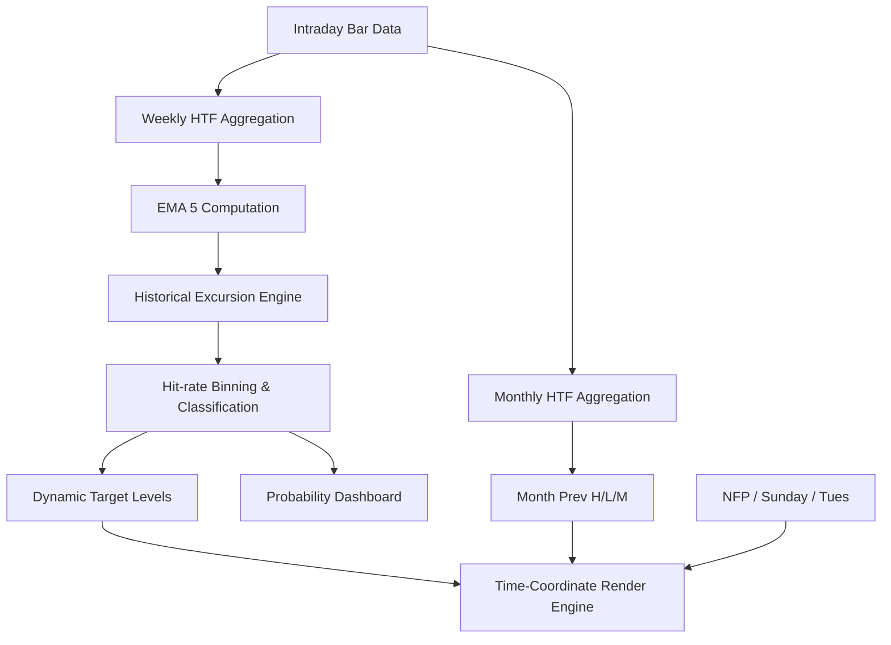

# HTF EMA Analysis - Architecture & Design Document

## 1. Overview
The **HTF EMA Analysis** indicator is a high-performance TradingView Pine Script (v6) explicitly engineered for intraday decision support. By continuously anchoring current intraday price action to Higher Time Frame (HTF) statistics—specifically the distribution of historical weekly excursions from the Weekly EMA—the indicator generates a predictive framework of "magnet" levels and probabilistic resistance/support bands.

## 2. Key Responsibilities
- **HTF Context Rendering**: Dynamically projects historical and current weekly/monthly/session levels (High, Low, Mid, 30%) seamlessly down to lowest timeframes.
- **Probabilistic Data Engine**: Calculates raw edge hit-rates over a fixed lookback (e.g., 52 weeks) of standard standard excursions from the Weekly EMA.
- **Drawing Object Management**: Bypasses TradingView's deep-history rendering limits by leveraging absolute Unix timestamps (`time`) geometry rather than array indexing (`bar_index`).
- **Data Visualization**: Presents real-time statistics in dense, non-intrusive data tables indicating directional mode, mean distances, and optimal entry zones.

## 3. Data Flow & Execution Pipeline

## 4. Key Mathematical Algorithms & Formulas

### 4.1 Base Metric (Percentage Excursion)
Rather than raw points, the engine exclusively evaluates standard volatility through percentage distance off the Weekly EMA closing price of the *previous* week (`prevWeeklyEma`).

- **Upward Excursion:** `math.max(0.0, ((prevWeekHigh - prevWeeklyEma) / prevWeeklyEma) * 100)`
- **Downward Excursion:** `math.max(0.0, ((prevWeeklyEma - prevWeekLow) / prevWeeklyEma) * 100)`

> *Design Note: Values negative to the targeted direction are clipped to `0.0`. This isolates pure adverse vs. favorable movement without polluting the distribution with counter-trend values.*

### 4.2 Statistical Definitions
- **Mean**: The mathematical average of the 52-week excursion array.
- **Median**: The 50th percentile of the 52-week excursion array after sorting.
- **Mode (Nearest-to-Mean)**: 
  1. The dataset is grouped into continuous `0.5%` bins.
  2. Bins containing zero-clips (`< 0.001`) are explicitly ignored to prevent range-bound chop from falsely projecting a `0.0%` mode.
  3. The highest frequency bin is identified. If multiple bins share the exact maximum frequency (a tie), the algorithm calculates the absolute distance of each tied bin's center to the dataset's `Mean`, selecting the bin closest to the Mean as the final `Mode`.

### 4.3 Classification Thresholds
Levels are graded dynamically based on standard hit-rate fractions (Thirds):
- **Good (Green)**: $\ge 66.67\%$
- **Fair (Yellow)**: $\ge 33.33\%$ and $< 66.67\%$
- **Rare (Red)**: $< 33.33\%$

## 5. Architectural Components & Innovations

### 5.1 Time-Coordinate Rendering Protocol (Bypassing the 500-Bar Limit)
TradingView enforces a strict recursive depth limit when calculating object coordinates via `bar_index`. On 1-minute or 15-minute charts, attempting to draw a box anchored to a previous month instantly triggers an `out of bounds` runtime failure.
- **Solution**: The script globally manages all anchor coordinates using `time` and `time_close` (UNIX timestamps). 
- **Implementation**: Constructors like `box.new` and `line.new` explicitly declare `xloc=xloc.bar_time`, resulting in absolute geographical coordinates that never exceed Pine Script bounds.

### 5.2 NFP & Holiday Detection Protocol
The script successfully detects Non-Farm Payroll anomalies without external API data:
1. Validates `dayofweek == friday` and `dayofmonth <= 7`.
2. Records intraday limits for precisely that session block.
3. Propagates the level strictly if the current month matches the recorded NFP month, ensuring the box doesn't continuously overwrite.

### 5.3 Modular Table Rendering
To avoid UI redraw churn and lag, table components are fully isolated. The hit-rate dashboard updates probabilistically per-bar but suppresses redundant array-sort executions unless the underlying sequence detects an authoritative `isNewWeek` tick boundary.
