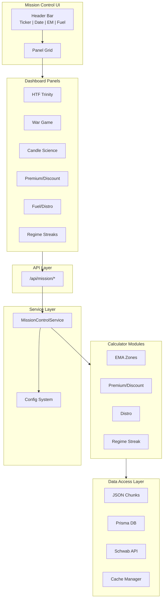
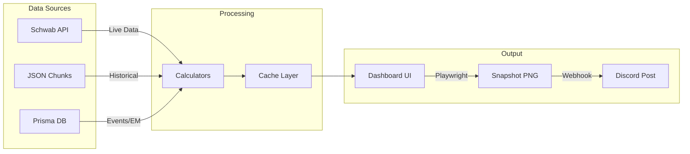
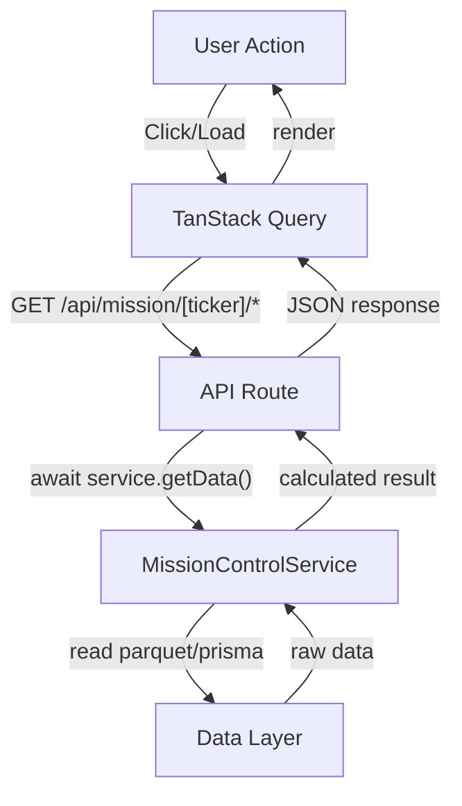

# Mission Control Dashboard - Design Document

**Version:** 1.0.0
**Last Updated:** 2026-02-03

---

## 1. Design Principles

### 1.1 Core Tenets
1. **Modular Architecture**: Every component is self-contained and reusable.
2. **Ticker-Agnostic**: All logic works for any ticker (NQ, ES, CL, GC, etc.).
3. **Configuration-Driven**: Timeframes, sessions, and thresholds are configurable, not hardcoded.
4. **Separation of Concerns**: Data layer, business logic, and UI are strictly separated.
5. **Premium UI/UX**: Bloomberg-inspired, information-dense, visually stunning.

### 1.2 Technology Stack
| Layer | Technology | Rationale |
| :--- | :--- | :--- |
| **Frontend** | Next.js 14 (App Router) | Server components, streaming, optimal performance |
| **Styling** | Tailwind CSS + shadcn/ui | Consistent design system, dark mode native |
| **State** | TanStack Query + Zustand | Server state + local UI state |
| **Charts** | Lightweight Charts (TradingView) | Professional financial charts |
| **Backend** | Next.js API Routes | Unified deployment, type-safe |
| **Data** | JSON Chunks + Prisma | Web-optimized OHLC chunks + transactional DB |
| **Screenshot** | Playwright | Headless browser for snapshot mode |

---

## 2. System Architecture

### 2.1 High-Level Architecture



### 2.2 Data Flow Diagram



### 2.3 Panel Component Flow



---

## 3. Configuration System

### 3.1 Ticker Configuration
```typescript
// config/tickers.ts
export const TICKER_CONFIGS: Record<string, TickerConfig> = {
  NQ1: {
    symbol: 'NQ1',
    displayName: 'E-mini NASDAQ-100',
    tickSize: 0.25,
    pointValue: 20,
    sessions: ['ASIA', 'LONDON', 'NY1', 'NY2'],
    emaZonePercent: { min: 2, max: 3 }, // NQ sweet spot
    dataPath: 'data/derived/NQ1',
  },
  ES1: {
    symbol: 'ES1',
    displayName: 'E-mini S&P 500',
    tickSize: 0.25,
    pointValue: 50,
    sessions: ['ASIA', 'LONDON', 'NY1', 'NY2'],
    emaZonePercent: { min: 1, max: 2 }, // ES sweet spot
    dataPath: 'data/derived/ES1',
  },
  // ... extensible for any ticker
};
```

### 3.2 Session Configuration
```typescript
// config/sessions.ts
export const SESSION_CONFIGS: Record<string, SessionConfig> = {
  ASIA: { start: '18:00', end: '02:00', timezone: 'America/New_York' },
  LONDON: { start: '02:00', end: '08:00', timezone: 'America/New_York' },
  NY1: { start: '09:30', end: '12:00', timezone: 'America/New_York' },
  NY2: { start: '12:00', end: '16:00', timezone: 'America/New_York' },
  // Configurable per user need
};
```

### 3.3 Timeframe Configuration
```typescript
// config/timeframes.ts
export const PREMIUM_DISCOUNT_TIMEFRAMES = ['1W', '1D', '4H', '1H', '15m'];
// Easily modified to add/remove timeframes
```

---

## 4. Component Architecture

### 4.1 Panel Component Pattern
All dashboard panels follow a consistent pattern:

```typescript
// components/panels/BasePanel.tsx
interface BasePanelProps<T> {
  ticker: string;
  data: T;
  isLoading: boolean;
  onExpand?: () => void;
  className?: string;
}

// Each panel implements:
// 1. Compact view (dashboard grid)
// 2. Expanded view (modal/popout)
// 3. Snapshot view (static for Discord)
```

### 4.2 Panel Registry
```typescript
// components/panels/registry.ts
export const PANEL_REGISTRY = {
  htfTrinity: { component: HTFTrinityPanel, order: 1, size: 'md' },
  warGame: { component: WarGamePanel, order: 2, size: 'lg' },
  candleScience: { component: CandleSciencePanel, order: 3, size: 'md' },
  premiumDiscount: { component: PremiumDiscountPanel, order: 4, size: 'md' },
  distro: { component: DistroPanel, order: 5, size: 'lg' },
  regimeStreak: { component: RegimeStreakPanel, order: 6, size: 'md' },
  modLod: { component: ModLodPanel, order: 7, size: 'sm' },
  economicCalendar: { component: EconomicCalendarPanel, order: 8, size: 'sm' },
};
```

---

## 5. Data Flow

### 5.1 Request Flow
```
User Action → TanStack Query → API Route → MissionControlService → Data Layer → Response
```

### 5.2 API Endpoints
| Endpoint | Method | Description |
| :--- | :--- | :--- |
| `/api/mission/[ticker]/summary` | GET | Full dashboard data for ticker |
| `/api/mission/[ticker]/ema-zones` | GET | EMA zone analysis |
| `/api/mission/[ticker]/premium-discount` | GET | Multi-TF P/D analysis |
| `/api/mission/[ticker]/regime` | GET | Session regime & streaks |
| `/api/mission/[ticker]/distro` | GET | Fuel/Distribution data |
| `/api/mission/refresh` | POST | Trigger Schwab API refresh |
| `/api/mission/snapshot` | POST | Generate & post to Discord |

### 5.3 Caching Strategy
| Data Type | Cache Duration | Invalidation |
| :--- | :--- | :--- |
| Historical Stats | 24 hours | Daily regeneration |
| Session Regimes | 1 hour | On session change |
| Live Price | 0 (no cache) | Real-time |
| Calculated Zones | 15 minutes | On refresh button |

---

## 6. UI/UX Design System

### 6.1 Color Palette
```css
/* Dark mode foundation */
--bg-primary: hsl(222, 47%, 6%);      /* Deep navy */
--bg-secondary: hsl(222, 47%, 10%);   /* Card background */
--bg-tertiary: hsl(222, 47%, 14%);    /* Hover states */

/* Accent colors */
--accent-bull: hsl(142, 76%, 36%);    /* Green for bullish */
--accent-bear: hsl(0, 84%, 60%);      /* Red for bearish */
--accent-neutral: hsl(45, 93%, 47%);  /* Amber for neutral */
--accent-info: hsl(217, 91%, 60%);    /* Blue for info */

/* Text hierarchy */
--text-primary: hsl(0, 0%, 100%);
--text-secondary: hsl(0, 0%, 70%);
--text-muted: hsl(0, 0%, 50%);
```

### 6.2 Typography
```css
/* Font stack */
--font-mono: 'JetBrains Mono', 'Fira Code', monospace;
--font-sans: 'Inter', -apple-system, sans-serif;

/* Sizes */
--text-xs: 0.75rem;   /* Data labels */
--text-sm: 0.875rem;  /* Secondary info */
--text-base: 1rem;    /* Body text */
--text-lg: 1.125rem;  /* Panel headers */
--text-xl: 1.25rem;   /* Section headers */
```

### 6.3 Component Patterns
- **Cards**: Rounded corners (8px), subtle border, glass effect
- **Tables**: Alternating rows, sticky headers, hover highlights
- **Badges**: Pill-shaped, color-coded by status
- **Charts**: Dark theme, minimal grid lines, crisp colors

---

## 7. Snapshot Mode

### 7.1 Implementation
```typescript
// lib/snapshot.ts
export async function captureSnapshot(ticker: string): Promise<Buffer> {
  const browser = await playwright.chromium.launch();
  const page = await browser.newPage();
  
  // Navigate to snapshot-optimized route
  await page.goto(`${BASE_URL}/dashboard/mission-control/${ticker}?mode=snapshot`);
  
  // Wait for all data to load
  await page.waitForSelector('[data-testid="dashboard-loaded"]');
  
  // Capture at exact resolution
  const screenshot = await page.screenshot({
    type: 'png',
    clip: { x: 0, y: 0, width: 1920, height: 1080 }
  });
  
  await browser.close();
  return screenshot;
}
```

### 7.2 Snapshot Mode Differences
| Element | Interactive | Snapshot |
| :--- | :--- | :--- |
| Update/Publish buttons | Visible | Hidden |
| Expandable modals | Clickable | Static |
| Loading spinners | Shown | Wait until loaded |
| Tooltips | On hover | Disabled |
| Animations | Enabled | Disabled |

---

## 8. File Structure

```
app/
├── dashboard/
│   └── mission-control/
│       ├── [ticker]/
│       │   └── page.tsx          # Main dashboard
│       └── layout.tsx            # Dashboard layout
├── api/
│   └── mission/
│       ├── [ticker]/
│       │   ├── summary/route.ts
│       │   ├── ema-zones/route.ts
│       │   ├── premium-discount/route.ts
│       │   ├── regime/route.ts
│       │   └── distro/route.ts
│       ├── refresh/route.ts
│       └── snapshot/route.ts

components/
├── mission-control/
│   ├── panels/
│   │   ├── HTFTrinityPanel.tsx
│   │   ├── WarGamePanel.tsx
│   │   ├── CandleSciencePanel.tsx
│   │   ├── PremiumDiscountPanel.tsx
│   │   ├── DistroPanel.tsx
│   │   ├── RegimeStreakPanel.tsx
│   │   ├── ModLodPanel.tsx
│   │   └── EconomicCalendarPanel.tsx
│   ├── MissionControlHeader.tsx
│   ├── MissionControlGrid.tsx
│   └── SnapshotMode.tsx

lib/
├── mission-control/
│   ├── service.ts               # MissionControlService
│   ├── calculators/
│   │   ├── ema-zones.ts
│   │   ├── premium-discount.ts
│   │   ├── distro.ts
│   │   ├── regime-streak.ts
│   │   └── candle-science.ts
│   ├── snapshot.ts
│   └── discord.ts

config/
├── tickers.ts
├── sessions.ts
├── timeframes.ts
└── panels.ts
```

---

## 9. Testing Strategy

| Layer | Tool | Focus |
| :--- | :--- | :--- |
| Unit | Vitest | Calculator functions |
| Integration | Vitest + MSW | API routes with mocked data |
| E2E | Playwright | Full dashboard flow |
| Visual | Playwright | Snapshot regression |

---

## 10. Performance Targets

| Metric | Target | Measurement |
| :--- | :--- | :--- |
| Initial Load | < 2s | Lighthouse |
| Data Refresh | < 500ms | API response time |
| Snapshot Generation | < 5s | E2E test |
| Bundle Size | < 500KB (JS) | Bundlewatch |

---

## Appendix: Design Tokens

All design tokens are centralized in `tailwind.config.ts` and exported as CSS variables for consistency across the application.
